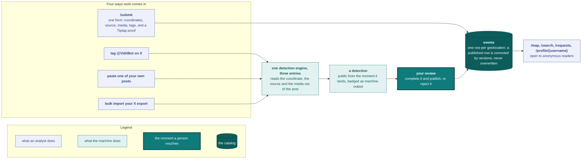

# Vidit

[](LICENSE)
[](https://vidit.app)

A web platform for OSINT/GEOINT analysts to archive, reference, and visualize geolocations of armed-conflict events. Interactive map, structured submission flow (coords + source + media + Tiptap proof + tags), community requests, and analyst profiles.

Live at **[vidit.app](https://vidit.app)** (beta).

Work reaches the map through one of four doors. Three of them read an analyst's own X posts and produce machine detections; the fourth is the submit form. Nothing is published until a person vouches for it.



The detection engine is documented in [docs/ingestion.md](docs/ingestion.md), the row and its statuses in [docs/data-model.md](docs/data-model.md).

---

## Why open source

Vidit is open source under [AGPL-3.0](LICENSE). Anyone can self-host the platform; modifications deployed as a network service must publish their source under the same license. See [`planning/roadmap.md`](planning/roadmap.md) → *Openness & transparency*.

---

## Demo

<!-- To replace this video, see video/README.md, section "Swap the README embed". -->

https://github.com/user-attachments/assets/f314673c-d357-4468-af6d-2299c831c5fc

---

## Stack and documentation

A FastAPI + PostgreSQL/PostGIS backend and a Next.js frontend. [docs/engineering.md](docs/engineering.md) covers the tech stack, the repository layout and the CI jobs.

The technical reference lives in [`docs/`](docs/) (start at [docs/index.md](docs/index.md)) and is hosted at **[docs.vidit.app](https://docs.vidit.app)**. Planning lives in [planning/roadmap.md](planning/roadmap.md) and the [GitHub Project](https://github.com/orgs/vidithq/projects/1); release history in [CHANGELOG.md](CHANGELOG.md).

---

## Getting started (local dev)

```bash
make init        # install + env + db-up + migrate (one-shot bootstrap)
make seed        # mock-admin + machine detections from the committed synthetic archive
make import-prod # replace the local DB with the latest production backup (see docs/backups.md)
make dev         # FastAPI :8000 + Next.js :3000 in parallel
make dev-worker  # archive-import worker (optional; without it, archive uploads stay queued)
make test        # backend pytest
```

`make help` lists every target individually.

### Prerequisites

- Docker (for PostgreSQL + PostGIS; local and prod both run `postgis/postgis:16-3.4`, see [`docs/backups.md`](docs/backups.md))
- Python 3.12+ and [uv](https://github.com/astral-sh/uv)
- Node.js 20+ and npm

### Secrets

`make init` copies `.env.example` → `.env` (backend) and `.env.local.example` → `.env.local` (frontend). Defaults are wired for `localhost`; every var is documented inline in [`backend/.env.example`](backend/.env.example) and [`frontend/.env.local.example`](frontend/.env.local.example). API docs auto-served at <http://localhost:8000/docs>.

### Bootstrap an account

`make seed` (or `make mock-admin`) creates `admin@vidit.app` / `admin` directly. To exercise the real invite + registration flow:

1. Set `ADMIN_EMAILS=<your-email>` in `backend/.env` so your account auto-promotes to admin on first login.
2. Get an invite code: sign in as the mock admin (`make mock-admin`) and mint one from the `/admin` panel.
3. Register at <http://localhost:3000/register> with the code.
4. `EMAIL_PROVIDER=console` (the local default) prints the confirmation link to **backend stdout**.

### Troubleshooting

- **Database connection failed**: ensure `docker-compose up -d` is running and nothing else holds port 5432.
- **Frontend can't reach the API**: check `NEXT_PUBLIC_API_URL` in `frontend/.env.local` is `http://localhost:8000/api/v1`.
- **"Module not found"**: re-run `uv sync --all-extras` (backend) / `npm install` (frontend), or `make install` for both.

---

## Contributing

The pull request flow, the local CI commands and the conventions live in [CONTRIBUTING.md](CONTRIBUTING.md). See also [SECURITY.md](SECURITY.md) and [CODE_OF_CONDUCT.md](CODE_OF_CONDUCT.md). Licensed under the [GNU Affero General Public License v3.0](LICENSE).

---

## Acknowledgements

The content shown in the landing video uses real geolocation work from [`@geo27752`](https://x.com/geo27752), reproduced with their consent. Thanks for letting Vidit show the platform the way analysts actually use it.
