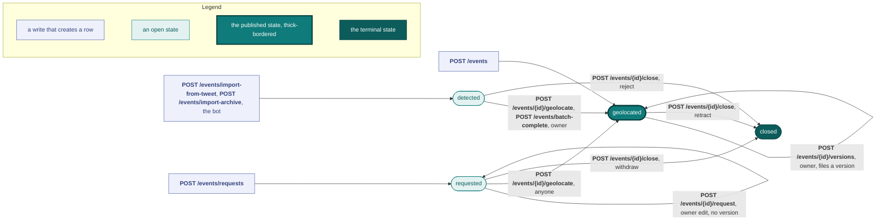

# API reference

Base URL: `/api/v1`. All responses are JSON. FastAPI also serves the generated schema at `/openapi.json`, which is what [`frontend/src/lib/api-types.ts`](../frontend/src/lib/api-types.ts) is generated from.

```mermaid
flowchart LR
  classDef every fill:#e3f2f1,stroke:#0f7b7a,color:#0b5c5b
  classDef route fill:#eef1fb,stroke:#4a5fa5,color:#33417a
  classDef core fill:#0f7b7a,stroke:#083f3e,stroke-width:3px,color:#ffffff
  classDef exit fill:#fdf0e6,stroke:#b4632a,color:#7a3f14

  subgraph legend [Legend]
    direction LR
    l1["`runs on every request`"]:::every
    l2["`runs on the routes that declare it`"]:::route
    l3["`the handler, thick-bordered`"]:::core
    l4["`a rejection and its status`"]:::exit
    l1 ~~~ l2 ~~~ l3 ~~~ l4
  end

  subgraph mw [Middleware]
    direction LR
    rid["`**RequestIdMiddleware**
    echoes or mints X-Request-ID`"]:::every --> hsts["`**add_hsts_header**
    Strict-Transport-Security`"]:::every --> cors["`**CORSMiddleware**
    exposes Link, Retry-After, X-Request-ID`"]:::every --> csrf["`**CSRFMiddleware**
    X-CSRF-Token must equal vidit_csrf`"]:::every --> body["`**enforce_request_body_size**
    platform body cap`"]:::every
  end

  subgraph guards [Route guards]
    direction LR
    auth["`**get_current_user**, **require_admin**
    the vidit_session cookie`"]:::route --> lim["`**limiter.limit**
    per-IP table`"]:::route --> quota["`**authenticated_read_quota**
    1000 reads an hour per account`"]:::route
  end

  router["`**routers/**
  parse and validate the request`"]:::core --> service["`**services/**
  business rules, one transaction`"]:::core
  typed["`**raise_typed_error**
  detail: code + message`"]:::exit

  e403["`403 plain string`"]:::exit
  e413["`413`"]:::exit
  e401["`401 / 403`"]:::exit
  e429["`429 rate_limited, read_quota_exceeded`"]:::exit
  e422["`422 detail array`"]:::exit

  body --> auth
  quota --> router
  csrf -.-> e403
  body -.-> e413
  auth -.-> e401
  lim -.-> e429
  quota -.-> e429
  router -.-> e422
  service -.-> typed
```



Every request passes the middleware chain, then the guards its route declares, then the router and the service. Each rejection exits with the response shape [Errors](#errors) describes. The sections below cover the middleware and authentication first, then [rate limits](#rate-limits), then each router's endpoints.

**Auth.** For endpoints marked 🔒, log in first. Send the `vidit_session` cookie (set by `POST /auth/login`, `HttpOnly; Secure; SameSite=Lax`). For state-changing requests (`POST`/`PUT`/`PATCH`/`DELETE`) that carry the session cookie, also send the `X-CSRF-Token` header with the value of the JS-readable `vidit_csrf` cookie. There is no `Authorization: Bearer` flow. A 🔒 endpoint returns 401 without a session. A 🛡️ endpoint also requires `is_admin=true` on your account and returns 403 to a non-admin. The per-endpoint error tables below omit these two rows.

**Transport security.** Every response carries `Strict-Transport-Security: max-age=15768000`, except a 500 from an unhandled server error. The header carries no `includeSubDomains` or `preload` directives.

**Request id.** Every response carries an `X-Request-ID` header, a 500 included. Send your own `X-Request-ID` of 1 to 64 characters from `A-Z`, `a-z`, `0-9`, `.`, `_`, and `-`, with at least one letter or digit, and the response echoes it. The API replaces any other value with an id of its own. The backend logs every line of the request under that id, so quote it when you report a failed request.

**Auth audit log.** Each `/auth/*` endpoint writes an [`auth_events`](data-model.md#auth_events) row as a best-effort side effect. An audit failure never breaks the auth flow.

---

## Endpoints at a glance

Auth column: 🌐 anonymous, 🔒 logged-in, 🛡️ admin-only.

| Method | Path | Auth | Purpose |
|---|---|---|---|
| **Auth** | | | |
| POST | `/auth/register` | 🌐 | Stage a pending registration; sends confirmation email |
| POST | `/auth/confirm-registration` | 🌐 | Confirm a pending registration (creates user, signs in) |
| POST | `/auth/resend-confirmation` | 🌐 | Resend the confirmation email and invalidate the previous token |
| POST | `/auth/login` | 🌐 | Email + password → session + CSRF cookies |
| POST | `/auth/logout` | 🌐 | Clear session cookies (idempotent) |
| GET | `/auth/me` | 🔒 | Current user |
| POST | `/auth/forgot-password` | 🌐 | Email a single-use reset token (always 204) |
| POST | `/auth/reset-password` | 🌐 | Consume reset token, set new password |
| POST | `/auth/change-password` | 🔒 | Rotate your password (requires your current password) |
| **Events** | | | |
| GET | `/events` | 🌐 | List one lifecycle view, `located` (default) or `requested` |
| GET | `/events/points` | 🌐 | Compact map-points tuples for one viewport (`bbox` required, cached) |
| GET | `/events/possible-duplicates` | 🔒 | Soft-warning probe for the submit form |
| POST | `/events/import-from-tweet` | 🔒 | Import your own X post as detections |
| POST | `/events/import-archive/presign` | 🔒 | Mint a presigned direct-to-storage upload for your X data archive |
| POST | `/events/import-archive` | 🔒 | Enqueue your staged archive (by `upload_key`) for the backfill worker |
| GET | `/events/import-archive/{job_id}` | 🔒 | Poll your import job (status + import counts) |
| GET | `/events/{id}` | 🌐 | Full event detail, any lifecycle state |
| POST | `/events/{id}/report` | 🌐 | Report an event for moderation (anonymous allowed) |
| POST | `/events` | 🔒 | Create an event born `geolocated` (multipart, uploads media) |
| POST | `/events/requests` | 🔒 | Open a request (multipart); creates a `requested` event |
| POST | `/events/{id}/request` | 🔒 | Correct an open request, owner only; overwrites it in place, no version filed |
| POST | `/events/{id}/geolocate` | 🔒 | Give an event a vouched location: `requested` \| `detected` → `geolocated` |
| POST | `/events/batch-complete` | 🔒 | Publish a selection of your detections in one call (per-row verdicts) |
| POST | `/events/{id}/versions` | 🔒 | Correct a published event, owner only; files the version it supersedes |
| GET | `/events/{id}/versions` | 🌐 | The event's superseded versions, newest first |
| GET | `/events/{id}/versions/{version_no}` | 🌐 | One superseded version, by its number |
| POST | `/events/{id}/close` | 🔒 | Withdraw, reject or retract an event, owner only (→ `closed`) |
| GET | `/events/detections` | 🔒 | Your `detected` events awaiting a geolocate (paginated, filterable on readiness) |
| GET | `/events/{id}/collections` | 🔒 | Your collections, each saying whether this event is on it (owner only) |
| **Collections** | | | |
| POST | `/collections` | 🔒 | Open a collection (title, description, and the events it holds) |
| POST | `/collections/{id}/report` | 🌐 | Report a collection for moderation (anonymous allowed) |
| GET | `/collections/{id}` | 🌐 | One collection: owner, title, description, tags, item count, date range |
| PATCH | `/collections/{id}` | 🔒 | Write your collection's title and description |
| DELETE | `/collections/{id}` | 🔒 | Drop your collection; the events it held stay |
| GET | `/collections/{id}/events` | 🌐 | Its items, oldest event first (cursor-paged) |
| PUT | `/collections/{id}/events/{event_id}` | 🔒 | Put one of your events on it (idempotent) |
| DELETE | `/collections/{id}/events/{event_id}` | 🔒 | Take one event off it (idempotent) |
| **Search** | | | |
| GET | `/search` | 🌐 | Free-text search across geolocations / requests / collections / users |
| GET | `/search/authors` | 🌐 | Username typeahead for the author filter |
| **Tags** | | | |
| GET | `/tags` | 🌐 | List tags (defaults to ones referenced by live geos) |
| POST | `/tags` | 🔒 | Create a free tag (curated categories rejected) |
| **Conflicts** | | | |
| GET | `/conflicts` | 🌐 | List the conflict referential (`?used=true` narrows to conflicts on live events) |
| **Users** | | | |
| GET | `/users/{username}` | 🌐 | Public analyst profile |
| GET | `/users/{username}/stats` | 🌐 | Aggregated shape of an analyst's work (status split, tags, source hosts, activity) |
| PATCH | `/users/me` | 🔒 | Edit your bio and external links |
| PUT | `/users/me/avatar` | 🔒 | Upload your profile picture (multipart) |
| DELETE | `/users/me/avatar` | 🔒 | Remove your profile picture |
| GET | `/users/{username}/events` | 🌐 | List an analyst's published geolocations |
| GET | `/users/{username}/collections` | 🌐 | List an analyst's collections |
| POST | `/users/{username}/follow` | 🔒 | Follow (idempotent; self-follow → 400) |
| DELETE | `/users/{username}/follow` | 🔒 | Unfollow (idempotent; unknown user → 404) |
| **Timeline** | | | |
| GET | `/timeline` | 🔒 | Activity feed from followed analysts |
| **Webhooks** | | | |
| GET | `/webhooks/x` | 🌐 | X webhook CRC challenge (HMAC answer, no DB) |
| POST | `/webhooks/x` | 🌐 | Receive an X Account Activity delivery (signature-verified) and queue bot mentions |
| **Admin** (collapsed below) | | | |
| GET | `/admin/me` | 🛡️ | `is_admin` probe |
| GET | `/admin/detection-stats` | 🛡️ | Machine-extraction quality: reject-rate + pending missing-piece counts |
| POST/GET | `/admin/invite-codes` | 🛡️ | Mint / list invite codes |
| POST | `/admin/invite-codes/{id}/revoke` | 🛡️ | Revoke an invite code, keeping its row |
| DELETE | `/admin/invite-codes/{id}` | 🛡️ | Drop the row of an invite code no account was created from |
| GET | `/admin/users` | 🛡️ | Substring search on username/email |
| DELETE | `/admin/users/{id}` | 🛡️ | Soft delete (default) or `?hard=true` GDPR erasure |
| DELETE | `/admin/users/{id}/detected-events` | 🛡️ | Purge every detection the user owns, account untouched |
| DELETE | `/admin/events/{id}` | 🛡️ | Soft delete or `?hard=true` GDPR erasure |
| PATCH | `/admin/collections/{id}/moderation` | 🛡️ | Withhold a collection from public view, or restore it (moves `hidden_at`) |
| DELETE | `/admin/collections/{id}` | 🛡️ | Withhold a collection from public view (the takedown alias of the PATCH above) |
| PATCH | `/admin/users/{id}/x-handle` | 🛡️ | Link / clear the bot-attribution X handle |
| GET | `/admin/reports` | 🛡️ | The moderation queue: event and collection reports, open ones first |
| POST | `/admin/reports/{id}/resolve` | 🛡️ | Close one report with a verdict, applying it to what the report names |
| PATCH | `/admin/events/{id}/moderation` | 🛡️ | Set an event's graphic flag / takedown directly, no report behind it |
| POST | `/admin/events/{id}/versions/{version_no}/redact` | 🛡️ | Blank one filed version, keeping its number |
| POST | `/admin/maintenance/reap-*` | 🛡️ | Cron-style reapers (auth tokens, pending regs) |
| POST | `/admin/maintenance/send-completion-digests` | 🛡️ | Email each analyst the count of detections awaiting completion |

---

## Rate limits

A single shared **slowapi** limiter ([`app/ratelimit.py`](../backend/app/ratelimit.py)) enforces two layers: the per-endpoint limits in the table below, and the [per-user read quota](#per-user-read-quota). Table limits are keyed per client IP (the rightmost `X-Forwarded-For` entry; see [`engineering.md`](engineering.md#particularities-non-obvious-behavior-found-during-development)) unless a row says otherwise. An endpoint absent from the table has no limit. Buckets are per process. Set `RATE_LIMIT_ENABLED=false` to disable every limit at once, for local development.

A rejected request returns `429` with the typed envelope: code `rate_limited` for a table limit, or `read_quota_exceeded` for the read quota. Both carry a `Retry-After` header in whole seconds, counted to the exact bucket reset. Branch on `code`: a per-minute throttle clears in seconds, and the quota window is a fixed hour.

CI pins every limit on this page behaviorally: N requests succeed, and request N+1 returns `429` (see [`test_rate_limits.py`](../backend/tests/test_rate_limits.py)).

This table is the one statement of each limit. The endpoint sections do not repeat it.

| Endpoint | Limit |
|---|---|
| **Auth** | |
| `POST /auth/login` | 5/min + 30/hour |
| `POST /auth/register` | 10/hour |
| `POST /auth/confirm-registration` | 30/hour |
| `POST /auth/resend-confirmation` | 5/hour |
| `POST /auth/forgot-password` | 5/hour |
| `POST /auth/reset-password` | 10/hour |
| `POST /auth/change-password` | 10/hour (keyed per session) |
| **Events** | |
| `GET /events`, `GET /events/{id}`, `GET /events/{id}/versions`, `GET /events/{id}/versions/{version_no}`, `GET /events/detections` | 120/min |
| `GET /events/points` | 60/min |
| `GET /events/possible-duplicates` | 60/min |
| `POST /events/import-from-tweet` | 30/min |
| `POST /events/import-archive/presign` | 10/hour |
| `POST /events/import-archive` | 10/hour |
| `GET /events/import-archive/{job_id}` | 60/min |
| `POST /events`, `POST /events/requests`, `POST /events/{id}/request` | 30/min |
| `POST /events/{id}/geolocate`, `POST /events/{id}/versions` | 30/min |
| `POST /events/batch-complete` | 10/min |
| `POST /events/{id}/close` | 60/min |
| `POST /events/{id}/report` | 10/hour (per IP only, anonymous allowed) |
| `GET /events/{id}/collections` | 120/min |
| **Collections** | |
| `GET /collections/{id}`, `GET /collections/{id}/events` | 120/min |
| `POST /collections`, `PATCH /collections/{id}`, `DELETE /collections/{id}` | 30/min |
| `POST /collections/{id}/report` | 10/hour (per IP only, anonymous allowed) |
| `PUT`/`DELETE /collections/{id}/events/{event_id}` | 60/min |
| **Search / Tags** | |
| `GET /search`, `GET /search/authors` | 60/min |
| `GET /tags` | 60/min |
| `POST /tags` | 30/min |
| `GET /conflicts` | 60/min |
| **Users / Timeline** | |
| `GET /users/{username}`, `GET /users/{username}/stats`, `GET /users/{username}/events`, `GET /users/{username}/collections`, `GET /timeline` | 120/min |
| `PATCH /users/me` | 30/min |
| `PUT`/`DELETE /users/me/avatar` | 20/min |
| `POST`/`DELETE /users/{username}/follow` | 60/min |
| **Admin** 🛡️ | |
| `POST /admin/invite-codes` · `DELETE /admin/users/{id}` · `DELETE /admin/users/{id}/detected-events` | 30/hour |
| `POST /admin/invite-codes/{id}/revoke` · `DELETE /admin/invite-codes/{id}` · `PATCH /admin/users/{id}/x-handle` · `DELETE /admin/events/{id}` | 60/hour |
| `POST /admin/reports/{id}/resolve` · `PATCH /admin/events/{id}/moderation` · `POST /admin/events/{id}/versions/{version_no}/redact` · `PATCH /admin/collections/{id}/moderation` · `DELETE /admin/collections/{id}` | 60/hour |
| `POST /admin/maintenance/reap-*` · `POST /admin/maintenance/send-completion-digests` | 30/hour |

The read-only admin probes (`GET /admin/me`, `/admin/detection-stats`, `/admin/users`, `/admin/invite-codes` list, `/admin/reports` list) carry no limit. The [`/webhooks/x`](#webhooks) pair carries none either: both are HMAC-gated.

### Per-user read quota

**1000/hour per account.** One bucket is shared across these 18 read paths, not one bucket per endpoint:

`GET /events` · `/events/{id}` · `/events/{id}/versions` · `/events/{id}/versions/{version_no}` · `/events/points` · `/events/detections` · `/events/possible-duplicates` · `/search` · `/search/authors` · `/tags` · `/conflicts` · `/users/{username}` · `/users/{username}/stats` · `/users/{username}/events` · `/users/{username}/collections` · `/collections/{id}` · `/collections/{id}/events` · `/timeline`

- The key is `User.id`, read from the signature-verified session cookie.
- The backend evaluates the per-IP table limit first, so a request the table rejects costs the account nothing.
- Anonymous callers are exempt and keep the per-IP limits alone. Fifteen of the 18 paths answer anonymously.
- Every authenticated read absent from the list is exempt, including `GET /auth/me` and the read-only admin probes.
- `GET /events/import-archive/{job_id}` is exempt because an import polls it. It returns one job's progress counters and no catalog rows.

---

## Auth

### Password rules

A password you set through `POST /auth/register`, `POST /auth/reset-password`, or `POST /auth/change-password` must be at least 8 characters long. It must also fit in 72 bytes of UTF-8, the input limit of bcrypt. An ASCII character takes 1 byte. Every other character takes 2 to 4 bytes: `ß` and `£` take 2, `€` takes 3, and most emoji take 4. A password outside these bounds gets a 422, and the first `detail` entry's `msg` states the rule. A 422 body never echoes the submitted value.

A password you sign in with, or send as `current_password`, is never refused for being too long. One longer than 72 bytes matches no account, so it gets the same response as a wrong password. An empty `current_password` gets a 422.

### `POST /auth/register`

Stage a registration. Anonymous. **This call creates no `users` row.** The submission lives in `pending_registrations` until the user clicks the link in the confirmation email. The pending row references the invite code but does not consume it, so an abandoned signup does not burn the invite.

**Request body:**
```json
{
  "username": "kalush",
  "email": "kalush@example.com",
  "password": "••••••••",
  "invite_code": "abc123"
}
```

**Response 202:**
```json
{
  "status": "pending_confirmation",
  "email": "kalush@example.com"
}
```

The response sets no session cookie. A background task sends the confirmation email, so the success and error branches return at the same wire timing.

**Errors:**
| Code | Case |
|------|------|
| 400 | `invalid_invite`: invite code invalid, expired, revoked, or exhausted |
| 409 | `email_already_registered` / `username_already_taken`: taken by a live or soft-deleted user |
| 409 | `email_pending_confirmation` / `username_pending_confirmation`: a live pending confirmation holds it |
| 422 | `password` outside the [password rules](#password-rules) |

---

### `POST /auth/confirm-registration`

Anonymous. Consumes the token that `POST /auth/register` emailed, creates the `users` row, marks the invite consumed, and signs the user in (sets the `vidit_session` and `vidit_csrf` cookies in the same response).

**Request body:**
```json
{ "token": "Pv3oZc..." }
```

**Response 200:** `UserRead` (same shape as [`GET /auth/me`](#get-authme)).

| Status | Meaning |
|--------|---------|
| 200 | Account created; cookies set |
| 400 | `invalid_or_expired_token`: token unknown, expired, or already consumed |
| 409 | Email or username was taken between register and confirm |

---

### `POST /auth/resend-confirmation`

Anonymous. Remints the token for an outstanding pending registration and resends the confirmation email. Always returns 204, so the response never leaks which addresses are in flight. Reminting invalidates the previous token.

**Request body:**
```json
{ "email": "kalush@example.com" }
```

**Response 204** (always).

---

### `POST /auth/login`

**Request body:**
```json
{
  "email": "kalush@example.com",
  "password": "••••••••"
}
```

**Response 200:** `UserRead` (same shape as [`GET /auth/me`](#get-authme)). Sets the `vidit_session` HttpOnly cookie and the JS-readable `vidit_csrf` cookie.

**Errors:**
| Code | Case |
|------|------|
| 401 | Wrong email or password |

---

### `POST /auth/logout`

Clears your session and CSRF cookies. Not session-gated, so it is idempotent. Like any mutating request, it still requires the `X-CSRF-Token` header when a session cookie is present. **Response 204:** no body.

---

### `GET /auth/me` 🔒

Returns your user account.

**Response 200:**
```json
{
  "id": "uuid",
  "username": "kalush",
  "email": "kalush@example.com",
  "bio": null,
  "avatar_url": null,
  "external_links": {},
  "created_at": "2026-03-28T10:00:00Z"
}
```

**This shape carries no `is_admin` field.** The admin role surfaces only through [`GET /admin/me`](#get-adminme).

---

### `POST /auth/forgot-password`

Anonymous. Emails a single-use reset token if the address matches an account. Always returns 204, to avoid user enumeration. The backend logs and swallows email-send failures, for the same reason.

**Body:**
```json
{ "email": "kalush@example.com" }
```

**Response 204** (always, on success or unknown email).

---

### `POST /auth/reset-password`

Anonymous. Consumes a reset token and sets a new password. Tokens are single-use. They expire `PASSWORD_RESET_TOKEN_MINUTES` after minting (default 15; the reset email quotes the same value), and become invalid the moment a fresh `forgot-password` request is issued for the same user.

**Body:**
```json
{
  "token": "Pv3oZc...",
  "new_password": "atleasteightchars"
}
```

**Response 204** on success.

| Status | Meaning |
|--------|---------|
| 204 | Password updated |
| 400 | Token unknown, expired, already consumed, or wrong purpose, one opaque error for all four |
| 422 | `new_password` outside the [password rules](#password-rules); the token stays unconsumed |

### `POST /auth/change-password` 🔒

Rotates your password. Requires your current password, so a stolen cookie can't lock you out. Audited as `password_changed` on success. After commit, the backend sends a best-effort notice to your address (no IP or user agent; it links to `/forgot-password`). The backend logs and swallows an email-send failure; the rotation still succeeds.

**Body:**
```json
{
  "current_password": "••••••••",
  "new_password": "atleasteightchars"
}
```

**Response 204** on success. The session cookie stays valid.

| Status | Meaning |
|--------|---------|
| 400 | Current password incorrect |
| 422 | `new_password` outside the [password rules](#password-rules) |

---

## Events

A request, a geolocation and a detection are all rows of one `events` table, told apart by `status`. Every read and write in this section covers all of them.



[`GET /events`](#get-events) lists one view (`requested` is the request queue, `located` the catalog) and [`GET /events/{id}`](#get-eventsid) reads any status. `DELETE /admin/events/{id}` is the only write that removes a row.

### Event form fields

Five multipart endpoints take the event form. Each posts the whole row state at once. This table states every field once; each endpoint section lists only its own rules.

Columns: **create** [`POST /events`](#post-events), **requests** [`POST /events/requests`](#post-eventsrequests), **request** [`POST /events/{id}/request`](#post-eventsidrequest), **geolocate** [`POST /events/{id}/geolocate`](#post-eventsidgeolocate), **versions** [`POST /events/{id}/versions`](#post-eventsidversions). Values: **req** required; **opt** optional; **keep** optional, and a blank or omitted value keeps what the row holds; **floor** optional on the wire, required by the [evidence floor](#evidence-floor); **no** not accepted, ignored if sent.

| Field | Rule | create | requests | request | geolocate | versions |
|---|---|---|---|---|---|---|
| `title` | 1 to 255 characters | req | req | req | req | req |
| `lat`, `lng` | Subject point. Latitude in [-90, 90], longitude in [-180, 180]. Both or neither; on request, posting neither clears the guess | req | opt | opt | req | req |
| `capture_source_lat`, `capture_source_lng` | Camera position. Both or neither | opt | opt | opt | opt | opt |
| `source_url` | The footage origin, at most 2000 characters | req | req | req | req | keep |
| `source_snapshot_url` | The [archived copy](#archived-copies) of `source_url`, at most 2000 characters | opt | opt | opt | opt | opt |
| `detected_from_snapshot_url` | The archived copy of `detected_from_url` | no | no | no | no | opt |
| `secondary_source_urls` | Repeated field, one per mirror, each at most 2000 characters. Normalized: stripped, blanks and duplicates dropped, an entry equal to `source_url` dropped, order kept. More than 10 after normalization is `too_many_source_links`. Replaces the stored list | opt | opt | opt | opt | opt |
| `secondary_snapshot_urls` | Repeated field, the archived copy of each mirror, aligned with `secondary_source_urls` by position. Send an empty value for a mirror you did not archive | opt | opt | opt | opt | opt |
| `event_date` | `YYYY-MM-DD`. Blank stores NULL | opt | opt | opt | opt | opt |
| `event_time` | `HH:MM`, UTC. Blank stores NULL. Independent of `event_date` | opt | opt | opt | opt | opt |
| `source_posted_at` | `YYYY-MM-DDTHH:MM`, read as UTC: when the source posted the media | req | req | keep | req | keep |
| `proof` | Serialized Tiptap document, sanitized server-side. A `placeholder://<filename>` src resolves against `proof_files`; an already-uploaded URL passes through | opt | opt | opt | opt | opt |
| `tag_ids` | JSON array of tag ids. Replaces the tag set | floor | opt | opt | floor | floor |
| `conflict_ids` | JSON array of [conflict](#conflicts) ids. Replaces the conflict set | floor | opt | opt | floor | floor |
| `is_graphic` | `true` when the footage shows death, injury or human remains. Defaults to `false`. Ratchets: `false` never clears a set flag; only [`PATCH /admin/events/{id}/moderation`](#patch-admineventsidmoderation) clears it | opt | opt | opt | opt | opt |
| `note` | At most 280 characters, stored on the version this edit supersedes | no | no | no | no | opt |
| `file` | Exactly one source file (image or video) | req | req | no | no | no |
| `remove_media_ids` | JSON array of source media ids to drop | no | no | opt | opt | opt |
| `files` | Replacement source media, 0 or 1. Kept plus new must total exactly one | no | no | opt | opt | opt |
| `proof_files` | The proof body's inline images, matched to its `placeholder://` srcs by filename | opt | opt | opt | opt | opt |

`status`, `requested_by` and the provenance columns (`detected_from_url` among them) accept no field on any of the five. No write moves `detected_from_url`.

#### Evidence floor

`POST /events`, `geolocate`, `versions` and [`POST /events/batch-complete`](#post-eventsbatch-complete) check the post-write state against one floor, before any upload:

1. Exactly one source media.
2. At least one image in the `proof` body.
3. At least one [conflict](#conflicts) and at least one tag of category `capture_source` (see [Tags](#tags)). Both domains ship an escape value (conflict `"Other"`, `capture_source` `"Unknown"`), so the floor is always satisfiable. A miss is `tag_requirements_not_met`.

A `geolocated` row also always carries coordinates and a `source_url`. The two request paths require only the source file; the curated floor binds at the geolocate.

#### Archived copies

`source_snapshot_url`, `secondary_snapshot_urls` and `detected_from_snapshot_url` are checked and stored in the same transaction as the write, on the terms [`archival.md`](archival.md) states. A rejected paste is a 400 with one of the `snapshot_*` codes or `original_url_not_on_event`, and nothing is written. A mirror's copy is paired with its mirror before normalization, so a copy whose mirror normalization drops is dropped with it.

#### Proof-image ceiling

`max_proof_images_per_event` bounds what the final proof body displays: the already-uploaded images it still references plus the new files. An image kept only because a past version displays it does not count. Over the ceiling is a 422 `too_many_files`.

### Event write errors

The error table every event form endpoint shares. Each endpoint section names which of its rows apply and adds its own.

| Status | Code | Case |
|---|---|---|
| 400 | (plain string) | Empty or whitespace-only `title` or `source_url` |
| 400 | `invalid_coordinates` | A coordinate out of range, or half of a pair |
| 400 | `media_required` | No source media, or the write would leave none |
| 400 | `invalid_proof` | The sanitizer rejected `proof` |
| 400 | `proof_image_required` | No image in the final proof body |
| 400 | `tag_requirements_not_met` | No conflict, or no `capture_source` tag |
| 400 | `too_many_source_links` | More than 10 `secondary_source_urls` after normalization |
| 400 | `invalid_file` | Disallowed type or size, or a proof src naming another event's image |
| 400 | `evidence_processing_failed` | An image the server refuses (see [File limits](#file-limits)), or a failed upload |
| 400 | `proof_files_mismatch` | A `placeholder://` src with no matching `proof_files` upload, or the reverse |
| 400 | `source_url_required` | A blank `source_url` where the row must carry one |
| 400 | `snapshot_url_invalid`, `snapshot_url_too_long`, `snapshot_url_not_https`, `snapshot_provider_not_allowed`, `snapshot_not_a_replay_url`, `snapshot_not_a_snapshot_code`, `original_url_not_on_event` | A rejected [archived copy](#archived-copies) |
| 403 | | You are not the owner (where the endpoint is owner-only) |
| 404 | `event_not_found` | Unknown or soft-deleted event |
| 409 | `invalid_state` | The row is not in a state this endpoint accepts |
| 409 | `source_media_conflict` | A concurrent write raced past the one-source-per-event index |
| 413 | | The body exceeds the platform cap (`max_video_size + max_proof_images_per_event × max_image_size + 10 MB`). The middleware checks it before the body is read, and the 413 carries CORS headers |
| 422 | `too_many_files` | Over the [proof-image ceiling](#proof-image-ceiling), or kept plus new source media over one |
| 422 | | A missing required field, `title` over 255 characters, `source_url` or one `secondary_source_urls` item over 2000 characters, or a malformed `event_date`, `event_time` or `source_posted_at` |

### `GET /events`

List one lifecycle view, newest first, as `EventList` cards (no full proof).

**Query params:**
| Param | Type | Description |
|-------|------|-------------|
| `view` | string | `located` (default, the catalog: `geolocated` + `detected` rows, plus a `closed` row whose `before_closed_status` was `detected`) or `requested` (the open-call queue: `requested` rows, plus a `closed` row whose `before_closed_status` was `requested`). A retraction (`closed` off `geolocated`) is in neither and is reachable by its own URL. Anything else → 422. |
| `status` | string (repeatable) | Narrows within the view, for example `?view=requested&status=closed`. Repeat to OR within the bucket. Values outside `requested` / `detected` / `geolocated` / `closed` return 422; a value the view can't contain returns an empty list. |
| `conflict` | string (repeatable) | Filter by [conflict](#conflicts) name (`conflicts.name`). OR within the bucket, AND across buckets. |
| `capture_source` | string (repeatable) | Filter by tag name of category `capture_source`. Same OR / AND semantics. |
| `tag` | string (repeatable) | Filter by tag name, any category. Same OR / AND semantics. |
| `bbox` | string | `south,west,north,east` (four comma-separated floats). 422 on malformed input; latitudes in [-90, 90], longitudes in [-180, 180], south ≤ north, west ≤ east. |
| `event_date_from` / `event_date_to` | date (YYYY-MM-DD) | Inclusive event-date range. Malformed values return 422. |
| `submitted_from` / `submitted_to` | date (YYYY-MM-DD) | Inclusive submission-date range. Malformed values return 422. |
| `author` | string | Exact, case-insensitive match on owner username (pick real handles via [`GET /search/authors`](#get-searchauthors)). Restricted to `[A-Za-z0-9_-]{1,50}`; any other character returns 422. |
| `limit` | int | Rows per page. See [Pagination](#pagination). |
| `cursor` | string | Opaque cursor from the previous page's `Link: rel="next"` header. See [Pagination](#pagination). |

**Response 200:** an array of `EventList`.
```json
[
  {
    "id": "uuid",
    "title": "Strike on depot, Donetsk",
    "event_coords": { "lat": 48.123, "lng": 37.456 },
    "event_date": "2026-03-15",
    "is_graphic": false,
    "status": "geolocated",
    "before_closed_status": null,
    "owner": { "id": "uuid", "username": "kalush" },
    "media": {
      "id": "uuid",
      "role": "source",
      "storage_url": "https://…/uploads/.../photo.jpg",
      "media_type": "image"
    },
    "tags": [
      { "id": "uuid", "name": "Drone", "category": "capture_source" },
      { "id": "uuid", "name": "airstrike", "category": "free" }
    ],
    "conflicts": [
      { "id": "uuid", "name": "Russian invasion of Ukraine", "wikidata_id": "Q110999040", "start_year": 2022, "end_year": null, "ongoing": true, "tier": "major" }
    ]
  }
]
```

**Response headers:** `Link: <…&cursor=…>; rel="next"` when a further page exists.

`event_coords` is `null` on a coordinate-less `requested` row. `is_graphic` is `true` when the author, or an admin overriding the author, flagged the footage as showing death, injury or human remains. A withheld event (`hidden_at` set, see [`GET /events/{id}`](#get-eventsid)) never appears. `media` is the card thumbnail: the event's `source` attachment, else its first `proof` image, else `null`; a proof video is never picked. `backend/app/services/thumbnails.py` holds that rule for every card surface. `conflicts` uses the `ConflictRead` shape of [`GET /conflicts`](#get-conflicts).

---

### `GET /events/points`

Compact `[id, lat, lng, event_date, added_date, detected]` tuples for client-side clustering, with no joins and no pagination. `event_date` and `added_date` are ISO `YYYY-MM-DD` (`added_date` is the `created_at` calendar day); `event_date` is `null` when unknown. `detected` is `1` for a machine-detected row and `0` for a `geolocated` one. Located rows only, so `requested` events never appear.

`bbox` is **required**, and nothing caps its area. Unlike on `GET /events`, an empty `?bbox=` is a rejection here, not an omitted filter. The server snaps `bbox` outward onto a fixed 0.05° grid before keying and querying, so two viewports inside one cell share a cache entry and get the payload of the snapped box, which contains the box requested. Results are cached in memory for 60 s per snapped `bbox` and filter combination; the response carries `X-Cache: HIT|MISS` and `Cache-Control: public, max-age=30`.

**Query params:**

| Param | Type | Description |
|-------|------|-------------|
| `bbox` | string, **required** | Same shape and validation as on `GET /events`. Missing, empty, or malformed → 422. A box crossing the antimeridian is not modeled; widen it to the full longitude range. |
| `media` | string (repeatable) | `?media=image&media=video` matches an event carrying any attachment of a listed type. Values outside `image` / `video` → 422. |
| `conflict`, `capture_source`, `tag`, `event_date_from`, `event_date_to`, `submitted_from`, `submitted_to`, `author` | | Same semantics as on [`GET /events`](#get-events). |

| Status | Meaning |
|--------|---------|
| 200 | Points inside `bbox` |
| 422 | `bbox` missing or malformed, a malformed date filter, or a `media` / `author` value outside its domain |

**Response 200:**
```json
[
  ["6c1f…uuid", 48.123, 37.456, "2024-03-11", "2024-03-12", 0],
  ["a0b2…uuid", 50.450, 30.523, "2024-05-02", "2024-05-04", 1]
]
```

---

### `GET /events/possible-duplicates` 🔒

Soft-warning probe for the submit form: geolocations that might describe the same event. Advisory only; it never blocks a submission.

Match rule: within about 500 m geodesic of the proposed `(lat, lng)` **and** either the same source-URL host or the same `event_date`. The host leg also matches an existing event's secondary source links. A scheme-stripped URL (`t.me/channel/12345`) still yields a host. A malformed host or date disables that leg, and no usable leg returns `[]`.

**Query params:**
| Field | Type | Required | Description |
|---|---|---|---|
| `lat` | float | yes | Latitude (-90 to 90) of the prospective submission. |
| `lng` | float | yes | Longitude (-180 to 180). |
| `source_url` | string | no | Source URL for the host leg. |
| `event_date` | string (YYYY-MM-DD) | no | Compared exactly for the date leg. |

**Response 200:** up to 10 candidates, nearest first.
```json
[
  {
    "id": "uuid",
    "title": "Strike on depot, Donetsk",
    "event_coords": { "lat": 48.123, "lng": 37.456 },
    "event_date": "2026-05-01",
    "source_url": "https://t.me/somechannel/12345",
    "distance_m": 55.4,
    "owner": { "id": "uuid", "username": "kalush" }
  }
]
```

---

### `POST /events/import-from-tweet` 🔒

Import one of your own X posts. The route runs the shared detection engine over the post and writes one detection, owned by you, per coordinate the post carries. The bot and the archive backfill run the same engine and write path (see [`ingestion.md`](ingestion.md#the-contract)).

**Own posts only.** The post's author must equal the X handle linked to your account (`users.x_handle`, compared case-insensitively). A post by anyone else, or a caller with no linked handle, returns `400 not_your_post`. Submit third-party footage through [`POST /events`](#post-events) with a `source_url` instead.

[`ingestion.md`](ingestion.md#what-acquisition-reads) states which posts acquisition reads. Responses from X's public syndication endpoint are cached in memory for 1 h per post id.

**Request body:**
```json
{ "url": "https://x.com/handle/status/1234567890" }
```

Accepts `x.com` and `twitter.com` (with or without `www.`), tolerates a query string and fragment, and reduces the path to `/<handle>/status/<id>`. Anything else returns 400.

**Response 200:**
```json
{
  "created": ["9a2b…"],
  "updated": [],
  "skipped": [],
  "warnings": [{ "code": "several_coordinates", "message": "Several coordinates, one detection each" }],
  "reason": null,
  "failed": 0
}
```

- `created`, `updated` and `skipped` carry event ids in engine order: new detections, open detections a re-import overwrote, and rows the import left alone. Re-importing is idempotent, and the [re-import rule](ingestion.md#re-import) decides what happens to a matched row.
- `warnings` lists `{code, message}` pairs that review still has to answer. The detections landed. [`ingestion.md`](ingestion.md#warnings) tables every code.
- `reason` names the refusal, in the same shape, when the post produced no detection, and is `null` otherwise.
- `failed` counts detections that raised mid-persist; the others are unaffected.

The engine fetches the post's own attachments and stores them with the detections. A detection whose media could not be fetched lands media-incomplete.

**Errors:**

| Code | Case |
|------|------|
| 400 | `invalid_tweet_url`: not a post URL. `not_your_post`: the post's author is not your linked X handle, or you have none; `message` names both handles |
| 404 | `post_unreadable`: deleted, protected, never existed, or readable only behind an X login |
| 502 | `upstream_unreadable`: syndication timeout or an unknown payload shape |
| 503 | `upstream_busy`: X declined to serve (its 429 or 5xx). Retry in a minute |

---

### `POST /events/import-archive/presign` 🔒

Step one of the archive import: mint a staging key and a presigned direct-to-storage upload for your browser-stripped zip. The archive never transits the API. POST a `multipart/form-data` form to `upload.url` carrying every `upload.fields` entry ahead of the file part, with no credentials. The policy pins the exact key, `application/zip`, and the 4 GB size guard, and expires after 15 minutes. Local storage serves a dev upload endpoint of the same shape.

**Request:** empty body.

**Response 200:**
```json
{
  "upload_key": "archive-imports/<user-id>/<uuid>.zip",
  "upload": {
    "url": "https://<bucket>.s3.<region>.amazonaws.com/",
    "fields": { "key": "…", "Content-Type": "application/zip", "policy": "…", "…": "…" }
  }
}
```

---

### `POST /events/import-archive` 🔒

Step two: enqueue the staged archive for the backfill worker. The upload **is the consent**: every geolocation lands `detected`, attributed to you. The job runs under the X handle linked to your account, and a job whose owner has no linked handle lands `failed`. The request checks that `upload_key` is yours, present, and under the size guard (a storage HEAD; the zip is not opened), then returns a `queued` job. The [worker](ingestion.md#archive-import-worker) runs the import and emails you the outcome. A malformed zip surfaces as a `failed` job plus a failure email, not as a 4xx.

The backend reads only the tweets allowlist (`tweets.js`, `tweets_media/`) and never reads DMs, email, account data, or `deleted-*`. Re-uploading is idempotent ([re-import](ingestion.md#re-import)). A detection with no recoverable media lands media-incomplete.

**Request:** JSON. `upload_key` comes from the presign. `post_estimate` (optional, ≥ 1) is a display hint for the queued job; the worker stamps the exact totals.
```json
{ "upload_key": "archive-imports/<user-id>/<uuid>.zip", "post_estimate": 1240 }
```

**Response 202:** an `ArchiveImportJobRead`.
```json
{
  "id": "uuid",
  "status": "queued",
  "post_estimate": 1240,
  "progress_done": 0,
  "progress_total": null,
  "created": 0, "updated": 0, "skipped": 0, "failed": 0,
  "error": null,
  "created_at": "2026-07-17T12:00:00Z"
}
```

**Errors:**
| Code | Case |
|------|------|
| 400 | `archive_upload_invalid`: not a staging key you minted |
| 404 | `archive_upload_missing`: nothing uploaded at `upload_key` |
| 413 | `archive_too_large`: the staged object is over the size guard |

---

### `GET /events/import-archive/{job_id}` 🔒

One archive-import job. Owner only: another user's job id reads as 404. Poll it until `status` is terminal.

- `status` moves `queued` → `running` → `done` | `failed`.
- `post_estimate` is the enqueue-time hint. Once the worker knows the exact detection count, it stamps `progress_total` and advances `progress_done` as rows land.
- `created`, `updated`, `skipped` and `failed` are final once `done`, and every detection lands in exactly one. The [re-import rule](ingestion.md#re-import) states which.
- A `failed` job keeps what landed before the failure; re-uploading skips it and continues. `error` is a terse operator-facing reason.

**Response 200:** the `ArchiveImportJobRead` of [`POST /events/import-archive`](#post-eventsimport-archive), counts filled.

---

### `GET /events/{id}`

Full detail for a single event, in any lifecycle state.

A withheld event (`hidden_at` set by an admin, directly or by resolving a [content report](#post-eventsidreport) as `hidden`) answers 404 for everyone but an admin. The payload carries no `hidden_at` field. A soft-deleted event answers 404 for every caller, admins included.

**Response 200:** an `EventRead`.
```json
{
  "id": "uuid",
  "title": "Strike on depot, Donetsk",
  "event_coords": { "lat": 48.123, "lng": 37.456 },
  "capture_source_coords": null,
  "source_url": "https://t.me/channel/12345",
  "archived_source": {
    "url": "https://web.archive.org/web/20260316094500/https://t.me/channel/12345",
    "provider": "wayback"
  },
  "secondary_source_urls": ["https://x.com/mirror_handle/status/1234567890"],
  "archived_secondary_sources": [
    { "url": "https://archive.ph/aBcDe", "provider": "archive_today" }
  ],
  "proof": { "type": "doc", "content": [] },
  "event_date": "2026-03-15",
  "event_time": "14:30:00",
  "source_posted_at": "2026-03-14T18:05:00Z",
  "created_at": "2026-03-16T09:42:00Z",
  "geolocated_at": "2026-03-16T09:42:00Z",
  "closed_at": null,
  "is_graphic": false,
  "status": "geolocated",
  "version_no": 1,
  "close_reason": null,
  "before_closed_status": null,
  "detected_from_url": null,
  "detected_via": null,
  "archived_detected_from": null,
  "owner": { "id": "uuid", "username": "kalush" },
  "requested_by": null,
  "geolocators": [
    { "id": "uuid", "username": "kalush" }
  ],
  "media": [
    {
      "id": "uuid",
      "role": "source",
      "storage_url": "https://d10w3bld05vsky.cloudfront.net/uploads/.../video.mp4",
      "media_type": "video",
      "sha256": "f7c3bcd13f00e8a4b2d4e9b3f1a2c5d6e7f8901234567890abcdef1234567890",
      "original_filename": "IMG_2034.MOV"
    }
  ],
  "thumbnail": { "…": "same MediaRead shape as media[]" },
  "tags": [
    { "id": "uuid", "name": "Drone", "category": "capture_source" }
  ],
  "conflicts": [
    { "id": "uuid", "name": "Russian invasion of Ukraine", "wikidata_id": "Q110999040", "start_year": 2022, "end_year": null, "ongoing": true, "tier": "major" }
  ]
}
```

| Field | Meaning |
|---|---|
| `event_coords` | The subject point. `null` on a coordinate-less `requested` event; every `geolocated` row carries it |
| `capture_source_coords` | The optional camera position |
| `source_url`, `source_posted_at` | `null` on a `detected` row with no declared source; a `requested` or `geolocated` row always carries a `source_url` |
| `archived_source` | The archived copy of `source_url`: `url` is the snapshot, `provider` is `wayback` or `archive_today`. `null` until the owner records one (see [`archival.md`](archival.md)) |
| `secondary_source_urls` | The ordered mirrors, empty when there are none |
| `archived_secondary_sources` | Same length and order as `secondary_source_urls`; entry `i` covers mirror `i`, on the terms of `archived_source` |
| `archived_detected_from` | The archived copy of `detected_from_url`, on the same terms; `null` for a human submit |
| `detected_via` | The ingest entry that produced a machine detection: `bot`, `paste` or `archive`. Stamped once at creation; `null` for a human submit and for machine rows older than the field |
| `requested_by` | The analyst who opened the request; `null` on a directly created event |
| `geolocators` | Who vouched the location, oldest first; empty until the first geolocate |
| `version_no` | `1` until the owner corrects the event, then one higher per [correction](#post-eventsidversions) |
| `geolocated_at` | When the row became `geolocated`; `null` before publication |
| `close_reason`, `before_closed_status` | `null` while the event is open |
| `media` | The `source` attachment only. A `proof` image lives inline in the `proof` document as a URL |
| `thumbnail` | The card thumbnail, on the rule of [`GET /events`](#get-events) |
| `is_graphic` | `true` when the footage is flagged as showing death, injury or human remains |

**Errors:**
| Code | Case |
|------|------|
| 404 | Event not found, soft-deleted, or withheld and you are not an admin |

---

### `POST /events/{id}/report` 🌐

Report an event for moderation. Anonymous allowed; a signed-in reporter is recorded as `reporter_user_id`.

**Request body:**
```json
{
  "reason": "graphic_not_flagged",
  "details": "Shows a body at 0:14, no graphic-content warning on the card."
}
```

`reason` is one of `illegal_content`, `graphic_not_flagged`, `copyright`, `privacy`, `other`. `details` is optional free text, capped at 2000 characters.

**Response 201:** a `ContentReportRead`.
```json
{
  "id": "uuid",
  "event_id": "uuid",
  "collection": null,
  "reason": "graphic_not_flagged",
  "details": "Shows a body at 0:14, no graphic-content warning on the card.",
  "reporter_user_id": null,
  "created_at": "2026-08-12T09:14:00Z",
  "resolved_at": null,
  "resolution": null
}
```

One report names one target: `event_id` here, or `collection` from [`POST /collections/{id}/report`](#post-collectionsidreport). Both land in the same [queue](#get-adminreports).

**Errors:**
| Code | Case |
|------|------|
| 404 | `event_not_found`: unknown id, soft-deleted, or already withheld, one answer for all three |

---

### `POST /events` 🔒

Create an event directly, born `geolocated`. To open a request without coordinates, use [`POST /events/requests`](#post-eventsrequests). To give an existing `requested` or `detected` event a location, use [`POST /events/{id}/geolocate`](#post-eventsidgeolocate).

**Request body (`multipart/form-data`):** the [event form](#event-form-fields), **create** column. The [evidence floor](#evidence-floor) applies.

**Response 201:** an [`EventRead`](#get-eventsid), `"status": "geolocated"`, with `requested_by: null` and you in `geolocators`.

**Errors:** the [event write errors](#event-write-errors), except the plain-string 400, `source_url_required`, 403, 404 and `invalid_state`.

---

### `GET /events/detections` 🔒

Your queue of machine-`detected` events awaiting a geolocate, newest first. Scoped to you; it never exposes another analyst's rows. Items are the full [`EventRead`](#get-eventsid), so the queue shows the evidence and what each row is missing without a per-row fetch. `requested_by` is always `null` here.

**Query params:** `page` and `per_page` (offset-paged, see [Pagination](#pagination)), and:

| Param | Type | Description |
|-------|------|-------------|
| `readiness` | string | `all` (default), `ready`, or `incomplete`. Any other value returns 422. |

**Readiness.** A detection is `ready` when it carries a `source` media row, a non-blank `source_url`, coordinates, and a proof body with at least one image, so only a conflict and a `capture_source` tag stand between it and a publish. `incomplete` is the exact complement. The filter runs in SQL over the whole queue, not over the loaded page.

**Response 200:**
```json
{
  "items": [ { "id": "uuid", "status": "detected", "media": [], "tags": [] } ],
  "total": 248,
  "page": 1,
  "per_page": 20,
  "ready_total": 35,
  "incomplete_total": 213
}
```

`total` counts the set `readiness` selected. `ready_total` and `incomplete_total` count the whole queue whatever `readiness` is; they sum to `total` when `readiness=all`.

**Errors:**
| Code | Case |
|------|------|
| 422 | `readiness` outside `all` / `ready` / `incomplete`, or out-of-range paging |

---

### `POST /events/requests` 🔒

Open a request: create a `requested` event. One source file is required. Coordinates, the camera point, tags, conflicts and the event date are optional, and the proof body may carry images or none. You are recorded as both `owner` and `requested_by`; `requested_by` survives the later geolocate.

**Request body (`multipart/form-data`):** the [event form](#event-form-fields), **requests** column.

**Response 201:** an [`EventRead`](#get-eventsid), `"status": "requested"`, with `event_coords` and `capture_source_coords` `null` unless you sent a guess.

**Errors:** the [event write errors](#event-write-errors), except `proof_image_required`, `tag_requirements_not_met`, `source_url_required`, 403, 404, `invalid_state` and `source_media_conflict`.

---

### `POST /events/{id}/request` 🔒

Correct an open request in place. Owner only, and only while `requested`. **No version is filed:** the row keeps its id, `requested_at`, `requested_by` and provenance columns, moves `updated_at`, and stays at `version_no` 1. Correct a published row through [`POST /events/{id}/versions`](#post-eventsidversions). Answering the request is [`POST /events/{id}/geolocate`](#post-eventsidgeolocate), which anyone may call.

**Request body (`multipart/form-data`):** the [event form](#event-form-fields), **request** column. Rules specific to this path:

- `source_url` is the requester's evidence anchor. A fulfiller cannot rewrite it, so this is the one write that moves it before publication.
- `source_posted_at` keeps the stored instant when blank, NULL included, so you can correct a bot-opened request whose source date was never read (see [`ingestion.md`](ingestion.md#the-bot)).
- The source media moves on `remove_media_ids` + `files`. The row must still carry exactly one source media afterwards. The replaced media's objects are deleted.

**Response 200:** an [`EventRead`](#get-eventsid), still `"status": "requested"` and `"version_no": 1`.

**Errors:** the [event write errors](#event-write-errors), except `proof_image_required`, `tag_requirements_not_met` and `source_url_required`. 403 means you are not the owner. 409 `invalid_state` means the row is not `requested`.

---

### `POST /events/{id}/geolocate` 🔒

Give an event a vouched location: `requested` | `detected` → `geolocated`, writing your whole edited form in one transaction under a row lock. A concurrent geolocate on the same row serializes, and the loser gets 409. A `detected` row is owner-only, and this is the only write to it. A `requested` event is answerable by anyone, and you become its `owner` (`requested_by` keeps the original poster).

**Request body (`multipart/form-data`):** the [event form](#event-form-fields), **geolocate** column. The [evidence floor](#evidence-floor) applies to the post-geolocate state. Rules specific to this path:

- On a `requested` row, the server ignores `source_url` and keeps the request's own, and files `source_snapshot_url` against that kept URL. The requester moves it through [`POST /events/{id}/request`](#post-eventsidrequest).
- On a `detected` row with no declared source, a blank `source_url` is `source_url_required`.
- `secondary_source_urls` is never ignored: the submitted list replaces the stored one on both row kinds.
- Dropped source media is deleted with its object, since nothing is versioned before publication.

**Response 200:** an [`EventRead`](#get-eventsid), `"status": "geolocated"`, with you added to `geolocators`.

**Errors:** the [event write errors](#event-write-errors), except the plain-string 400. 403 means a detection you do not own. 409 `invalid_state` means the row is not `requested` or `detected`.

---

### `POST /events/batch-complete` 🔒

Publish a selection of your own detections in one call: the bulk form of the `detected` → `geolocated` transition. **JSON, not multipart**: nothing uploads and no other field is written. The call supplies only what the machine can't judge: the conflicts, once for the selection, and one `capture_source` tag per row.

Each row runs in its own transaction against the [evidence floor](#evidence-floor). A row that fails rolls back alone and stays a detection; the rest still publish. A published row credits you in `event_geolocators`. Owner only: every targeted detection must be yours.

**Request body:**
```json
{
  "conflict_ids": ["3f1c…"],
  "rows": [
    { "event_id": "9a2b…", "capture_source_tag_id": "77de…" },
    { "event_id": "5c04…", "capture_source_tag_id": "9b31…" }
  ]
}
```

| Field | Type | Description |
|-------|------|-------------|
| `conflict_ids` | UUID[] | 1 to 10 [conflicts](#conflicts), applied to every row, replacing the conflicts the detections held |
| `rows` | object[] | 1 to 100 rows, one per `event_id` (a repeated id is a 422). `event_id` is a `detected` row you own. `capture_source_tag_id` replaces the row's `capture_source` tag; its other tags stay |

**Response 200:** verdicts in submission order.
```json
{
  "published": 1,
  "failed": 1,
  "rows": [
    { "event_id": "9a2b…", "published": true, "code": null, "message": null },
    { "event_id": "5c04…", "published": false, "code": "proof_image_required",
      "message": "At least one proof image is required" }
  ]
}
```

A `200` does not mean every row published; read `published` and `failed`. A failed row's `code`, checked in this order:

| `code` | Case |
|--------|------|
| `source_url_required` | The detection carries no source URL |
| `coordinates_required` | The detection carries no point |
| `media_required` | The detection carries no `source` media row |
| `proof_image_required` | The stored proof body holds no image |
| `tag_requirements_not_met` | The row's `capture_source_tag_id` is unknown or not a `capture_source` tag |
| `invalid_state` | The row is no longer `detected` |
| `event_not_found` | Hard-deleted, or soft-deleted by an admin |
| `internal_error` | A database failure on that row alone. The detection is untouched and retriable as-is |

**Errors** (whole call, evaluated before any row publishes):
| Code | Case |
|------|------|
| 400 | `tag_requirements_not_met`: no `conflict_ids` entry resolves to a live conflict |
| 403 | A targeted detection belongs to another analyst; nothing is published |
| 422 | Empty `conflict_ids` or `rows`, over 10 conflicts, over 100 rows, a repeated `event_id`, or a malformed UUID |

---

### `POST /events/{id}/versions` 🔒

Correct a published event. Owner only, and only while `geolocated`. The write files the pre-edit state as a version, applies your form, and moves the event to the next `version_no`, in one transaction under a row lock, so two concurrent edits take their numbers in order. Before publication, edit a row through [`POST /events/{id}/request`](#post-eventsidrequest) or [`POST /events/{id}/geolocate`](#post-eventsidgeolocate).

**Request body (`multipart/form-data`):** the [event form](#event-form-fields), **versions** column. The [evidence floor](#evidence-floor) is re-checked against the post-edit state.

**Editability.** Every field the publish form wrote is editable and versioned, the evidence anchor included: the title, both coordinate sets, the event date and time, `source_posted_at`, `is_graphic`, the tags, the conflicts, the proof body, the secondary source links, `source_url`, and the source media. The version records the `source_url` and source media it supersedes. `detected_from_url` is the one field no write moves.

**Archived copies.** `source_snapshot_url`, `detected_from_snapshot_url` and `secondary_snapshot_urls` archive a link without changing it. Each lands in the version this call produces, and a save whose only change is a copy files a version like any other. `detected_from_snapshot_url` on a row with no provenance link is `original_url_not_on_event`. See [`archival.md`](archival.md).

Rules specific to this path:

- `source_url`: blank or omitted keeps the stored URL; whitespace-only is `source_url_required`.
- `nothing_changed` (409): the edit moves no versioned field and no archived copy. `note` is not a versioned field. The check runs before any upload.
- `version_limit` (409): the event already carries 100 versions. A save whose only change is archived copies is exempt.
- `remove_media_ids` drops the source media row but keeps its object, which the filed version renders.

**Media and history.**

- A proof image the new body drops is deleted, row and object, unless a readable past version displays it.
- A replaced source media object stays until the event is deleted or the last readable version naming it is [redacted](#post-admineventsidversionsversion_noredact).
- An already-uploaded src in `proof` must be one of this event's own images (a proof image, its source media, or a source media a past version names). Any other stored image is `invalid_file`.

**Response 200:** an [`EventRead`](#get-eventsid), with `version_no` one higher.

**Errors:** the [event write errors](#event-write-errors), except the plain-string 400, plus `nothing_changed` and `version_limit` above. 403 means you are not the owner. 409 `invalid_state` means the row is not `geolocated`. A `note` over 280 characters is a 422.

---

### `GET /events/{id}/versions` 🌐

The event's superseded versions, newest first. Public, like the event. The live row is the current version and is not listed, so an event nobody has corrected answers with an empty list. Cursor-paged (see [Pagination](#pagination)); `total` is the whole history, not the page.

**Query parameters:** `limit` and `cursor`, see [Pagination](#pagination).

**Response 200:** an `EventVersionList`, whose items are `EventVersionRead`.
```json
{
  "items": [
    {
      "id": "uuid",
      "version_no": 1,
      "edited_by": { "id": "uuid", "username": "kalush" },
      "note": "Coordinates were off by a block.",
      "created_at": "2026-03-18T11:20:00Z",
      "redacted": false,
      "snapshot": {
        "title": "Strike on depot, Donetsk",
        "source_url": "https://t.me/channel/12345",
        "source_media": [ { "…": "MediaRead, as in media[] on GET /events/{id}" } ],
        "event_coords": { "lat": 48.123, "lng": 37.456 },
        "capture_source_coords": null,
        "event_date": "2026-03-15",
        "event_time": "14:30:00",
        "source_posted_at": "2026-03-14T18:05:00+00:00",
        "is_graphic": false,
        "secondary_source_urls": [],
        "tags": [{ "id": "uuid", "name": "Drone", "category": "capture_source" }],
        "conflicts": [{ "id": "uuid", "name": "Russian invasion of Ukraine" }],
        "proof": { "type": "doc", "content": [] },
        "proof_media": [ { "…": "MediaRead" } ],
        "archives": [
          {
            "original_url": "https://t.me/channel/12345",
            "origin": "source_url",
            "snapshot_url": "https://web.archive.org/web/20260316094500/https://t.me/channel/12345",
            "provider": "wayback",
            "created_at": "2026-03-16T09:45:00+00:00"
          }
        ]
      }
    }
  ],
  "total": 1
}
```

- `version_no` is the version the row **holds**. An event at `version_no` 3 answers with snapshots 2 and 1.
- `edited_by` is the analyst whose edit superseded that version, `null` once their account is erased. `note` is their optional line, `null` when they left none. `created_at` is when the edit happened.
- `redacted` is `true` on a version an admin [blanked](#post-admineventsidversionsversion_noredact). It keeps its number, `created_at` and `edited_by`, and serves `{}` as `snapshot` with `note` `null`.
- `snapshot` carries the editable fields as they stood. Tags and conflicts carry their names beside their ids. `source_media` and `proof_media` carry each media whole, because the row may be gone. `archives` lists the archived copies held at that version, one per link, sorted by `original_url`.
- Every snapshot names `source_url` and `source_media`. A snapshot filed before another field was versioned omits that field; read it from the live row.

**Errors:**
| Code | Case |
|------|------|
| 404 | Event not found, soft-deleted, or withheld (an admin still reads a withheld row's history) |
| 422 | Malformed `cursor`, or `limit` below 1 |

---

### `GET /events/{id}/versions/{version_no}` 🌐

One superseded version by its number, the read behind a `/events/{id}/vN` address. Public and visibility-gated like the list. The current version's own number answers 404; read it from [`GET /events/{id}`](#get-eventsid). A redacted version answers 200 with its blanked shape.

**Response 200:** one `EventVersionRead`, as in [`GET /events/{id}/versions`](#get-eventsidversions).

**Errors:**
| Code | Case |
|------|------|
| 404 | Event not found, soft-deleted, or withheld (an admin still reads it); or no version under that number, the current one included |

---

### `GET /events/{id}/collections` 🔒

Your collections, each saying whether this event is already on it. Owner only, since only an event's owner may put it on a collection. Empty collections are listed; withheld collections are not.

**Response 200:**
```json
{
  "items": [
    { "id": "uuid", "title": "Zaporizhzhia plant", "event_count": 12, "in_collection": true },
    { "id": "uuid", "title": "March strikes", "event_count": 0, "in_collection": false }
  ]
}
```

Thinner than [`CollectionRead`](#get-collectionsid): no description, mosaic or date range. `event_count` uses the same predicate as the collection reads. Unpaged, newest first, and capped at 100 rows (`MAX_POPOVER_COLLECTIONS` in [`services/collections.py`](../backend/app/services/collections.py)); older collections past the cap are absent with nothing marking the cut.

**Errors:**
| Code | Case |
|------|------|
| 403 | Not your event |
| 404 | Unknown, soft-deleted or withheld event |

---

### `POST /events/{id}/close` 🔒

Close an event, owner only. The row stays publicly visible with the reason attached, and `before_closed_status` records the state it left:

| Left | Reads as | What happens to it |
|------|----------|--------------------|
| `requested` | Withdrawn ask | Stays in the `requested` view as a closed row |
| `detected` | Rejected machine reading | Stays in the `located` view; a re-import leaves it closed |
| `geolocated` | Public retraction | Leaves the published set, both read views and the map; the page, its `id`, its version history, its credits and its archives stay |

Closing is terminal, so the reason is required. Only `DELETE /admin/events/{id}` destroys a row.

**Request body:**
```json
{ "close_reason": "AI-generated image, not a real event" }
```
`close_reason` is required (1 to 2000 characters) and stays publicly visible on the closed row.

**Response 200:** an [`EventRead`](#get-eventsid), `"status": "closed"`.

**Errors:**
| Code | Case |
|------|------|
| 403 | You are not the owner |
| 404 | Event not found (including soft-deleted) |
| 409 | `invalid_state`: the row is already `closed` |
| 422 | `close_reason` missing or over 2000 characters |

---

## Search

Full-text discovery across four result groups: `geolocations` (located view: `geolocated` and `detected` rows with coordinates), `requests` (`requested` rows), `collections`, and `users`. Matching uses the Postgres `simple` dictionary, and the response is grouped by entity. Search does not index `source_url` or proof content.

### `GET /search` 🌐

**Query params:**
| Param | Type | Description |
|-------|------|-------------|
| `q` | string | Free-text query. |
| `type` | enum | `all` (default), `event` (both event groups), `geolocation`, `request`, `collection`, or `user`. Anything else → 422. |
| `limit` | int | Per-group cap. 1 ≤ `limit` ≤ 50, default 20. |
| *filter set* | | The event filters of [`GET /events`](#get-events): `status`, `conflict`, `capture_source`, `tag`, `media` (repeatable), `event_date_from` / `event_date_to`, `submitted_from` / `submitted_to`, `author`. They scope the two event groups; a `status` value a group's view can't contain empties that group. |

**Rules.**

- An empty `q` with no active filter returns empty groups.
- An empty `q` with an active filter enters **browse mode**: the filtered view, newest first, with plain titles as their own highlight.
- Any active filter empties the users group.
- The collections group reads one filter, `author`, which narrows it to that analyst's collections. Any other active filter empties it. With an empty `q`, `author` lists the analyst's collections newest first.
- A collection hit matches on its title and `description_text` together. It is the full [`CollectionRead`](#get-collectionsid) and carries no `*_highlight` field. A withheld collection, one whose owner is soft-deleted, and one holding nothing showable are absent.
- Ranking is `ts_rank` descending, then `created_at` descending.
- Every group excludes soft-deleted rows.

**Highlight markers:** each event and user hit carries one or more `*_highlight` fields with STX (`U+0002`) / ETX (`U+0003`) control bytes around matched fragments. JSON encodes them as `\u0002` / `\u0003`. The frontend (`lib/search.ts::splitHighlights`) splits on those bytes and wraps the inner segments in `<mark>`. No raw HTML crosses the wire.

**Response 200:**
```json
{
  "geolocations": [
    {
      "id": "uuid",
      "title": "Strike on warehouse complex, Donetsk Oblast",
      "title_highlight": "Strike on warehouse complex, Donetsk Oblast",
      "lat": 48.01, "lng": 37.80,
      "event_date": "2026-04-15",
      "is_graphic": false,
      "status": "geolocated",
      "owner": { "id": "uuid", "username": "osint_analyst" },
      "media": [{ "id": "uuid", "role": "source", "storage_url": "…", "media_type": "image" }],
      "tags": [{ "id": "uuid", "name": "airstrike", "category": "free" }]
    }
  ],
  "requests": [
    {
      "id": "uuid",
      "title": "Footage from Kharkiv area, can someone place it?",
      "title_highlight": "Footage from Kharkiv area, can someone place it?",
      "source_url": "https://twitter.com/…",
      "status": "requested",
      "created_at": "2026-04-12T08:00:00Z",
      "is_graphic": false,
      "owner": { "id": "uuid", "username": "kharkiv_osint" },
      "media": [{ "id": "uuid", "role": "source", "storage_url": "…", "media_type": "image" }],
      "tags": []
    }
  ],
  "collections": [ { "…": "CollectionRead" } ],
  "users": [
    {
      "id": "uuid",
      "username": "kharkiv_osint",
      "username_highlight": "kharkiv_osint",
      "bio": "Tracking armoured movement in Eastern Ukraine.",
      "bio_highlight": null,
      "avatar_url": null
    }
  ],
  "total": { "geolocations": 1, "requests": 1, "collections": 1, "users": 1 },
  "query": "kharkiv",
  "type": "all"
}
```

- `media` on both event groups holds at most one row, the card thumbnail of [`GET /events`](#get-events).
- `bio_highlight` is `null` when only the username matched.
- Groups you did not request through `type` come back as empty arrays.
- `total` holds each group's match count before the `limit` cap, in browse mode too.
- `type` echoes the request.

**Errors:**
| Code | Case |
|------|------|
| 422 | `type` outside the allowed set, or `limit` outside [1, 50] |

---

### `GET /search/authors`

Username typeahead for the `author` filter, which is an exact match. Case-insensitive substring over live users, prefix matches first, then alphabetical, capped at 8. `q` takes the `[A-Za-z0-9_-]{1,50}` rule of `?author=`: empty returns an empty list, and any other character is a 422.

**Response 200:**
```json
{ "authors": ["ana-demo", "analyst2"] }
```

---

## Tags

### `GET /tags`

List tags. By default, returns only tags referenced by at least one **live** geolocation. Returned whole, not paged (see [Pagination](#pagination)).

**Query params:**
| Param | Type | Description |
|-------|------|-------------|
| `category` | string | `capture_source` or `free` |
| `curated` | bool | When `true`, return the full curated `capture_source` taxonomy whatever its usage. |

Conflicts are not tags: see [`GET /conflicts`](#get-conflicts).

**Response 200:** an array of `TagRead`.
```json
[
  { "id": "uuid", "name": "Drone", "category": "capture_source" },
  { "id": "uuid", "name": "airstrike", "category": "free" }
]
```

---

### `POST /tags` 🔒

Create a tag. Only `free` tags are creatable; `capture_source` is server-managed.

**Request body:**
```json
{
  "name": "drone strike",
  "category": "free"
}
```

`name` is stripped of surrounding whitespace, then must be 1 to 100 characters; empty or whitespace-only is a 422. Name matching is case-sensitive, like the DB unique constraint: `Drone` and `drone` are distinct tags.

**Response 201:** the new `TagRead`.

**Response 200:** a tag with this name already exists in the same category. The response is that existing `TagRead`, and no row is created.

**Errors:**
| Code | Case |
|------|------|
| 403 | `category` is not `free` |
| 409 | A tag with this name exists under another category |

---

## Conflicts

### `GET /conflicts`

List the conflict referential, `ongoing` first, then by name. Server-managed (see [`conflicts.md`](conflicts.md)); there is no create endpoint. The default returns every row, ongoing and ended. Returned whole, not paged (see [Pagination](#pagination)).

**Query params:**
| Param | Type | Description |
|-------|------|-------------|
| `used` | bool | When `true`, return only conflicts carried by at least one live event. |

**Response 200:** an array of `ConflictRead`.
```json
[
  { "id": "uuid", "name": "Russian invasion of Ukraine", "wikidata_id": "Q110999040", "start_year": 2022, "end_year": null, "ongoing": true, "tier": "major" },
  { "id": "uuid", "name": "Western Sahara conflict", "wikidata_id": "Q1152920", "start_year": 1970, "end_year": null, "ongoing": false, "tier": null }
]
```

`start_year` and `end_year` disambiguate same-named entries. `tier` is the Wikipedia death-toll tier (`major`, `minor`, `conflict`; see [`data-model.md`](data-model.md#conflicts)), `null` for an unclassified row.

Ongoing-conflict names and dates derive from Wikipedia's "List of ongoing armed conflicts," available under [CC BY-SA 4.0](https://creativecommons.org/licenses/by-sa/4.0/). Any surface that lists them must carry that attribution.

---

## Collections

A collection is a named set of one analyst's own events, shown on the owner's public profile. [`data-model.md`](data-model.md#collections) describes the storage. On the wire:

- **Title:** required, 1 to 255 characters after stripping surrounding whitespace.
- **Description:** required, a Tiptap document in the shape of an event's `proof`, sanitized on the proof allowlist minus images. An `image` node is dropped. A link `href` must be `http(s)`.
- **Description cap:** 500 characters, measured on the plain-text projection that every read serves as `description_text`, not on the JSON.
- **`invalid_description` (400):** the body is not a `type: "doc"` document, its projection is empty, or its projection exceeds 500 characters. A `description` that is not a JSON object is a 422.
- **What a collection shows:** visible events (neither soft-deleted nor withheld) in `geolocated` or `detected`. The same predicate governs the item list, the count, the date range, the mosaic, the tag union, and the add check. An event that leaves that set leaves all six with no membership write.
- **Order:** items order themselves by when their events happened; there is no manual order.

### `POST /collections` 🔒

Open a collection, holding the events you pick.

**Body:**
```json
{
  "title": "Zaporizhzhia plant",
  "description": {
    "type": "doc",
    "content": [
      {
        "type": "paragraph",
        "content": [
          { "type": "text", "text": "Strikes and their aftermath at the plant, " },
          { "type": "text", "text": "2025 to 2026", "marks": [{ "type": "bold" }] },
          { "type": "text", "text": "." }
        ]
      }
    ]
  },
  "event_ids": ["7c9e6679-7425-40de-944b-e07fc1f90ae7"]
}
```

`event_ids` is optional and defaults to empty. Repeated ids collapse to one membership, and more than 500 ids is a 422. Each id runs the checks of [`PUT /collections/{id}/events/{event_id}`](#put-collectionsideventsevent_id) in the same transaction: a refusal on any id fails the whole create.

**Response 201:** the new [`CollectionRead`](#get-collectionsid).

**Errors:**
| Code | Case |
|------|------|
| 400 | `invalid_description` |
| 403 | One of `event_ids` belongs to someone else |
| 404 | `event_not_found`: an id no event carries |
| 409 | `event_not_collectable`: an event's state is not one a collection shows |
| 422 | Title empty or over 255 characters; `description` not a JSON object; or more than 500 `event_ids` |

---

### `POST /collections/{id}/report` 🌐

Report a collection for moderation. Same body, `reason` values and anonymous rule as [`POST /events/{id}/report`](#post-eventsidreport).

**Response 201:** a [`ContentReportRead`](#post-eventsidreport) with `event_id` `null` and `collection` set:
```json
{
  "collection": {
    "id": "uuid",
    "title": "Zaporizhzhia plant",
    "owner": { "id": "uuid", "username": "analyst", "avatar_url": "https://…/avatars/…jpg" }
  }
}
```

The report lands in the [`GET /admin/reports`](#get-adminreports) queue. A collection takes the verdicts `hidden` and `dismissed`.

**Errors:**
| Code | Case |
|------|------|
| 404 | `collection_not_found`: unknown id, already withheld, or owned by a soft-deleted account, one answer for all three. An admin gets it too |

---

### `GET /collections/{id}` 🌐

One collection's header: owner, title, description, tags, item count, and the date range its items span.

**Response 200:** a `CollectionRead`.
```json
{
  "id": "uuid",
  "owner": { "id": "uuid", "username": "analyst", "avatar_url": "https://…/avatars/…jpg" },
  "title": "Zaporizhzhia plant",
  "description": {
    "type": "doc",
    "content": [
      {
        "type": "paragraph",
        "content": [
          { "type": "text", "text": "Strikes and their aftermath at the plant, 2025 to 2026." }
        ]
      }
    ]
  },
  "description_text": "Strikes and their aftermath at the plant, 2025 to 2026.",
  "cover": [
    { "url": "https://…/uploads/geo/…jpg", "media_type": "image", "role": "source" },
    { "url": "https://…/uploads/geo/…mp4", "media_type": "video", "role": "source" }
  ],
  "tags": [
    { "id": "uuid", "name": "satellite", "category": "capture_source" },
    { "id": "uuid", "name": "power grid", "category": "free" }
  ],
  "event_count": 12,
  "first_date": "2026-03-01",
  "last_date": "2026-07-09",
  "created_at": "2026-08-01T09:12:00Z"
}
```

All computed fields are computed per read over the events the collection shows, never stored.

| Field | Meaning |
|---|---|
| `description_text` | The description's plain-text projection |
| `event_count` | How many events the collection shows |
| `first_date`, `last_date` | The smallest and largest `event_date` among them; both `null` when none carries a date |
| `cover` | Zero to four tiles, in item order, skipping graphic items, each the item's card media (an image preferred over a clip). `media_type` is `image` or `video`. `role` is `source` or `proof`; a `proof` `url` has no `_hero` / `_thumb` derivatives, so read it as is |
| `tags` | The union of the items' tags (`TagRead`), ordered by `category` then `name`. A collection carries no tag of its own |

A withheld collection (`hidden_at`, see [`PATCH /admin/collections/{id}/moderation`](#patch-admincollectionsidmoderation)) answers 404 for everyone but an admin, its owner included. So does a collection whose owner is soft-deleted.

**Errors:**
| Code | Case |
|------|------|
| 404 | `collection_not_found`: unknown, withheld, or the owner is soft-deleted |

---

### `PATCH /collections/{id}` 🔒

Write your collection's title and description. Owner only. Both fields are required on every edit, under the rules of [Collections](#collections).

**Body:** `title` and `description`, as in [`POST /collections`](#post-collections) without `event_ids`.

**Response 200:** the updated [`CollectionRead`](#get-collectionsid).

**Errors:**
| Code | Case |
|------|------|
| 400 | `invalid_description` |
| 403 | Not your collection |
| 404 | `collection_not_found` |
| 422 | Title empty or over 255 characters, or `description` not a JSON object |

---

### `DELETE /collections/{id}` 🔒

Drop your collection and its memberships. Owner only. The events it held are untouched.

**Response 204:** no body.

**Errors:**
| Code | Case |
|------|------|
| 403 | Not your collection |
| 404 | `collection_not_found` |

---

### `GET /collections/{id}/events` 🌐

The collection's items, in the order the events happened. Cursor-paged; [Pagination](#pagination) gives the ordering and cap.

**Query params:** `limit` and `cursor`, see [Pagination](#pagination).

**Response 200:** an array of [`EventList`](#get-events) cards.

**Errors:**
| Code | Case |
|------|------|
| 404 | `collection_not_found` |
| 422 | Malformed `cursor`, or `limit` below 1 |

---

### `PUT /collections/{id}/events/{event_id}` 🔒

Put one of your events on one of your collections. Idempotent: an event already on it returns 204 and writes no second row.

Three refusals, in this order: the collection is not yours (403); the event is not yours (403); the event's state is not one a collection shows (409).

**Response 204:** no body.

**Errors:**
| Code | Case |
|------|------|
| 403 | The collection or the event belongs to someone else |
| 404 | `collection_not_found`, or `event_not_found` |
| 409 | `event_not_collectable` |

---

### `DELETE /collections/{id}/events/{event_id}` 🔒

Take one event off your collection. Owner only. Idempotent: an event the collection does not hold returns 204. Eligibility is not re-checked, so you can always clear a membership whose event has since closed or been withheld.

**Response 204:** no body.

**Errors:**
| Code | Case |
|------|------|
| 403 | Not your collection |
| 404 | `collection_not_found` |

---

## Users

### `GET /users/{username}`

Public profile of an analyst.

**Response 200:**
```json
{
  "id": "uuid",
  "username": "kalush",
  "bio": "OSINT analyst tracking armoured movement in Eastern Ukraine.",
  "avatar_url": "https://<cloudfront-domain>/avatars/<user_id>/<uuid>.jpg",
  "external_links": {
    "x": "kalush",
    "discord": null,
    "website": "https://kalush.example.com",
    "github": null
  },
  "created_at": "2026-03-28T10:00:00Z",
  "geolocations_count": 42,
  "followers_count": 17,
  "following_count": 5,
  "is_following": false
}
```

`bio` and `external_links` are set through [`PATCH /users/me`](#patch-usersme); `avatar_url` through `PUT` / `DELETE /users/me/avatar`. Defaults are `null` / `null` / `{}`. `is_following` is `true` only when you are signed in and follow this user. Email is never on this shape.

`geolocations_count` counts live rows with `status = "geolocated"`, the same set as `total` on [`GET /users/{username}/events`](#get-usersusernameevents). For all live work, detections included, read `total_events` on [`GET /users/{username}/stats`](#get-usersusernamestats).

**Errors:**
| Code | Case |
|------|------|
| 404 | User not found |

---

### `GET /users/{username}/stats`

Aggregated shape of an analyst's work, computed over existing columns.

**Response 200:**
```json
{
  "geolocated_count": 2,
  "detected_count": 1,
  "total_events": 3,
  "media_count": 2,
  "top_conflicts": [{ "name": "Russo-Ukrainian War", "count": 2 }],
  "capture_sources": [{ "name": "dashcam", "count": 1 }],
  "source_hosts": [{ "name": "x.com", "count": 1 }, { "name": "t.me", "count": 1 }],
  "other_hosts_count": 0,
  "no_source_count": 1,
  "activity": [{ "period": "2025-11", "count": 0 }, { "period": "2025-12", "count": 3 }]
}
```

Every field describes one population: the analyst's visible events (`deleted_at IS NULL`, `hidden_at IS NULL`) in `geolocated` or `detected`. That set is `total_events`. `requested` and `closed` rows take part in no aggregate.

- `top_conflicts` and `capture_sources` hold at most 5 entries, ordered by count descending, then name.
- `source_hosts` groups the set by the host of `source_url`, lowercased, with a leading `www.` removed. At most 5 entries, ordered by count descending, then host. `other_hosts_count` counts events on any further host. `no_source_count` counts events whose `source_url` is null or has no readable host. The five counts plus those two add up to `total_events`.
- `activity` buckets `event_date` by calendar month, from the analyst's earliest dated event to the latest, oldest first, zero-filled. `period` is `YYYY-MM`. An event with no `event_date` takes no bucket. The span covers at most the 10 most recent calendar years and then starts at January of the oldest year shown; events outside it still count in every other aggregate.

[`design.md`](design.md#public-profile) describes how the profile renders these fields.

**Errors:**
| Code | Case |
|------|------|
| 404 | User not found |

---

### `PATCH /users/me` 🔒

Edit your own bio and external account handles.

**Body** (all fields optional; an absent field leaves the column alone, and explicit `null` or an empty string clears it):
```json
{
  "bio": "OSINT analyst, Eastern Ukraine armoured movement.",
  "external_links": {
    "x": "@me",
    "discord": "me",
    "website": "https://me.example.com",
    "github": "@me"
  }
}
```

`bio` is capped at 500 characters. `external_links` is **replaced whole**, not merged: send the full set each time. Each platform validates its own shape and stores one form:

| Field | Accepted | Stored |
|-------|----------|--------|
| `x` | a handle (`ana` or `@ana`: 1 to 15 characters of `A-Za-z0-9_`), or a profile URL on `x.com` or `twitter.com` with exactly one path segment (`https://x.com/ana`, optional `www.`, optional trailing slash, no query and no fragment) | the handle alone, without the `@` |
| `github` | a user or organization name (`vidithq` or `@vidithq`: 1 to 39 characters of `A-Za-z0-9-`), or a profile URL on `github.com` with exactly one path segment | the name alone, without the `@` |
| `discord` | a username, never a link: 2 to 32 characters of `A-Za-z0-9_.`, optionally followed by the legacy `#0000` discriminator | the username, without a leading `@` |
| `website` | an http or https URL | the URL as sent, whitespace trimmed |

The three handle fields cap at 200 characters and `website` at 500. A value that fits none of the accepted forms is a 422: a status URL (`https://x.com/ana/status/1`), a product path (`https://x.com/i/flow`), a URL on another host, a scheme-less `x.com/ana`, and an `x` or `github` handle carrying a space or a dot are all rejected. A stored value can also be a full URL on the platform, so a client that reads a profile handles both forms.

The body rejects unknown fields, `avatar_url` among them. The profile picture changes only through the two endpoints below.

**Response 200:** the updated `UserRead` (same shape as [`GET /auth/me`](#get-authme)).

**Errors:**
| Code | Case |
|------|------|
| 422 | Bio too long, a non-http(s) website, a link value that is neither a handle nor a profile URL on the platform, or an unknown field |

---

### `PUT /users/me/avatar` 🔒

Upload your profile picture. The backend strips the image's metadata, resizes it so its longer edge fits 400 px, re-encodes it as JPEG, and stores one object under `avatars/{user_id}/`. It then points `users.avatar_url` at that object and deletes the picture it replaced, under the retention rules in the Media row of [`engineering.md`](engineering.md#deployment).

**Body:** `multipart/form-data` with a single `file` field. Accepts `image/jpeg`, `image/png`, and `image/webp` within the image [file limits](#file-limits), which set a lower pixel limit for a profile picture. Video types are rejected.

**Response 200:** the updated `UserRead`, carrying the new `avatar_url`.

**Errors:**
| Code | Case |
|------|------|
| 422 | `invalid_avatar`: not an accepted image type, over the size or pixel limit, content that is not JPEG, PNG or WebP, or undecodable |

---

### `DELETE /users/me/avatar` 🔒

Remove your profile picture. Clears `users.avatar_url` and deletes the stored object, under the retention rules in the Media row of [`engineering.md`](engineering.md#deployment). Idempotent: removing a picture you do not have returns 200.

**Response 200:** the updated `UserRead`, with `avatar_url` null.

---

### `GET /users/{username}/events`

An analyst's published geolocations: live rows with `status = "geolocated"` only, newest event date first. `total` counts the same set, and so does `geolocations_count` on [`GET /users/{username}`](#get-usersusername). Offset-paged; [Pagination](#pagination) gives the ordering and cap.

**Query params:** `page` and `per_page`, see [Pagination](#pagination).

**Response 200:** a `PaginatedEvents` whose `items` are the [`EventList`](#get-events) cards `GET /events` serves.

---

### `GET /users/{username}/collections`

One analyst's collections, newest first. A reader gets the collections that show at least one event; the owner gets all of theirs, empty ones included. `total` counts the same set. Withheld collections are in neither. Offset-paged (see [Pagination](#pagination)).

**Query params:** `page` and `per_page`, see [Pagination](#pagination).

**Response 200:** a `CollectionList` whose `items` are [`CollectionRead`](#get-collectionsid).

**Errors:**
| Code | Case |
|------|------|
| 404 | User not found or soft-deleted |

---

### `POST /users/{username}/follow` 🔒

Follow another analyst. Idempotent: re-following returns 204.

**Response 204:** no body.

**Errors:**
| Code | Case |
|------|------|
| 400 | Cannot follow yourself |
| 404 | Target user not found or soft-deleted |

---

### `DELETE /users/{username}/follow` 🔒

Unfollow another analyst. Idempotent. An unknown username returns 404.

**Response 204:** no body.

**Errors:**
| Code | Case |
|------|------|
| 404 | Target user not found or soft-deleted |

---

## Timeline

### `GET /timeline` 🔒

Geolocations by analysts you follow, newest submission first. Published work only, the set [`GET /users/{username}/events`](#get-usersusernameevents) serves. Offset-paged (see [Pagination](#pagination)).

**Query params:** `page` and `per_page`, see [Pagination](#pagination).

**Response 200:** a `PaginatedEvents`, as on [`GET /users/{username}/events`](#get-usersusernameevents).

---

## Admin

All routes below are mounted under `/admin` and gated by the `require_admin` dependency, which layers on `get_current_user`, so a deactivated admin (`is_active=false`) loses access immediately. A path naming an unknown id returns 404. Each state-changing route appends an `admin_events` row, named under its endpoint.

<details>
<summary>Admin endpoints. Expand for contracts.</summary>

### `GET /admin/me` 🛡️

**Response 200:**
```json
{ "is_admin": true }
```

### `GET /admin/detection-stats` 🛡️

Quality signal on the machine-extraction pipeline. A **machine detection** is an event imported from X (the archive backfill or the bot), identified by `detected_from_url` being set. Read-only, no audit row.

- **`machine_rejected`** counts machine detections dismissed before publication: closed out of `detected` (`before_closed_status = "detected"`), or soft-deleted while `detected`. That includes the pending detections of a soft-deleted account. A detection that was ever promoted to `geolocated` is not a reject.
- **`reject_rate`** is `machine_rejected / machine_total` as a 0 to 1 ratio, `0` when there are no machine detections. Both counts cover every machine row, soft-deleted or not.
- **`pending_*`** profile the live `detected` queue (`deleted_at IS NULL`, machine rows only): detections missing a source media, a proof image, or a `source_url`.

**Response 200:**
```json
{
  "machine_total": 420,
  "machine_rejected": 37,
  "reject_rate": 0.088,
  "pending": 61,
  "pending_missing_source_media": 4,
  "pending_missing_proof_image": 9,
  "pending_missing_source_url": 12
}
```

### `POST /admin/invite-codes` 🛡️

Mint a new invite code. Audited as `invite_created`.

**Request body:**
```json
{
  "expires_in_days": 14,
  "x_handle": "@osint_hawk"
}
```

Every code is single-use. `expires_in_days` is optional (omit or `null` for no expiry), at most `365`. `x_handle` is optional and binds the code to an X handle, normalized like [`PATCH /admin/users/{id}/x-handle`](#patch-adminusersidx-handle). Redemption copies it onto the new account; if the handle is linked elsewhere by then, the account is created without it.

**Response 201:** an `AdminInviteCodeRead`, as in the list below.

**Response 409:** `x_handle_conflict`, the handle is already linked to a user.

**Response 422:** `x_handle` outside the handle alphabet.

### `GET /admin/invite-codes` 🛡️

List invite codes, newest first, including exhausted, revoked and expired ones. Each used code nests its `redeemer` with onboarding counters. Cursor-paged (see [Pagination](#pagination)).

**Query params:** `limit` and `cursor`, see [Pagination](#pagination).

**Response 200:** an array of `AdminInviteCodeRead`.
```json
[
  {
    "id": "…", "code": "…", "status": "exhausted",
    "expires_at": null, "created_at": "…", "used_at": "…", "x_handle": "osint_hawk",
    "redeemer": {
      "user_id": "…",
      "username": "osint_hawk",
      "email": "hawk@example.com",
      "is_admin": false,
      "x_handle": "osint_hawk",
      "archives_imported": 1,
      "bot_detection_count": 3,
      "detected_count": 12,
      "geolocated_count": 4,
      "last_seen_at": "…"
    }
  }
]
```

- `status` is one of `active`, `exhausted`, `revoked`, `expired`, computed at read time. `redeemer` is `null` until the code is used.
- `archives_imported` counts `done` archive-import jobs.
- `bot_detection_count` sums `bot_mentions.events_created` for the account's X handle (case-insensitive), a total that later deletes do not reduce.
- `detected_count` and `geolocated_count` count the live events the account owns in that status.
- `last_seen_at` is the account's most recent authenticated request, refreshed at most once per 15 minutes and stamped at sign-in. It falls back to the newest `login` auth event, and is `null` when neither exists.

### `POST /admin/invite-codes/{id}/revoke` 🛡️

Revoke an invite code (sets `revoked_at`). The row stays and lists as `revoked`. Idempotent. Audited as `invite_revoked`.

**Response 200:** the updated `AdminInviteCodeRead`.

### `DELETE /admin/invite-codes/{id}` 🛡️

Drop the invite-code row. Active, expired and revoked codes all delete, provided no account was created from them. An unconfirmed registration started from the code goes with it. Audited as `invite_deleted`, with target `{"invite_code_id": …, "code": …}`.

**Response 204:** no body.

**Response 409:** `invite_code_used`, the code names a redeemer.

### `GET /admin/users?q=<query>` 🛡️

Case-insensitive substring match on username or email. Empty `q` returns `[]`. Capped at 20 rows.

**Response 200:** an array of `AdminUserRead`.
```json
[
  {
    "id": "…",
    "username": "tester2",
    "email": "tester2@example.com",
    "is_admin": false,
    "x_handle": "tester2",
    "created_at": "…"
  }
]
```

### `DELETE /admin/users/{id}` 🛡️

Remove a user. Both modes invalidate the points cache. Audited as `user_soft_deleted` or `user_hard_deleted`.

- **Soft delete** (default) sets `users.deleted_at` and soft-deletes every live event the user owns. The user can no longer log in (an opaque 401, like wrong credentials), and their profile answers 404. Idempotent: a repeat keeps the original timestamp.
- **Hard delete** (`?hard=true`, GDPR erasure) drops the user row, every event and [collection](#collections) they owned, then sweeps their storage objects (event media of both roles and the profile picture). Invite codes they issued or used survive with the reference set to NULL. The DB commits before the storage sweep.

**Response 200:**
```json
{
  "user_id": "…",
  "username": "throwaway",
  "mode": "soft",
  "deleted_at": "2026-05-09T16:45:00Z",
  "cascaded_geolocations": 5,
  "media_count": 0
}
```

`cascaded_geolocations` counts every event the user owned, whatever its status. For `mode = "hard"`, `deleted_at` is `null` and `media_count` counts the files swept.

### `DELETE /admin/users/{id}/detected-events` 🛡️

Hard-delete every detection the user owns, soft-deleted ones included (rows, media rows, and storage objects with derivatives), keeping the account, its geolocations and its requests. `closed` rows that were once detected stay. Use it to clear a bad import. Invalidates the points cache. The DB commits before the storage sweep. Audited as `detected_events_purged`.

**Response 200:**
```json
{
  "user_id": "…",
  "username": "osint_hawk",
  "deleted_events": 137,
  "media_count": 12
}
```

`media_count` counts swept storage objects, derivatives included. `deleted_events` can exceed the list's `detected_count`, which counts live rows only.

### `DELETE /admin/events/{id}` 🛡️

Remove an event. Both modes invalidate the points cache. Audited as `geolocation_soft_deleted` or `geolocation_hard_deleted`.

- **Soft delete** (default) sets `deleted_at`; rows and storage objects stay, and every public read filters the event out. Idempotent: a repeat keeps the original timestamp and appends no audit row.
- **Hard delete** (`?hard=true`, GDPR erasure) drops the row and its media rows, then deletes the storage objects, including superseded source objects its versions name. The DB commits before the storage sweep; a per-key storage failure is logged and swallowed.

**Response 200:**
```json
{
  "geolocation_id": "…",
  "title": "Strike on depot, Donetsk",
  "mode": "soft",
  "deleted_at": "2026-05-09T16:30:00Z",
  "media_count": 0
}
```

For `mode = "hard"`, `deleted_at` is `null` and `media_count` counts the files swept.

### `PATCH /admin/collections/{id}/moderation` 🛡️

Withhold a collection, or restore it, by moving `collections.hidden_at`. `hidden: true` stamps the takedown; `hidden: false` clears it. A withheld collection answers 404 on [`GET /collections/{id}`](#get-collectionsid) for everyone but an admin, its owner included, and drops off [`GET /users/{username}/collections`](#get-usersusernamecollections). The events on it are untouched in both directions.

Idempotent: a collection already in the requested state keeps its timestamp and files no audit row. A write that takes effect is audited as `collection_hidden` or `collection_restored`.

**Request body:**
```json
{ "hidden": false }
```

**Response 200:**
```json
{ "collection_id": "uuid", "title": "Zaporizhzhia plant", "hidden_at": null }
```

`hidden_at` is `null` when the collection is live and the takedown time when it is withheld.

**Errors:** 404 `collection_not_found`.

### `DELETE /admin/collections/{id}` 🛡️

Withhold a collection: the alias of [`PATCH /admin/collections/{id}/moderation`](#patch-admincollectionsidmoderation) with `{"hidden": true}`, with the same audit row, response and idempotence. Restore through the PATCH.

**Response 200:**
```json
{ "collection_id": "uuid", "title": "Zaporizhzhia plant", "hidden_at": "2026-09-12T10:00:00Z" }
```

**Errors:** 404 `collection_not_found`.

---

### `PATCH /admin/users/{id}/x-handle` 🛡️

Link or clear the X handle the bot attributes mentions to. Registration also copies an invite-bound handle; this endpoint repairs one that failed to link at redemption. A non-null value is normalized (single leading `@` stripped, lowercased) and must match `^[a-z0-9_]{1,15}$`; `null` clears the link. Audited as `x_handle_linked` or `x_handle_cleared`.

**Request body:**
```json
{ "x_handle": "@osint_hawk" }
```

**Response 200:** the updated `AdminUserRead`.

**Response 409:** `x_handle_conflict`, the handle is linked to another account.

**Response 422:** value outside the handle alphabet.

**Response 404:** unknown or soft-deleted user id.

### `GET /admin/reports` 🛡️

The moderation queue: open reports first, then newest first within each group, event and collection reports in one list. Resolved reports stay listed; a report is never deleted. Offset-paged (see [Pagination](#pagination)).

**Query params:** `page` and `per_page`, see [Pagination](#pagination).

**Response 200:** `{items, total, page, per_page}`, whose `items` are [`ContentReportRead`](#post-eventsidreport).

- `resolved_at` and `resolution` are both `null` while a report is open and both set once it is resolved. The resolving admin is recorded in `admin_events`, not on the wire.
- A row names one target. `event_id` carries the event's id. `collection` carries the collection's current title and owner, read at queue time.
- Both are `null` when the target is gone (a hard-deleted event, or a collection erased with its owner). Such a report takes only `dismissed`.

### `POST /admin/reports/{id}/resolve` 🛡️

Close one report with a verdict and apply it to the target. A report is resolved once; a second resolve is a 409. Audited as `report_resolved` (target `report_id`, `event_id`, `collection_id`, `resolution`). A verdict that changes the target also appends `event_marked_graphic`, `event_hidden` or `collection_hidden`, as the direct admin verbs do. Invalidates the points cache when the verdict hides an event.

**Request body:**
```json
{ "resolution": "hidden" }
```

`resolution` is one of:

- `marked_graphic`: sets the event's `is_graphic`. Events only, since a collection holds no footage of its own.
- `hidden`: withholds the target, stamping `events.hidden_at` or `collections.hidden_at`.
- `dismissed`: closes the report and leaves the target untouched.

**Response 200:** the resolved `ContentReportRead`.

**Errors:**
| Code | Case |
|------|------|
| 404 | `report_not_found`: unknown report id |
| 409 | `report_already_resolved`: the report already carries a verdict |
| 409 | `report_target_gone`: the target was deleted; resolve as `dismissed` instead |
| 409 | `report_verdict_not_applicable`: `marked_graphic` against a collection report; the report stays open |

### `PATCH /admin/events/{id}/moderation` 🛡️

Set an event's moderation state directly, with no report behind it. The only verb that can undo a takedown or clear `is_graphic`. Both fields are optional and independent: `null` or omitted leaves that axis as it is, and a value equal to the stored one writes nothing and appends no audit row. Audited as `event_marked_graphic`, `event_unmarked_graphic`, `event_hidden` or `event_unhidden`, one row per axis that changed. Invalidates the points cache when `hidden` changes.

**Request body:**
```json
{ "is_graphic": null, "hidden": true }
```

**Response 200:**
```json
{
  "id": "uuid",
  "is_graphic": false,
  "hidden_at": "2026-08-12T09:20:00Z"
}
```

`hidden_at` is `null` when the event is live and the takedown time when it is withheld.

**Errors:**
| Code | Case |
|------|------|
| 404 | `event_not_found`: unknown or soft-deleted event |

### `POST /admin/events/{id}/versions/{version_no}/redact` 🛡️

Blank one filed version. [`event_versions`](data-model.md#event_versions) is append-only and a version number is a public address, so redaction sets `snapshot` to `{}` and `note` to `null` and keeps the row, `version_no`, `created_at` and `edited_by`. [`GET /events/{id}/versions`](#get-eventsidversions) keeps listing it with `redacted: true`.

A redacted version holds no evidence alive. A proof image that no readable version and no current proof body references is deleted, row and object. So is the storage object of a source media this version alone named. Audited as `event_version_redacted`.

Idempotent: redacting an already-redacted version returns it unchanged and appends no audit row.

**Response 200:** one `EventVersionRead`, as in [`GET /events/{id}/versions`](#get-eventsidversions), with `redacted: true`.

**Errors:**
| Code | Case |
|------|------|
| 403 | Not an admin, the event's owner included |
| 404 | `geolocation_not_found`: unknown or soft-deleted event. `version_not_found`: no version under that number |

### `POST /admin/maintenance/reap-auth-tokens` 🛡️

Drop expired and old consumed `auth_tokens` rows. Audited as `maintenance_reap_auth_tokens`.

**Response 200:**
```json
{ "expired": 12, "old_consumed": 3 }
```

### `POST /admin/maintenance/reap-pending-registrations` 🛡️

Drop expired `pending_registrations` rows that the inline cleanup on `/auth/register` did not reach. Audited as `maintenance_reap_pending_registrations`.

**Response 200:**
```json
{ "pending_registrations_deleted": 7 }
```

### `POST /admin/maintenance/send-completion-digests` 🛡️

Email every analyst holding unpublished detections one message with the count and a link to their Detections queue, where [`POST /events/batch-complete`](#post-eventsbatch-complete) publishes them.

- Selection: live detections only, owned by a live, active account with an address.
- Ordered by backlog size and cut at 200 analysts per call; call again to cover the rest.
- A provider failure on one address is counted, not raised.
- Audited as `maintenance_send_completion_digests`.

**Response 200:** `detections_pending` counts the detections the delivered messages covered, so a failed send adds to `digest_send_failures` only.
```json
{ "analysts_notified": 4, "detections_pending": 137, "digest_send_failures": 0 }
```

</details>

---

## Webhooks

The X Account Activity webhook, the bot's mention delivery (see [`ingestion.md`](ingestion.md#the-bot)). **Unauthenticated by design**: X calls it, and the HMAC signature with the app's consumer secret is the gate.

### `GET /webhooks/x`

X's Challenge-Response Check (CRC), sent at registration and then hourly; a wrong or slow answer deactivates the webhook. Answered in-request, no DB.

**Query:** `crc_token` (required), matching `^[A-Za-z0-9_-]{1,200}$`. The answer is the HMAC construction the POST verifies, and no JSON webhook body fits that charset, so the endpoint cannot sign a forged body.

**Response 200:**
```json
{ "response_token": "sha256=<base64(HMAC-SHA256(consumer_secret, crc_token))>" }
```

**Response 400:** `crc_token` outside the URL-safe shape.

**Response 503:** the X credentials are not configured on this deployment.

### `POST /webhooks/x`

One Account Activity delivery.

- The `x-twitter-webhooks-signature` header must carry `sha256=<base64(HMAC-SHA256(consumer_secret, raw_body))>`, compared in constant time. A mismatch is a 401.
- A body over 512 KiB is a 413, before the body is read.
- A valid signature always answers 200, because a non-2xx makes X retry and eventually deactivate the webhook. A foreign `for_user_id`, a non-mention event, and the bot's own posts are ignored.
- Mentions are queued in [`bot_webhook_events`](data-model.md#bot_webhook_events); the import worker runs the pipeline.

**Response 200:**
```json
{ "queued": 1 }
```

**Response 503:** the consumer secret or the bot user id is not configured.

---

## General conventions

### Pagination

**Every list response is capped at 100 rows**, whatever `limit` or `per_page` you request. A larger value is clamped, not rejected: `?limit=500` answers 200 with 100 rows. A value below 1 or non-numeric returns 422, and so does a malformed `cursor`. [`services/pagination.py`](../backend/app/services/pagination.py) holds the cap and the cursor.

| Endpoint | Scheme | Order | Default | Max |
|---|---|---|---|---|
| [`GET /events`](#get-events) | cursor | `created_at DESC, id DESC` | 100 | 100 |
| `GET /admin/invite-codes` | cursor | `created_at DESC, id DESC` | 100 | 100 |
| [`GET /events/{id}/versions`](#get-eventsidversions) | cursor | `version_no DESC` | 50 | 100 |
| [`GET /collections/{id}/events`](#get-collectionsidevents) | cursor | `event_date, event_time, created_at, id` ascending; a missing date or time sorts last | 100 | 100 |
| [`GET /users/{username}/events`](#get-usersusernameevents) | offset | `event_date DESC`, then `created_at DESC, id DESC` | 20 | 100 |
| [`GET /users/{username}/collections`](#get-usersusernamecollections) | offset | newest first | 20 | 100 |
| [`GET /events/detections`](#get-eventsdetections) | offset | `created_at DESC` | 20 | 100 |
| [`GET /timeline`](#get-timeline) | offset | `created_at DESC, id DESC` | 20 | 100 |
| `GET /admin/reports` | offset | open first, then newest | 20 | 100 |
| [`GET /search`](#get-search) | per-group `limit`, no paging | `ts_rank DESC, created_at DESC` | 20 | 50 |
| [`GET /events/{id}/collections`](#get-eventsidcollections) | none | newest first | | 100 |
| [`GET /tags`](#get-tags), [`GET /conflicts`](#get-conflicts) | none, returned whole | see endpoint | | 2000 (referential ceiling) |

[`GET /events/points`](#get-eventspoints) takes no cursor; the required `bbox` bounds its payload.

**Cursor-paged lists.** Send `limit` and `cursor`. A page whose next page holds at least one row carries a `Link` header:

```
Link: <https://api.vidit.app/api/v1/events?view=requested&cursor=WyIyMDI2LTA4LTExVDA5OjE0OjIyKzAwOjAwIiwiOWY0…Il0>; rel="next"
```

The URL carries the whole query the page was minted under, so a walk stays inside one filter set. No header means no further rows. CORS exposes the header to browser clients. The cursor is opaque: it encodes the position of the page's last row in a total ordering, so rows inserted mid-walk never cause a repeat or a skip. A cursor that decodes cleanly is honored whoever minted it; it carries no authorization, and every filter on the request still applies. A cursor-paged list returns a bare array, except `GET /events/{id}/versions`, which returns `{items, total}`.

**Offset-paged lists.** Send `page` (default 1) and `per_page`. The response is this envelope, `total` being the match count before the cap:
```json
{
  "items": [],
  "total": 0,
  "page": 1,
  "per_page": 20
}
```

`GET /events/detections` adds `ready_total` and `incomplete_total`.

### Errors

A non-2xx response carries one of three shapes on its `detail` field. The frontend `apiFetch` helper ([`frontend/src/lib/api.ts`](../frontend/src/lib/api.ts)) normalizes all three.

| Shape | Example | Raised by |
|---|---|---|
| Plain string | `{"detail": "Invite code not found"}` | A direct `HTTPException` in a router or middleware |
| Validation array | `{"detail": [{"loc": [...], "msg": "...", "type": "..."}]}` | A request-body or query-string validation failure (422). The entries never echo the submitted value |
| Typed envelope | `{"detail": {"code": "<stable_id>", "message": "<human prose>"}}` | A business-rule error from the service layer |

Branch on `code`, not on `message`: `code` is the stable contract, and each endpoint section lists its codes. The `429` responses of the [rate limiter](#rate-limits) use the typed envelope (`rate_limited`, `read_quota_exceeded`). Any endpoint that touches the database answers `409` with code `lock_timeout` when a statement waits longer than the [lock timeout](engineering.md#request-concurrency) for a lock another transaction holds; retry the request.

### File limits

| Type | Extensions | Max size | Max pixels |
|------|------------|----------|------------|
| Image | jpg, png, webp | 10 MB | 60 megapixels; 25 megapixels for a profile picture |
| Video | mp4, webm | 95 MiB | |

The server decodes each image before it stores it. The content must be JPEG, PNG or WebP, whatever the declared `Content-Type`, and the server stores the image re-encoded in the declared type: a PNG sent as `image/jpeg` is stored as a JPEG. The server refuses an image when:

- Its content is not a readable JPEG, PNG or WebP file, either another format or a damaged file. The error message names the accepted formats.
- The width times the height in its header exceeds the pixel limit. The check runs before any pixel is decoded.
- It is animated. Upload it as a video instead.

An event upload returns 400 `evidence_processing_failed` for a refused image, and `PUT /users/me/avatar` returns 422 `invalid_avatar`.
