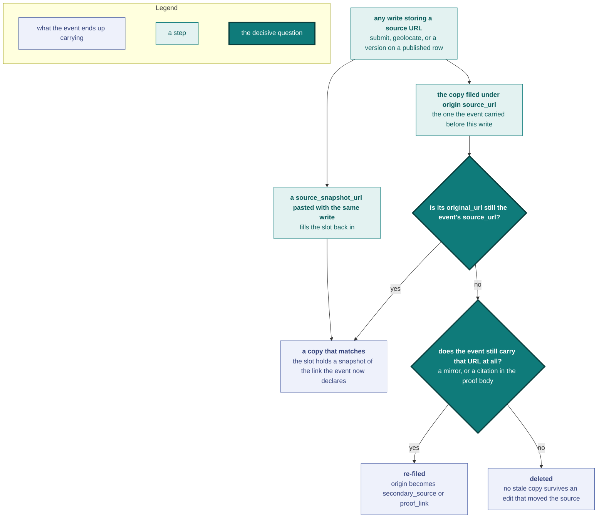
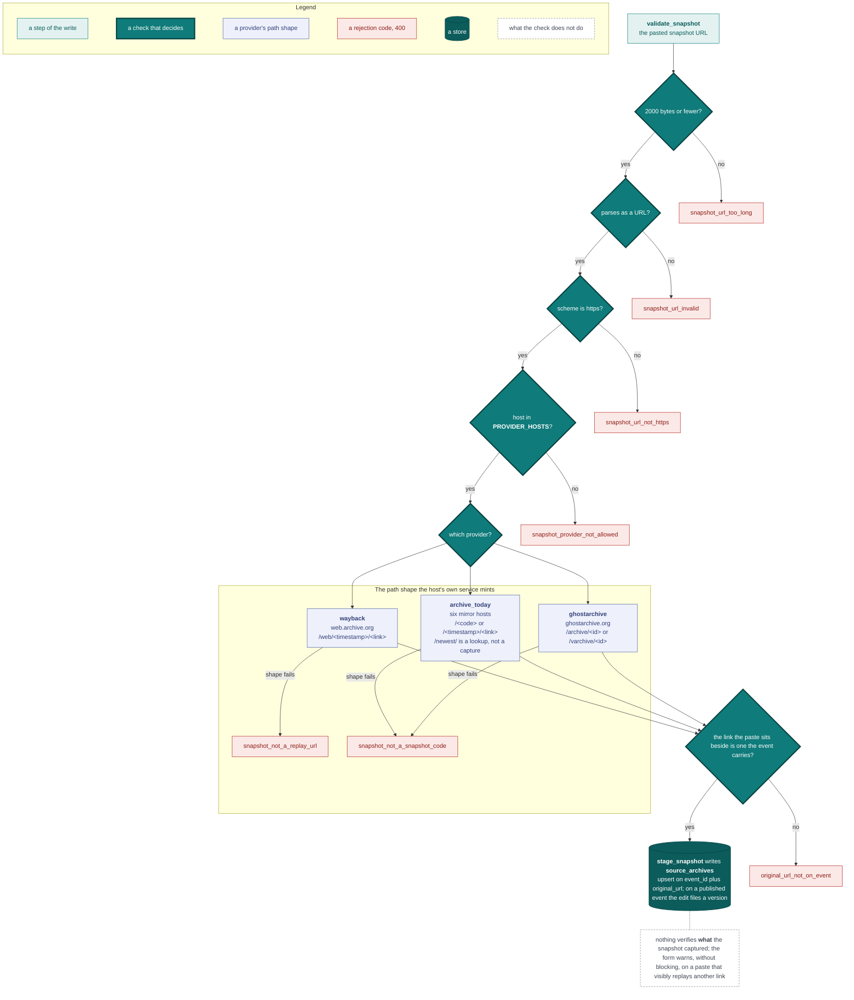

# Source archival

Source tweets get deleted and accounts get suspended, which destroys exactly the evidence the catalog preserves. An archived copy keeps a dead original readable, and the analyst who owns the event is who makes it.

```mermaid
flowchart LR
  classDef spec fill:#eef1fb,stroke:#4a5fa5,color:#33417a
  classDef shared fill:#e3f2f1,stroke:#0f7b7a,color:#0b5c5b
  classDef core fill:#0f7b7a,stroke:#083f3e,stroke-width:3px,color:#ffffff
  classDef store fill:#0b5c5b,stroke:#083f3e,color:#ffffff

  subgraph legend [Legend]
    direction LR
    l1["`what happens in the analyst's browser`"]:::spec
    l2["`a step of the write`"]:::shared
    l3["`the check that decides`"]:::core
    l4[("`a store`")]:::store
    l1 ~~~ l2 ~~~ l3 ~~~ l4
  end

  links["`**source_archive.collect_links**
  the four origins: source_url, secondary_source, detected_from, proof_link`"]:::shared
  mark["`**ArchiveAdornment**
  the mark inside the field holding the link`"]:::spec
  save["`**web.archive.org/save/&lt;link&gt;**
  opened prefilled, in the analyst's own browser; another provider is opened by hand`"]:::spec
  paste["`**ArchiveSnapshotField**
  the snapshot pasted back under that field`"]:::spec
  post["`**the write carrying it**
  source_snapshot_url, secondary_snapshot_urls, detected_from_snapshot_url`"]:::shared
  check["`**validate_snapshot**
  https, a host on PROVIDER_HOSTS, that provider's path shape; a rejection is a 400 and nothing publishes`"]:::core
  row[("`**source_archives**
  UNIQUE (event_id, original_url): one copy per link, provider inferred from the host`")]:::store
  version["`**file_version**
  on a published row: files the superseded version, changed field Archived copies`"]:::shared
  read["`**ArchivedCopies**
  accent where a copy exists and it opens it, grey and inert where none does`"]:::spec

  links --> mark --> save --> paste --> post --> check --> row
  post --> version
  row --> read
```

Each paragraph below takes one region of the diagram: why the capture runs in the browser, which links are in scope, which writes carry a paste, what the check accepts, and what a reader sees.

**The capture happens in the analyst's browser, not on the server.** Roughly nine in ten sources here are `x.com`, which Save Page Now refuses structurally (`We're currently facing some limitations when it comes to archiving this site`), and archive.today has no API and answers a burst of server-side submissions by banning the submitting host. Both services work from a browser, which is how the OSINT community uses them. So the form hands the analyst one prefilled submit page, `https://web.archive.org/save/<link>`, and takes back the snapshot URL the service produced. The Wayback Machine is the page it opens because Save Page Now runs from a browser and mints a replay URL that names the link it captured, which is what lets the paste field warn about an obvious mis-paste; an analyst who prefers another service opens it themselves and pastes the snapshot into the same field, which takes every host in the table below.

**Scope.** The table tracks the event's `source_url`, its [secondary source links](data-model.md#event_source_links) (the analyst-submitted mirrors, which carry the same link-rot risk as the primary), its `detected_from_url` (the analyst's own post a machine detection came from, which is the provenance of the geolocation claim), and every `http(s)` href carried by a link mark in the proof body's Tiptap document. [`source_archive.collect_links`](../backend/app/services/source_archive.py) is the one home for that walk, reading the proof body through [`sanitize.extract_link_hrefs`](../backend/app/services/sanitize.py). Each row records where its link came from in `origin` (`source_url`, `secondary_source`, `detected_from`, `proof_link`); a URL reachable from more than one is one link, kept under the first of those it appears in. Every link goes through [`sanitize.safe_link_href`](../backend/app/services/sanitize.py) (the same allowlist the proof editor writes against) plus a 2000-byte ceiling matching the `source_url` column. Analyst profile external links are out of scope, since they represent identity rather than evidence.

**One copy per link, from whichever service produced it.** [`source_archives`](data-model.md#source_archives) is unique on `(event_id, original_url)`, and the row holds one `snapshot_url` plus the `provider` that produced it. Two snapshots of one link is redundancy nobody reads back, and a resubmission by the owner overwrites the slot instead of competing with it, which is how a wrong paste is corrected. There is no queue state, no attempt counter and no per-provider slot: a row exists because a copy exists.

**A copy is recorded through the forms, and only through the forms.** There is no standalone archive endpoint: the paste rides the write that stores or corrects the link it covers, so a copy on a published record is a version like any other change to that record. [`POST /events`](api.md#post-events) and [`POST /events/requests`](api.md#post-eventsrequests) take it at submit, [`POST /events/{id}/geolocate`](api.md#post-eventsidgeolocate) at the fulfil / detection submit, and [`POST /events/{id}/versions`](api.md#post-eventsidversions) on a published row. `detected_from_url` is therefore archived from the published-row edit alone, being immutable from the moment the detection exists; a proof citation carries no paste field at all, and a row lands under origin `proof_link` only when the reconcile below re-files a source copy the analyst moved into the proof body. **A `requested` or `closed` row has no archive path**: its poster records the source copy at submit, and once the row is closed there is no write left that takes a paste, whichever state it left.

**On a published event, recording a copy is a tracked change.** Which of a `geolocated` record's links are archived is part of what that record says, so the edit carrying the paste files the superseded version as an [`event_versions`](data-model.md#event_versions) row and moves `version_no` on. The version's changed-field list names it *Archived copies*, and each version's snapshot carries the copies it held, so `/events/{id}/vN` renders them as they stood. A re-paste of the copy a link already carries moves nothing and files nothing: the comparison folds the two URLs through `same_snapshot`, dropping the scheme, the host case, a leading `www.` and a trailing slash, so a spelling picked up in a browser is not read as a correction. An event carries at most 100 versions, and a save whose only change is archived copies is exempt from that ceiling: an original that dies while the row sits at 100 would otherwise be unarchivable for good. Below publication (`requested`, `detected`) nothing is versioned, so the copy is stored on its own.

**Archival starts at the submit form, not after publication.** A link is most archivable while the analyst still has it open, so every link the form declares carries the affordance inside the field holding it: an archive mark in the field's trailing slot, which opens one line under that field with a paste field taking the snapshot back from any accepted host and a door onto `https://web.archive.org/save/<link>` prefilled with the value currently typed. A link that already has a copy carries the mark opening that copy as well, since one link holds one copy and replacing a wrong paste is what the second mark is for. The source URL carries it, and so does each secondary source row, since a mirror rots the same way; on the published-row edit the locked *Detected from* field carries it too, because a link being immutable says nothing about whether it rots. The pastes post as `source_snapshot_url`, as `secondary_snapshot_urls` (one entry per mirror, aligned with `secondary_source_urls` by position) and as `detected_from_snapshot_url`, which only [`POST /events/{id}/versions`](api.md#post-eventsidversions) declares. Each runs `validate_snapshot` and lands in the same transaction as the event, filed under origin `source_url`, `secondary_source` or `detected_from`. The pairing runs before the mirrors are normalized, so a copy stays on the link it was pasted under; a copy whose mirror the write drops is dropped with it, and a copy filed against a mirror an edit removes is deleted with that mirror, the version it superseded keeping it readable. A rejected paste publishes nothing: the analyst fixes it and submits the same form again. The fields are optional and sit in no publish floor.

**A copy always matches the source URL it is filed against.**

The source URL is editable at every point of the lifecycle, a correction on a published row included, so an edit can leave a snapshot describing a link the event no longer declares. Every write that stores a source URL therefore reconciles the copy filed under origin `source_url`: if that copy's `original_url` is no longer the event's `source_url`, it is re-filed under the origin the URL now has (the analyst moved it to the mirrors, or cited it in the proof) or deleted when the event no longer carries the URL at all. An edit that changes the source and pastes no new snapshot thus leaves the event with **no** archived source rather than a stale one; pasting a `source_snapshot_url` with the same write fills the slot back in. The reconcile reads the links the event carries at that moment, so the mirrors are the submitted ones while the proof body is still the stored one (a write applies its new proof at commit).

**What counts as a snapshot.** The server checks where a snapshot lives, not what it captured. The byte ceiling matches the one the `source_url` column carries. The host is also what infers the provider.

| Provider | Hosts | Path shape |
|---|---|---|
| `wayback` | `web.archive.org` | `/web/<timestamp>/<original link>` |
| `archive_today` | `archive.today`, `archive.ph`, `archive.is`, `archive.md`, `archive.li`, `archive.vn` | `/<code>` or `/<timestamp>/<original link>` |
| `ghostarchive` | `ghostarchive.org` | `/archive/<id>` or `/varchive/<id>` |

archive.today serves one set of snapshots under six interchangeable domains, and which one an analyst is handed depends on where they are, so all six read as one provider. A `/newest/<link>` lookup fails the shape check on either archive.today spelling: it resolves to whatever the service holds today rather than to one fixed capture, and a capture URL starts with a timestamp where a lookup starts with a word.

**Which link a snapshot archives is the analyst's to get right.** The short-code and id forms embed nothing, so an archive.today code and a Ghostarchive id give the server nothing to compare. The replay forms do carry the link they captured, but they carry it in the form the source platform used at capture time: a `youtu.be` share link, `twitter.com` before the rename and a `t.me/s/` channel preview each address the same post as the link stored on the event, so comparing the two strings refuses correct snapshots every time a platform moves its own URLs. Reading the snapshot instead is not open either, because fetching archive.today from a server is what gets the deployment's IP banned. So the paste is trusted: it comes from the authenticated owner of the event, whose own catalog entry a wrong link degrades, and the host allowlist plus the path shape is what bounds the abuse.

**The forms warn before they post.** A pasted snapshot that visibly replays a link other than the one it sits under raises an amber line under the paste field naming both URLs ([`lib/snapshots.ts`](../frontend/src/lib/snapshots.ts) → `snapshotArchivesAnotherLink`). It reads both path forms that embed an original, `web.archive.org/web/<timestamp>/<link>` and `archive.today/<timestamp>/<link>`. The comparison folds the scheme, the host case, a leading `www.`, a trailing slash, the platform spellings above and X's `s` and `t` share parameters. It blocks nothing, which is what lets it be loose: a wrong warning costs a sentence the analyst ignores.

**Treat an archive.today snapshot as a convenience link rather than integrity-bearing evidence.** English Wikipedia deprecated links to the service in February 2026, citing evidence that it tampers with archived pages ([guidance](https://en.wikipedia.org/wiki/Wikipedia:Archive.today_guidance), [background](https://en.wikipedia.org/wiki/Archive.today)). The Wayback Machine is the provider the affordance prefills for that reason.

Every rejection is a 400 carrying the code for the check it failed, as the diagram names them: `snapshot_url_too_long`, `snapshot_url_invalid`, `snapshot_url_not_https`, `snapshot_provider_not_allowed`, `snapshot_not_a_replay_url`, `snapshot_not_a_snapshot_code`, `original_url_not_on_event`.

**Read surface.** `EventRead.archived_source` carries the archived copy of the event's own `source_url` as `{url, provider}`. `archived_secondary_sources` carries the same per mirror, index-aligned with `secondary_source_urls`, and `archived_detected_from` carries it for the provenance link (see [`api.md`](api.md#get-eventsid)). All three are `null` when no copy has been recorded, which is every link's starting state. The event detail surface, both the full page and the map side panel, renders each as one small icon beside the link it covers, using [`ArchivedCopies`](../frontend/src/components/ui/ArchivedCopies.tsx) as the one component for the primary source, the mirrors and the provenance link. It reads and never writes: the icon is accent-coloured and opens the copy where one exists, and grey and inert where none does, for every reader including the event's owner. Recording a copy is an edit, so it happens on the forms, which carry the affordance as a mark inside the Source URL field, inside every secondary source row and, on the published-row edit, inside the locked *Detected from* field ([`ArchiveAdornment`](../frontend/src/components/ui/ArchivedCopies.tsx)), opening the paste line under that field ([`ArchiveSnapshotField`](../frontend/src/components/ui/ArchivedCopies.tsx)); a link that already carries a copy shows the mark that opens it beside the mark that replaces it. Detections carry the field too, since a detection's source rots while it waits. Proof-link copies are stored but not rendered inline.

## See also

- [`api.md`](api.md#post-eventsidversions) for the write contract, and [`GET /events/{id}`](api.md#get-eventsid) for the read shape.
- [`data-model.md`](data-model.md#source_archives) for the `source_archives` columns.
- [`ingestion.md`](ingestion.md#re-import) for what a re-import does to a detection's archived copies.
