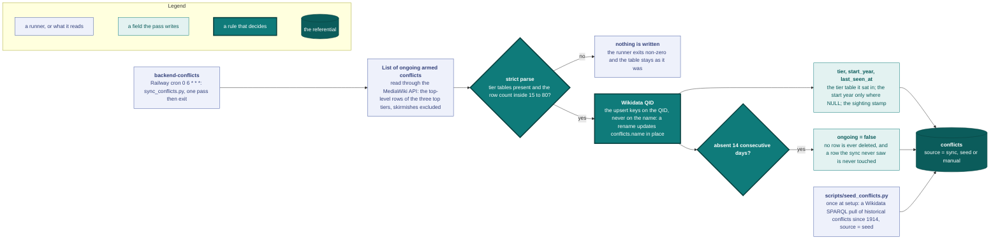

# Conflict referential sync

The conflicts an event can be tagged with are not user-created. They live in the [`conflicts`](data-model.md#conflicts) table, fed from two external sources by [`conflict_sync.py`](../backend/app/services/conflict_sync.py) and [`seed_conflicts.py`](../backend/scripts/seed_conflicts.py).

Each paragraph below takes one node of the diagram, and the two runners are named at the end.

**Source.** The daily sync parses Wikipedia's "List of ongoing armed conflicts" through the MediaWiki API. It reads the top-level rows of the three top tiers (major wars, minor wars, conflicts), and excludes skirmishes as high-churn editorial noise. The page's presence boundary (a conflict is listed only if editors judge it ongoing) matches the product's `ongoing` flag exactly, so syncing the page externalizes both the list and the "is it still ongoing" judgment.

**QID identity.** Each row's article resolves to its Wikidata QID, and the sync upserts by QID, not by name. The page renames conflicts constantly: 24 of 35 month transitions over 2023-2026 changed at least one name, almost all editorial renames of the same conflict. The QID survives every rename. A rename updates `conflicts.name` in place. A same-name row without a QID is adopted. A name collision is skipped and logged.

**Tier capture.** Each row's tier table becomes `conflicts.tier`: `major`, `minor`, or `conflict`. These match the page's death-toll bands: 10,000+ combat deaths in the current or previous year, 1,000-9,999, or 100-999. A conflict that moves to another tier table gets `tier` updated on the next pass. Rows the sync has never seen keep `tier` as NULL.

**start_year fill.** The sync parses each row's start-of-conflict year from the page and writes `start_year` only where it is NULL. It never overwrites an existing value, such as the Wikidata seed's years.

**Grace period, never delete.** Disappearance from the page is ambiguous: a conflict may have ended, been renamed, or slid below a tier threshold. A row flips `ongoing=false` only after 14 consecutive days of absence (`last_seen_at`), and rows are never deleted. Rows the sync has never seen (`last_seen_at IS NULL`, such as the manual `Other` row and unseen seed rows) are never touched.

**Strict-parse abort.** If the page structure stops matching (tier tables missing) or the row count falls outside [15, 80], the sync raises an error and writes nothing, leaving the referential table as it was. The runner exits non-zero.

**The two scripts:**

- `uv run python scripts/seed_conflicts.py [--dry-run]` runs **once at setup**. It performs a Wikidata SPARQL pull of historical conflicts since 1914, about 700 to 850 rows, using a P31 type allowlist: wars, civil wars, armed conflicts, rebellions, insurgencies, and the relevant margins. It excludes battles, operations, and coup attempts. Rows with missing QIDs insert as `source='seed'`, `ongoing=false`. It never modifies existing rows, since the sync owns them. It is idempotent and safe to re-run.
- `uv run python scripts/sync_conflicts.py` runs **daily through a Railway cron service**: one pass of the Wikipedia sync described above. You can also run it by hand.

**Scheduler config.** The sync runs as the Railway cron service `backend-conflicts`, on the schedule `0 6 * * *`, with the start command `uv run python scripts/sync_conflicts.py`. It mirrors the [`backend-backup`](backups.md) pattern, and its build, config-as-code path and shared environment are the ones every scheduler service takes (see [`engineering.md`](engineering.md#scheduler-services)). The process makes one pass and exits. A non-zero exit shows on the service's deployment view, and when `SENTRY_DSN` is set, a strict-parse abort is captured to Sentry. A missed run is harmless: the sync is idempotent, and the 14-day grace period absorbs multi-day gaps.

## See also

- [`data-model.md`](data-model.md#conflicts) for the `conflicts` / `event_conflicts` columns.
- [`api.md`](api.md#get-conflicts) for the referential on the wire.
- [`engineering.md`](engineering.md#scheduler-services) for the other Railway scheduler services.
