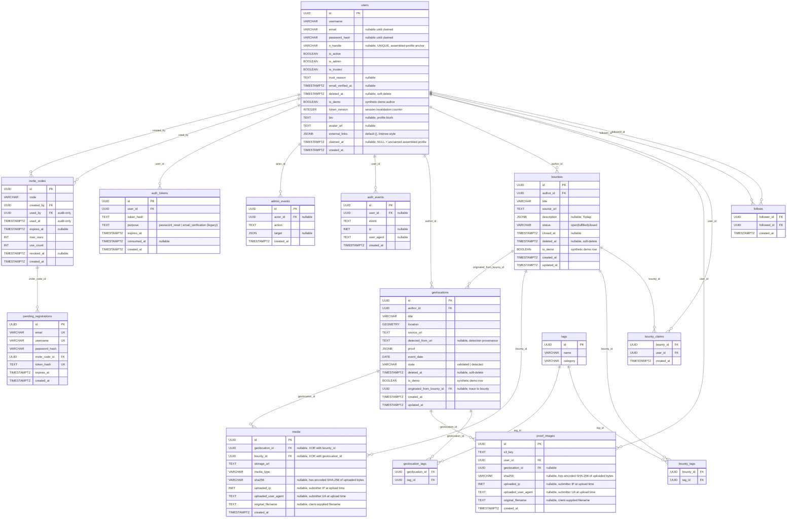

# Data model

## Overview



---

## Tables

### `users`

| Column | Type | Constraints |
|--------|------|-------------|
| `id` | `UUID` | PK, default `gen_random_uuid()` |
| `username` | `VARCHAR(50)` | UNIQUE, NOT NULL |
| `email` | `VARCHAR(255)` | UNIQUE, nullable — NULL on an assembled profile (built from an X handle before login); set when its owner claims it. Every self-registered / claimed account carries it. |
| `password_hash` | `VARCHAR(255)` | nullable — NULL until claimed, same reason as `email`. |
| `x_handle` | `VARCHAR(50)` | UNIQUE, nullable — the X handle an assembled profile was built from (lowercased, no `@`). Pre-claim identity anchor and the dedup key so re-consent reuses the existing profile. Distinct from `external_links["x"]`, a free-text display link the owner sets. |
| `is_active` | `BOOLEAN` | NOT NULL, default `true` |
| `is_admin` | `BOOLEAN` | NOT NULL, default `false` — auto-flipped on login/register if email matches `ADMIN_EMAILS` |
| `is_trusted` | `BOOLEAN` | NOT NULL, default `false` — substantiated trust mark (toggle UI lands later; column ships now) |
| `trust_reason` | `TEXT` | nullable — required at the application layer when `is_trusted=true` |
| `email_verified_at` | `TIMESTAMPTZ` | nullable — set to `created_at` by the pre-creation registration flow. Every row minted after the `pending_registrations` migration only exists because the analyst clicked the confirmation link, so this is non-NULL for new accounts. |
| `deleted_at` | `TIMESTAMPTZ` | nullable — non-NULL = soft-deleted (login rejected, profile 404s, filtered from public reads). Soft-deleting a user cascade-soft-deletes every geolocation they authored. Hard-delete (the GDPR escape hatch) drops the row + cascade-drops their geolocations + sweeps S3. |
| `is_demo` | `BOOLEAN` | NOT NULL, default `false` — TRUE iff created by the admin Demo data seeder (5 fixed `demo-analyst-N` accounts with unloggable hashes + `@vidit.invalid` emails). The wipe button drops every flagged user + their geolocations in one go. |
| `token_version` | `INTEGER` | NOT NULL, default `0` — monotonic session-invalidation counter. The session JWT embeds this as a `tv` claim; `get_current_user` 401s on mismatch. Bumped on logout, password change, password reset, and soft-delete so every outstanding JWT for the user becomes invalid at once. Pre-migration cookies (no `tv`) 401 too — the migration's one-time forced logout is intended. |
| `bio` | `TEXT` | nullable — short plain-text blurb shown on the public profile, edited via `PATCH /users/me`. Capped at 500 chars at the API layer (no DB constraint — cap changes don't need migrations). |
| `avatar_url` | `TEXT` | nullable — public avatar URL. Validated as http(s) at the API layer to keep `javascript:` URLs out of the `` render path. No upload pipeline yet (free-form URL — analysts paste a Gravatar / CDN link). |
| `external_links` | `JSONB` | NOT NULL, default `'{}'::jsonb` — Linktree-style object keyed by platform (`x`, `discord`, `website`, `github`). Default `{}` (never NULL) so the read path is always a dict. `PATCH /users/me` replaces the column wholesale; partial-merge conflicts with the whole-panel form submit. |
| `claimed_at` | `TIMESTAMPTZ` | nullable, `DEFAULT now()` — the moment an owner took control. Defaults to insert time so owned-at-creation paths (registration, seeder, future sign-up) are correct without stamping it; the assembly pipeline inserts an explicit NULL for an unclaimed profile, so `claimed_at IS NULL` means "assembled, not yet claimed" (identified by `x_handle` alone). Existing rows backfilled to `created_at`. |
| `created_at` | `TIMESTAMPTZ` | NOT NULL, default `now()` |

Indexes:

- `users_x_handle_key` UNIQUE on `(x_handle)` — one profile per X handle; Postgres allows the unlimited NULLs of handle-less (registered) rows
- `ix_users_live` on `(created_at) WHERE deleted_at IS NULL` — partial; admin search and the auth path filter `deleted_at IS NULL`
- `ix_users_demo` on `(id) WHERE is_demo = true` — partial; the wipe sweep runs `WHERE is_demo = true` and would otherwise full-scan the table
- `ix_users_search_fts` GIN on `to_tsvector('simple', coalesce(username, '') || ' ' || coalesce(bio, ''))` — backs `GET /search` (analyst branch); bio joins the indexed expression so `ts_headline` can return a fragment highlight

The credential-less assembled-profile model — nullable `email` / `password_hash`, the `x_handle` anchor, `claimed_at IS NULL` for an unclaimed row — shipped in `v0.3.1`; see [CHANGELOG](../CHANGELOG.md) for the claim-flag-over-a-separate-`authors`-table rationale.

---

### `auth_tokens`

Single-use, expiring tokens for password reset.

| Column | Type | Constraints |
|--------|------|-------------|
| `id` | `UUID` | PK, default `uuid4()` |
| `user_id` | `UUID` | FK → `users.id` ON DELETE CASCADE, NOT NULL |
| `token_hash` | `TEXT` | UNIQUE, NOT NULL — `sha256(secret)`; the plaintext is only ever in the email link |
| `purpose` | `TEXT` | NOT NULL, CHECK in `('password_reset', 'email_verification')` — only `password_reset` is minted today; `email_verification` is a legacy value retained as the DB-level cross-purpose-rejection anchor |
| `expires_at` | `TIMESTAMPTZ` | NOT NULL |
| `consumed_at` | `TIMESTAMPTZ` | nullable; non-null = single-use already redeemed |
| `created_at` | `TIMESTAMPTZ` | NOT NULL, default `now()` |

Indexes:

- `ix_auth_tokens_user_id` on `(user_id)` — cascade delete + per-user revocation lookups
- `ix_auth_tokens_user_purpose` on `(user_id, purpose)` — "is there a live reset for this user?" before mint
- `ix_auth_tokens_live_expires_at` on `(expires_at) WHERE consumed_at IS NULL` — partial; reaper scan stays cheap as consumed rows accumulate

Lifecycle: created by `mint`, consumed by `consume`, force-revoked by `revoke_all_live_for_user` on fresh same-purpose mint. Cleanup runs on-demand via the admin Maintenance panel (`services/maintenance.py::reap_auth_tokens`): live-but-expired rows are deleted immediately, and consumed rows older than 30 days are dropped.

---

### `invite_codes`

| Column | Type | Constraints |
|--------|------|-------------|
| `id` | `UUID` | PK, default `gen_random_uuid()` |
| `code` | `VARCHAR(64)` | UNIQUE, NOT NULL |
| `created_by` | `UUID` | FK → `users.id` ON DELETE SET NULL, nullable (admin-seeded codes; FK nulled on user hard-delete to preserve the audit row) |
| `used_by` | `UUID` | FK → `users.id` ON DELETE SET NULL, nullable — **audit-only** (records the *first* user to consume the code; FK nulled on user hard-delete) |
| `used_at` | `TIMESTAMPTZ` | nullable — audit-only, paired with `used_by` |
| `expires_at` | `TIMESTAMPTZ` | nullable |
| `max_uses` | `INTEGER` | NOT NULL, default `1` — quota; minted by the admin page (1 = single-use) |
| `use_count` | `INTEGER` | NOT NULL, default `0` — incremented on each successful registration |
| `revoked_at` | `TIMESTAMPTZ` | nullable — set by the admin page; non-null instantly invalidates the code |
| `created_at` | `TIMESTAMPTZ` | NOT NULL, default `now()` |

A code is valid iff `revoked_at IS NULL AND use_count < max_uses AND (expires_at IS NULL OR expires_at > now())`. `used_by` / `used_at` are *not* part of the validity check.

---

### `pending_registrations`

| Column | Type | Constraints |
|--------|------|-------------|
| `id` | `UUID` | PK, default `gen_random_uuid()` |
| `email` | `VARCHAR(255)` | UNIQUE, NOT NULL — holds the address until the user confirms or the row expires |
| `username` | `VARCHAR(50)` | UNIQUE, NOT NULL — same role as `email` for handle uniqueness |
| `password_hash` | `VARCHAR(255)` | NOT NULL — bcrypt; transferred straight into `users.password_hash` at confirmation |
| `invite_code_id` | `UUID` | FK → `invite_codes.id` ON DELETE CASCADE, NOT NULL — invite is referenced, **not consumed**, until confirmation |
| `token_hash` | `TEXT` | UNIQUE, NOT NULL — `sha256(secret)`; the plaintext is only ever in the email link |
| `expires_at` | `TIMESTAMPTZ` | NOT NULL — 24h after mint |
| `created_at` | `TIMESTAMPTZ` | NOT NULL, default `now()` |

Indexes:

- `ix_pending_registrations_expires_at` on `(expires_at)` — reaper sweep

Why UNIQUE on `email` / `username` instead of a partial index? Partial-index predicates must be IMMUTABLE in Postgres, and `expires_at > now()` is STABLE. The plain UNIQUE keeps race-window protection without a predicate; the `/auth/register` path deletes expired rows inline before its INSERT and the admin Maintenance reaper sweeps the rest, so a recently-expired pending row does not permanently pin its address.

Lifecycle: `POST /auth/register` inserts via `services/registration.py::create_pending_registration`. `POST /auth/confirm-registration` consumes via `confirm_pending_registration` (creates the `users` row, bumps `invite_codes.use_count`, deletes the pending row). `POST /auth/resend-confirmation` re-mints the token on the same row, invalidating the previous link. Cleanup: `services/maintenance.py::reap_pending_registrations`, exposed in the admin Maintenance panel.

---

### `auth_events`

Append-only audit log for auth-relevant events. Populated synchronously from the auth router on `login` / `failed_login` / `logout` / `register_pending` / `register_resent` / `register_confirmed` / `password_reset_requested` / `password_reset_completed` / `password_changed`. Writes happen inside a SAVEPOINT (`db.begin_nested()`) so an INSERT failure (e.g. INET coercion from a malformed `X-Forwarded-For`) rolls back only the audit row and the caller's transaction stays usable.

| Column | Type | Constraints |
|--------|------|-------------|
| `id` | `UUID` | PK, default `uuid4()` |
| `user_id` | `UUID` | FK → `users.id` ON DELETE SET NULL, nullable — NULL when the email didn't match a live user (failed_login, password_reset_requested no-op branch, register_pending, register_resent on both branches, anonymous logout) so the row doesn't double as a probe-able email-to-existence oracle |
| `event` | `TEXT` | NOT NULL — plain string, no DB enum so adding a new event kind doesn't require a migration |
| `ip` | `INET` | nullable — IPv4 / IPv6, parsed via `ipaddress.ip_address` in `services/audit.py::extract_client_ip`. We take the **right-most** entry of `X-Forwarded-For` (the trusted-proxy observation), not the left-most: left-most is client-spoofable. Assumes one trusted hop (Railway); add a `TRUSTED_PROXY_HOPS` peel when a second trusted proxy lands in front. An invalid value lands as NULL rather than poisoning the savepoint. |
| `user_agent` | `TEXT` | nullable, capped at 1024 chars |
| `created_at` | `TIMESTAMPTZ` | NOT NULL, default `now()` |

Indexes:

- `ix_auth_events_user_id_created_at` on `(user_id, created_at)` — "what did this user do, latest first" forensics query
- `ix_auth_events_event_created_at` on `(event, created_at)` — "did event X spike recently"

No retention policy today.

---

### `admin_events`

Append-only audit row for admin actions taken via the `/admin` page. Sibling to the `auth_events` table above.

| Column | Type | Constraints |
|--------|------|-------------|
| `id` | `UUID` | PK, default `uuid4()` |
| `actor_id` | `UUID` | FK → `users.id` ON DELETE SET NULL, nullable |
| `action` | `TEXT` | NOT NULL — e.g. `invite_created`, `invite_revoked` |
| `target` | `JSON` | nullable — free-form context (target IDs, parameters) |
| `created_at` | `TIMESTAMPTZ` | NOT NULL, default `now()` |

Indexes:

- `ix_admin_events_actor_id` on `(actor_id)` — "what did this admin do?"
- `ix_admin_events_created_at` on `(created_at)` — chronological scans

---

### `geolocations`

| Column | Type | Constraints |
|--------|------|-------------|
| `id` | `UUID` | PK, default `gen_random_uuid()` |
| `author_id` | `UUID` | FK → `users.id`, NOT NULL |
| `title` | `VARCHAR(255)` | NOT NULL |
| `location` | `GEOMETRY(Point, 4326)` | NOT NULL |
| `source_url` | `TEXT` | NOT NULL — where the footage was first published. For a machine `detected` row, no footage origin is known from the text alone, so it points at the originating post (also surfaced as `detected_from_url`); immutable once set. |
| `detected_from_url` | `TEXT` | nullable — the post a machine detection was imported from. The `(detected_from_url, coordinate)` assemble idempotency anchor and a provenance link, distinct from `source_url`. NULL for human submits. |
| `proof` | `JSONB` | NOT NULL — Tiptap document (ProseMirror JSON). Every row carries a proof doc: human submits the analyst's write-up, machine detections the tweet / thread text. A submission with no proof body stores an empty doc, not NULL. |
| `event_date` | `DATE` | NOT NULL — for a machine detection, provisionally the originating tweet's post date; the owner corrects it at validation. |
| `state` | `VARCHAR(20)` | NOT NULL, `server_default 'validated'` — `validated` (human submits + bounty fulfilments, immutable) vs `detected` (machine-produced, rendered marked on every surface until its owner validates it). Plain string, no DB enum (mirrors `bounties.status`); the default keeps every non-machine insert correct with no code change. |
| `deleted_at` | `TIMESTAMPTZ` | nullable — non-NULL = soft-deleted (filtered from public reads; admin-only thereafter) |
| `is_demo` | `BOOLEAN` | NOT NULL, default `false` — TRUE iff seeded by the admin Demo data panel. Surfaced via the always-attached `demo` free tag (filterable in the map UI) and dropped en masse by the wipe button. |
| `originated_from_bounty_id` | `UUID` | FK → `bounties.id` ON DELETE SET NULL, nullable — provenance trace populated when a geolocation is promoted from a bounty. `SET NULL` so a hard-deleted bounty doesn't take its descendant geolocation with it. |
| `created_at` | `TIMESTAMPTZ` | NOT NULL, default `now()` |
| `updated_at` | `TIMESTAMPTZ` | NOT NULL, default `now()` |

**Indexes:**
- `GIST(location)` — required for geospatial queries (bounding-box filtering, proximity sort)
- `(author_id)` — profile lookup
- `(event_date)`, `(created_at)` — time-based queries
- `(author_id, created_at DESC)` — composite for profile listing
- `ix_geolocations_live` on `(created_at) WHERE deleted_at IS NULL` — partial; every public read filters `deleted_at IS NULL`; the partial keeps the index tight.
- `ix_geolocations_demo` on `(id) WHERE is_demo = true` — partial; the demo-wipe sweep runs `WHERE is_demo = true` and otherwise full-scans
- `ix_geolocations_originated_from_bounty_id` on `(originated_from_bounty_id)` — bounty detail reads "what geolocation came from me?" via this column
- `uq_geolocations_originated_from_bounty_id` on `(originated_from_bounty_id) WHERE originated_from_bounty_id IS NOT NULL` — **unique** partial; at most one geolocation per fulfilled bounty. Backs the `SELECT ... FOR UPDATE` taken by `POST /geolocations bounty_id=…`: even if a future code path forgets the row lock, the second insert fails on constraint violation. The `WHERE` clause keeps standalone geolocations out of the uniqueness check.
- `ix_geolocations_search_fts` GIN on `to_tsvector('simple', coalesce(title, ''))` — backs `GET /search`. `simple` config (not `english`) keeps matching predictable for the closed beta corpus of place names and analyst handles; soft-delete is filtered at query time. `source_url` is intentionally not in the indexed expression — see migration `o1j3k5l7m9n1` for the rationale (Postgres' simple parser tokenizes URLs as host/path units).

> `location` is a PostGIS point in WGS84 (SRID 4326 = standard GPS coordinates).
> GeoAlchemy2 exposes `.lat` / `.lng` via `WKBElement`, or `ST_X` / `ST_Y` in raw SQL.

---

### `bounties`

An **unfinished geolocation**: media + a source URL someone couldn't place. Lifecycle: `open` → `fulfilled` (a geolocation was promoted from this bounty via `POST /geolocations bounty_id=…`) or `closed` (author withdrew). "I'm working on this" is a parallel multi-claimer signal in [`bounty_claims`](#bounty_claims), not a state.

| Column | Type | Constraints |
|--------|------|-------------|
| `id` | `UUID` | PK, default `gen_random_uuid()` |
| `author_id` | `UUID` | FK → `users.id`, NOT NULL |
| `title` | `VARCHAR(255)` | NOT NULL |
| `source_url` | `TEXT` | NOT NULL — required because a bounty is evidence in search of a location |
| `description` | `JSONB` | nullable — Tiptap document (ProseMirror JSON), sanitised server-side on insert |
| `status` | `VARCHAR(20)` | NOT NULL, default `'open'` — one of `open`, `fulfilled`, `closed`. Plain string (no DB enum) so adding a state doesn't require a migration |
| `closed_at` | `TIMESTAMPTZ` | nullable — set when status transitions to `fulfilled` or `closed` |
| `deleted_at` | `TIMESTAMPTZ` | nullable — soft-delete; filtered from every public read (admin path acts on the raw model) |
| `is_demo` | `BOOLEAN` | NOT NULL, default `false` — TRUE iff seeded by the admin "Demo bounties" panel. The wipe button drops every flagged row in one bulk DELETE. |
| `created_at` | `TIMESTAMPTZ` | NOT NULL, default `now()` |
| `updated_at` | `TIMESTAMPTZ` | NOT NULL, default `now()` |

**Indexes:**
- `ix_bounties_status_created_at` on `(status, created_at)` — "open bounties, newest first" is the dominant index query
- `ix_bounties_author_id` on `(author_id)` — profile + admin lookups
- `ix_bounties_deleted_at` on `(deleted_at)` — cheap soft-delete filter on every public read
- `ix_bounties_demo` on `(id) WHERE is_demo = true` — partial; the demo-wipe sweep runs `WHERE is_demo = true` and otherwise full-scans
- `ix_bounties_search_fts` GIN on `to_tsvector('simple', coalesce(title, ''))` — parallel index to the geolocations one, backs the same `GET /search` endpoint

The pointer from a fulfilled bounty to the resulting geolocation lives on `geolocations.originated_from_bounty_id` (not on this table) — geolocation-side because read paths render the trace. `DELETE /bounties/{id}` refuses with **409** when a geolocation already points to the row, so the descendant isn't orphaned silently.

---

### `bounty_tags`

Many-to-many junction between `bounties` and `tags`. Mirrors `geolocation_tags`.

| Column | Type | Constraints |
|--------|------|-------------|
| `bounty_id` | `UUID` | FK → `bounties.id` ON DELETE CASCADE |
| `tag_id` | `UUID` | FK → `tags.id` ON DELETE CASCADE |

Composite PK: `(bounty_id, tag_id)`

---

### `bounty_claims`

Multi-analyst "I'm working on this" signal. Multiple analysts can hold a claim on the same bounty simultaneously — the claim is a public hint to coordinate, not a single-claimer reservation. Composite PK makes re-claiming idempotent at the DB level; the `POST /bounties/{id}/claim` endpoint exploits that and returns 204 either way.

| Column | Type | Constraints |
|--------|------|-------------|
| `bounty_id` | `UUID` | FK → `bounties.id` ON DELETE CASCADE |
| `user_id` | `UUID` | FK → `users.id` ON DELETE CASCADE |
| `created_at` | `TIMESTAMPTZ` | NOT NULL, default `now()` |

Composite PK: `(bounty_id, user_id)`

**Indexes:**
- `ix_bounty_claims_bounty_id_created_at` on `(bounty_id, created_at)` — "who's working on bounty X right now?" detail-page query, newest-first ordering
- `ix_bounty_claims_user_id` on `(user_id)` — profile / dashboard "what is this user working on?"

Claims don't gate the lifecycle: a bounty can be fulfilled by an analyst who never claimed, and claims aren't cleared when the bounty terminates. Hard-delete on the bounty cascades-drops the rows.

---

### `follows`

Directed follow edges between analysts. Drives the per-user `GET /timeline` feed and the `followers_count` / `following_count` / `is_following` fields on `GET /users/{username}`.

| Column | Type | Constraints |
|--------|------|-------------|
| `follower_id` | `UUID` | FK → `users.id` ON DELETE CASCADE, NOT NULL |
| `followed_id` | `UUID` | FK → `users.id` ON DELETE CASCADE, NOT NULL |
| `created_at` | `TIMESTAMPTZ` | NOT NULL, default `CURRENT_TIMESTAMP` |

Composite PK: `(follower_id, followed_id)` — the pair is the natural identity (no surrogate id) and the PK alone gives uniqueness, so no separate UNIQUE constraint is shipped.

Self-follow is rejected at **two** layers: the router returns `400 Cannot follow yourself` before the row is staged, and `CHECK (follower_id <> followed_id)` (constraint `ck_follows_no_self_follow`) refuses the INSERT even if a future code path skips the router check. The 400 gives the UI a clean error, the CHECK is the durable invariant.

Indexes:
- `ix_follows_followed_id` on `(followed_id)` — the PK indexes the forward direction (who is X following?) on its leading column, but the reverse direction (who follows X?) — the query that powers `followers_count` on every profile load — would otherwise full-scan.

`ON DELETE CASCADE` on both FKs: hard-deleting an analyst drops every edge they're on either side of, so a deleted user can't keep ghost-followers or ghost-followings. Soft-deleted users (`users.deleted_at IS NOT NULL`) keep their edges — the public profile 404s anyway, and resurrecting an account should resurrect its graph.

---

### `media`

Shared by `geolocations` and `bounties`. Exactly one of `geolocation_id` / `bounty_id` is non-NULL — the XOR is enforced both at the model layer and by a DB `CHECK` constraint (`ck_media_exactly_one_owner`). The polymorphism keeps the slice-2 bounty-fulfilment flow cheap: instead of re-uploading S3 objects, promoting a bounty rewrites the row pointers in place.

| Column | Type | Constraints |
|--------|------|-------------|
| `id` | `UUID` | PK, default `gen_random_uuid()` |
| `geolocation_id` | `UUID` | FK → `geolocations.id` ON DELETE CASCADE, nullable — XOR with `bounty_id` |
| `bounty_id` | `UUID` | FK → `bounties.id` ON DELETE CASCADE, nullable — XOR with `geolocation_id` |
| `storage_url` | `TEXT` | NOT NULL — S3 / CloudFront URL |
| `media_type` | `VARCHAR(10)` | NOT NULL — `'image'` or `'video'` |
| `sha256` | `VARCHAR(64)` | nullable — hex-encoded SHA-256 of the uploaded bytes, captured at upload time (`services/storage.py::UploadResult`). Stable content fingerprint that survives storage-class changes and copy operations, unlike the S3 ETag (MD5 for non-multipart uploads, not stable across copies). NULL on rows that pre-date this column. Demo-seeder rows now carry the hash too — `services/seed.py::_prepare_pool_media` runs a one-pass-per-seed hash + derivative production over each unique `demo-pool/` media key, so demo content matches real upload integrity. **The hash is computed on the bytes that land on S3 — for images that means after the EXIF strip — so an auditor downloading the public URL can independently verify the hash matches.** |
| `uploaded_ip` | `INET` | nullable — submitter IP at upload time. Extracted via `services/audit.py::extract_client_ip` (right-most XFF, defended against client-spoofed prepends). NULL when the value isn't parseable as IPv4 / IPv6, on demo-seeder rows, and on rows that pre-date the column. **Admin-only — never surfaced on the public read API.** |
| `uploaded_user_agent` | `TEXT` | nullable — submitter `User-Agent` string at upload time, capped at 1 KB. Same admin-only visibility as `uploaded_ip`. |
| `original_filename` | `TEXT` | nullable — client-supplied filename (e.g. `IMG_1234.jpg`). Surfaced on the public read API because investigators sometimes need to trace evidence back to a source post by filename. |
| `created_at` | `TIMESTAMPTZ` | NOT NULL, default `now()` |

**Check constraint:**
- `ck_media_exactly_one_owner`: `(geolocation_id IS NOT NULL AND bounty_id IS NULL) OR (geolocation_id IS NULL AND bounty_id IS NOT NULL)`

**Indexes:**
- `(sha256) WHERE sha256 IS NOT NULL` — partial index for "find every row with this content hash" audit / dedup queries; only the populated cohort, so demo rows don't bloat it.

At least one media item is required per geolocation and per bounty (enforced at the application layer — both `POST /geolocations` and `POST /bounties` reject empty file lists). Multiple media items per parent are allowed.

The `media` table stores the **top-level evidence files** uploaded with the form (the gallery shown above the proof body). Inline images embedded *inside* the proof body — added via the rich-text editor's `+ Image` button — live in `proof_images` instead.

S3 key prefixes: `uploads/<geolocation_id>/...` for geolocation media, `bounty_uploads/<bounty_id>/...` for bounty media. When slice 2 promotes a bounty, we rewrite the DB pointers but leave the S3 keys where they are.

---

### `proof_images`

Inline images embedded inside the Tiptap proof body (one row per image referenced from the `<image>` nodes in `geolocations.proof`).

| Column | Type | Constraints |
|--------|------|-------------|
| `id` | `UUID` | PK, default `gen_random_uuid()` |
| `s3_key` | `TEXT` | UNIQUE, NOT NULL — canonical key (host-stripped); inverse of `Storage.public_url` |
| `user_id` | `UUID` | FK → `users.id` ON DELETE CASCADE, NOT NULL |
| `geolocation_id` | `UUID` | FK → `geolocations.id` ON DELETE CASCADE, **nullable** until form submit |
| `sha256` | `VARCHAR(64)` | nullable — hex-encoded SHA-256 of the uploaded bytes (same rationale and NULL-cohort as `media.sha256`). |
| `uploaded_ip` | `INET` | nullable — submitter IP at upload (same rationale and admin-only visibility as `media.uploaded_ip`). |
| `uploaded_user_agent` | `TEXT` | nullable — submitter UA, capped at 1 KB. Admin-only. |
| `original_filename` | `TEXT` | nullable — client-supplied filename. Public on the read API. |
| `created_at` | `TIMESTAMPTZ` | NOT NULL, default `now()` |

**Indexes:**
- `(user_id)` — orphan reaper scopes by user; future per-user quota
- `(geolocation_id)` — collect keys for the cascade-delete S3 sweep
- `(created_at) WHERE geolocation_id IS NULL` — partial index for the orphan reaper
- `(sha256) WHERE sha256 IS NOT NULL` — partial content-hash index, mirrors `ix_media_sha256`

**Lifecycle:**
1. Editor uploads an image → `POST /geolocations/proof-images` writes to S3 and inserts a row with `geolocation_id = NULL`.
2. User submits the geolocation form → after sanitization, `POST /geolocations` extracts the `<image>` srcs from the proof JSON, derives s3_keys, and `UPDATE proof_images SET geolocation_id = :geo WHERE s3_key IN (...) AND user_id = :u AND geolocation_id IS NULL`. The user-id scope blocks one user from claiming another user's keys.
3. Geolocation deletion → the router collects matching `s3_key`s, deletes the S3 objects, then commits the cascade DB delete. (S3 is deleted post-commit so a failed transaction can't strand referenced files.)
4. Form abandoned → the row stays with `geolocation_id = NULL` and is reaped on-demand from the admin Maintenance panel (`services/maintenance.py::reap_proof_image_orphans`, 24h grace), which deletes both the S3 object and the row.

Why a separate table instead of embedding the URL in the proof JSON: gives O(1) orphan reaping, lets us sweep S3 on geolocation delete, and supports per-user quotas / takedown lookups without scanning the bucket or parsing JSONB.

---

### `tags`

| Column | Type | Constraints |
|--------|------|-------------|
| `id` | `UUID` | PK, default `gen_random_uuid()` |
| `name` | `VARCHAR(100)` | UNIQUE, NOT NULL |
| `category` | `VARCHAR(20)` | NOT NULL — `'conflict'`, `'capture_source'`, or `'free'` |

Tags with category `conflict` are the main conflicts (Ukraine, Gaza, Sudan…), plus an `Other` escape value.
Tags with category `capture_source` are the original "lens" that captured the media — `Smartphone`, `Satellite`, `Drone`, `Static camera`, `Dashcam`, `Body / helmet cam`, plus an `Unknown` escape value. Seeded in prod by migration `s5n7p9r1t3v5` (the demo seeder is local-only, but the category is required on the submit form, so the options must exist on a fresh prod DB).
Tags with category `free` are user-created and free-form.

`conflict` and `capture_source` are **curated** (server-managed, not user-creatable) and **required**: `POST /geolocations` rejects a submission that doesn't carry at least one tag from each category (see [`api.md`](api.md) → `POST /geolocations`). The rule is enforced at the API layer, not by a DB constraint — pre-existing rows and the demo seeder are unaffected, and each category ships an escape value. `name` is globally UNIQUE across all three categories, so a `capture_source` tag can't share a name with a `free` or `conflict` tag.

---

### `geolocation_tags`

Many-to-many junction table between `geolocations` and `tags`.

| Column | Type | Constraints |
|--------|------|-------------|
| `geolocation_id` | `UUID` | FK → `geolocations.id` ON DELETE CASCADE |
| `tag_id` | `UUID` | FK → `tags.id` ON DELETE CASCADE |

Composite PK: `(geolocation_id, tag_id)`

---

## Design decisions

### Why JSONB for `proof`?
Tiptap (the rich editor) serializes content as ProseMirror JSON. Storing that JSON as-is in a JSONB column avoids any conversion. PostgreSQL can index and query JSONB natively.

### Why `geolocation_tags` and not an array column on `geolocations`?
Many-to-many: a geolocation can carry several tags, and a tag can appear on many geolocations. The `geolocation_tags` junction table is the standard solution: it allows efficient filtering (`WHERE tag_id = X`) and indexing on both sides. The alternative (a `tag_ids[]` array on `geolocations`) would make filters more complex and less performant at scale.

```sql
-- Tags for a given geolocation
SELECT t.name, t.category
FROM tags t
JOIN geolocation_tags gt ON gt.tag_id = t.id
WHERE gt.geolocation_id = 'a3f8c2d1-...';
-- → [{ name: "Ukraine", category: "conflict" }, { name: "airstrike", category: "free" }]
```

### Why a single `tags` table with a category?
Conflicts and free-form tags share the same mechanics (filtering, many-to-many association). A single table plus a `category` field avoids duplicating the logic. The distinction is still queryable: `WHERE category = 'conflict'`.

### Why `GEOMETRY` instead of two `lat` / `lng` columns?
PostGIS unlocks native geospatial queries (bounding-box filtering, distance computation, clustering). GeoAlchemy2 exposes those types directly to SQLAlchemy.

---

## Typical MVP queries

```sql
-- All points for the map (initial load)
SELECT id, title, ST_X(location) AS lng, ST_Y(location) AS lat, event_date
FROM geolocations;

-- Filter by conflict
SELECT g.id, g.title, ST_X(g.location) AS lng, ST_Y(g.location) AS lat
FROM geolocations g
JOIN geolocation_tags gt ON gt.geolocation_id = g.id
JOIN tags t ON t.id = gt.tag_id
WHERE t.name = 'Ukraine' AND t.category = 'conflict';

-- An analyst's geolocations (profile)
SELECT id, title, event_date, created_at
FROM geolocations
WHERE author_id = :user_id
ORDER BY event_date DESC;
```

---

## Seed data

A third-party KMZ export can be mapped locally to generate test data. Large binaries; not version-controlled.

**KML → Vidit mapping:**

| KML field | → | Vidit column |
|-----------|---|---------------|
| `coordinates` (lng, lat) | → | `geolocations.location` |
| `description` (first line) | → | `geolocations.title` |
| `TimeStamp` | → | `geolocations.event_date` |
| "Source(s)" URLs in `description` | → | `geolocations.source_url` |
| "Geolocation(s)" URLs in `description` | → | `geolocations.proof` |
| `styleUrl` (icon color) | → | `tags` (side / event type) |

Local KMZ import is no longer scripted in this repo (the prior `seed_external.py` / `enrich_media.py` were deleted — the admin Demo data panel replaces them with a synthetic-data flow that references a curated `demo-pool/` S3 prefix). Mapping kept for a future agreement-bound import.
