# Data model

## Overview

```mermaid
erDiagram
    users {
        UUID id PK
        VARCHAR username
        VARCHAR email "nullable, legacy credential-less rows"
        VARCHAR password_hash "nullable, legacy credential-less rows"
        VARCHAR x_handle "nullable, UNIQUE, admin-linked bot-attribution handle"
        BOOLEAN is_active
        BOOLEAN is_admin
        BOOLEAN is_trusted
        TEXT trust_reason "nullable"
        TIMESTAMPTZ email_verified_at "nullable"
        TIMESTAMPTZ deleted_at "nullable, soft-delete"
        BOOLEAN is_demo "synthetic demo author"
        INTEGER token_version "session-invalidation counter"
        TEXT bio "nullable, profile blurb"
        TEXT avatar_url "nullable"
        JSONB external_links "default {}, linktree-style"
        TIMESTAMPTZ claimed_at "nullable; NULL only on legacy unclaimed rows"
        TIMESTAMPTZ created_at
    }

    admin_events {
        UUID id PK
        UUID actor_id FK "nullable"
        TEXT action
        JSON target "nullable"
        TIMESTAMPTZ created_at
    }

    auth_events {
        UUID id PK
        UUID user_id FK "nullable"
        TEXT event
        TIMESTAMPTZ created_at
    }

    auth_tokens {
        UUID id PK
        UUID user_id FK
        TEXT token_hash
        TEXT purpose "password_reset | email_verification (legacy)"
        TIMESTAMPTZ expires_at
        TIMESTAMPTZ consumed_at "nullable"
        TIMESTAMPTZ created_at
    }

    invite_codes {
        UUID id PK
        VARCHAR code
        UUID created_by FK
        UUID used_by FK "audit-only"
        TIMESTAMPTZ used_at "audit-only"
        TIMESTAMPTZ expires_at "nullable"
        INT max_uses
        INT use_count
        TIMESTAMPTZ revoked_at "nullable"
        VARCHAR x_handle "nullable, bound handle copied at redemption"
        TIMESTAMPTZ created_at
    }

    pending_registrations {
        UUID id PK
        VARCHAR email UK
        VARCHAR username UK
        VARCHAR password_hash
        UUID invite_code_id FK
        TEXT token_hash UK
        TIMESTAMPTZ expires_at
        TIMESTAMPTZ created_at
    }

    events {
        UUID id PK
        UUID owner_id FK "edit-rights owner, moves to geolocator"
        UUID requested_by_id FK "nullable, who opened the request"
        VARCHAR title
        GEOMETRY event_coords "nullable, the subject; required at geolocated"
        GEOMETRY capture_source_coords "nullable, the camera position"
        TEXT source_url "nullable, required at requested/geolocated"
        TEXT detected_from_url "nullable, detection provenance"
        JSONB proof
        DATE event_date "nullable"
        TIME event_time "nullable, optional UTC hour"
        TIMESTAMPTZ source_posted_at "nullable, when the source posted (UTC)"
        TIMESTAMPTZ detected_post_at "nullable, analyst's X post time"
        TIMESTAMPTZ requested_at "nullable, entered requested"
        TIMESTAMPTZ detected_at "nullable, entered detected"
        TIMESTAMPTZ geolocated_at "nullable, entered geolocated"
        TIMESTAMPTZ closed_at "nullable, entered closed"
        VARCHAR status "requested | detected | geolocated | closed"
        TEXT close_reason "nullable, free-text"
        VARCHAR before_closed_status "nullable, status before closed"
        TIMESTAMPTZ deleted_at "nullable, admin soft-delete"
        BOOLEAN is_demo "synthetic demo row"
        TIMESTAMPTZ created_at
        TIMESTAMPTZ updated_at
    }

    event_geolocators {
        UUID event_id FK
        UUID user_id FK
        TIMESTAMPTZ created_at
    }

    event_investigators {
        UUID event_id FK
        UUID user_id FK
        TIMESTAMPTZ created_at
    }

    media {
        UUID id PK
        UUID event_id FK
        VARCHAR role "source | proof"
        TEXT storage_url
        VARCHAR media_type
        VARCHAR sha256 "nullable, hex-encoded SHA-256 of uploaded bytes"
        TEXT original_filename "nullable, client-supplied filename"
        TIMESTAMPTZ created_at
    }

    tags {
        UUID id PK
        VARCHAR name
        VARCHAR category "capture_source | free"
    }

    event_tags {
        UUID event_id FK
        UUID tag_id FK
    }

    conflicts {
        UUID id PK
        VARCHAR name "UNIQUE"
        VARCHAR wikidata_id "nullable, UNIQUE, sync/seed natural key"
        INT start_year "nullable"
        INT end_year "nullable"
        BOOLEAN ongoing
        TIMESTAMPTZ last_seen_at "nullable, last sync sighting"
        VARCHAR source "sync | seed | manual"
    }

    event_conflicts {
        UUID event_id FK
        UUID conflict_id FK
    }

    follows {
        UUID follower_id FK
        UUID followed_id FK
        TIMESTAMPTZ created_at
    }

    users ||--o{ invite_codes : "created_by"
    users ||--o{ invite_codes : "used_by"
    invite_codes ||--o{ pending_registrations : "invite_code_id"
    users ||--o{ auth_tokens : "user_id"
    users ||--o{ admin_events : "actor_id"
    users ||--o{ auth_events : "user_id"
    users ||--o{ events : "owner_id"
    users ||--o{ events : "requested_by_id"
    events ||--o{ media : "event_id"
    events ||--o{ event_tags : "event_id"
    tags ||--o{ event_tags : "tag_id"
    events ||--o{ event_conflicts : "event_id"
    conflicts ||--o{ event_conflicts : "conflict_id"
    events ||--o{ event_geolocators : "event_id"
    users ||--o{ event_geolocators : "user_id"
    events ||--o{ event_investigators : "event_id"
    users ||--o{ event_investigators : "user_id"
    users ||--o{ follows : "follower_id"
    users ||--o{ follows : "followed_id"
```



---

## Tables

### `users`

| Column | Type | Constraints |
|--------|------|-------------|
| `id` | `UUID` | PK, default `gen_random_uuid()` |
| `username` | `VARCHAR(50)` | UNIQUE, NOT NULL |
| `email` | `VARCHAR(255)` | UNIQUE, nullable. NULL only on legacy credential-less rows from the retired assembled-profile mechanism; every account created today carries it. |
| `password_hash` | `VARCHAR(255)` | nullable, same legacy reason as `email`. |
| `x_handle` | `VARCHAR(50)` | UNIQUE, nullable, the X handle the bot attributes mentions to (lowercased, no `@`). Set at registration from an invite-bound handle, or admin-linked via `PATCH /admin/users/{id}/x-handle`; never self-serve, and the bot never mints rows for it. Distinct from `external_links["x"]`, a free-text display link the owner sets. |
| `is_active` | `BOOLEAN` | NOT NULL, default `true` |
| `is_admin` | `BOOLEAN` | NOT NULL, default `false`, auto-flipped on login/register if email matches `ADMIN_EMAILS` |
| `is_trusted` | `BOOLEAN` | NOT NULL, default `false`, substantiated trust mark (toggle UI lands later; column ships now) |
| `trust_reason` | `TEXT` | nullable, required at the application layer when `is_trusted=true` |
| `email_verified_at` | `TIMESTAMPTZ` | nullable, set to `created_at` by the pre-creation registration flow. Every row minted after the `pending_registrations` migration only exists because the analyst clicked the confirmation link, so this is non-NULL for new accounts. |
| `deleted_at` | `TIMESTAMPTZ` | nullable, non-NULL = soft-deleted (login rejected, profile 404s, filtered from public reads). Soft-deleting a user cascade-soft-deletes every event they own. Hard-delete (the GDPR escape hatch) drops the row + the events they own + their contributor rows + sweeps S3; because the owner is always among an event's geolocators, no `geolocated` event is left below one geolocator. |
| `is_demo` | `BOOLEAN` | NOT NULL, default `false`, TRUE iff created by the admin Demo data seeder (5 fixed `demo-analyst-N` accounts with unloggable hashes + `@vidit.invalid` emails). The wipe button drops every flagged user + their geolocations in one go. |
| `token_version` | `INTEGER` | NOT NULL, default `0`, monotonic session-invalidation counter. The session JWT embeds this as a `tv` claim; `get_current_user` 401s on mismatch. Bumped on logout, password change, password reset, and soft-delete so every outstanding JWT for the user becomes invalid at once. Pre-migration cookies (no `tv`) 401 too; the migration's one-time forced logout is intended. |
| `bio` | `TEXT` | nullable, short plain-text blurb shown on the public profile, edited via `PATCH /users/me`. Capped at 500 chars at the API layer (no DB constraint, so cap changes don't need migrations). |
| `avatar_url` | `TEXT` | nullable, public avatar URL. Validated as http(s) at the API layer to keep `javascript:` URLs out of the `` render path. No upload pipeline yet (free-form URL, analysts paste a Gravatar / CDN link). |
| `external_links` | `JSONB` | NOT NULL, default `'{}'::jsonb`, Linktree-style object keyed by platform (`x`, `discord`, `website`, `github`). Default `{}` (never NULL) so the read path is always a dict. `PATCH /users/me` replaces the column wholesale; partial-merge conflicts with the whole-panel form submit. |
| `claimed_at` | `TIMESTAMPTZ` | nullable, `DEFAULT now()`, the moment an owner took control. Defaults to insert time so owned-at-creation paths (registration, seeder, future sign-up) are correct without stamping it. NULL only on legacy rows from the retired assembled-profile mechanism (which inserted an explicit NULL for a credential-less unclaimed profile); no current path writes NULL. Existing rows backfilled to `created_at`. |
| `created_at` | `TIMESTAMPTZ` | NOT NULL, default `now()` |

Indexes:

- `users_x_handle_key` UNIQUE on `(x_handle)`, one account per X handle; Postgres allows the unlimited NULLs of handle-less rows
- `ix_users_live` on `(created_at) WHERE deleted_at IS NULL`, partial; admin search and the auth path filter `deleted_at IS NULL`
- `ix_users_demo` on `(id) WHERE is_demo = true`, partial; the wipe sweep runs `WHERE is_demo = true` and would otherwise full-scan the table
- `ix_users_search_fts` GIN on `to_tsvector('simple', coalesce(username, '') || ' ' || coalesce(bio, ''))`, backs `GET /search` (analyst branch); bio joins the indexed expression so `ts_headline` can return a fragment highlight

The nullable `email` / `password_hash` / `claimed_at` columns are the footprint of the retired credential-less assembled-profile model (rows minted from an X handle alone, `claimed_at IS NULL`); no path mints such rows anymore, and `x_handle` is now the admin-linked bot-attribution anchor. See [CHANGELOG](../CHANGELOG.md) for the claim-flag-over-a-separate-`authors`-table rationale.

---

### `auth_tokens`

Password-reset tokens (single-use).

| Column | Type | Constraints |
|--------|------|-------------|
| `id` | `UUID` | PK, default `uuid4()` |
| `user_id` | `UUID` | FK → `users.id` ON DELETE CASCADE, NOT NULL |
| `token_hash` | `TEXT` | UNIQUE, NOT NULL, `sha256(secret)`; the plaintext is only ever in the email link |
| `purpose` | `TEXT` | NOT NULL, CHECK in `('password_reset', 'email_verification')`, only `password_reset` is minted today, `email_verification` is a legacy value kept for the CHECK |
| `expires_at` | `TIMESTAMPTZ` | NOT NULL |
| `consumed_at` | `TIMESTAMPTZ` | nullable; non-null = single-use already redeemed |
| `created_at` | `TIMESTAMPTZ` | NOT NULL, default `now()` |

Indexes:

- `ix_auth_tokens_user_id` on `(user_id)`, cascade delete + per-user revocation lookups
- `ix_auth_tokens_user_purpose` on `(user_id, purpose)`, "is there a live reset for this user?" before mint
- `ix_auth_tokens_live_expires_at` on `(expires_at) WHERE consumed_at IS NULL`, partial; reaper scan stays cheap as consumed rows accumulate

Lifecycle: created by `mint`, consumed by `consume`, force-revoked by `revoke_all_live_for_user` on fresh same-purpose mint. Cleanup runs on-demand via the admin Maintenance panel (`services/maintenance.py::reap_auth_tokens`): live-but-expired rows are deleted immediately, and consumed rows older than 30 days are dropped.

---

### `invite_codes`

| Column | Type | Constraints |
|--------|------|-------------|
| `id` | `UUID` | PK, default `gen_random_uuid()` |
| `code` | `VARCHAR(64)` | UNIQUE, NOT NULL |
| `created_by` | `UUID` | FK → `users.id` ON DELETE SET NULL, nullable (admin-seeded codes; FK nulled on user hard-delete to preserve the audit row) |
| `used_by` | `UUID` | FK → `users.id` ON DELETE SET NULL, nullable, **audit-only** (records the *first* user to consume the code; FK nulled on user hard-delete) |
| `used_at` | `TIMESTAMPTZ` | nullable, audit-only, paired with `used_by` |
| `expires_at` | `TIMESTAMPTZ` | nullable |
| `max_uses` | `INTEGER` | NOT NULL, default `1`, quota; minted by the admin page (1 = single-use) |
| `use_count` | `INTEGER` | NOT NULL, default `0`, incremented on each successful registration |
| `revoked_at` | `TIMESTAMPTZ` | nullable, set by the admin page; non-null instantly invalidates the code |
| `x_handle` | `VARCHAR(50)` | nullable, the X handle the code binds (normalized: lowercase, no `@`). Redemption copies it onto the new account's `users.x_handle` (the bot-attribution link), fail-soft if the handle got linked elsewhere between mint and redemption. |
| `created_at` | `TIMESTAMPTZ` | NOT NULL, default `now()` |

A code is valid iff `revoked_at IS NULL AND use_count < max_uses AND (expires_at IS NULL OR expires_at > now())`. `used_by` / `used_at` are *not* part of the validity check.

---

### `pending_registrations`

| Column | Type | Constraints |
|--------|------|-------------|
| `id` | `UUID` | PK, default `gen_random_uuid()` |
| `email` | `VARCHAR(255)` | UNIQUE, NOT NULL, holds the address until the user confirms or the row expires |
| `username` | `VARCHAR(50)` | UNIQUE, NOT NULL, same role as `email` for handle uniqueness |
| `password_hash` | `VARCHAR(255)` | NOT NULL, bcrypt; transferred straight into `users.password_hash` at confirmation |
| `invite_code_id` | `UUID` | FK → `invite_codes.id` ON DELETE CASCADE, NOT NULL, invite is referenced, **not consumed**, until confirmation |
| `token_hash` | `TEXT` | UNIQUE, NOT NULL, `sha256(secret)`; the plaintext is only ever in the email link |
| `expires_at` | `TIMESTAMPTZ` | NOT NULL, 24h after mint |
| `created_at` | `TIMESTAMPTZ` | NOT NULL, default `now()` |

Indexes:

- `ix_pending_registrations_expires_at` on `(expires_at)`, reaper sweep

Why UNIQUE on `email` / `username` instead of a partial index? Partial-index predicates must be IMMUTABLE in Postgres, and `expires_at > now()` is STABLE. The plain UNIQUE keeps race-window protection without a predicate; the `/auth/register` path deletes expired rows inline before its INSERT and the admin Maintenance reaper sweeps the rest, so a recently-expired pending row does not permanently pin its address.

Lifecycle: `POST /auth/register` inserts via `services/registration.py::create_pending_registration`. `POST /auth/confirm-registration` consumes via `confirm_pending_registration` (creates the `users` row, copying a bound `invite_codes.x_handle` onto it when still free, bumps `invite_codes.use_count`, deletes the pending row). `POST /auth/resend-confirmation` re-mints the token on the same row, invalidating the previous link. Cleanup: `services/maintenance.py::reap_pending_registrations`, exposed in the admin Maintenance panel.

---

### `auth_events`

Append-only audit log for auth-relevant events. Populated synchronously from the auth router on `login` / `failed_login` / `logout` / `register_pending` / `register_resent` / `register_confirmed` / `password_reset_requested` / `password_reset_completed` / `password_changed`. Writes happen inside a SAVEPOINT (`db.begin_nested()`) so an INSERT failure rolls back only the audit row and the caller's transaction stays usable.

| Column | Type | Constraints |
|--------|------|-------------|
| `id` | `UUID` | PK, default `uuid4()` |
| `user_id` | `UUID` | FK → `users.id` ON DELETE SET NULL, nullable, NULL when the email didn't match a live user (failed_login, password_reset_requested no-op branch, register_pending, register_resent on both branches, anonymous logout) so the row doesn't double as a probe-able email-to-existence oracle |
| `event` | `TEXT` | NOT NULL, plain string, no DB enum so adding a new event kind doesn't require a migration |
| `created_at` | `TIMESTAMPTZ` | NOT NULL, default `now()` |

Indexes:

- `ix_auth_events_user_id_created_at` on `(user_id, created_at)`, "what did this user do, latest first" forensics query
- `ix_auth_events_event_created_at` on `(event, created_at)`, "did event X spike recently"

No IP or User-Agent is stored (dropped for privacy; network context lives only at the Cloudflare edge). No retention policy today.

---

### `admin_events`

Append-only audit row for admin actions taken via the `/admin` page. Sibling to the `auth_events` table above.

| Column | Type | Constraints |
|--------|------|-------------|
| `id` | `UUID` | PK, default `uuid4()` |
| `actor_id` | `UUID` | FK → `users.id` ON DELETE SET NULL, nullable |
| `action` | `TEXT` | NOT NULL, e.g. `invite_created`, `invite_revoked` |
| `target` | `JSON` | nullable, free-form context (target IDs, parameters) |
| `created_at` | `TIMESTAMPTZ` | NOT NULL, default `now()` |

Indexes:

- `ix_admin_events_actor_id` on `(actor_id)`, "what did this admin do?"
- `ix_admin_events_created_at` on `(created_at)`, chronological scans

---

### `events`

One row is one event across the whole lifecycle. `status` is the lifecycle; `event_coords` is an independent nullable axis tied to it by a CHECK. A request is a `requested` event on this table (no coordinates required yet); fulfilling it is a single `UPDATE status='geolocated', event_coords=…` on the same row plus an `event_geolocators` insert, not a copy into a new row.

| Column | Type | Constraints |
|--------|------|-------------|
| `id` | `UUID` | PK, default `gen_random_uuid()` |
| `owner_id` | `UUID` | FK → `users.id`, NOT NULL. Edit-rights owner. For a `requested` event this is the poster; it moves to the fulfiller at the `geolocated` transition, so permissions stay a single-owner check across the lifecycle. Renamed from `author_id`; the owner is always among the event's geolocators (see `event_geolocators`). |
| `requested_by_id` | `UUID` | FK → `users.id` ON DELETE SET NULL, nullable. Who opened the request, preserved across fulfilment so who posted the request isn't erased. NULL for a directly-submitted geolocation. |
| `title` | `VARCHAR(255)` | NOT NULL |
| `event_coords` | `GEOMETRY(Point, 4326)` | nullable, the subject: what the footage shows. Tied to `status` by `ck_events_coords_status`: required for `geolocated`, optional otherwise (a `requested` request may carry an approximate guess). Renamed from `location`. One subject point per event; multi-point is a deferred `event_points` child table. |
| `capture_source_coords` | `GEOMETRY(Point, 4326)` | nullable, the camera position: where the footage was shot from. Always optional, one per event. |
| `source_url` | `TEXT` | nullable, where the footage was first published. Tied to `status` by `ck_events_source_url_status`: required for `requested` and `geolocated`, optional for `detected` (a machine draft may declare no source, see [`ingestion.md`](ingestion.md)). |
| `detected_from_url` | `TEXT` | nullable, the post a machine detection was imported from. The `(detected_from_url, coordinate)` re-import idempotency anchor and a provenance link, distinct from `source_url`. NULL for human submits. |
| `proof` | `JSONB` | NOT NULL, Tiptap document (ProseMirror JSON). Every row carries a proof doc: human submits the analyst's write-up, machine detections the tweet / thread text. A submission with no proof body stores an empty doc, not NULL. |
| `event_date` | `DATE` | nullable in every status, when the depicted event happened. NULL when unknown (the footage doesn't always establish the date; renders as *Unknown*). For a machine detection, provisionally the originating tweet's post date; the owner corrects it at submit. |
| `event_time` | `TIME` | nullable, optional time-of-day for `event_date` (UTC). NULL when the hour is unknown. |
| `source_posted_at` | `TIMESTAMPTZ` | nullable, when the original source posted the media: a real post instant, so a full UTC timestamp when known. Distinct from `event_date` (when the event happened), `detected_post_at` (when the analyst posted the geolocation), and `created_at` (submission). A human submit or a machine detection with a quoted source always sets it; a machine detection with only a footage link (no quote) leaves it `NULL`, since the link carries no date, except a Telegram footage link whose public embed was chased, which carries the post's own date (see [`ingestion.md`](ingestion.md#archive-formats)). |
| `detected_post_at` | `TIMESTAMPTZ` | nullable, when the analyst published this geolocation on X (the post time of `detected_from_url`). The "who geolocated it first" precedence input for the claim/dispute pipeline; captured at import because the tweet may later be deleted. NULL for human submits. |
| `requested_at` | `TIMESTAMPTZ` | nullable, stamped when the event entered `requested`. |
| `detected_at` | `TIMESTAMPTZ` | nullable, stamped when a machine produced it (`detected`). |
| `geolocated_at` | `TIMESTAMPTZ` | nullable, stamped when a person vouched and froze it (`geolocated`). |
| `closed_at` | `TIMESTAMPTZ` | nullable, stamped when the event entered the terminal `closed`. |
| `status` | `VARCHAR(20)` | NOT NULL, `server_default 'geolocated'`. The lifecycle: `requested` (an open call to geolocate) → `detected` (machine draft, rendered marked on every surface, immutable until vouched) → `geolocated` (a person vouched and froze it, always has a location) → `closed` (withdrawn request or rejected detection). Plain string (no native enum), value domain pinned by `ck_events_status_valid`. The default keeps a direct human submit correct without setting it; the requested / detected paths pass `status` explicitly. The `geolocate` and `close` transitions live in [`api.md`](api.md). |
| `close_reason` | `TEXT` | nullable, free-text reason the event was closed (AI image, bot bug, withdrawn…). Kept visible for transparency. A curated reason picker is deferred. |
| `before_closed_status` | `VARCHAR(20)` | nullable, the status held just before `closed` (`requested` = withdrawn, `detected` = rejected). Drives the status badge, the requested-view routing, and lets re-import treat a closed detection as re-importable. |
| `deleted_at` | `TIMESTAMPTZ` | nullable, non-NULL = admin takedown (soft-delete): filtered from public reads, the row still exists. |
| `is_demo` | `BOOLEAN` | NOT NULL, default `false`, TRUE iff seeded by the admin Demo data panel. Surfaced via the always-attached `demo` free tag (filterable in the map UI) and dropped en masse by the wipe button. |
| `created_at` | `TIMESTAMPTZ` | NOT NULL, default `now()` |
| `updated_at` | `TIMESTAMPTZ` | NOT NULL, default `now()` |

**Check constraints:**
- `ck_events_status_valid`: `status IN ('requested', 'detected', 'geolocated', 'closed')`. Pins the value domain at the database (the column is a plain `VARCHAR`, not a native enum), so a bad write is rejected by Postgres, not only by the app-layer `Literal`.
- `ck_events_coords_status`: `status <> 'geolocated' OR event_coords IS NOT NULL`. A `geolocated` event always has a subject coordinate; the other states are free. The old "requested forbids coordinates" half is deliberately dropped so a `requested` request may carry an approximate guess.
- `ck_events_source_url_status`: `status NOT IN ('requested', 'geolocated') OR source_url IS NOT NULL`. A `requested` or `geolocated` event always has a source URL; a `detected` draft may carry none (see [`ingestion.md`](ingestion.md)). The promotion to `geolocated` enforces the same rule in `services/events.geolocate` before the row can violate this CHECK.
- `ck_events_closed_stamp` (`status <> 'closed' OR closed_at IS NOT NULL`) and `ck_events_geolocated_stamp` (`status <> 'geolocated' OR geolocated_at IS NOT NULL`). The terminal stamps are tied to status so an app path that forgets to stamp is rejected at write time, not stored as silent bad data.
- `ck_events_before_closed_status`: `(status = 'closed' AND before_closed_status IS NOT NULL AND before_closed_status IN ('requested', 'detected')) OR (status <> 'closed' AND before_closed_status IS NULL)`. Non-NULL and in-domain exactly when `closed`, NULL otherwise. The explicit `IS NOT NULL` is required: `NULL IN (...)` is unknown (not false), so without it a `closed` row could keep a NULL discriminator and slip through.

**Temporal fields: four kinds of time.** A geolocation carries several timestamps, each a different point on the path from an event to a Vidit row. They are distinct on purpose:

```
event happens ──▶ source posts the media ──▶ analyst posts the geoloc on X ──▶ imported to Vidit
 event_date           source_posted_at            detected_post_at                 created_at
 (+ event_time)       (UTC instant)               (UTC instant, machine path)      (UTC instant)
```

| Field | Meaning | Filled by | Null? |
|---|---|---|---|
| `event_date` (+ `event_time`) | when the depicted event happened | analyst, or detection (tweet date) | date nullable in every status (NULL when the footage doesn't establish it); time optional (the hour is often unknown) |
| `source_posted_at` | when the source posted the media | analyst, or detection (a quoted source's date) | nullable: `NULL` on a `detected` row whose source is a footage link (no date) or whose source is undeclared |
| `detected_post_at` | when the analyst posted the geolocation on X | detection only (the imported tweet's time) | NULL for human submits |
| `created_at` | when it was submitted to Vidit | system | NOT NULL |

`event_date` is *editorial*: a real-world event, often known only to the day and with no canonical zone, so it's a bare date plus an optional UTC hour. `source_posted_at` and `detected_post_at` are *post instants*: known to the minute when present, and UTC, so they're full timestamps. All entered times follow the UTC convention.

**Indexes:**
- `GIST(event_coords)`, required for geospatial queries (bounding-box filtering, proximity sort). `capture_source_coords` is not indexed (no spatial read consumes it).
- `(owner_id)`, profile lookup
- `(event_date)`, `(created_at)`, time-based queries
- `(owner_id, created_at DESC)`, composite for profile listing. Single-author reads stay on `owner_id` until they re-home onto `event_geolocators`.
- `ix_events_live` on `(created_at) WHERE deleted_at IS NULL`, partial; every public read filters `deleted_at IS NULL`; the partial keeps the index tight.
- `ix_events_demo` on `(id) WHERE is_demo = true`, partial; the demo-wipe sweep runs `WHERE is_demo = true` and otherwise full-scans
- `ix_events_status_created_at` on `(status, created_at)`, the requested-view (ex-request) list, the map, and the detection queue all filter on `status` newest-first
- `ix_events_detected_from_url` on `(detected_from_url) WHERE detected_from_url IS NOT NULL`, partial; backs the assemble idempotency look-up (one per detection during a backfill); human rows are always NULL
- `ix_events_search_fts` GIN on `to_tsvector('simple', coalesce(title, ''))`, backs `GET /search` (both the located and requested views run through it). `simple` config (not `english`) keeps matching predictable for the closed beta corpus of place names and analyst handles; soft-delete is filtered at query time. `source_url` is intentionally not in the indexed expression, see migration `o1j3k5l7m9n1` for the rationale (Postgres' simple parser tokenizes URLs as host/path units).

> `event_coords` / `capture_source_coords` are PostGIS points in WGS84 (SRID 4326 = standard GPS coordinates). GeoAlchemy2 exposes `.lat` / `.lng` via `WKBElement`, or `ST_X` / `ST_Y` in raw SQL.

---

### `event_geolocators`

Durable credit for the geolocation: who vouched the location. Replaces the single `author_id` as the attribution source of truth; the `owner_id` is always among these rows. Written at the `geolocate` transition (at least one), collaborative (N).

| Column | Type | Constraints |
|--------|------|-------------|
| `event_id` | `UUID` | FK → `events.id` ON DELETE CASCADE |
| `user_id` | `UUID` | FK → `users.id` ON DELETE CASCADE |
| `created_at` | `TIMESTAMPTZ` | NOT NULL, default `now()` |

Composite PK: `(event_id, user_id)` (idempotent credit).

**Indexes:**
- `ix_event_geolocators_user_created_at` on `(user_id, created_at)`, the reverse "a user's geolocations" profile query.

The composite PK's leading `event_id` serves the forward "who geolocated event X" read. Because `owner_id` is always among the geolocators and `hard_delete_user` deletes the events a user owns, a user erasure cannot leave a `geolocated` event below one geolocator.

---

### `event_investigators`

Multi-analyst "I'm working on this" signal on an event. Several analysts can hold one at once: a public hint to coordinate, not a single-claimer reservation. Renamed from `event_claims` ("claim" made no sense on an event). The composite PK makes re-signalling idempotent, and `POST` / `DELETE /events/{id}/investigate` toggles it (204 either way).

| Column | Type | Constraints |
|--------|------|-------------|
| `event_id` | `UUID` | FK → `events.id` ON DELETE CASCADE |
| `user_id` | `UUID` | FK → `users.id` ON DELETE CASCADE |
| `created_at` | `TIMESTAMPTZ` | NOT NULL, default `now()` |

Composite PK: `(event_id, user_id)`

**Indexes:**
- `ix_event_investigators_event_id_created_at` on `(event_id, created_at)`, "who's working on event X right now?", newest-first ordering
- `ix_event_investigators_user_id` on `(user_id)`, profile / dashboard "what is this user working on?"

The signal doesn't gate the lifecycle: an event can be geolocated by an analyst who never signalled, and rows aren't cleared when the event terminates. Kept as a table (not an id-array) for the reverse `user_id` query and the per-row `created_at`. Hard-delete on the event cascade-drops the rows.

---

### `follows`

Directed follow edges between analysts. Drives the per-user `GET /timeline` feed and the `followers_count` / `following_count` / `is_following` fields on `GET /users/{username}`.

| Column | Type | Constraints |
|--------|------|-------------|
| `follower_id` | `UUID` | FK → `users.id` ON DELETE CASCADE, NOT NULL |
| `followed_id` | `UUID` | FK → `users.id` ON DELETE CASCADE, NOT NULL |
| `created_at` | `TIMESTAMPTZ` | NOT NULL, default `CURRENT_TIMESTAMP` |

Composite PK: `(follower_id, followed_id)`, the pair is the natural identity (no surrogate id) and the PK alone gives uniqueness, so no separate UNIQUE constraint is shipped.

Self-follow is rejected at two layers: the router returns `400 Cannot follow yourself`, and `CHECK (follower_id <> followed_id)` (constraint `ck_follows_no_self_follow`) refuses the INSERT even if a code path skips the router. The 400 gives the UI a clean error; the CHECK is the durable invariant.

Indexes:
- `ix_follows_followed_id` on `(followed_id)`, the PK indexes the forward direction (who is X following?) on its leading column, but the reverse direction (who follows X?), the query that powers `followers_count` on every profile load, would otherwise full-scan.

`ON DELETE CASCADE` on both FKs: hard-deleting an analyst drops every edge they're on either side of, so a deleted user can't keep ghost-followers or ghost-followings. Soft-deleted users (`users.deleted_at IS NOT NULL`) keep their edges, the public profile 404s anyway, and resurrecting an account should resurrect its graph.

---

### `media`

Every uploaded file for an event, source footage and proof-body images alike, split by `role`. One `event_id` owner; a request is a `requested` event, so all evidence is on one table and fulfilling a request never moves media.

| Column | Type | Constraints |
|--------|------|-------------|
| `id` | `UUID` | PK, default `gen_random_uuid()` |
| `event_id` | `UUID` | FK → `events.id` ON DELETE CASCADE, NOT NULL. Always set: files upload at publish, so there is no unattached staging row (see Upload timing below). |
| `role` | `VARCHAR` | NOT NULL, `'source'` (the footage, at most one per event via a partial unique index) or `'proof'` (inline images referenced from the proof body, N per event). |
| `storage_url` | `TEXT` | NOT NULL, S3 / CloudFront URL |
| `media_type` | `VARCHAR(10)` | NOT NULL, `'image'` or `'video'` |
| `sha256` | `VARCHAR(64)` | nullable, hex-encoded SHA-256 of the uploaded bytes, captured at upload time. Stable content fingerprint that survives storage-class changes and copies, unlike the S3 ETag (MD5 for non-multipart uploads, not stable across copies). NULL on rows that pre-date this column. Demo-seeder rows carry the hash too. **The hash is computed on the bytes that land on S3, for images after the EXIF strip, so an auditor downloading the public URL can independently verify it.** |
| `original_filename` | `TEXT` | nullable, client-supplied filename (e.g. `IMG_1234.jpg`). Surfaced on the public read API so investigators can trace evidence back to a source post by filename. |
| `created_at` | `TIMESTAMPTZ` | NOT NULL, default `now()` |

`uploaded_ip` / `uploaded_user_agent` are **not stored** (dropped for privacy; network context lives only at the Cloudflare edge).

**Indexes:**
- `(sha256) WHERE sha256 IS NOT NULL`, partial index for "find every row with this content hash" audit / dedup queries; only the populated cohort, so demo rows don't bloat it.
- unique `(event_id) WHERE role = 'source'`, the "at most one source media per event" cap.

At least one `source` media is required per request and per `geolocated` event, and at least one `proof` image is required at the `geolocate` transition. A `requested` event carries the poster's evidence from the start.

**Upload timing.** Persistence happens only at publish. While writing, the proof editor holds local previews; submit uploads every file (source and proof) through the same evidence intake, in one transaction. So `event_id` is always set: there is no staging table, no `event_id IS NULL` orphan, and no proof-image reaper. This replaces the former separate `proof_images` table.

---

### `tags`

| Column | Type | Constraints |
|--------|------|-------------|
| `id` | `UUID` | PK, default `gen_random_uuid()` |
| `name` | `VARCHAR(100)` | UNIQUE, NOT NULL |
| `category` | `VARCHAR(20)` | NOT NULL, `'capture_source'` or `'free'` |

Tags with category `capture_source` are the original "lens" that captured the media, `Smartphone`, `Satellite`, `Drone`, `Static camera`, `Dashcam`, `Body / helmet cam`, plus an `Unknown` escape value. Seeded in prod by migration `s5n7p9r1t3v5` (the demo seeder is local-only, but the category is required on the submit form, so the options must exist on a fresh prod DB).
Tags with category `free` are user-created and free-form.

Conflicts used to be a third category; they now live in the dedicated [`conflicts`](#conflicts) table (migration `j2l4n6p8r0t2` moved the rows and their event links).

`capture_source` is **curated** (server-managed, not user-creatable) and **required**: a submission must carry at least one `capture_source` tag and at least one conflict (see [`api.md`](api.md) → `POST /events`). The rule is enforced at the API layer, not by a DB constraint, and both domains ship an escape value (`capture_source → "Unknown"`, conflict → `"Other"`). `name` is globally UNIQUE across both categories, so a `capture_source` tag can't share a name with a `free` tag.

---

### `event_tags`

Many-to-many junction table between `events` and `tags`.

| Column | Type | Constraints |
|--------|------|-------------|
| `event_id` | `UUID` | FK → `events.id` ON DELETE CASCADE |
| `tag_id` | `UUID` | FK → `tags.id` ON DELETE CASCADE |

Composite PK: `(event_id, tag_id)`

---

### `conflicts`

The conflict referential: one row per armed conflict, externally synced. Fed by three writers, discriminated by `source`: the daily Wikipedia ongoing-conflicts sync (`sync`), the one-shot Wikidata historical seed (`seed`), and operator rows (`manual`, the `Other` escape value plus the rows migrated out of `tags`). See [`ingestion.md`](ingestion.md#conflict-referential-sync) for the sync mechanics.

| Column | Type | Constraints |
|--------|------|-------------|
| `id` | `UUID` | PK, default `uuid4()` |
| `name` | `VARCHAR(200)` | UNIQUE, NOT NULL. 200 (over tags' 100) because Wikipedia page names run long. |
| `wikidata_id` | `VARCHAR(20)` | UNIQUE, nullable, the Wikidata item id (`Q131569`). The natural key the sync and seed writers upsert on; NULL on `manual` rows. |
| `start_year` | `INTEGER` | nullable. The sync fills it from the page's start-of-conflict year only where it is NULL; an existing value (the Wikidata seed's years) is never overwritten. |
| `end_year` | `INTEGER` | nullable |
| `ongoing` | `BOOLEAN` | NOT NULL, default `false`. Mirrors presence on the Wikipedia ongoing-conflicts page, with a grace period. |
| `tier` | `VARCHAR(10)` | nullable, `'major'`, `'minor'`, or `'conflict'`. The Wikipedia death-toll tier: major wars 10,000+ combat deaths in the current or previous year, minor wars 1,000-9,999, conflicts 100-999. Written by the daily sync from which tier table the row sits in (updated when a conflict moves tiers); NULL for rows the sync has never seen (historical seed rows, `manual` rows). |
| `last_seen_at` | `TIMESTAMPTZ` | nullable, last time the sync saw the row on the page. NULL for rows the sync has never seen (`manual`, never-listed `seed` rows); those are immune to the grace-period deactivation. |
| `source` | `VARCHAR(20)` | NOT NULL, `'sync'`, `'seed'`, or `'manual'` |

**Why the QID is the natural key, not the name.** The Wikipedia page renames conflicts constantly (measured on 36 monthly snapshots over 2023-2026: 24 of 35 month transitions changed at least one name, almost all editorial renames of the same conflict; Sudan carried 5 names in 3 years). The QID survives every rename, so the sync upserts by `wikidata_id` and a rename updates `name` in place: events keep their association and the filter never fragments.

**Lifecycle: never deleted.** Disappearance from the ongoing page is ambiguous (really ended, renamed, or slid below the page's tier threshold), so a row flips `ongoing=false` only after 14 consecutive days of absence, and no row is ever deleted: an ended conflict stays selectable forever, since archival footage remains taggable. Each sync pass also refreshes `tier` (a conflict that moves tables is updated) and backfills `start_year` where it is NULL. The `Other` escape row ships `ongoing=true` from the migration and the sync never touches it (`last_seen_at` stays NULL).

---

### `event_conflicts`

Many-to-many junction table between `events` and `conflicts`, same shape as `event_tags`.

| Column | Type | Constraints |
|--------|------|-------------|
| `event_id` | `UUID` | FK → `events.id` ON DELETE CASCADE |
| `conflict_id` | `UUID` | FK → `conflicts.id` ON DELETE CASCADE |

Composite PK: `(event_id, conflict_id)`

### `bot_mentions`

The bot's idempotency ledger: one row per processed @-mention of the bot, whatever the outcome, so a mention is processed (and billed, the reads and gestures are the paid X API) at most once. Shared by both delivery paths, the webhook and the reconciliation poll: whichever sees a mention first records it, the other skips it. The poll's `since_id` is the max `mention_tweet_id` minus a one-interval lookback, so a mention the webhook dropped stays reachable even after a newer delivery advanced the max (the re-read overlap is absorbed here as already-handled). See [`ingestion.md`](ingestion.md#bot-format) for the pipeline.

| Column | Type | Constraints |
|--------|------|-------------|
| `id` | `UUID` | PK, default `uuid4()` |
| `mention_tweet_id` | `VARCHAR(25)` | UNIQUE, NOT NULL. The tagged tweet's id (X snowflake, numeric string). |
| `author_handle` | `VARCHAR(50)` | NOT NULL. The tagging analyst's handle, normalized (lowercase, no leading `@`). Forensics, not a FK; attribution resolves through the admin-linked `users.x_handle`. |
| `outcome` | `VARCHAR(20)` | NOT NULL, `'created'`, `'no_detection'`, `'no_account'` (no live account carries the tagged author's admin-linked `x_handle`; nothing created, no reply), `'skipped'`, `'self'` (the bot's own post, ledgered so the cursor advances past it), or `'failed'`. A `failed` row retries only when an operator deletes it. |
| `events_created` | `INTEGER` | NOT NULL, default 0 |
| `reply_tweet_id` | `VARCHAR(25)` | nullable. The bot's in-thread reply, success (event ref + warnings) or failure (a diagnosis plus the format lesson, linked authors only, see [`ingestion.md`](ingestion.md#bot-format)); NULL when no reply was earned, reply credentials are absent, or the post failed (the detection stays durable either way). |
| `liked_at` | `TIMESTAMPTZ` | nullable. Retired: the like ack was removed from the response model, so nothing writes or reads it; new rows keep it NULL (dropping the column is not worth a migration). |
| `processed_at` | `TIMESTAMPTZ` | NOT NULL |

---

### `bot_webhook_events`

The queue between the X Account Activity webhook endpoint ([`POST /webhooks/x`](api.md#post-webhooksx), which must answer X fast and therefore only inserts) and the import worker, which drains it through the shared mention pipeline. Idempotency lives in [`bot_mentions`](#bot_mentions), not here: a redelivered or poll-raced mention processes once. See [`ingestion.md`](ingestion.md#bot-format).

| Column | Type | Constraints |
|--------|------|-------------|
| `id` | `UUID` | PK, default `uuid4()` |
| `mention` | `JSONB` | NOT NULL. The internal `Mention` shape (`tweet_id`, `author_id`, `author_handle`, `text`, `in_reply_to_user_id`): everything the pipeline needs, so a drain never re-reads (re-bills) the paid API. |
| `status` | `VARCHAR(10)` | NOT NULL. `'queued'` → `'processing'` → `'done'` \| `'failed'`. `processing` marks a claimed row so a concurrent worker skips it (an exception re-queues it; a hard worker crash strands it and the reconciliation poll re-delivers the mention). `done` means the pipeline ran (the per-mention outcome, including a ledgered `failed`, lives in `bot_mentions`); `failed` means the attempt budget is spent or the payload was malformed. Composite index `(status, created_at)` matches the claim query. |
| `attempts` | `INTEGER` | NOT NULL, default 0. Claim counter; at the budget the row lands `failed` (poison-pill guard). |
| `created_at` | `TIMESTAMPTZ` | NOT NULL |

---

### `archive_import_jobs`

The durable queue behind `POST /events/import-archive`: the endpoint stages the uploaded zip to storage and inserts a row; the worker service claims rows with `FOR UPDATE SKIP LOCKED`, runs the backfill, stamps the assemble counts, and emails the owner. See [`ingestion.md`](ingestion.md#archive-import-worker) for the pipeline and recovery semantics.

| Column | Type | Constraints |
|--------|------|-------------|
| `id` | `UUID` | PK, default `uuid4()` |
| `owner_id` | `UUID` | FK → `users.id`, ON DELETE CASCADE, NOT NULL, indexed. The uploader; every resulting row lands `detected` under this owner. |
| `zip_key` | `TEXT` | NOT NULL. Storage key of the staged upload (`archive-imports/<id>.zip`); the object is deleted when the job reaches a terminal state. |
| `status` | `VARCHAR(10)` | NOT NULL, indexed. `'queued'` → `'running'` → `'done'` \| `'failed'`. A `running` row whose `started_at` is past the stale window is reclaimable (worker died mid-job). |
| `attempts` | `INTEGER` | NOT NULL, default 0. Claim counter; at the budget the job lands `failed` instead of looping (poison-pill guard). |
| `post_estimate` | `INTEGER` | nullable. Zip-metadata volume hint stamped at enqueue (declared `tweets.js` size over a per-record average); display only. |
| `progress_done` / `progress_total` | `INTEGER` | NOT NULL default 0 / nullable. The worker's live scan position, batched every few rows once the parse has the exact detection count. |
| `created_count` / `skipped_count` / `recreated_count` / `failed_count` | `INTEGER` | NOT NULL, default 0. The assemble counts, final once `done`. |
| `error` | `TEXT` | nullable. Terse operator-facing failure reason; the owner gets the story by email. |
| `created_at` | `TIMESTAMPTZ` | NOT NULL |
| `started_at` / `finished_at` | `TIMESTAMPTZ` | nullable |

---

## Design decisions

### Why JSONB for `proof`?
Tiptap (the rich editor) serializes content as ProseMirror JSON. Storing that JSON as-is in a JSONB column avoids any conversion. PostgreSQL can index and query JSONB natively.

### Why `event_tags` and not an array column on `events`?
Many-to-many: a geolocation can carry several tags, and a tag can appear on many geolocations. The `event_tags` junction table is the standard solution: it allows efficient filtering (`WHERE tag_id = X`) and indexing on both sides. The alternative (a `tag_ids[]` array on `events`) would make filters more complex and less performant at scale.

```sql
-- Tags for a given geolocation
SELECT t.name, t.category
FROM tags t
JOIN event_tags gt ON gt.tag_id = t.id
WHERE gt.event_id = 'a3f8c2d1-...';
-- → [{ name: "Drone", category: "capture_source" }, { name: "airstrike", category: "free" }]
```

### Why a single `tags` table with a category?
Capture-source and free-form tags share the same mechanics (filtering, many-to-many association). A single table plus a `category` field avoids duplicating the logic. The distinction is still queryable: `WHERE category = 'capture_source'`.

### Why conflicts left the `tags` table
A conflict is not a label an analyst invents; it is a referential row with an external identity (`wikidata_id`), a lifecycle (`ongoing`, the grace period), and machine writers (the Wikipedia sync, the Wikidata seed). None of that fits a `(id, name, category)` tag row, and bolting sync columns onto `tags` would have made every free tag carry them. So conflicts got their own table + join (`conflicts`, `event_conflicts`), and `tags` keeps the two categories that really do share mechanics.

### Why `GEOMETRY` instead of two `lat` / `lng` columns?
PostGIS unlocks native geospatial queries (bounding-box filtering, distance computation, clustering). GeoAlchemy2 exposes those types directly to SQLAlchemy.

### Why two contributor tables (`event_geolocators`, `event_investigators`) and not id-arrays?
Both are read from both sides: an event's contributors, and a user's geolocations / investigations (the profile). A junction table indexes both directions and carries a per-row `created_at`; an id-array on `events` forces a GIN scan for the reverse query and stores no timestamp. They stay two tables rather than one `event_contributors` with a `role` because their lifecycles differ (durable attribution vs a transient signal) and a person can be a geolocator without ever having been an investigator.

### Why split `author_id` into `owner_id` + `event_geolocators`?
Edit rights and credit are different facts. `owner_id` is a single mutable permission holder (it moves to the fulfiller on geolocate); `event_geolocators` is the durable, potentially collaborative record of who vouched the location. Single-author read surfaces (profile, byline, search, trust filter) stay on `owner_id` until a second-geolocator write path exists, then re-home onto `event_geolocators`.

### Why upload proof images at publish, not while typing?
So `media` keeps a NOT NULL `event_id`: no staging table, no `event_id IS NULL` orphan, no reaper. The editor holds local previews and submit uploads every file through the one evidence intake. The trade is a browser-side editor that batches uploads at submit rather than on drop.

### Why `before_closed_status`?
`close` unifies the old withdraw and reject into one verb, but a closed request and a closed detection are different (the badge copy, the requested-view routing, and re-import all need to tell them apart). `before_closed_status` records which state the row left, so one column keeps the unified verb without losing the distinction.

---

## Typical MVP queries

```sql
-- All points for the map (initial load)
SELECT id, title, ST_X(event_coords) AS lng, ST_Y(event_coords) AS lat, event_date
FROM events;

-- Filter by conflict
SELECT g.id, g.title, ST_X(g.event_coords) AS lng, ST_Y(g.event_coords) AS lat
FROM events g
JOIN event_conflicts ec ON ec.event_id = g.id
JOIN conflicts c ON c.id = ec.conflict_id
WHERE c.name = 'Russian invasion of Ukraine';

-- An analyst's geolocations (profile; stays on owner_id until it re-homes onto event_geolocators)
SELECT id, title, event_date, created_at
FROM events
WHERE owner_id = :user_id
ORDER BY event_date DESC;
```

---

## Seed data

A third-party KMZ export can be mapped locally to generate test data. Large binaries; not version-controlled.

**KML → Vidit mapping:**

| KML field | → | Vidit column |
|-----------|---|---------------|
| `coordinates` (lng, lat) | → | `events.event_coords` |
| `description` (first line) | → | `events.title` |
| `TimeStamp` | → | `events.event_date` |
| "Source(s)" URLs in `description` | → | `events.source_url` |
| "Geolocation(s)" URLs in `description` | → | `events.proof` |
| `styleUrl` (icon color) | → | `tags` (side / event type) |

Local KMZ import is no longer scripted in this repo (the prior `seed_external.py` / `enrich_media.py` were deleted, the admin Demo data panel replaces them with a synthetic-data flow that references a curated `demo-pool/` S3 prefix). Mapping kept for a future agreement-bound import.
