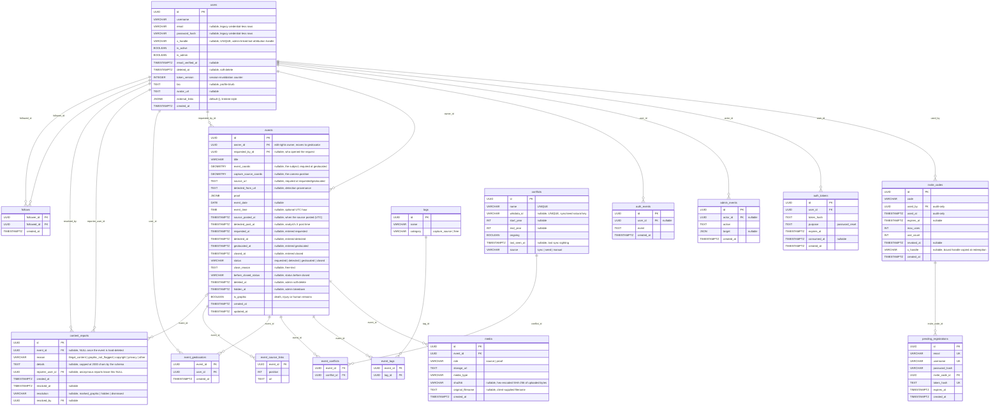

# Data model

## Overview


```mermaid
erDiagram
    users {
        UUID id PK
        VARCHAR username
        VARCHAR email "nullable, legacy credential-less rows"
        VARCHAR password_hash "nullable, legacy credential-less rows"
        VARCHAR x_handle "nullable, UNIQUE, admin-linked bot-attribution handle"
        BOOLEAN is_active
        BOOLEAN is_admin
        TIMESTAMPTZ email_verified_at "nullable"
        TIMESTAMPTZ deleted_at "nullable, soft-delete"
        INTEGER token_version "session-invalidation counter"
        TEXT bio "nullable, profile blurb"
        TEXT avatar_url "nullable"
        JSONB external_links "default {}, linktree-style"
        TIMESTAMPTZ created_at
    }

    admin_events {
        UUID id PK
        UUID actor_id FK "nullable"
        TEXT action
        JSON target "nullable"
        TIMESTAMPTZ created_at
    }

    auth_events {
        UUID id PK
        UUID user_id FK "nullable"
        TEXT event
        TIMESTAMPTZ created_at
    }

    auth_tokens {
        UUID id PK
        UUID user_id FK
        TEXT token_hash
        TEXT purpose "password_reset"
        TIMESTAMPTZ expires_at
        TIMESTAMPTZ consumed_at "nullable"
        TIMESTAMPTZ created_at
    }

    invite_codes {
        UUID id PK
        VARCHAR code
        UUID used_by FK "audit-only"
        TIMESTAMPTZ used_at "audit-only"
        TIMESTAMPTZ expires_at "nullable"
        INT max_uses
        INT use_count
        TIMESTAMPTZ revoked_at "nullable"
        VARCHAR x_handle "nullable, bound handle copied at redemption"
        TIMESTAMPTZ created_at
    }

    pending_registrations {
        UUID id PK
        VARCHAR email UK
        VARCHAR username UK
        VARCHAR password_hash
        UUID invite_code_id FK
        TEXT token_hash UK
        TIMESTAMPTZ expires_at
        TIMESTAMPTZ created_at
    }

    events {
        UUID id PK
        UUID owner_id FK "edit-rights owner, moves to geolocator"
        UUID requested_by_id FK "nullable, who opened the request"
        VARCHAR title
        GEOMETRY event_coords "nullable, the subject; required at geolocated"
        GEOMETRY capture_source_coords "nullable, the camera position"
        TEXT source_url "nullable, required at requested/geolocated"
        TEXT detected_from_url "nullable, detection provenance"
        JSONB proof
        DATE event_date "nullable"
        TIME event_time "nullable, optional UTC hour"
        TIMESTAMPTZ source_posted_at "nullable, when the source posted (UTC)"
        TIMESTAMPTZ detected_post_at "nullable, analyst's X post time"
        TIMESTAMPTZ requested_at "nullable, entered requested"
        TIMESTAMPTZ detected_at "nullable, entered detected"
        TIMESTAMPTZ geolocated_at "nullable, entered geolocated"
        TIMESTAMPTZ closed_at "nullable, entered closed"
        VARCHAR status "requested | detected | geolocated | closed"
        TEXT close_reason "nullable, free-text"
        VARCHAR before_closed_status "nullable, status before closed"
        TIMESTAMPTZ deleted_at "nullable, admin soft-delete"
        TIMESTAMPTZ hidden_at "nullable, admin takedown"
        BOOLEAN is_graphic "death, injury or human remains"
        TIMESTAMPTZ created_at
        TIMESTAMPTZ updated_at
    }

    content_reports {
        UUID id PK
        UUID event_id FK "nullable, NULL once the event is hard-deleted"
        VARCHAR reason "illegal_content | graphic_not_flagged | copyright | privacy | other"
        TEXT details "nullable, capped at 2000 chars by the schema"
        UUID reporter_user_id FK "nullable, anonymous reports leave this NULL"
        TIMESTAMPTZ created_at
        TIMESTAMPTZ resolved_at "nullable"
        VARCHAR resolution "nullable, marked_graphic | hidden | dismissed"
        UUID resolved_by FK "nullable"
    }

    event_geolocators {
        UUID event_id FK
        UUID user_id FK
        TIMESTAMPTZ created_at
    }

    event_source_links {
        UUID event_id FK
        INT position
        TEXT url
    }

    media {
        UUID id PK
        UUID event_id FK
        VARCHAR role "source | proof"
        TEXT storage_url
        VARCHAR media_type
        VARCHAR sha256 "nullable, hex-encoded SHA-256 of uploaded bytes"
        TEXT original_filename "nullable, client-supplied filename"
        TIMESTAMPTZ created_at
    }

    tags {
        UUID id PK
        VARCHAR name
        VARCHAR category "capture_source | free"
    }

    event_tags {
        UUID event_id FK
        UUID tag_id FK
    }

    conflicts {
        UUID id PK
        VARCHAR name "UNIQUE"
        VARCHAR wikidata_id "nullable, UNIQUE, sync/seed natural key"
        INT start_year "nullable"
        INT end_year "nullable"
        BOOLEAN ongoing
        TIMESTAMPTZ last_seen_at "nullable, last sync sighting"
        VARCHAR source "sync | seed | manual"
    }

    event_conflicts {
        UUID event_id FK
        UUID conflict_id FK
    }

    follows {
        UUID follower_id FK
        UUID followed_id FK
        TIMESTAMPTZ created_at
    }

    users ||--o{ invite_codes : "used_by"
    invite_codes ||--o{ pending_registrations : "invite_code_id"
    users ||--o{ auth_tokens : "user_id"
    users ||--o{ admin_events : "actor_id"
    users ||--o{ auth_events : "user_id"
    users ||--o{ events : "owner_id"
    users ||--o{ events : "requested_by_id"
    events ||--o{ media : "event_id"
    events ||--o{ event_tags : "event_id"
    tags ||--o{ event_tags : "tag_id"
    events ||--o{ event_conflicts : "event_id"
    conflicts ||--o{ event_conflicts : "conflict_id"
    events ||--o{ event_geolocators : "event_id"
    users ||--o{ event_geolocators : "user_id"
    events ||--o{ event_source_links : "event_id"
    events |o--o{ content_reports : "event_id"
    users ||--o{ content_reports : "reporter_user_id"
    users ||--o{ content_reports : "resolved_by"
    users ||--o{ follows : "follower_id"
    users ||--o{ follows : "followed_id"
```

---

## Tables

### `users`

| Column | Type | Constraints |
|--------|------|-------------|
| `id` | `UUID` | PK, default `gen_random_uuid()` |
| `username` | `VARCHAR(50)` | UNIQUE, NOT NULL |
| `email` | `VARCHAR(255)` | UNIQUE, nullable. Legacy credential-less rows from the retired assembled-profile mechanism are the only rows where this is NULL. Every account created today has an email. |
| `password_hash` | `VARCHAR(255)` | nullable. Nullable for the same legacy reason as `email`. |
| `x_handle` | `VARCHAR(50)` | UNIQUE, nullable. The X handle the bot attributes mentions to (lowercase, no `@`). The system sets it at registration from an invite-bound handle, or an admin links it through `PATCH /admin/users/{id}/x-handle`. Analysts cannot self-serve this field, and the bot never creates rows for it. It differs from `external_links["x"]`, a free-text display link the owner sets. |
| `is_active` | `BOOLEAN` | NOT NULL, default `true` |
| `is_admin` | `BOOLEAN` | NOT NULL, default `false`. The system flips this to `true` automatically on login or registration if the email matches `ADMIN_EMAILS`. |
| `email_verified_at` | `TIMESTAMPTZ` | nullable. Audit stamp: written once by the pre-creation registration flow (to `created_at`), read by no code path. Every row created after the `pending_registrations` migration exists because the analyst clicked the confirmation link, so this field is non-NULL for new accounts. |
| `deleted_at` | `TIMESTAMPTZ` | nullable. A non-NULL value marks the user as soft-deleted: login is rejected, the profile returns 404, and public reads filter the row out. Soft-deleting a user cascades to soft-delete every event they own. Hard-delete, the GDPR escape hatch, drops the user row, the events they own, and their contributor rows, and sweeps S3. Because the owner is always among an event's geolocators, hard-delete never leaves a `geolocated` event with zero geolocators. |
| `token_version` | `INTEGER` | NOT NULL, default `0`. A monotonic session-invalidation counter. The session JWT embeds this value as a `tv` claim, and `get_current_user` returns 401 on a mismatch. The system bumps this counter on logout, password change, password reset, and soft-delete, which invalidates every outstanding JWT for the user at once. Pre-migration cookies, which carry no `tv` claim, also return 401. The migration's one-time forced logout is intentional. |
| `bio` | `TEXT` | nullable. A short plain-text blurb shown on the public profile. Analysts edit it through `PATCH /users/me`. The API layer caps it at 500 characters. There is no database constraint, so changing the cap does not require a migration. |
| `avatar_url` | `TEXT` | nullable. A public avatar URL. The API layer validates it as http(s) to keep `javascript:` URLs out of the `` render path. There is no upload pipeline: it is a free-form URL, and analysts paste a Gravatar or CDN link. |
| `external_links` | `JSONB` | NOT NULL, default `'{}'::jsonb`. A Linktree-style object keyed by platform (`x`, `discord`, `website`, `github`). The default `{}` means the value is never NULL, so the read path always gets a dict. `PATCH /users/me` replaces the whole column. A partial merge would conflict with the whole-panel form submit. |
| `created_at` | `TIMESTAMPTZ` | NOT NULL, default `now()` |

Indexes:

- `users_x_handle_key`: UNIQUE on `(x_handle)`. Enforces one account per X handle. Postgres allows unlimited NULLs, so handle-less rows are unaffected.
- `ix_users_live`: partial index on `(created_at) WHERE deleted_at IS NULL`. Admin search and the auth path both filter on `deleted_at IS NULL`.
- `ix_users_search_fts`: GIN index on `to_tsvector('simple', coalesce(username, '') || ' ' || coalesce(bio, ''))`. Backs `GET /search` (the analyst branch). `bio` is part of the indexed expression so `ts_headline` can return a fragment highlight.

The nullable `email` and `password_hash` columns are the footprint of the retired credential-less assembled-profile model, which minted rows from an X handle alone. No path creates such rows anymore. `x_handle` is now the admin-linked bot-attribution anchor.

---

### `auth_tokens`

Password-reset tokens. Each token is single-use.

| Column | Type | Constraints |
|--------|------|-------------|
| `id` | `UUID` | PK, default `uuid4()` |
| `user_id` | `UUID` | FK → `users.id` ON DELETE CASCADE, NOT NULL |
| `token_hash` | `TEXT` | UNIQUE, NOT NULL. `sha256(secret)`. The plaintext token exists only in the email link. |
| `purpose` | `TEXT` | NOT NULL, CHECK in `('password_reset')`. `consume` matches on it, so a token minted for one purpose can never be redeemed for another. |
| `expires_at` | `TIMESTAMPTZ` | NOT NULL |
| `consumed_at` | `TIMESTAMPTZ` | nullable. A non-null value means the token was already redeemed. |
| `created_at` | `TIMESTAMPTZ` | NOT NULL, default `now()` |

Indexes:

- `ix_auth_tokens_user_id` on `(user_id)`. Supports cascade delete and per-user revocation lookups.
- `ix_auth_tokens_user_purpose` on `(user_id, purpose)`. Checks whether a live reset already exists for a user before minting a new one.
- `ix_auth_tokens_live_expires_at`: partial index on `(expires_at) WHERE consumed_at IS NULL`. Keeps the reaper scan cheap as consumed rows accumulate.

Lifecycle: `mint` creates a token, `consume` redeems it, and `revoke_all_live_for_user` force-revokes prior tokens on a fresh same-purpose mint. Cleanup runs on demand from the admin Maintenance panel (`services/maintenance.py::reap_auth_tokens`). It deletes live-but-expired rows immediately and drops consumed rows older than 30 days.

---

### `invite_codes`

| Column | Type | Constraints |
|--------|------|-------------|
| `id` | `UUID` | PK, default `gen_random_uuid()` |
| `code` | `VARCHAR(64)` | UNIQUE, NOT NULL |
| `used_by` | `UUID` | FK → `users.id` ON DELETE SET NULL, nullable, **audit-only**. Records the first user to consume the code. The FK is set to NULL on user hard-delete. |
| `used_at` | `TIMESTAMPTZ` | nullable, audit-only. Paired with `used_by`. |
| `expires_at` | `TIMESTAMPTZ` | nullable |
| `max_uses` | `INTEGER` | NOT NULL, default `1`. The usage quota. The admin page mints codes with this value; `1` means single-use. |
| `use_count` | `INTEGER` | NOT NULL, default `0`. Increments on each successful registration. |
| `revoked_at` | `TIMESTAMPTZ` | nullable. The admin page sets this. A non-null value invalidates the code immediately. |
| `x_handle` | `VARCHAR(50)` | nullable. The X handle the code binds, normalized to lowercase with no `@`. Redemption copies it onto the new account's `users.x_handle`, the bot-attribution link. If the handle got linked elsewhere between mint and redemption, redemption fails soft. |
| `created_at` | `TIMESTAMPTZ` | NOT NULL, default `now()` |

A code is valid exactly when `revoked_at IS NULL AND use_count < max_uses AND (expires_at IS NULL OR expires_at > now())`. `used_by` and `used_at` are not part of the validity check.

---

### `pending_registrations`

| Column | Type | Constraints |
|--------|------|-------------|
| `id` | `UUID` | PK, default `gen_random_uuid()` |
| `email` | `VARCHAR(255)` | UNIQUE, NOT NULL. Holds the address until the user confirms or the row expires. |
| `username` | `VARCHAR(50)` | UNIQUE, NOT NULL. Plays the same role as `email`, reserving the username until confirmation or expiry. |
| `password_hash` | `VARCHAR(255)` | NOT NULL. A bcrypt hash. The system transfers it directly into `users.password_hash` at confirmation. |
| `invite_code_id` | `UUID` | FK → `invite_codes.id` ON DELETE CASCADE, NOT NULL. The invite is referenced but **not consumed** until confirmation. |
| `token_hash` | `TEXT` | UNIQUE, NOT NULL. `sha256(secret)`. The plaintext token exists only in the email link. |
| `expires_at` | `TIMESTAMPTZ` | NOT NULL. Set to 24 hours after mint. |
| `created_at` | `TIMESTAMPTZ` | NOT NULL, default `now()` |

Indexes:

- `ix_pending_registrations_expires_at` on `(expires_at)`. Supports the reaper sweep.

Why UNIQUE on `email` and `username` instead of a partial index? Partial-index predicates must be IMMUTABLE in Postgres, and `expires_at > now()` is STABLE. The plain UNIQUE constraint keeps race-window protection without a predicate. The `/auth/register` path deletes expired rows inline before its INSERT, and the admin Maintenance reaper sweeps the rest. As a result, a recently expired pending row does not permanently reserve its address.

Lifecycle: `POST /auth/register` inserts a row through `services/registration.py::create_pending_registration`. `POST /auth/confirm-registration` consumes it through `confirm_pending_registration`, which creates the `users` row, copies a bound `invite_codes.x_handle` onto it if the handle is still free, increments `invite_codes.use_count`, and deletes the pending row. `POST /auth/resend-confirmation` re-mints the token on the same row and invalidates the previous link. Cleanup runs through `services/registration.py::reap_pending_registrations`, exposed in the admin Maintenance panel.

---

### `auth_events`

An append-only audit log for auth-relevant events. The auth router populates it synchronously on `login`, `failed_login`, `logout`, `register_pending`, `register_resent`, `register_confirmed`, `password_reset_requested`, `password_reset_completed`, and `password_changed`. Writes happen inside a SAVEPOINT (`db.begin_nested()`), so an INSERT failure rolls back only the audit row and the caller's transaction stays usable.

| Column | Type | Constraints |
|--------|------|-------------|
| `id` | `UUID` | PK, default `uuid4()` |
| `user_id` | `UUID` | FK → `users.id` ON DELETE SET NULL, nullable. NULL when the email didn't match a live user: `failed_login`, the `password_reset_requested` no-op branch, `register_pending`, both branches of `register_resent`, and anonymous logout. This prevents the row from doubling as a probe-able email-to-existence oracle. |
| `event` | `TEXT` | NOT NULL. A plain string, not a database enum, so adding a new event kind doesn't require a migration. |
| `created_at` | `TIMESTAMPTZ` | NOT NULL, default `now()` |

Indexes:

- `ix_auth_events_user_id_created_at` on `(user_id, created_at)`. Supports the forensics query "what did this user do, latest first".
- `ix_auth_events_event_created_at` on `(event, created_at)`. Supports the query "did event X spike recently".

The table stores no IP address or User-Agent. Vidit drops them for privacy; network context lives only at the Cloudflare edge. There is no retention policy.

---

### `admin_events`

An append-only audit log for admin actions taken through the `/admin` page. It is a sibling to the `auth_events` table above.

| Column | Type | Constraints |
|--------|------|-------------|
| `id` | `UUID` | PK, default `uuid4()` |
| `actor_id` | `UUID` | FK → `users.id` ON DELETE SET NULL, nullable |
| `action` | `TEXT` | NOT NULL, for example `invite_created` and `invite_revoked` |
| `target` | `JSON` | nullable. Free-form context: target IDs and parameters. |
| `created_at` | `TIMESTAMPTZ` | NOT NULL, default `now()` |

Indexes:

- `ix_admin_events_actor_id` on `(actor_id)`. Supports the query "what did this admin do?".
- `ix_admin_events_created_at` on `(created_at)`. Supports chronological scans.

---

### `events`

One row represents one event across its whole lifecycle. `status` tracks the lifecycle. `event_coords` is an independent nullable field tied to `status` by a CHECK constraint. A request is a `requested` event on this table, with no coordinates required yet. Fulfilling a request is a single `UPDATE status='geolocated', event_coords=...` on the same row plus an `event_geolocators` insert. It never copies the row into a new one.

| Column | Type | Constraints |
|--------|------|-------------|
| `id` | `UUID` | PK, default `gen_random_uuid()` |
| `owner_id` | `UUID` | FK → `users.id`, NOT NULL. The edit-rights owner. For a `requested` event, this is the poster. It moves to the fulfiller at the `geolocated` transition, so permission checks stay a single-owner check across the lifecycle. This column was renamed from `author_id`. The owner is always among the event's geolocators; see `event_geolocators`. |
| `requested_by_id` | `UUID` | FK → `users.id` ON DELETE SET NULL, nullable. Records who opened the request. This is preserved across fulfilment so the identity of the requester is not erased. NULL for a directly submitted geolocation. |
| `title` | `VARCHAR(255)` | NOT NULL |
| `event_coords` | `GEOMETRY(Point, 4326)` | nullable. The subject: what the footage shows. Tied to `status` by `ck_events_coords_status`: required for `geolocated`, optional otherwise. A `requested` request may carry an approximate guess. This column was renamed from `location`. Each event has one subject point. Multi-point support is a deferred `event_points` child table. |
| `capture_source_coords` | `GEOMETRY(Point, 4326)` | nullable. The camera position: where the footage was shot from. Always optional, one per event. |
| `source_url` | `TEXT` | nullable. Where the footage was first published. Tied to `status` by `ck_events_source_url_status`: required for `requested` and `geolocated`, optional for `detected`. A machine draft may declare no source; see [`ingestion.md`](ingestion.md). |
| `detected_from_url` | `TEXT` | nullable. The post a machine detection was imported from. Serves as the `(detected_from_url, coordinate)` re-import idempotency anchor and a provenance link, distinct from `source_url`. NULL for human submits. |
| `proof` | `JSONB` | NOT NULL. A Tiptap document stored as ProseMirror JSON. Every row carries a proof document: a human submit carries the analyst's write-up, and a machine detection carries the tweet or thread text. A submission with no proof body stores an empty document, not NULL. |
| `event_date` | `DATE` | nullable in every status. When the depicted event happened. NULL when unknown: the footage doesn't always establish the date, and it renders as *Unknown*. For a machine detection, this is provisionally the originating tweet's post date; the owner corrects it at submit. |
| `event_time` | `TIME` | nullable. An optional time of day for `event_date`, in UTC. NULL when the hour is unknown. |
| `source_posted_at` | `TIMESTAMPTZ` | nullable. When the original source posted the media: a real post instant, so a full UTC timestamp when known. Distinct from `event_date` (when the event happened), `detected_post_at` (when the analyst posted the geolocation), and `created_at` (when the row was submitted). A human submit or a machine detection with a quoted source always sets it. A machine detection with only a footage link and no quote leaves it `NULL`, because the link carries no date, except a Telegram footage link whose public embed was chased. That case carries the post's own date; see [`ingestion.md`](ingestion.md#archive-formats). |
| `detected_post_at` | `TIMESTAMPTZ` | nullable. When the analyst published this geolocation on X: the post time of `detected_from_url`. This is the precedence input for the "who geolocated it first" claim/dispute pipeline. The system captures it at import, because the tweet may later be deleted. NULL for human submits. |
| `requested_at` | `TIMESTAMPTZ` | nullable. Stamped when the event entered `requested`. |
| `detected_at` | `TIMESTAMPTZ` | nullable. Stamped when a machine produced it, entering `detected`. |
| `geolocated_at` | `TIMESTAMPTZ` | nullable. Stamped when a person vouched for it and froze it, entering `geolocated`. |
| `closed_at` | `TIMESTAMPTZ` | nullable. Stamped when the event entered the terminal `closed` state. |
| `status` | `VARCHAR(20)` | NOT NULL, `server_default 'geolocated'`. The lifecycle runs `requested` (an open call to geolocate) → `detected` (a machine draft, marked on every surface, immutable until vouched) → `geolocated` (a person vouched for it and froze it; always has a location) → `closed` (a withdrawn request or a rejected detection). It is a plain string, not a native enum, and `ck_events_status_valid` pins the value domain. The default keeps a direct human submit correct without setting the value explicitly; the requested and detected paths pass `status` explicitly. The `geolocate` and `close` transitions are documented in [`api.md`](api.md). |
| `close_reason` | `TEXT` | nullable. A free-text reason the event was closed, such as AI image, bot bug, or withdrawn. Kept visible for transparency. A curated reason picker is deferred. |
| `before_closed_status` | `VARCHAR(20)` | nullable. The status held just before `closed`: `requested` means withdrawn, `detected` means rejected. Drives the status badge and the requested-view routing, and lets re-import treat a closed detection as re-importable. |
| `deleted_at` | `TIMESTAMPTZ` | nullable. A non-NULL value marks an admin soft-delete: the row and its media stay in place, but every public read filters it out, admins included. |
| `hidden_at` | `TIMESTAMPTZ` | nullable. A non-NULL value marks a takedown: the row is withheld from every public read the same way `deleted_at` is, but an admin still reads it (judging the [content report](#content_reports) that led to the takedown means seeing what was withheld), and the state is reversible, which is what separates it from `deleted_at`. Set by `POST /admin/reports/{id}/resolve` (`resolution = "hidden"`) or directly by `PATCH /admin/events/{id}/moderation`; cleared only by the latter. |
| `is_graphic` | `BOOLEAN` | NOT NULL, default `false`. `TRUE` when the footage shows death, injury or human remains. The author sets it on the create / edit forms; an admin can override it, directly (`PATCH /admin/events/{id}/moderation`) or by resolving a report as `marked_graphic`. Public column, carried by every event read schema: the frontend covers a flagged event's media behind [`GraphicContentGate`](design.md#components) until the viewer confirms they want to see it. |
| `created_at` | `TIMESTAMPTZ` | NOT NULL, default `now()` |
| `updated_at` | `TIMESTAMPTZ` | NOT NULL, default `now()` |

**Check constraints:**
- `ck_events_status_valid`: `status IN ('requested', 'detected', 'geolocated', 'closed')`. Pins the value domain at the database. The column is a plain `VARCHAR`, not a native enum, so this constraint rejects a bad write at the Postgres level, not only at the app-layer `Literal`.
- `ck_events_coords_status`: `status <> 'geolocated' OR event_coords IS NOT NULL`. A `geolocated` event always has a subject coordinate. The other states leave it free. The constraint deliberately drops the old rule that forbade coordinates on a `requested` row, so a `requested` request may carry an approximate guess.
- `ck_events_source_url_status`: `status NOT IN ('requested', 'geolocated') OR source_url IS NOT NULL`. A `requested` or `geolocated` event always has a source URL. A `detected` draft may carry none; see [`ingestion.md`](ingestion.md). The promotion to `geolocated` enforces the same rule in `services/events.geolocate` before the row can violate this CHECK.
- `ck_events_closed_stamp` (`status <> 'closed' OR closed_at IS NOT NULL`) and `ck_events_geolocated_stamp` (`status <> 'geolocated' OR geolocated_at IS NOT NULL`). These tie the terminal stamps to status. An app path that forgets to stamp is rejected at write time, not stored as silent bad data.
- `ck_events_before_closed_status`: `(status = 'closed' AND before_closed_status IS NOT NULL AND before_closed_status IN ('requested', 'detected')) OR (status <> 'closed' AND before_closed_status IS NULL)`. The field is non-NULL and in-domain exactly when `closed`, and NULL otherwise. The explicit `IS NOT NULL` clause is required: `NULL IN (...)` evaluates to unknown, not false, so without it a `closed` row could keep a NULL discriminator and slip through.

**Temporal fields: four kinds of time.** A geolocation carries several timestamps. Each marks a different point on the path from an event to a Vidit row. They are distinct by design:

```
event happens ──▶ source posts the media ──▶ analyst posts the geoloc on X ──▶ imported to Vidit
 event_date           source_posted_at            detected_post_at                 created_at
 (+ event_time)       (UTC instant)               (UTC instant, machine path)      (UTC instant)
```

| Field | Meaning | Filled by | Null? |
|---|---|---|---|
| `event_date` (+ `event_time`) | when the depicted event happened | analyst, or detection (tweet date) | date nullable in every status: NULL when the footage doesn't establish it. Time optional: the hour is often unknown. |
| `source_posted_at` | when the source posted the media | analyst, or detection (a quoted source's date) | nullable. `NULL` on a `detected` row whose source is a footage link with no date, or whose source is undeclared. |
| `detected_post_at` | when the analyst posted the geolocation on X | detection only (the imported tweet's time) | NULL for human submits |
| `created_at` | when it was submitted to Vidit | system | NOT NULL |

`event_date` is *editorial*: a real-world event, often known only to the day, with no canonical time zone. It stores a bare date plus an optional UTC hour. `source_posted_at` and `detected_post_at` are *post instants*: known to the minute when present, and always UTC, so they store full timestamps. All entered times follow the UTC convention.

**Indexes:**
- `GIST(event_coords)`. Required for geospatial queries: bounding-box filtering and proximity sort. `capture_source_coords` is not indexed, because no spatial read consumes it.
- `(owner_id)`. Supports profile lookup.
- `(event_date)` and `(created_at)`. Support time-based queries.
- `(owner_id, created_at DESC)`. A composite index for profile listing. Single-author reads stay on `owner_id` until they re-home onto `event_geolocators`.
- `ix_events_live`: partial index on `(created_at) WHERE deleted_at IS NULL`. Every public read filters on `deleted_at IS NULL`, and the partial index keeps it tight.
- `ix_events_status_created_at` on `(status, created_at)`. The requested view (formerly the request list), the map, and the detection queue all filter on `status`, newest first.
- `ix_events_created_at_id` on `(created_at, id)`. Backs the keyset that the capped list endpoints page on. `GET /events`, `GET /events/detections`, and `GET /timeline` order by `created_at DESC, id DESC` and cut each page with a row comparison over that pair; see [`api.md`](api.md#pagination).
- `ix_events_detected_from_url`: partial index on `(detected_from_url) WHERE detected_from_url IS NOT NULL`. Backs the assemble idempotency lookup, one per detection during a backfill. Human rows are always NULL here.
- `ix_events_search_fts`: GIN index on `to_tsvector('simple', coalesce(title, ''))`. Backs `GET /search`; both the located and requested views run through it. The `simple` configuration, not `english`, keeps matching predictable for the corpus of place names and analyst handles. Soft-delete is filtered at query time. `source_url` is intentionally not in the indexed expression, because Postgres' simple parser tokenizes URLs as host and path units; see migration `o1j3k5l7m9n1` for the rationale.

> `event_coords` and `capture_source_coords` are PostGIS points in WGS84 (SRID 4326, standard GPS coordinates). GeoAlchemy2 exposes them as `.lat` and `.lng` through `WKBElement`, or as `ST_X` and `ST_Y` in raw SQL.

---

### `event_geolocators`

Durable credit for the geolocation: who vouched for the location. Replaces the single `author_id` as the attribution source of truth. `owner_id` is always among these rows. The system writes at least one row at the `geolocate` transition, and the credit is collaborative: an event can have many geolocators.

| Column | Type | Constraints |
|--------|------|-------------|
| `event_id` | `UUID` | FK → `events.id` ON DELETE CASCADE |
| `user_id` | `UUID` | FK → `users.id` ON DELETE CASCADE |
| `created_at` | `TIMESTAMPTZ` | NOT NULL, default `now()` |

Composite PK: `(event_id, user_id)`. Makes the credit idempotent.

**Indexes:**
- `ix_event_geolocators_user_created_at` on `(user_id, created_at)`. Supports the reverse query, a user's geolocations, for the profile page.

The composite PK's leading `event_id` serves the forward read, who geolocated event X. Because `owner_id` is always among the geolocators, and `hard_delete_user` deletes the events a user owns, erasing a user can never leave a `geolocated` event with zero geolocators.

---

### `event_source_links`

An event's ordered secondary source links: mirrors of the same footage on another network, or another post from the same point of view. The primary evidence anchor stays the scalar `events.source_url`. These rows are optional extras with no such protection; see [`api.md`](api.md#post-events).

| Column | Type | Constraints |
|--------|------|-------------|
| `event_id` | `UUID` | FK → `events.id` ON DELETE CASCADE |
| `position` | `INTEGER` | list index, `0`-based |
| `url` | `TEXT` | NOT NULL |

Composite PK: `(event_id, position)`. `position` sits in the key, so the stored order is the read order, and Postgres rejects a duplicate slot.

There is no secondary index: every read is "this event's links, in order", served by the PK's leading `event_id`. `MAX_SECONDARY_SOURCE_LINKS = 10` (`backend/app/models/event.py`) caps how many rows an event carries. The write forms normalize and enforce this cap before insert: they strip whitespace, drop blanks, drop duplicates, and drop the entry equal to `source_url`, preserving order.

The system writes this list wholesale, not row by row. A create sets the full ordered list once, and a geolocate replaces the whole list with whatever the fulfiller submits, including for requested events. Unlike `source_url`, there is no requester protection here. Hard-deleting the event cascades to the rows.

---

### `content_reports`

One viewer's report against one event. Open to anonymous viewers: a takedown request must not require an account, since the people a piece of footage harms are rarely the people who hold one. Rows accumulate rather than dedupe: several viewers may report the same event, and each report is resolved on its own. A report is never deleted, only resolved, so the table is an audit trail of what was reported and what was decided. Resolved rows stay in the table.

| Column | Type | Constraints |
|--------|------|-------------|
| `id` | `UUID` | PK, default `uuid4()` |
| `event_id` | `UUID` | FK → `events.id` ON DELETE SET NULL, nullable. NULL once the reported event is hard-deleted: the report is the record that a complaint was filed and how it was answered, so it outlives the event. An orphaned report accepts only the `dismissed` verdict; the other two mutate an event row that is gone, and answer 409 `report_event_gone`. |
| `reason` | `VARCHAR(30)` | NOT NULL, CHECK in `('illegal_content', 'graphic_not_flagged', 'copyright', 'privacy', 'other')`. `illegal_content` is the legal escalation (material whose hosting is itself unlawful); `graphic_not_flagged` says the footage shows death, injury or human remains without the author's `events.is_graphic` declaration; `copyright` and `privacy` are third-party rights claims; `other` keeps the form answerable when none of the four fits, with `details` carrying the story. |
| `details` | `TEXT` | nullable. The reporter's own words. Bounded to 2000 characters by the schema, not the column, which stays unbounded `TEXT`. |
| `reporter_user_id` | `UUID` | FK → `users.id` ON DELETE SET NULL, nullable. NULL for an anonymous report, and again once the reporter's account is erased (the report outlives the account, including a GDPR erasure). |
| `created_at` | `TIMESTAMPTZ` | NOT NULL. The application stamps it on insert; the column carries no server default, so a raw `INSERT` must supply it. |
| `resolved_at` | `TIMESTAMPTZ` | nullable. Non-NULL exactly when `resolution` is (`ck_content_reports_resolution_stamp`), so `resolved_at IS NULL` is the single-column test for an open report. |
| `resolution` | `VARCHAR(30)` | nullable, CHECK in `('marked_graphic', 'hidden', 'dismissed')` when set. `marked_graphic` sets `events.is_graphic`, `hidden` withholds the event from every public read via `events.hidden_at`, `dismissed` closes the report and leaves the event untouched. There is no re-resolve: a report already carrying a verdict answers a second resolve attempt with 409. |
| `resolved_by` | `UUID` | FK → `users.id` ON DELETE SET NULL, nullable. The admin who resolved it, NULL until then and again after a GDPR erasure of that admin's account. |

**Check constraints:**
- `ck_content_reports_reason_valid`: pins the `reason` domain at the database, mirroring the `ContentReportReason` alias so a bad write is rejected by Postgres, not only by the app-layer `Literal`.
- `ck_content_reports_resolution_valid`: pins the `resolution` domain the same way, mirroring `ContentReportResolution`.
- `ck_content_reports_resolution_stamp`: `(resolution IS NULL AND resolved_at IS NULL) OR (resolution IS NOT NULL AND resolved_at IS NOT NULL)`. The verdict and its timestamp travel together in both directions: a resolved row can't forget what was decided, and an open row can't carry a stale verdict.

**Indexes:**
- `ix_content_reports_event_id` on `(event_id)`. Backs the FK's ON DELETE SET NULL sweep and a per-event report lookup.
- `ix_content_reports_queue`: expression index on `((resolved_at IS NOT NULL), created_at DESC, id DESC)`. Backs the admin queue's read, open reports first then newest first, with the id breaking ties so the offset walk is total. The index repeats the query's `ORDER BY` expression for expression, so Postgres walks it instead of sorting the table. Change the sort and you change this index.

---

### `follows`

Directed follow edges between analysts. Drives the per-user `GET /timeline` feed and the `followers_count`, `following_count`, and `is_following` fields on `GET /users/{username}`.

| Column | Type | Constraints |
|--------|------|-------------|
| `follower_id` | `UUID` | FK → `users.id` ON DELETE CASCADE, NOT NULL |
| `followed_id` | `UUID` | FK → `users.id` ON DELETE CASCADE, NOT NULL |
| `created_at` | `TIMESTAMPTZ` | NOT NULL, default `CURRENT_TIMESTAMP` |

Composite PK: `(follower_id, followed_id)`. The pair is the natural identity, so there is no surrogate id. The PK alone gives uniqueness, so the schema ships no separate UNIQUE constraint.

Self-follow is rejected at two layers. The router returns `400 Cannot follow yourself`, and `CHECK (follower_id <> followed_id)` (constraint `ck_follows_no_self_follow`) refuses the INSERT even if a code path skips the router. The 400 response gives the UI a clean error, and the CHECK is the durable invariant.

Indexes:
- `ix_follows_followed_id` on `(followed_id)`. The PK indexes the forward direction, who is X following, on its leading column. Without this index, the reverse direction, who follows X, the query that powers `followers_count` on every profile load, would full-scan.

`ON DELETE CASCADE` applies to both FKs. Hard-deleting an analyst drops every edge on either side, so a deleted user cannot keep ghost followers or ghost followings. Soft-deleted users (`users.deleted_at IS NOT NULL`) keep their edges. The public profile returns 404 regardless, and resurrecting an account should resurrect its graph.

---

### `media`

Every uploaded file for an event, source footage and proof-body images alike, split by `role`. Each row has one `event_id` owner. A request is a `requested` event, so all evidence lives on one table, and fulfilling a request never moves media.

| Column | Type | Constraints |
|--------|------|-------------|
| `id` | `UUID` | PK, default `gen_random_uuid()` |
| `event_id` | `UUID` | FK → `events.id` ON DELETE CASCADE, NOT NULL. Always set. Files upload at publish, so there is no unattached staging row; see Upload timing below. |
| `role` | `VARCHAR` | NOT NULL. `'source'` for the footage, at most one per event, enforced by a partial unique index, or `'proof'` for inline images referenced from the proof body, with no per-event limit. |
| `storage_url` | `TEXT` | NOT NULL. An S3 or CloudFront URL. |
| `media_type` | `VARCHAR(10)` | NOT NULL, `'image'` or `'video'` |
| `sha256` | `VARCHAR(64)` | nullable. Hex-encoded SHA-256 of the uploaded bytes, captured at upload time. A stable content fingerprint that survives storage-class changes and copies, unlike the S3 ETag, which is an MD5 for non-multipart uploads and is not stable across copies. NULL on rows that predate this column. **The hash is computed on the bytes that land on S3, for images after the EXIF strip, so an auditor downloading the public URL can independently verify it.** |
| `original_filename` | `TEXT` | nullable. The client-supplied filename, for example `IMG_1234.jpg`. Surfaced on the public read API so investigators can trace evidence back to a source post by filename. |
| `created_at` | `TIMESTAMPTZ` | NOT NULL, default `now()` |

`uploaded_ip` and `uploaded_user_agent` are **not stored**. Vidit drops them for privacy; network context lives only at the Cloudflare edge.

**Indexes:**
- `(sha256) WHERE sha256 IS NOT NULL`: a partial index for "find every row with this content hash" audit and dedup queries. Covers only the populated cohort, so rows that predate the column do not bloat it.
- unique `(event_id) WHERE role = 'source'`. Enforces the "at most one source media per event" cap.

Each request and each `geolocated` event requires at least one `source` media row. The `geolocate` transition requires at least one `proof` image. A `requested` event carries the poster's evidence from the start.

**Upload timing.** Persistence happens only at publish. While the analyst writes, the proof editor holds local previews. Submit uploads every file, source and proof, through the same evidence intake, in one transaction. As a result, `event_id` is always set: there is no staging table, no `event_id IS NULL` orphan, and no proof-image reaper. This replaces the former separate `proof_images` table.

---

### `tags`

| Column | Type | Constraints |
|--------|------|-------------|
| `id` | `UUID` | PK, default `gen_random_uuid()` |
| `name` | `VARCHAR(100)` | UNIQUE, NOT NULL |
| `category` | `VARCHAR(20)` | NOT NULL, `'capture_source'` or `'free'` |

Tags with category `capture_source` describe the original "lens" that captured the media: `Smartphone`, `Satellite`, `Drone`, `Static camera`, `Dashcam`, `Body / helmet cam`, plus an `Unknown` escape value. Migration `s5n7p9r1t3v5` seeds them in production, since the category is required on the submit form and the options must exist on a fresh database.
Tags with category `free` are user-created and free-form.

Conflicts were formerly a third category. They now live in the dedicated [`conflicts`](#conflicts) table; migration `j2l4n6p8r0t2` moved the rows and their event links.

`capture_source` is **curated**, server-managed and not user-creatable, and **required**: a submission must carry at least one `capture_source` tag and at least one conflict; see [`api.md`](api.md) → `POST /events`. The API layer enforces this rule, not a database constraint. Both domains ship an escape value: `capture_source` has `"Unknown"`, and conflict has `"Other"`. `name` is globally UNIQUE across both categories, so a `capture_source` tag cannot share a name with a `free` tag.

---

### `event_tags`

Many-to-many junction table between `events` and `tags`.

| Column | Type | Constraints |
|--------|------|-------------|
| `event_id` | `UUID` | FK → `events.id` ON DELETE CASCADE |
| `tag_id` | `UUID` | FK → `tags.id` ON DELETE CASCADE |

Composite PK: `(event_id, tag_id)`

---

### `conflicts`

The conflict referential: one row per armed conflict, externally synced. Three writers feed it, discriminated by `source`: the daily Wikipedia ongoing-conflicts sync (`sync`), the one-shot Wikidata historical seed (`seed`), and operator rows (`manual`), which include the `Other` escape value and the rows migrated out of `tags`. See [`ingestion.md`](ingestion.md#conflict-referential-sync) for the sync mechanics.

| Column | Type | Constraints |
|--------|------|-------------|
| `id` | `UUID` | PK, default `uuid4()` |
| `name` | `VARCHAR(200)` | UNIQUE, NOT NULL. 200 characters, longer than the tags table's 100, because Wikipedia page names run long. |
| `wikidata_id` | `VARCHAR(20)` | UNIQUE, nullable. The Wikidata item id, for example `Q131569`. The natural key that the sync and seed writers upsert on. NULL on `manual` rows. |
| `start_year` | `INTEGER` | nullable. The sync fills this from the page's start-of-conflict year only where it is NULL. It never overwrites an existing value, such as the Wikidata seed's years. |
| `end_year` | `INTEGER` | nullable |
| `ongoing` | `BOOLEAN` | NOT NULL, default `false`. Mirrors presence on the Wikipedia ongoing-conflicts page, with a grace period. |
| `tier` | `VARCHAR(10)` | nullable. `'major'`, `'minor'`, or `'conflict'`: the Wikipedia death-toll tier. Major wars have 10,000 or more combat deaths in the current or previous year, minor wars have 1,000-9,999, and conflicts have 100-999. The daily sync writes this from which tier table the row sits in, and updates it when a conflict moves tiers. NULL for rows the sync has never seen: historical seed rows and `manual` rows. |
| `last_seen_at` | `TIMESTAMPTZ` | nullable. The last time the sync saw the row on the page. NULL for rows the sync has never seen: `manual` rows and never-listed `seed` rows. Those rows are immune to the grace-period deactivation. |
| `source` | `VARCHAR(20)` | NOT NULL, `'sync'`, `'seed'`, or `'manual'` |

**Why the QID is the natural key, not the name.** The Wikipedia page renames conflicts constantly. Across 36 monthly snapshots from 2023 to 2026, 24 of 35 month transitions changed at least one name, almost all editorial renames of the same conflict; Sudan carried 5 names in 3 years. The QID survives every rename, so the sync upserts by `wikidata_id`, and a rename updates `name` in place. Events keep their association, and the filter never fragments.

**Lifecycle: never deleted.** Disappearance from the ongoing page is ambiguous: the conflict may have really ended, been renamed, or slid below the page's tier threshold. A row flips `ongoing=false` only after 14 consecutive days of absence, and no row is ever deleted. An ended conflict stays selectable forever, because archival footage remains taggable. Each sync pass also refreshes `tier` when a conflict moves tables, and backfills `start_year` where it is NULL. The `Other` escape row ships `ongoing=true` from the migration, and the sync never touches it, so `last_seen_at` stays NULL.

---

### `event_conflicts`

Many-to-many junction table between `events` and `conflicts`, same shape as `event_tags`.

| Column | Type | Constraints |
|--------|------|-------------|
| `event_id` | `UUID` | FK → `events.id` ON DELETE CASCADE |
| `conflict_id` | `UUID` | FK → `conflicts.id` ON DELETE CASCADE |

Composite PK: `(event_id, conflict_id)`

### `bot_mentions`

The bot's idempotency ledger: one row per processed @-mention of the bot, whatever the outcome. This ensures a mention is processed, and billed since the reads and gestures use the paid X API, at most once. Both delivery paths, the webhook and the reconciliation poll, share this ledger: whichever sees a mention first records it, and the other skips it. The poll's `since_id` is the max `mention_tweet_id` minus a one-interval lookback, so a mention the webhook dropped stays reachable even after a newer delivery advanced the max. The ledger absorbs the re-read overlap as already handled. See [`ingestion.md`](ingestion.md#bot-format) for the pipeline.

| Column | Type | Constraints |
|--------|------|-------------|
| `id` | `UUID` | PK, default `uuid4()` |
| `mention_tweet_id` | `VARCHAR(25)` | UNIQUE, NOT NULL. The tagged tweet's id: an X snowflake, stored as a numeric string. |
| `author_handle` | `VARCHAR(50)` | NOT NULL. The tagging analyst's handle, normalized to lowercase with no leading `@`. Stored for forensics, not as a FK. Attribution resolves through the admin-linked `users.x_handle`. |
| `outcome` | `VARCHAR(20)` | NOT NULL, `'created'`, `'no_detection'`, `'no_account'` (no live account carries the tagged author's admin-linked `x_handle`, so nothing is created and no reply is sent), `'skipped'`, `'self'` (the bot's own post, ledgered so the cursor advances past it), or `'failed'`. A `failed` row retries only when an operator deletes it. |
| `events_created` | `INTEGER` | NOT NULL, default 0 |
| `reply_tweet_id` | `VARCHAR(25)` | nullable. The bot's in-thread reply: on success, an event reference plus warnings; on failure, a diagnosis plus the format lesson, sent only to linked authors (see [`ingestion.md`](ingestion.md#bot-format)). NULL when no reply was earned, reply credentials are absent, or the post failed. The detection stays durable either way. |
| `processed_at` | `TIMESTAMPTZ` | NOT NULL |

---

### `bot_webhook_events`

The queue between the X Account Activity webhook endpoint ([`POST /webhooks/x`](api.md#post-webhooksx)), which must answer X fast and therefore only inserts, and the import worker, which drains the queue through the shared mention pipeline. Idempotency lives in [`bot_mentions`](#bot_mentions), not here: a redelivered or poll-raced mention processes once. See [`ingestion.md`](ingestion.md#bot-format).

| Column | Type | Constraints |
|--------|------|-------------|
| `id` | `UUID` | PK, default `uuid4()` |
| `mention` | `JSONB` | NOT NULL. The internal `Mention` shape: `tweet_id`, `author_id`, `author_handle`, `text`, `in_reply_to_user_id`. Carries everything the pipeline needs, so a drain never re-reads, and never re-bills, the paid API. |
| `status` | `VARCHAR(10)` | NOT NULL. `'queued'` → `'processing'` → `'done'` \| `'failed'`. `processing` marks a claimed row so a concurrent worker skips it. An exception re-queues the row; a hard worker crash strands it, and the reconciliation poll re-delivers the mention. `done` means the pipeline ran; the per-mention outcome, including a ledgered `failed`, lives in `bot_mentions`. `failed` means the attempt budget is spent or the payload was malformed. A composite index on `(status, created_at)` matches the claim query. |
| `attempts` | `INTEGER` | NOT NULL, default 0. A claim counter. When it reaches the budget, the row lands `failed`, a poison-pill guard. |
| `created_at` | `TIMESTAMPTZ` | NOT NULL |

---

### `archive_import_jobs`

The durable queue behind `POST /events/import-archive`. The endpoint stages the uploaded zip to storage and inserts a row. The worker service claims rows with `FOR UPDATE SKIP LOCKED`, runs the backfill, stamps the assemble counts, and emails the owner. See [`ingestion.md`](ingestion.md#archive-import-worker) for the pipeline and recovery semantics.

| Column | Type | Constraints |
|--------|------|-------------|
| `id` | `UUID` | PK, default `uuid4()` |
| `owner_id` | `UUID` | FK → `users.id`, ON DELETE CASCADE, NOT NULL, indexed. The uploader. Every resulting row lands `detected` under this owner. |
| `zip_key` | `TEXT` | NOT NULL. The storage key of the staged upload (`archive-imports/<id>.zip`). The object is deleted when the job reaches a terminal state. |
| `status` | `VARCHAR(10)` | NOT NULL, indexed. `'queued'` → `'running'` → `'done'` \| `'failed'`. A `running` row whose `started_at` is past the stale window is reclaimable, because the worker died mid-job. |
| `attempts` | `INTEGER` | NOT NULL, default 0. A claim counter. When it reaches the budget, the job lands `failed` instead of looping, a poison-pill guard. |
| `post_estimate` | `INTEGER` | nullable. A volume hint from zip metadata, stamped at enqueue: the declared `tweets.js` size divided by a per-record average. Display only. |
| `progress_done` / `progress_total` | `INTEGER` | NOT NULL default 0, and nullable, respectively. The worker's live scan position, updated every few rows once the parse has the exact detection count. |
| `created_count` / `skipped_count` / `recreated_count` / `failed_count` | `INTEGER` | NOT NULL, default 0. The assemble counts, final once `done`. |
| `error` | `TEXT` | nullable. A terse, operator-facing failure reason. The owner gets the full story by email. |
| `created_at` | `TIMESTAMPTZ` | NOT NULL |
| `started_at` / `finished_at` | `TIMESTAMPTZ` | nullable |

### `source_archives`

One row per link carried by an event: its `source_url`, its [`event_source_links`](#event_source_links) mirrors, and every `http(s)` href in the proof body's Tiptap document. The row is both the archival job and its result, so a link never travels between a queue table and a read table. The write paths insert `queued` rows. The worker claims them with `FOR UPDATE SKIP LOCKED`, submits the link to both archiving services, and stamps their capture columns in place. One row per link rather than one per (link, provider): the two providers share one lifecycle, since the first capture to land finishes the job. See [`ingestion.md`](ingestion.md#source-archival) for the pipeline and retry semantics.

| Column | Type | Constraints |
|--------|------|-------------|
| `id` | `UUID` | PK, default `uuid4()` |
| `event_id` | `UUID` | FK → `events.id`, ON DELETE CASCADE, NOT NULL, indexed |
| `original_url` | `TEXT` | NOT NULL. The link exactly as stored on the event. It is never normalized, because it is half the row's identity and what the read surface matches against `events.source_url`. |
| `origin` | `VARCHAR(20)` | NOT NULL, `ck_source_archives_origin_valid`: `'source_url'` (the event's declared footage source), `'secondary_source'` (a row of [`event_source_links`](#event_source_links)), or `'proof_link'` (an href inside the proof body). A link reachable from several of these is stored once, under whichever of them it appeared in first when the row was created. The insert conflicts on `(event_id, original_url)` and does nothing afterward, so a later enqueue never rewrites the origin. |
| `status` | `VARCHAR(10)` | NOT NULL, `ck_source_archives_status_valid`: `'queued'` → `'running'` → `'done'` \| `'failed'`. One lifecycle for both providers. An attempt where every provider refused returns the row to `queued` behind a backoff. A `running` row past the stale window is reclaimable. `'failed'` is terminal and displayed: the read surface shows the link as not archived. |
| `wayback_url` | `TEXT` | nullable. The Wayback Machine replay URL. |
| `archive_today_url` | `TEXT` | nullable. The archive.today snapshot URL. Filled independently of `wayback_url`: both providers are attempted for every link. |
| `attempts` | `INTEGER` | NOT NULL, default 0. A claim counter. When it reaches the budget, the row lands `failed` rather than consuming attempt budget forever. |
| `error` | `TEXT` | nullable. A terse reason for the last attempt, one clause per provider that refused. Kept on a row that returns to `queued`, so a retry history stays readable in flight, and on a `done` row where one provider refused, since it is the only record of why that column is empty. |
| `created_at` | `TIMESTAMPTZ` | NOT NULL |
| `next_attempt_at` | `TIMESTAMPTZ` | NOT NULL. When the row becomes claimable. Set to now at insert, and pushed out by exponential backoff after each failure. Indexed together with `status` (`ix_source_archives_status_next_attempt`), the claim query. |
| `started_at` / `finished_at` | `TIMESTAMPTZ` | nullable |

`UNIQUE (event_id, original_url)` is the idempotency anchor. Every enqueue path, create, the geolocate promotion, an edit that adds a citation, and the catalog backfill, can run repeatedly and only inserts what is missing.

`ck_source_archives_done_capture` ties the two capture columns to the status in both directions: at least one of them is non-NULL exactly when `status='done'`, and both are NULL in every other state. So a non-NULL value is always a usable capture, a `done` row is never empty, and a `failed` row never holds one, which is what lets the read surface treat `failed` as "no copy exists" rather than "no copy yet". A `done` row with one column empty is settled rather than half-finished: that provider refused and is not retried.

---

## Design decisions

### Why JSONB for `proof`?
Tiptap, the rich editor, serializes content as ProseMirror JSON. Storing that JSON as-is in a JSONB column avoids conversion. PostgreSQL indexes and queries JSONB natively.

### Why `event_tags` and not an array column on `events`?
This is a many-to-many relationship: a geolocation can carry several tags, and a tag can appear on many geolocations. The `event_tags` junction table is the standard solution. It supports efficient filtering (`WHERE tag_id = X`) and indexing on both sides. The alternative, a `tag_ids[]` array on `events`, would make filters more complex and less performant at scale.

```sql
-- Tags for a given geolocation
SELECT t.name, t.category
FROM tags t
JOIN event_tags gt ON gt.tag_id = t.id
WHERE gt.event_id = 'a3f8c2d1-...';
-- → [{ name: "Drone", category: "capture_source" }, { name: "airstrike", category: "free" }]
```

### Why a single `tags` table with a category?
Capture-source and free-form tags share the same mechanics: filtering and many-to-many association. A single table plus a `category` field avoids duplicating the logic. The distinction stays queryable: `WHERE category = 'capture_source'`.

### Why conflicts left the `tags` table
A conflict is not a label an analyst invents. It is a referential row with an external identity (`wikidata_id`), a lifecycle (`ongoing`, the grace period), and machine writers (the Wikipedia sync, the Wikidata seed). None of that fits a `(id, name, category)` tag row, and bolting sync columns onto `tags` would have made every free tag carry them. So conflicts got their own table and join, `conflicts` and `event_conflicts`, and `tags` keeps the two categories that genuinely share mechanics.

### Why `GEOMETRY` instead of two `lat` / `lng` columns?
PostGIS enables native geospatial queries: bounding-box filtering, distance computation, and clustering. GeoAlchemy2 exposes those types directly to SQLAlchemy.

### Why a `event_geolocators` table and not an id array?
The table is read from both sides: an event's geolocators, and a user's geolocations on the profile page. A junction table indexes both directions and carries a per-row `created_at`. An id array on `events` would force a GIN scan for the reverse query and store no timestamp.

### Why split `author_id` into `owner_id` + `event_geolocators`?
Edit rights and credit are different facts. `owner_id` is a single mutable permission holder; it moves to the fulfiller on geolocate. `event_geolocators` is the durable, potentially collaborative record of who vouched for the location. Single-author read surfaces, profile, byline, search, stay on `owner_id` until a second-geolocator write path exists, and then re-home onto `event_geolocators`.

### Why upload proof images at publish, not while typing?
This keeps `media.event_id` NOT NULL: no staging table, no `event_id IS NULL` orphan, no reaper. The editor holds local previews, and submit uploads every file through the one evidence intake. The trade-off is a browser-side editor that batches uploads at submit rather than on drop.

### Why a `source_archives` child table and not capture columns on `events`?
An event carries several links: its `source_url`, its mirrors, and every citation in the proof body. Columns on `events` could only hold the source's captures, and each link needs its own attempt counter, backoff schedule, and failure reason to retry independently. The child table also makes the queue and the read surface the same rows, so a capture is never copied from a job table into an event column, where the two could disagree.

### Why `before_closed_status`?
`close` unifies the old withdraw and reject actions into one verb, but a closed request and a closed detection are different: the badge copy, the requested-view routing, and re-import all need to tell them apart. `before_closed_status` records which state the row left, so one column keeps the unified verb without losing the distinction.

---

## Typical MVP queries

```sql
-- All points for the map (initial load)
SELECT id, title, ST_X(event_coords) AS lng, ST_Y(event_coords) AS lat, event_date
FROM events;

-- Filter by conflict
SELECT g.id, g.title, ST_X(g.event_coords) AS lng, ST_Y(g.event_coords) AS lat
FROM events g
JOIN event_conflicts ec ON ec.event_id = g.id
JOIN conflicts c ON c.id = ec.conflict_id
WHERE c.name = 'Russian invasion of Ukraine';

-- An analyst's geolocations (profile; stays on owner_id until it re-homes onto event_geolocators)
SELECT id, title, event_date, created_at
FROM events
WHERE owner_id = :user_id
ORDER BY event_date DESC;
```

---

## Seed data

You can map a third-party KMZ export locally to generate test data. The files are large binaries and are not version-controlled.

**KML → Vidit mapping:**

| KML field | → | Vidit column |
|-----------|---|---------------|
| `coordinates` (lng, lat) | → | `events.event_coords` |
| `description` (first line) | → | `events.title` |
| `TimeStamp` | → | `events.event_date` |
| "Source(s)" URLs in `description` | → | `events.source_url` |
| "Geolocation(s)" URLs in `description` | → | `events.proof` |
| `styleUrl` (icon color) | → | `tags` (side / event type) |

This repo does not script local KMZ import. Local databases are filled from a production restore (`make import-prod`, see [`backups.md`](backups.md#import-production-into-local-dev)) or from an X archive import. This mapping is kept for a future agreement-bound import.
