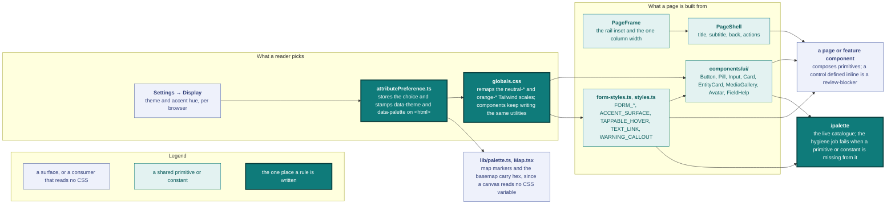
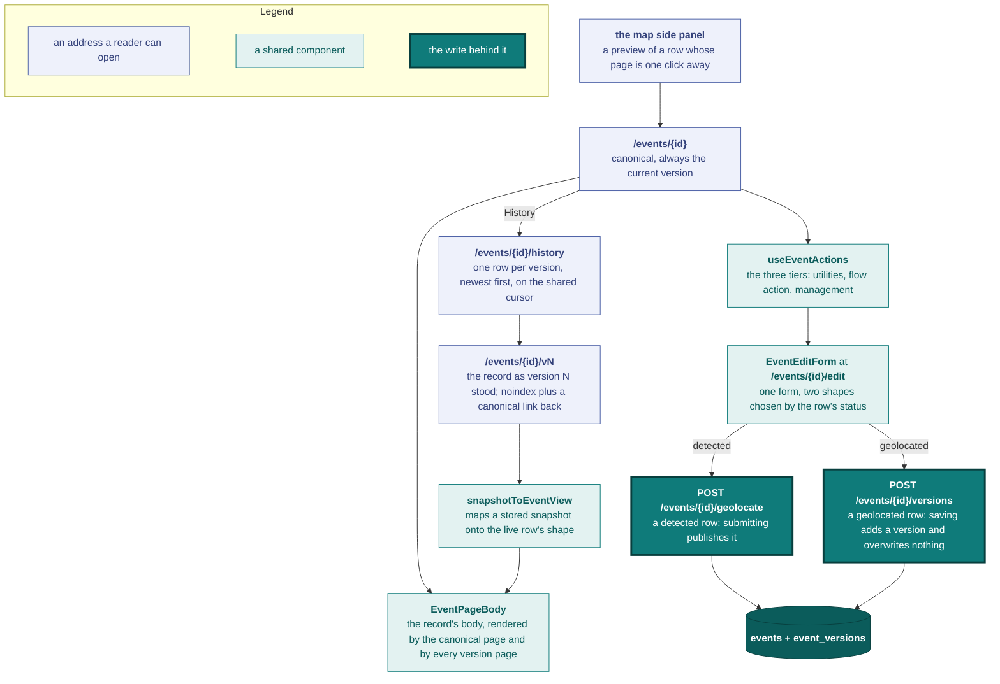
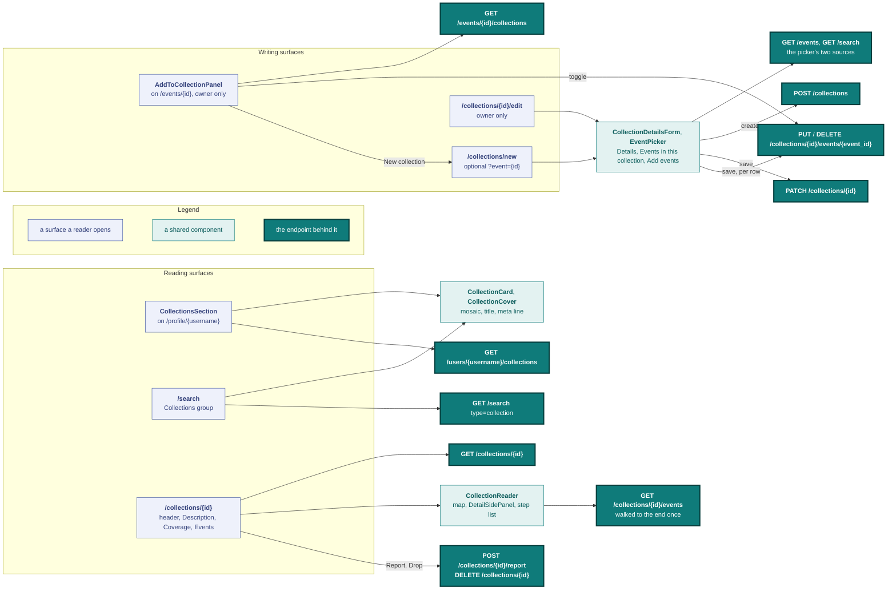

# Design principles and decisions

Every surface composes the same primitives, and two reader preferences repaint all of them at once. This page is that vocabulary: the principles the interface follows, the palette and layout it draws from, and the components a page is allowed to use.



Each region of the diagram has a section below. What a reader picks is [Theme](#theme) and the [accent](#accent). What a page is built from is [Components](#components), whose class constants are named in the [accent recipe](#accent-recipe) and whose frame is [Page chrome](#page-chrome). `/palette` is the gate on that vocabulary, and the exceptions decided once are [Sanctioned one-offs](#sanctioned-one-offs).

## Philosophy

The interface is spare by default and reveals complexity on demand. It stays legible to first-time visitors, and advanced filters and tools appear only when needed. The design avoids a cluttered dashboard look and a dark-ops aesthetic.

1. **Progressive disclosure**: the default view is a map and points. Filters, detail, and tools appear on demand.
2. **Clarity over aesthetics**: every visual element serves a function.
3. **Neutral and professional**: the tone is sober, with no military-tech or hacker-dashboard tropes.
4. **Controlled density**: the reader moves from map, to points, to detail panel, to full proof, and picks the depth.

## Theme

The interface is dark by default, with light available on demand. It uses a uniform background, opaque panels, and one warm accent for contrast. Dark reads better for long, data-dense sessions and stays the default. Light is a second option for readers who want it.

Theme and accent share one mechanism, [`attributePreference.ts`](../frontend/src/lib/attributePreference.ts): it stores the choice in `localStorage`, stamps a data attribute on `<html>`, and [`globals.css`](../frontend/src/app/globals.css) remaps a Tailwind scale under that attribute, so every utility repaints with no per-component change. Two consumers read no CSS variable and carry hex instead: [`Map.tsx`](../frontend/src/components/map/Map.tsx) swaps the basemap on [`useTheme`](../frontend/src/hooks/useTheme.ts), and map markers read [`lib/palette.ts`](../frontend/src/lib/palette.ts).

The theme is independent of the accent hue. Its key is `vidit:theme`, and light applies as `data-theme="light"`; dark is the default and carries no attribute. Light remaps the `neutral-*` scale to a curated soft ramp, plus the semantic `red` / `amber` scales, mirrored so their pale text stops go dark on the light tint. The block also sets `color-scheme`, so native widgets (scrollbars, date and select popups) track the theme. The accent is not theme-adjusted, except that accent text (links, the success banner) reads a touch lighter in light mode. The basemap swaps CARTO Dark Matter for its light counterpart, Positron.

## Colour palette

### Foundation

The dark roles below are the default. The light theme re-points the same `neutral-*` scale to a curated soft ramp (`globals.css`): a soft warm grey canvas (`neutral-950`) with warm off-white cards (`neutral-900`) floating on it, and dark grey text (`neutral-100` = `#232323`, not black). This keeps a large light surface easy on the eyes instead of a flat, near-white glare. The light surfaces carry a faint warmth (`R > G > B`), while the text greys stay neutral. This mirrors how the dark scale avoids pure black and pure white.

| Role | Color | Tailwind | Usage |
|------|-------|----------|-------|
| Background | `#0a0a0a` | `neutral-950` | Global background, behind the map |
| Surface | `#171717` | `neutral-900` | Panels, cards, modals |
| Surface elevated | `#262626` | `neutral-800` | Inputs, interactive elements, hover |
| Border | `#333333` | `neutral-700` | Separators, field outlines |
| Text primary | `#f5f5f5` | `neutral-100` | Titles, primary content |
| Text secondary | `#a3a3a3` | `neutral-400` | Labels, metadata |
| Text muted | `#737373` | `neutral-500` | Placeholders, disabled elements |

### Accent

There is one accent hue. It's selectable, and orange by default. Settings → Display also offers blue, emerald, violet, and rose. Its key is `vidit:palette`, and `data-palette` remaps the `orange-*` scale to the chosen hue (see [Theme](#theme)). Components keep writing `orange-*` utilities and the [`styles.ts`](../frontend/src/components/ui/styles.ts) constants, so everything below holds for whichever hue is active.

The accent is **tinted-on-dark**, never a flat `bg-orange-500` fill for buttons or selected states:

| Token | Where it shows up |
|------|-------|
| `orange-400` | Text of every interactive element: inline links, button labels, tappable-card hover, status pills. |
| `orange-500` | The hue itself, only at fractional opacity on backgrounds / borders (`bg-orange-500/10`, `/15`, `/20`), and full strength on map points + state dots. |

### Map points

| Role | Color | Usage |
|------|-------|-------|
| Point default | accent `500` (default `#f97316`) | Submitted points; follows the selected accent |
| Point detected | accent `300` (default `#fdba74`) | Machine-detected points; same hue a shade lighter, distinct from submitted by lightness |
| Point selected | accent `500` + white border | Active, clicked point |

### Semantic

| Role | Color | Tailwind | Usage |
|------|-------|----------|-------|
| Danger | `#ef4444` | `red-500` | Errors, deletions (`FORM_ERROR_BANNER`) |
| Success / info | accent `500` | `orange-500` | Confirmations + info notices (`FORM_SUCCESS_BANNER`). Accent, not green: a confirmation next to red destructive actions shouldn't read as celebratory. |
| Warning | `#f59e0b` | `amber-500` | Non-blocking caution (`WARNING_CALLOUT`): duplicate probe, curated-tags load failure, tweet-import notice. Colour only; layout at the call site. |

## Accent recipe

Every accent treatment is a named constant from [`styles.ts`](../frontend/src/components/ui/styles.ts) or a primitive. Use it; don't hand-roll the class string. The rule:

> If something carries the accent and isn't clickable, it's a bug. If something is clickable and isn't accent, it's a bug.

Carve-outs: navigation chrome stays neutral grey, destructive actions go red, and the `?` help is neutral (meta, not content). Charts carry one more, and it is the only inert accent on the site: a mark whose accent step encodes a magnitude takes `ACCENT_RAMP` whether or not a reader can act on it, and so does its legend, which is drawn with the same cells as the data it explains. `<SourceHostBar>`'s ranked segments and `<ActivityHeatmap>`'s lit months are both inert ranked marks, so both take the ramp. What stands outside the ranking takes the neutral chart paints instead: an empty month, the unnamed tail, a slice naming no source. External links open in a new tab (`target="_blank" rel="noopener noreferrer"`) with the same accent styling.

There are five buckets:

1. **Inline link** (`TEXT_LINK`): clickable accent text in copy or rows (bylines, source URLs, retry, empty-state CTAs), using `text-orange-400 hover:underline`. An action that only reads like a link (Cancel, dismiss) is a `<Button variant="ghost">`.
2. **Tappable card or row** (`TAPPABLE_HOVER`): the whole card or row is one click target (`EntityCard`, search rows, the About page's link rows). It's neutral at rest. On hover, the border turns accent and the title picks up `group-hover:text-orange-400` (put `group` on the row).
3. **Buttons** (`<Button>`): every action, shape, and colour in one unit at one size. A `<Link>` that must look like a button takes `buttonClasses(variant)`. See the full vocabulary under [Buttons](#buttons).
4. **Pills, chips, and badges** (`<Pill>`): the whole badge family uses one `tone`: `accent` (open, detected, selected), `neutral` (default, tag, closed, inactive), `danger` (revoked, error), or `strong` (a completed end-state, neutral white, not green, because completion isn't a win). It's a `<span>` by default; pass `onClick` and it becomes an interactive chip, with the caller driving the tone off its active state. Domain wrappers (`StatusBadge` for the one unified event lifecycle, the invite `StatusChip`) map an enum to tone, icon, and label. A bare tag is `<Pill tone="neutral">` inline, with no wrapper.
5. **Active nav or row surface** (`ACCENT_SURFACE`): the bare accent paint (background and text, no border) for a selected nav row or option (sidebar rows, a `SegmentedControl`'s active option, the accent icon circles on the import panel and detections entry). `<Pill>`'s accent tone composes this paint plus a border, so a pill and an active nav item can't drift apart.

Constants: the pill tones live on `<Pill>` as `PILL_TONE`; these colour-only paints export from [`styles.ts`](../frontend/src/components/ui/styles.ts): `ACCENT_SURFACE`, `TAPPABLE_HOVER`, `TEXT_LINK`, `WARNING_CALLOUT`. If a class string for an accent element runs longer than about 3 Tailwind tokens, a constant probably already fits.

## Layout

```
┌────┬─────────────────────────────────────────────┐
│    │  Filters │                    │   Detail    │
│rail│  panel   │        MAP         │   panel     │
│    │  (left)  │   (full screen)    │  on click   │
└────┴─────────────────────────────────────────────┘
```

- **Sidebar rail:** left nav (logo, working surfaces, identity block), a fixed column from `sm` up, which every page clears through `PageFrame`'s `sm:pl-14`. Below `sm` it is a drawer behind a floating menu chip and takes no inset at all; see [Phone chrome](#phone-chrome).
- **Map:** full-screen background on `/map`.
- **Left panel:** filters, opaque, floating over the map.
- **Right panel:** event detail, appears on click, dismissible. When the selected event fails to load, the panel shows the error message and a Retry control, never a previously selected event.

**Panels:** `neutral-900` opaque (no glass / blur), `border-neutral-700`, `rounded-lg`, `p-4`, floating above the map. Width ~240px (filters), ~380px (detail). Both take a different shape below `sm`; see [Phone chrome](#phone-chrome).

## Typography

- **Font:** system stack, `-apple-system, BlinkMacSystemFont, 'Segoe UI', sans-serif`
- **Sizes:** titles `text-lg` (18px) max; body `text-sm` (14px); labels / meta `text-xs` (12px); micro (counters, badges) `text-[11px]`
- **Weights:** `font-medium` for titles, `font-normal` for everything else

## Map

- **Style:** CARTO Dark Matter (with labels), `https://basemaps.cartocdn.com/gl/dark-matter-gl-style/style.json`. The light theme swaps in its matched counterpart, Positron, `.../gl/positron-gl-style/style.json` (see [Theme](#theme)), with a faint `sepia` on the canvas (`globals.css`) that warms Positron's cool grey to match the warm light surfaces.
- **Renderer:** MapLibre GL JS (vector tiles) with globe projection. The zoom floor is 1.8 (`MIN_ZOOM` in [`Map.tsx`](../frontend/src/components/map/Map.tsx)), the lowest level that keeps the globe fully visible without shrinking it away.
- **One map stack.** Every map on the site is the same [`<Map>`](../frontend/src/components/map/Map.tsx): the full-screen canvas, the single pin on an event page, the coverage map a profile opens its work with ([`<ProfileMap>`](../frontend/src/components/profile/ProfileMap.tsx)), and the same map stepped beside the detail panel on a collection page (see [Collections](#collections)). A set with no mappable point renders no card at all, since an empty world map says less than no map and both surfaces carry a list that says the rest. A page whose view comes from its own content passes `fitBounds` (a `MapBounds`, from `pointsBounds` in [`bounds.ts`](../frontend/src/components/map/bounds.ts)) instead of `center` / `zoom`. MapLibre solves the camera against the real container, capped at zoom 9, so a lone point lands on a regional read rather than a street-level one. `pointsBounds` encloses longitude on the shorter arc (the complement of the widest empty gap), so work on either side of the antimeridian frames tight instead of as a world view. A box across the seam comes back unwrapped, with `east` past 180. `MapBounds` is the one bounds shape, for framing and requests alike. The `?bbox=` wire format has one home, [`lib/viewport.ts`](../frontend/src/lib/viewport.ts): its `toBboxParam` rounds outward and widens an unwrapped crossing box to the full longitude range, which is what `parse_bbox` accepts.
- Map labels (cities, regions) are a discreet light grey.
- Point geometry: default radius 6px, selected 7px with a 2px white border. Opacity is 1.0 for points and 0.85 for clusters. The cursor is a pointer on hover.
- **Pin hover preview.** Hovering any single unclustered pin (or a ring dot, described below) shows one shared preview card after a 150 ms hover-intent delay (`PinPreviewCard` in [`Map.tsx`](../frontend/src/components/map/Map.tsx)): title, `StatusBadge`, the fixed `MediaThumb` slot (the picked card thumbnail, or its "no media" box), date, and `AuthorByline`, composed on `Card`. The event detail is fetched only once the hover intent elapses (`GET /events/{id}`, with a bounded in-memory cache that also holds in-flight requests; stale responses are ignored, and a failed fetch shows a terse fallback). The card clamps against the map edges after measuring, and flips to the left of the pin when the right side lacks room, so it always renders fully visible. Ordinary clusters get no preview. A coarse pointer arms no preview at all, so a tap goes straight to the panel; see [Phone chrome](#phone-chrome).
- **Co-located events: counted badge and hover fan-out.** Events sharing one coordinate form a cluster that can never expand. `groupStacks` ([`stack.ts`](../frontend/src/components/map/stack.ts)) groups points client-side on a roughly 1 m epsilon grid with neighbor-cell merging, so a stack straddling a grid line reads as one. Past the clustering ceiling, the group renders as **one counted badge** with the colour, radius, opacity, and count text of a small cluster, so a stack of 3 never reads as a single pin. Cluster counts below the ceiling stay true.
  - Hovering the badge, or an unexpandable cluster (leaves within `STACK_EPSILON` via `getClusterLeaves`), replaces it with `SpiderRing`: 12px DOM dots on an 18px ring around the shared center, the ring growing past about 7 events and capped at 24 dots. A larger stack fans out its first 23 events and fills the last slot with a "+N" marker; the badge count stays the true total.
  - The dots travel out from the center, and back before the badge reappears. Dot colours keep the point semantics (detected shade, selected halo); the badge carries the halo when it holds the selected event.
  - Hovering a dot shows the pin preview, and clicking it opens the event like a normal pin.
  - The ring collapses when the pointer leaves it (with a grace margin), on wheel, or when the map moves. On touch, a tap opens the ring and a tap off it closes it, and the dots carry a wider hit box (see [Phone chrome](#phone-chrome)).
  - Ordinary clusters keep zoom-on-click.
- **Cluster to points crossfade.** The map sets `fadeDuration: 0`, so count labels and their circles swap on the same frame; basemap place labels pop in instead of fading. Count labels skip symbol placement (`text-allow-overlap` + `text-ignore-placement`), so a count is never culled apart from its circle. Around the clustering ceiling, a zoom-interpolated opacity crossfade runs in paint expressions, with stops derived from `CLUSTER_MAX_ZOOM`: clusters and counts thin approaching one zoom past the ceiling, and points and stack badges rise just past it. The crossfade applies **only while a zoom is in flight**; at rest every layer holds full opacity, and a cluster click that resolves past the ceiling lands its pins at full opacity.

## Components

### Build on shared primitives

Every UI element is a reusable primitive. Compose from them; never hand-roll a one-off. If none fits a new need, add the missing piece to [`components/ui/`](../frontend/src/components/ui) (or as a new `FORM_*` / `styles.ts` constant) and consume it from there, never inlined in a page. Growing the vocabulary with a new shared component is a maintainer decision (see [`AGENTS.md`](../AGENTS.md) → *Conventions*). Reusing or extending an existing one is the default.

**Token or component?** A piece is a *component* when it owns shape or behaviour (`<Input>`, `<Pill>`, `<Button>`, `<Card>`). It stays a raw *class constant* when it is a single-element paint composed into someone else's markup (`FORM_LABEL`, `ACCENT_SURFACE`, `TAPPABLE_HOVER`). A constant that starts growing variants has crossed the line, so promote it. Primitives join classes with [`cn`](../frontend/src/lib/cn.ts) (tailwind-merge), so a caller's `className` wins conflicts predictably. `<Button>` and `<Pill>` stay one size by design; the button's only variation is the taller tap shape it takes on a phone (see [Buttons](#buttons)).

The vocabulary:

- **Labels.** `FORM_LABEL` is the uppercase label above a control (`LABEL_TEXT` is the same without `block`). [`<SectionHeading>`](../frontend/src/components/ui/SectionHeading.tsx) heads a form section (title plus `?`). [`<SectionEyebrow>`](../frontend/src/components/ui/SectionEyebrow.tsx) is the uppercase eyebrow over a page, panel, or card section.
- **Copy.** The clipboard write and the flash timer are one hook, [`useCopyToClipboard`](../frontend/src/hooks/useCopyToClipboard.ts). A call site wears it as the ghost icon button for a mark set in a line ([`<CoordinateActions>`](../frontend/src/components/event/CoordinateActions.tsx), the profile's Discord account) or as a text button (the admin invite row). The flash is the same in every shape: the resting mark flips to a check and the tooltip follows, while the accessible name holds still and the confirmation lands in a sibling `role="status"` region, since a name that changes on click is re-announced as a new control. The resting mark is the platform's own where the value names itself (Discord carries its brand mark); the check is fixed.
- **Small assemblies.**
  - [`<Avatar>`](../frontend/src/components/ui/Avatar.tsx) is the profile-picture circle: the profile header, the feed card's author circle (through `<EntityCard>`), the user search hits, `<AuthorByline>`'s avatar variant, and the sidebar identity row, which renders it in the rail's 18px glyph box. `size` is the only dimension a caller sets, and the fallback is the handle's initial or a neutral user icon. An `avatar_url` addresses a server-minted object on the media host, uploaded through the profile header's picker (the shared `<FileManager>` in single-file image mode). A failed load falls back to the same circle and a new picture retries, because replacing a picture deletes the old object and a CDN edge can answer for a key before a new one propagates. `iconClassName` colours the icon fallback (the sidebar passes `text-current`, so the glyph follows the row's hover and active state). `decorative` drops the alt text where the host names itself, so the image does not displace the enclosing link's accessible name.
  - [`<AuthorByline>`](../frontend/src/components/ui/AuthorByline.tsx) is "by @user". `avatar` leads with the author's picture instead of the "by " prefix, on the detail pages and the map side-panel header. `link={false}` drops the profile anchor for a slot that is already one click, such as a version-history row under its stretched link.
  - [`<Dot>`](../frontend/src/components/ui/Dot.tsx) is the accent "new content awaits" dot: sidebar nav badges (through `notify`), the rail's identity row when detections are pending, the profile's detections entry, and the map filter panel's in-flight pulse. Position, ring, and size come through `className`.
  - [`<EmptyState>`](../frontend/src/components/ui/EmptyState.tsx) owns the empty-state grammar (`boxed` / `plain` / `invite`).
  - [`usePinnedPopover`](../frontend/src/hooks/usePinnedPopover.ts) is the anchored-popover machinery (pin, hover, outside-click / Escape dismiss, portal plus viewport clamp), used by `FieldHelp`.
- **Instruction lists.** [`<NumberedSteps>`](../frontend/src/components/ui/NumberedSteps.tsx) is the static "1, 2, 3…" list (numbered disc, title, body): `plain` on the public guides, `boxed` with a per-step icon for the archive export walkthrough on `/submit`. Every step looks the same because it is reference copy, not state. For a check mark or a spinner, use `<ProgressSteps>`.
- **Live progress.** [`<ProgressSteps>`](../frontend/src/components/ui/ProgressSteps.tsx) is the vertical stepper for a live multi-step operation (the archive import): check for done, highlighted disc for the active step, muted for pending. A determinate bar renders only when a real 0..1 `progress` ratio exists. A step in flight without one takes a discreet `spinner` next to its label, never a fake animation. `keepDetail` pins a step's detail line after completion (a privacy guarantee, a final count). `failed` turns the active step into the red failure marker. The message itself stays in the form's `FORM_ERROR_BANNER`.

#### Media

- [`<MediaGallery>`](../frontend/src/components/ui/MediaGallery.tsx) is the detail-surface block: a 2-up `hero` grid on the page, stacked `thumbnail` tiles in the panel.
- [`<VideoPlayer>`](../frontend/src/components/ui/VideoPlayer.tsx) is the one player, mounted by the gallery's video tiles and by the shared viewer. The landing page's demo clip is a one-off: it stays idle until a visitor clicks play, then hands playback to the browser's own controls.
- The player engine is [media-chrome](https://media-chrome.mux.dev): web-component controls around a native `<video>`, skinned through CSS variables on the controller (neutral-100 glyphs, flat controls on a translucent dark bar). This keeps the chrome independent of the React version and out of specificity conflicts with Tailwind.
- The bar holds play, scrub, time, mute, volume, download, and one big-view control. It hides after two undisturbed seconds of playback and returns on pointer move, hover, or focus.
- Big view is per context: a gallery tile carries an expand control that opens the shared viewer, and the viewer carries fullscreen. One such icon shows at a time.
- The viewer, [`<MediaLightbox>`](../frontend/src/components/ui/MediaLightbox.tsx), portals to `document.body` and layers above every floating surface (map panels, sidebar, banner), so a tile expanded inside the map's detail panel covers the viewport.
- The player fills its container and letterboxes, so a portrait clip keeps its shape over the tile's backdrop.
- A clip posters its first frame through the `#t=0.1` media fragment, since stored clips carry no poster derivative. [`posterFrameUrl`](../frontend/src/lib/mediaUrls.ts) owns this for every caller.
- Download is [`<MediaDownloadButton>`](../frontend/src/components/ui/MediaDownloadButton.tsx) everywhere. It fetches the object as a blob and saves it under its `original_filename`, because media is served from a separate origin, where a plain `<a download>` navigates to the file instead of saving it. An image tile's download floats under `HOVER_REVEAL` (invisible at rest, shown on hover or focus, permanent on a coarse pointer), the same cluster a proof image carries.
- `MediaThumb` is the card-sized media slot. It lives in [`<EntityCard>`](../frontend/src/components/ui/EntityCard.tsx) and is exported to the map's pin preview, the detections queue row, and each tile of a collection's mosaic, so its marked "no media" box is the site's one placeholder. A mosaic tile reads the slot's `size`: the 400 px derivative where it shares the mosaic, the 1280 px one where it fills it alone.
- Every card or preview thumbnail (events list, profile feed, timeline, search hits, map pin hover, detections queue) is the backend-picked media: the `source` attachment, or else the first `proof` image, never a proof video. The pick lives in `backend/app/services/thumbnails.py`. The frontend renders what the payload carries and never re-derives it.
- [`<GraphicContentGate>`](../frontend/src/components/ui/GraphicContentGate.tsx) covers media on a flagged event (`is_graphic`, author-set at submit and edit, admin-overridable). The media renders blurred and inert behind an interstitial naming what is underneath. Confirming once, kept in `sessionStorage` for the browser session, reveals every gated instance on the page. `full` wraps `MediaGallery` on the detail surfaces, with the sentence and a confirm button. `compact` fills a card-sized slot (`MediaThumb`, the map pin preview, a proof body's inline images) with one labelled control.

#### Cards

[`<EntityCard>`](../frontend/src/components/ui/EntityCard.tsx) is the one catalogue card, `compact` (thumbnail beside the text) or `feed` (thumbnail under it).

- The whole card is a stretched link to `detailHref`. Anything interactive inside it is lifted above that link (`relative z-20`) and takes its own click.
- `onSelect` swaps that link for a stretched button, for a list whose rows pick a position on their own surface (a collection page's step list). In this mode the title renders as plain text and `detailHref` renders nowhere on the row. `selected` marks the row the surface stands on with the accent border.
- The byline shows on every catalogue surface, where a card stands beside other analysts' work. It is omitted on a surface that is one analyst's set and names them in its header (a collection's items).
- `action` is a control that acts on the row rather than opening it: the owner's cross that takes an item off a collection, and the **Add** button on the collection picker. It exists on the compact row only, which the type enforces, since the feed card floats its badge over the corner. It renders at the bottom of the badge's column, lifted above the stretched link, in the corner furthest from the title.
- On a phone the compact row narrows the thumbnail to `w-20` and drops the status badge under the text, so the title keeps its width.
- `uniformHeight` keeps every row of a catalogue list the same height whatever slots it fills (1-line or 2-line title, tags or none), from `sm` up. A list whose rows all share one short shape turns it off (a collection's items). Off, the row stands on its media column, and text shorter than that column centres against it.
- The thumbnail slot is `self-start`, so a tall card keeps the 16:9 ratio and leaves empty space under the thumbnail at every width. This is intended.

#### Controls

- A control carries colour while it acts and neutral grey when it cannot. For the disabled button, see [Buttons](#buttons).
- Every icon control on the site is the ghost icon button: one 32px square with one hover plate, on a page-header cluster, the profile header row, the coordinates line, the archive mark beside a source link, and a field's trailing adornment. An action is `<Button icon variant="ghost">`. A control that navigates puts the same shape on a `<Link>` or an `<a>` through `buttonClasses("ghost", { icon: true })`, so a button never nests inside an anchor.
- A control with nothing to act on is that button `disabled`, which paints it grey and drops it from the tab order. An inert link becomes a disabled button.
- `aria-label` is the whole name and `title` repeats it, so every icon-only control carries a tooltip equal to its accessible name. There is no tooltip primitive beyond that. Only a tooltip that moves while the name holds still (the copy flash) may differ.
- [`<Switch>`](../frontend/src/components/ui/Switch.tsx) is the one boolean toggle (`md` settings rows, `sm` map filter rows; `as="span"` when a whole-row parent owns the click).
- [`<SegmentedControl>`](../frontend/src/components/ui/SegmentedControl.tsx) is the exclusive-choice bar (submit type, admin delete mode, the detections queue filter; `tone="danger"` for a destructive active option). It stretches below `sm` (see [Phone chrome](#phone-chrome)). A bar whose one-word labels need a sentence takes a `<FieldHelp>` beside it.
- `<Input icon>` overlays a leading icon (the search box). `<Input trailing>` overlays the field's own actions at the other edge, centred on the field's height and taking the pointer: the map and copy marks of a longitude field, the picker of a date field, the archive mark of a URL field.
  - Each trailing control is the ghost icon button, set a hair apart so two hover plates read as two controls.
  - The field is one height across its three variants, so the square sits inside any of them with a 3px gutter.
  - The field's text padding grows by `TRAILING_ROOM`, so a long value never runs under the marks. `FieldAdornment` and that constant are exported for `<LockedUrl>`, which renders as an anchor and clears the same marks by the same amount.
- [`<DateTimeInput>`](../frontend/src/components/ui/DateTimeInput.tsx) is the date / time / instant field. It sets `.picker-glyph`, which hides the engine's picker button (Webkit and Chromium only), puts a ghost icon button in the trailing slot (`Calendar` for a day, `Clock` for a time of day), and opens the native picker through `showPicker()`, falling back to focusing the field. It owns `has-value`, the class that mutes an empty field's `dd/mm/yyyy` placeholder. A date field too narrow for an adornment (the search filters, the map scrubber) stays a bare `<Input type="date">` with the native button.
- [`<Select>`](../frontend/src/components/ui/Input.tsx) is the pick-one-from-a-short-list field. It runs `<Input>`'s shape recipe under a custom caret, so a select and a text field on one row stay alike.
- [`<LinkListInput>`](../frontend/src/components/ui/LinkListInput.tsx) is the ordered list of URL fields (the submit and edit forms' Secondary sources): one `<Input>` per row with a per-row remove, and an add button that disables at its `max`. An optional per-row `companion` adds a second value, a mark inside the row's URL field (`trailing`), and a line under that field (`render`), all three kept index-aligned through every add and removal. The list owns which rows are expanded, and a row seeded with a companion value opens showing it.

#### Source links

- [`<SourceLabel>`](../frontend/src/components/ui/SourceLabel.tsx) renders a stored source URL as its host, with italic fallbacks for a null URL and a value the parser gives no host for.
- [`<ArchivedCopies>`](../frontend/src/components/ui/ArchivedCopies.tsx) is the archived-copy mark beside it on the event detail surfaces (the full page and the map side panel), one component for the primary source, the provenance link, and every secondary mirror.
  - One link holds one copy, from whichever service produced it, so the mark is one ghost icon button carrying lucide's `Archive` box, for every state and provider, never a service logo.
  - The provider lives in the accessible name of a stored copy (`Wayback Machine copy of the source`, `archive.today copy of the source`, `Ghostarchive copy of the source`).
  - The mark is accent where a copy exists and opens it. It is grey and inert where none does, for every reader including the event's owner. A missing copy is shown, not hidden.
  - Nothing on a reading surface writes. Recording a copy is an edit, so the owner archives from the form and files a version naming the change.

On a form, the mark rides the field holding the link, not a block under it:

- `<ArchiveAdornment>` is the mark inside that field (`<Input trailing>`, or `<LockedUrl trailing>` where the value is frozen). On a form it is never grey. A link with no copy carries the `ArchiveRestore` mark, which opens the paste line under the field. A link with a copy carries the `Archive` mark, which opens the stored copy, with `ArchiveRestore` beside it so a wrong paste can be replaced.
- `<ArchiveSnapshotField>` is the line it opens: one field, with no label, no optional marker, and no sentence. The placeholder states the contract (paste a snapshot from `web.archive.org`, `archive.today` or `ghostarchive.org`), and the check reads the full host list, `SNAPSHOT_HOSTS`, from the same file. Its own trailing mark opens the Wayback Machine prefilled with the URL currently typed above, so archiving a corrected URL is a re-click. It is the one form mark that goes grey: a link that does not parse has no page to open.
- Under the field there is at most one line: a red refusal for a value that cannot be a snapshot, or an amber `WARNING_CALLOUT` naming both URLs when the paste reads as an archived copy of a different link. The amber line blocks nothing.
- Every link the form declares gets the pair: the source URL, every Secondary sources row (through `<LinkListInput>`'s `companion`, which keeps each paste aligned with its link across an add or a removal), and the locked *Detected from* field on the published-row edit.
- Every glyph looks alike, so the accessible name carries the state and the target: `PRIMARY_SOURCE_DESCRIPTION` for the source, `DETECTED_FROM_DESCRIPTION` for the provenance link, and `mirrorDescription(host, index, total)` for a mirror, which leads with the position when the list holds more than one and falls back to a literal for a hostless URL.
- The mark carries no `?` of its own. The `source_url`, `secondary_source_urls`, and `detected_from` concepts each describe the archive mark on their own row, so a list of ten mirrors shows one explanation.

### Page chrome

Every main-app page uses [`<PageShell>`](../frontend/src/components/ui/PageShell.tsx), which owns the `title` / `subtitle` / `back` / `actions` slots:

| Element | Style | Notes |
|---|---|---|
| Column | `max-w-4xl mx-auto px-4 sm:px-6 pt-10 max-sm:pt-16 pb-16 space-y-6` | One width across the app. The offset + column (`sm:pl-14` + `max-w-4xl mx-auto px-4 sm:px-6`) come from [`<PageFrame>`](../frontend/src/components/ui/PageFrame.tsx), which PageShell composes and the public landing uses directly, so both share the same left inset. The side padding drops a step below `sm`, where the desktop gutter leaves the cards too narrow to hold a title beside a thumbnail on a 375px screen. The top padding steps up there instead, to clear the menu chip the rail leaves in the corner; see [Phone chrome](#phone-chrome). |
| H1 (`title`) | `text-xl font-medium text-neutral-100` | Consistent on every page. |
| Subtitle | `text-sm text-neutral-400` | Tight under the H1 (8 px gap). |
| Back arrow (`back`) | `max-sm:hidden flex -ml-2 mb-1 lg:inline-flex lg:absolute lg:right-full lg:top-1.5 lg:mr-3 lg:mb-0 lg:ml-0` | Lives in the gutter from `lg` up, so the title's x-coordinate is the same whether back is present or not. That gutter exists only once the centred column has room to sit off the rail; between `sm` and `lg` the button is a row of its own above the title, since a gutter-parked one lands under the fixed sidebar, where taps reach the nav rather than the button. Below `sm` the header carries no back control at all: the same button is portaled into the menu chip instead (see [Phone chrome](#phone-chrome)). `-ml-2` takes back 8 of the 9px the 36px square insets its 18px glyph by, so the arrow reads as aligned with the heading. **When to set it:** `back` marks a drill-in page reached from content (event / request detail, edit, profile, the detections queue), where "back" means "return to where I clicked this". Sidebar destinations (map, submit, requests, search, about, settings) never set it: they are entered from the rail, so there is no "where I came from" to promise. **What it walks:** [`smartBack`](../frontend/src/lib/navigation.ts) pops an app-kept stack of visited paths rather than calling `history.back()`, which would walk off the origin. A route that only redirects keeps itself out of that stack (`skipBackRecord`, called before the redirect), since walking back onto one runs its redirect again and lands where the walk started, which reads as an arrow that does nothing. |
| Actions (`actions`) | Right of the title, wrapping under it below a `14rem` title basis | The page-level action cluster. Every control that acts on the thing the page is about goes here, so a reader finds them in one place. On a profile that is the glyph row (the linked accounts, then Edit profile on your own), and Follow on someone else's profile or the save pair while editing. On an event surface it is the three-tier grammar below. The map's side panel mirrors the position, right-aligned beside its title. A panel a cluster control opens (the report form, the close form) renders under the header, directly below the trigger; two open panels stack as separate cards rather than sharing a slot. Flex line-breaking measures the title's base size, so the cluster takes its own line rather than squeezing a heading into a one-word column. A preference, not a minimum (`min-w-0`): a hard floor outgrows the frame on the narrowest phones and scrolls the page sideways. The cluster is capped at the header width (`max-w-full`) and wraps inside itself, so a row of several buttons breaks into right-aligned lines on a phone. The subtitle breaks anywhere, since the owner's email is one unbreakable token. |

Pre-data states use `<PageLoading>` / `<PageError>` (one centered shell). Opt-outs: `/` (landing), `/map` (full-screen map), the `(auth)/*` group, and `app/error.tsx`.

The public guides use the same shell, signed in or out: `/guide` ("How Vidit works", the whole loop from reading the map to publishing), `/methodology` ("Building a proof"), and `/import` ("Import your work from X": the conditions once, what a detection carries, then one section per entry). Each is a server component of `PageShell` plus `Card`, for SEO, linked from the About page's Guides section. `/bot` and `/archive` are `redirect()` stubs into `/import#bot` and `/import#archive`, and both stay in `PUBLIC_PREFIXES` so a signed-out reader is forwarded rather than sent to the login page. The bot's X bio points at `/bot` (see [The bot](ingestion.md#the-bot)).

The `(auth)/*` group composes [`<AuthCard>`](../frontend/src/components/auth/AuthCard.tsx) (a `max-w-sm` centered card). The two single-email pages (`/forgot-password`, `/resend-confirmation`) also share [`<SingleEmailFlow>`](../frontend/src/components/auth/SingleEmailFlow.tsx), whose sent-state copy stays anti-enumeration ("if X is registered…", never confirming the address exists).

#### Phone chrome

The nav chrome takes three shapes, and the page offset follows it:

| Width | Nav | Page offset | Back control |
|---|---|---|---|
| Below `sm` (640px) | The rail is off-canvas. A floating menu chip in the top-left corner opens it as a drawer. | No left inset. `PageShell` takes `max-sm:pt-16`, so the title clears the chip. | Portaled into the chip, beside the open control. |
| `sm` to `lg` | Fixed 56px rail, collapsed to glyphs or expanded to labels. | `sm:pl-14`, from `PageFrame`. | A row of its own above the title. |
| `lg` up | The same rail. | `sm:pl-14`. | Parked in the gutter left of the column. |

**The chip is the rail's chrome while the rail is off-canvas** ([`Sidebar.tsx`](../frontend/src/components/Sidebar.tsx)): an opaque `neutral-900` box on a `neutral-800` border, 8px in from the top and left edges, holding a 44px open control (lucide's `Menu`) and, beside it, a slot for the page's back control. It costs the corner it occupies and nothing more, which is why each page clears it with its own top padding rather than every route surrendering a row to a bar. `PageShell` portals its back control into that slot below `sm` through [`phoneBackSlot.ts`](../frontend/src/lib/phoneBackSlot.ts), so a page carrying one shows the arrow beside the open control and every other page shows the open control alone. The brand mark stays in the drawer, where it doubles as the Home entry.

**The drawer is the rail's expanded state**, slid over the page: 192px wide, glyphs plus labels, the identity block at the foot, and the beta pill inline under it. A `black/50` scrim covers the page behind it, and the body stops scrolling while it is open. It closes five ways: a tap on any link inside it (the entry already active included, which changes no route), a route change, Escape, a tap on the scrim, and the foot control, which reads *Close* below `sm` and *Collapse* from `sm` up: one row at every width, but two buttons, since closing the drawer and folding the rail act on different state.

**The beta pill has one live copy at any width** ([`BetaBanner.tsx`](../frontend/src/components/BetaBanner.tsx)). The floating corner pill paints over a phone's content, so it hides below `sm` and the drawer renders the same component inline at its foot.

**The map page lays its overlays out around the chip.** The filter bar starts right of the chip's open control (`left-16`), and the overlay stretches to 16px above the viewport bottom, laying its bar, its active-filter strip and its section stack out as a column: the stack takes the height the other two leave and scrolls the rest, so the tag and author sections stay reachable. The stretched box passes pointers through, so the map keeps every tap outside the blocks themselves. The detail panel becomes a bottom sheet: full width on the bottom edge, capped at `60dvh`, scrolling its own content, under a grab bar above its close control. The bar is decorative, and marks the sheet as the scrolling surface; the close control dismisses it. The map's bottom-left control group keeps the map's own corner below `sm`, since the 60px offset in [`globals.css`](../frontend/src/app/globals.css) clears a rail that is not there; an open sheet covers that group, and closing it hands the group back.

**A finger gets slop on the canvas** ([`Map.tsx`](../frontend/src/components/map/Map.tsx), [`stack.ts`](../frontend/src/components/map/stack.ts)). On a coarse pointer, a tap that hits bare canvas is re-tested over a 12px box on each side and takes the feature whose projected centre sits nearest, then does what that feature's own layer would have done: a cluster zooms, a stack badge fans out, a pin selects. A ring dot keeps its 12px paint and grows a 32px hit box around it. A tap arms no hover preview, since the compatibility `mousemove` a tap fires would open the card over the pin the finger just selected. A mouse keeps exact hit testing and its preview. The pointer read has one home, `isCoarsePointer` ([`pointer.ts`](../frontend/src/lib/pointer.ts)), on the same media feature the `pointer-coarse:` variant carries in CSS.

**A [`<SegmentedControl>`](../frontend/src/components/ui/SegmentedControl.tsx) always stretches below `sm`**, its options sharing the track and their labels staying on one line. An intrinsic-width track with three labelled options runs past a 375px column, and the browser's answer there, wrapping each label, reads broken.

**A form field renders at 16px on a phone** ([`Input.tsx`](../frontend/src/components/ui/Input.tsx)). `FIELD_TEXT` is the one field type size, 16px below `sm` and 14px from `sm` up, and the three `<Input>` variants, `<Select>`, `<Textarea>` and the locked box all run it. Mobile Safari zooms the page in when you focus an editable element rendering under 16px, and it does not zoom back out when you leave the field, so a smaller field leaves you scrolled sideways on the form you were filling in. The three fields that set a denser size of their own, the author filter, the search date range and the map scrubber, carry it as `sm:text-[11px]`, so they keep the dense desktop size and take the floor on a phone. The field's height follows its type size, 38px from `sm` up and 42px below it.

**A field's trailing actions are cleared by one figure at each size**, `TRAILING_ROOM` in the same file. The widest adornment holds two ghost icon buttons and the icon button steps from 32px to 36px on a phone, so the text padding that clears it is `pr-18` from `sm` up and `pr-20` below. [`<LockedUrl>`](../frontend/src/components/geolocations/new/LockedUrl.tsx) and every URL field wearing an `ArchiveAdornment` read that constant, so a value stops in the same place on every field wearing that mark. A mark that stands down on a phone takes `sm:pr-10`, one icon button's room from `sm` up and none below, which the field asks for with `trailingFromSm`: `<Input>` then hides the slot below `sm` and leaves the field its full width there, so the two halves of the decision stay together. [`<DateTimeInput>`](../frontend/src/components/ui/DateTimeInput.tsx) takes that form for every date, time and instant field: at 320px the instant in the required `Source posted (UTC)` field needs the whole field, so the picker mark is a desktop affordance, and below `sm` a tap on the field opens the engine's own picker. The narrow-viewport suite measures the room the instant field leaves against the width the engine paints its value in.

**The coordinate pair stacks below `sm`** ([`CoordinateInputs.tsx`](../frontend/src/components/geolocations/CoordinateInputs.tsx)). The longitude field carries the pair's map and copy controls as its trailing adornment, which takes 80px of the field on a phone. In two columns inside the form card that leaves about 4px of typing room for a 9-character value at 320px, so you cannot read the longitude you are typing. One column below `sm` gives each field the card's full width; two columns return from `sm` up, where a column is wide enough to carry the mark and the value together.

**An embedded map hands the one-finger swipe back to the page** ([`Map.tsx`](../frontend/src/components/map/Map.tsx)). The `embedded` prop sets MapLibre's `cooperativeGestures` on the event page's location box and on the profile map, which drops the canvas to `touch-action: pan-x pan-y`: a swipe that starts on the map scrolls the article, panning takes two fingers, and zooming takes Command or Ctrl with the wheel, announced on the blocked gesture. On desktop, a bare wheel over either map scrolls the page, and MapLibre paints its own overlay saying to hold Command or Ctrl. `/map` leaves the prop unset, since there the map is the page.

**The page frames on `dvh` and paints under the cutout.** [`app/layout.tsx`](../frontend/src/app/layout.tsx) exports `viewport` with `viewportFit: "cover"`, so the document reaches the physical edges of the screen.

- Every surface that owns the screen size takes it on `dvh` rather than `vh`: the document body, both page frames (`<PageFrame>` and `<PageCenter>`), the map page, the media lightbox, and the global error boundary. `vh` is the tallest the viewport gets, so with mobile Safari's URL bar showing, a `vh` frame pushes centred blocks low and puts the last row behind the bottom chrome.
- Edge chrome takes the insets back through the `safe-*` utilities in [`globals.css`](../frontend/src/app/globals.css). A surface that floats a set distance from an edge takes the inset as a margin: the menu chip, the map's filter overlay, and the map's detail panel from `sm` up. A surface that fills an edge takes it as padding, so its box still reaches the edge: the nav drawer, the map's bottom sheet, and the media overlay, whose backdrop covers the cutout band so a tap there closes the viewer.
- The nav element takes that padding only while it is the drawer (`max-sm:`). From `sm` up it is the 56px rail, which takes no inset and paints under the cutout band, since a notched phone in landscape is past `sm` and the inset would leave 12px for the glyphs.
- The page column takes its horizontal insets in `<PageFrame>` and `<PageCenter>` ([`PageFrame.tsx`](../frontend/src/components/ui/PageFrame.tsx)), which keeps every route's content out from under the cutout in landscape.
- `env()` reads 0 where the device reports no inset, so both forms are inert on a desktop.

**The media lightbox scrolls instead of overflowing** ([`MediaLightbox.tsx`](../frontend/src/components/ui/MediaLightbox.tsx)). The frame is `80dvh` inside an `overflow-y-auto` overlay, so a video's control bar stays on screen with the iOS URL bar visible. The content sits at the top of the overlay with auto vertical margins, which centre it while it fits and collapse to 0 when it does not, so nothing lands above scroll origin. The content is sized by what it holds rather than clamped to the overlay's height, so a tall frame scrolls.

**An interactive chip and a filter-section header are tap targets.** `TAP_STEP` ([`Button.tsx`](../frontend/src/components/ui/Button.tsx)) is the one phone floor, 36px below `sm` and the exact desktop shape from `sm` up. It raises the tappable height only, so a control keeps its own type scale and its own horizontal padding. [`<Pill>`](../frontend/src/components/ui/Pill.tsx) takes it whenever it carries an `onClick`, which is every conflict, capture-source, tag and status chip, every removable active filter, the search scope chips, the author suggestions and every `<TagPicker>` chip; a static pill is a label and keeps its resting height. [`<FilterSection>`](../frontend/src/components/ui/FilterSection.tsx) makes its whole header row the target the way [`<ToggleRow>`](../frontend/src/components/ui/ToggleRow.tsx) makes its row the switch: each of the two toggles carries the step and the row's vertical padding, and the summary and chevron one grows into every pixel right of the title, so the `?` is the only part of the header that is not a toggle. Put the step on the row instead and it sizes the row while each button keeps its own 16px line box, which is a 36px strip holding two 16px targets. The quiet text controls of the same surfaces, `Clear all` and `Show all N`, take the step as well. A square control smaller than the icon button takes the same floor through `ICON_TAP_STEP`, the width and the height together: the settings accent swatch, a `<FileManager>` tile's remove control, the map scrubber's play and reset controls, and the sidebar's three community links, each naming its own desktop square beside it.

**A boolean preference is a [`<ToggleRow>`](../frontend/src/components/ui/ToggleRow.tsx).** The whole row carries `role="switch"` and the click and `<Switch>` renders as its visual span, so a tap anywhere on the row toggles rather than having to land on the 20x36px track, and the row takes `TAP_STEP`. A `description` picks the shape: without one the row is the filter toggle, a micro uppercase label on a divided list; with one it is a settings preference, the label at reading size over a line saying what the preference does. The accessible name is the label alone (`aria-labelledby` on it), so a screen reader announces the switch by what it switches and reads the description after it.

**A pill never outgrows the box it sits in.** `<Pill>` holds its width against its neighbours (`shrink-0`), which is what keeps a badge from being squeezed on a crowded row, so a pill carrying one long word would hold its full width and run past its container. `max-w-full` bounds the box and `wrap-anywhere` breaks the word inside it, so a long tag name on the request card's content column takes a second line rather than scrolling the page sideways. Use `wrap-anywhere` (`overflow-wrap: anywhere`) and not `break-words`: a pill is an `inline-flex` box, sized by its content's min-content width, and a `break-word` opportunity is excluded from that measurement, so the box would stay as wide as the unbroken word. The same token breaks the account email on the settings page and the page subtitle in `<PageShell>`.

**A detail row gives way rather than squeezing** ([`DetailRow.tsx`](../frontend/src/components/ui/DetailRow.tsx)). Label and value share one line at every width, and `*:min-w-0` lifts the automatic flex floor off both halves, so a value carrying `truncate` cuts itself to the room the row leaves and a value that wraps on its own (a close reason, a tag list) takes the lines it needs beside the label. The label never shrinks, so it stays on one line at every width. The row does not wrap: wrapping drops a truncating value onto a line of its own before `truncate` engages, which is a different row from the one the desktop map panel is laid out as. `gap-x-4` is the only gutter between the two halves, so a value adds no margin of its own. [`<SourceLabel>`](../frontend/src/components/ui/SourceLabel.tsx) truncates against that rule rather than against a width ceiling of its own, which is why it takes no width prop.

#### One event, four surfaces, two writes

An event is read on four surfaces and written by two endpoints.



The history list's `Current` row opens the canonical page rather than a version address, since that is where the record as it stands is read.

#### Event action tiers

Every surface that shows one event puts its controls in three tiers, in this order, in the slot above. [`useEventActions`](../frontend/src/components/event/useEventActions.tsx) assembles them and returns two nodes, the row and the panels its triggers open, so a surface renders the grammar instead of building a row of its own.

| Tier | Position | Contents |
|---|---|---|
| Utilities | Far right, icon-only | The X intent ([`ShareButtons`](../frontend/src/components/event/ShareButtons.tsx), wrapping the shared [`<ShareOnX>`](../frontend/src/components/share/ShareOnX.tsx) intent builder and button that the collection page's header also renders, see [Collections](#collections)) plus the report flag. On every reading surface: reading an event and passing it on or flagging it needs no standing. There is no copy-link beside them, since the address is in the address bar the reader is already looking at. |
| Flow action | Left of the utilities, filled | At most one, and only where the surface has one to offer: geolocate an open request. |
| Management | Between the two: icon buttons in the row | The controls only the author holds. Both detail pages hold the close, and the event page also holds editing a published geolocation and shelving it on one of the author's own collections (see [Collections](#collections)). Nothing is hidden behind a disclosure: the author's own verbs are the ones they reach for most, and a menu over two of them costs a click on every use. Nothing here destroys a row either, so nothing wears the destructive colour: closing keeps the row readable with its reason, and removing one for good is an admin act. |

A surface renders the tiers it has. The request page carries all three. The event page has no flow action (a published geolocation is finished work) and carries utilities plus, for its author, the pencil labelled *Edit this geolocation*, whose label names the version it files rather than promising an in-place rewrite, and the close.

**One verb closes every shape.** The verb is *Close*, and only the noun changes with the row: *Close this request*, *Close this detection*, *Close this geolocation* ([`CloseEventForm`](../frontend/src/components/event/CloseEventForm.tsx) holds that copy, and the action row, the panel eyebrow, the reason label and the panel's confirm button all read it). One write ends all three, so one word names it on every surface. What the close means still differs by row, and the record says so: the closed page carries the reason, and the state it left is *withdrawn*, *rejected* or *retracted*. A closed row shows no close control at all: closing is terminal and the owner has no un-close. The panel asks for a reason and says it stays public, because that reason is what a reader finds on the closed page in place of the claim.

A retracted geolocation keeps its page. It reads as a `Closed` badge with the reason and the closing day beside it, over the record it took back: the coordinates, the evidence, the credits and the version history are all still there, and the History button stays in the utilities row, since walking what the record used to claim is exactly what a reader does after a retraction. The map's side panel and the forms carry no tier at all. The panel previews a row whose own page is one click away on the title, so acting on the record belongs there rather than in a preview of it; a form's flow action is its own Submit, at the bottom of the fields it applies, and sharing or reporting a row one is in the middle of rewriting acts on a record that is not the one on screen. The detection form's header cluster is its own controls instead (the queue position, Skip, Close).

An event corrected at least once prints its version beside the byline, as a neutral [`<Pill>`](../frontend/src/components/ui/Pill.tsx) reading `v2`. Version 1 prints nothing: an event nobody has corrected has no history to announce. A published event, retraction included, also carries an icon-compact **History** button into its version list, first in the utilities row of the top-right cluster, before the X share. It is not an owner control: the other tiers act on the record, and this one reads it. Every reader gets it, because a corrected record is auditable only when anyone can walk the corrections. The event page alone carries it; the map panel and the forms show one version by construction.

#### The owner edit form

[`<EventEditForm>`](../frontend/src/components/geolocations/edit/EventEditForm.tsx) is one form in two shapes, selected by the row's state rather than by a prop, so `/events/{id}/edit` is one address for both owner edits. On a `detected` row it is **Submit detection**: every field editable, Skip and Close in the header, and a Submit that arms in place, because submitting publishes the row. On a `geolocated` row it is **Edit geolocation**: the same field bricks and the same editable fields, the source URL and the source media included, an optional **Version note** at the foot, and a **Save version N** that writes on the click that made it, because a version adds a version and overwrites nothing. The button names the number it would produce, so the reader sees what they are about to create rather than what is on screen. A save that would move no versioned field is refused in the form, without a request: the banner reads *Nothing changed since version N*, which is the sentence the server's own refusal maps to. Two inputs hold less than their column does, the source post time (minutes) and the event time (no seconds), so a field still holding what the row seeded it with is treated as untouched and is not posted back as its own truncation: the instant is omitted, which the endpoint reads as *keep*, and the time goes back at the row's precision. Otherwise every edit of a typo would quietly take the seconds off a published record, and no save would ever count as unchanged.

#### The version history and one version

Three addresses read one record. `/events/{id}` is the canonical page and always shows the current version. `/events/{id}/history` lists every version. `/events/{id}/vN` shows the record as version N stood.

The page titles itself *Version history* and names the event under it as plain text: the `Current` row already opens the event, and a second way there in the header is one control the reader has to tell apart from the other.

**The list is one row per version, newest first.** A row states which version it is, what its edit changed, and who made that edit when: a neutral `v3` [`<Pill>`](../frontend/src/components/ui/Pill.tsx), an accent `Current` beside it on the live version, the changed fields as a short line (*Title, Coordinates, Proof*), then the editor's byline, the date and their note. The whole row is one click, the model every catalogue row uses: a past version opens its own address, and the current version opens `/events/{id}`, because that is where the record as it stands is read. The byline is [`<AuthorByline link={false}>`](../frontend/src/components/ui/AuthorByline.tsx), the handle as plain text: an anchor under the stretched link is a target the mouse reaches by z-order and the keyboard reaches as its own stop, so the two would disagree about what the row does. The profile stays one tap away from the version the row opens. A version an admin redacted carries a danger `Redacted` pill and keeps its number, its byline and its link.

**A row is credited to the edit that produced it.** The API files that credit on the version the edit superseded, so version *n* takes its content from version row *n* and its byline, date and note from row *n - 1* ([`eventVersions`](../frontend/src/lib/events.ts)). Version 1 was published rather than edited, so it reads *Published* and carries the record's own author and date. The changed fields are computed on the client from the two adjacent versions, since the API serves what each version held rather than what an edit did, and they print under the names the event page already uses for the same values. Two versions that cannot be compared, a redacted one on either side, print nothing rather than an empty edit.

**The list walks the shared cursor**, `Load more` at the foot like every other list. The page is 50 versions, half the shared row cap, so a history that reaches the 100-version ceiling still pages and the control is one the product exercises rather than one it only declares. A version's credit sits on the version below it, so the oldest row of an unfinished walk is credit for the row above it rather than a row of its own: it is held back until the next page completes it. A row is whole or absent, never a version number with no editor beside it.

**A version page is the canonical page minus its actions.** Both render [`<EventPageBody>`](../frontend/src/components/event/EventPageBody.tsx), fed either the live row or a snapshot mapped onto the same shape (`snapshotToEventView`), so a version cannot drift into a layout of its own. Sharing, reporting and editing act on the record, so the action cluster is absent. An amber [`<EventVersionBanner>`](../frontend/src/components/event/EventVersionBanner.tsx) opens the page (*Version 2 of 4, edited by ana on 18 Mar 2026*) with an orange link to the current version, the callout split every warning surface takes: the card is the caution, the clickable affordance stays the accent. A redacted version renders the banner and an `<EmptyState>` saying so, and no content.

**`/events/{id}` stays canonical.** A version page carries `robots: noindex` and a canonical link to `/events/{id}`, and asking for the current version's own number forwards there rather than serving the record at two addresses. The route is a `[version]` segment beside the static `edit` and `history` ones, so a version keeps a one-segment address; a segment that is not `v` followed by a version number is a 404, as is a number past the current version.

### Public profile

[`/profile/{username}`](../frontend/src/app/profile/[username]/page.tsx) is an analyst's portfolio, the page they pin as their link, so it reads as evidence rather than as an account: identity and contact in the header, then the work, widest reading first.

| Block | Component | Data source | Shown |
|---|---|---|---|
| Identity | `ProfileTitle`, `ProfileIdentity` ([`ProfileHeader.tsx`](../frontend/src/components/profile/ProfileHeader.tsx)), `LinkedAccountsLine` ([`LinkedAccounts.tsx`](../frontend/src/components/profile/LinkedAccounts.tsx)) | `GET /users/{username}` | Always |
| Detections queue | `DetectionsEntry` | `useDetectionsCount` | Owner only, while the queue holds something |
| Coverage | `ProfileMap` | `GET /events/points?author=…` | When the analyst has located events |
| Insights | `ProfileInsights` | `GET /users/{username}/stats` | When the profile has events |
| Collections | `CollectionsSection` | [`GET /users/{username}/collections`](api.md#get-usersusernamecollections) | Owner always; visitor when the list is not empty |
| Recent submissions | `RecentSubmissions` | `GET /users/{username}/events` | Always |
| Sign out | | | Owner only, under all of it |

#### Identity

- The handle is the H1, with the avatar beside it (`ProfileTitle`), the grammar the event page uses. PageShell's `subtitle` slot carries `ProfileIdentity`: the bio, the metadata line, then the owner's email on their own profile. One `space-y-1` spaces the block, so a line the profile does not carry leaves no gap.
- The bio has no card, so the evidence starts one glance below the handle. Empty renders nothing. A link stays plain text and breaks through `[overflow-wrap:anywhere]`. A long bio wraps rather than clamps, since `BIO_MAX_LEN` caps it at 500 characters. Authored line breaks collapse here and keep their shape in the edit field.
- The metadata line reads `N followers · N following · Member since <date>` as secondary text. It carries no work figures; those live in Insights. Each segment holds together, so the row wraps between segments at 375 px. Zero values print.
- The `actions` cluster carries the linked accounts, then Edit profile on your own profile, Follow on someone else's, or the save pair while editing.

#### Linked accounts

- `LinkedAccountsLine` is a row of ghost icon buttons, one per platform the profile carries (X, Discord, website, GitHub), each the brand mark alone. Marks rather than printed handles keep the weight on the handle that titles the page.
- The owner's **Edit profile** is the last control in that row, a `Pencil` in the same square. The row's `gap-1.5` is the event page's action-cluster spacing, the cluster's `gap-2` separates the row from the button beside it, and the row wraps inside the cluster.
- The account is in each mark's `title` and accessible name (`X / Twitter: @LoLManya`), printed through `displayLinkValue` ([`lib/users.ts`](../frontend/src/lib/users.ts)): an X or GitHub value reads `@handle` whether stored as a profile URL or a bare handle, and a website drops its scheme and trailing slash.
- Each platform's `action` decides what its mark does, never how it looks. `link` opens the profile in a new tab. `copy` runs the mark over `useCopyToClipboard`; Discord takes it because the platform publishes no profile URL for a username. The mark flips to a check for the flash while its name holds still.
- `resolveLinkHref` links an X or GitHub value only when it names an account under the platform's own rules, and a website only when it parses as an http(s) URL. `PATCH /users/me` applies the same rules (see [`api.md`](api.md#patch-usersme)). A stored value the strict parse refuses renders nothing.
- A profile with no reachable account renders no marks, which leaves Edit profile or Follow alone.

#### Work blocks

- **Detections queue** (`DetectionsEntry`): the count of `detected` geolocations awaiting your submission, linking to `/profile/{username}/detections`. It sits above the work because it is pending work.
- **Coverage** (`ProfileMap`): the shared `<Map>` with an explicit world `bbox` (`WORLD_BOUNDS` through `toBboxParam`; the endpoint requires one), the camera fitted to the returned points. It maps `geolocated` and `detected` in the map's two point shades. The count beside the heading splits the same way ("N geolocated, N detected on the map"), so its `geolocated` leg equals the Insights `Geolocated` tile.
- **Insights** (`ProfileInsights`): see [Insights](#insights).
- **Collections** (`CollectionsSection`): a grid of mosaic cards, the turn from readings of the whole body of work to the work itself (see [Collections](#collections)).
  - Each card carries the mosaic, the title, the description's plain-text projection clamped to two lines, and the collection page's meta line, and the whole card is one click. No type mark sits beside the title, so the title keeps its two lines of width.
  - The endpoint narrows by viewer. On an empty list a visitor sees no section, and the owner keeps the heading and the action that fills it.
  - The grid holds four cards. Past four, `Show more` opens the shelf in `/search` through `profileSearchHref`, carrying `type=collection`, the one scope the `author` filter narrows instead of emptying.
  - Both owner entry points, beside the heading and in the first-run state, link to `/collections/new`.
- **Recent submissions** (`RecentSubmissions`): the five newest rows from an endpoint that serves published work only, so the block is what the analyst vouched for. It counts the same set as the `Geolocated` tile.
  - The heading copy and `Show more` key off the returned rows: an analyst with detections alone gets "No geolocations yet.", and `Show more` carries `status=geolocated` into `/search`.
  - Every visitor sees the same rows, the owner included. When the block is empty, the owner gets a link to the submit form under the heading and a visitor gets the heading alone.
  - It reads last because it is the block that grows.

#### Insights

`ProfileInsights` is the page's only home for work figures: a `<StatGrid>` of four tiles (`Geolocated`, `Detected`, `Top conflict`, `Top capture source`), then the source-origin bar and the month grid. It sits under the map because it interprets it: the map says where, the card says what kind, how much, and when.

- **Every tile links into `/search`** through `profileSearchHref` ([`lib/search.ts`](../frontend/src/lib/search.ts)), the one builder for the profile's search links, both `Show more` links included. The status pair carries `status=geolocated` and `status=detected`, the leaders carry `conflict=` and `capture_source=`, and `author` is an exact username match, so a tile lands on the rows it summed. A tile takes `TAPPABLE_HOVER` plus a `focus-visible` ring.
- A leader with no value prints `None` and carries no link. The two counts stay linked at zero.
- A leader tile names who leads, and the search behind it says by how much. There is no `Media` tile; `media_count` is served and the share card prints it.
- **One population.** Every field counts visible `geolocated` and `detected` events. A `requested` or `closed` row counts in no figure: an open ask is not documented work, and a closed row is work the analyst discarded.
- The line under the card heading names that population for the tiles only (*The tiles below read one set of N events: this analyst's geolocations and machine detections. Two count it, two name what leads it*). Each chart states its own population in its own note, since neither draws the whole set.
- **Source origin** ([`<SourceHostBar>`](../frontend/src/components/ui/SourceHostBar.tsx)) is one stacked bar over the hosts of the analyst's `source_url` values, ranked, with a legend naming every slice. It says what kind of work the analyst does rather than how much.
  - Hosts are bare (`t.me`, not *Telegram*), the vocabulary `<SourceLabel>` uses, so the long tail is named rather than printed as "Unknown". The server folds the host to lower case and strips a leading `www.` (see [`api.md`](api.md#get-usersusernamestats)).
  - Five hosts name themselves, the ceiling the endpoint applies to the leader rankings. The rest is one *Other* slice, and events with no readable source are a *No source* slice, so the bar accounts for every event the tiles count.
  - The heading carries the `source_url` `<FieldHelp>`, which separates this source (the platform) from the capture source (the lens). One line under the heading states what the bar counts.
- **The month grid** ([`<ActivityHeatmap>`](../frontend/src/components/ui/ActivityHeatmap.tsx)) counts `event_date`: when the documented events happened.
  - The heading is *Event dates*, the field's name on the submit and edit forms. The line under it reads *The month each event took place, not when it was posted, imported or published*, since a calendar on a profile otherwise reads as posting activity. The same line states the grid's population (*It covers the N events dated in the years shown*), summed off the buckets rather than `total_events`. The `event_date` `<FieldHelp>` carries the field's definition.
  - One row per calendar year, twelve month cells, intensity off the busiest month, and a *Less / More* legend. Months rather than days, since tens of events a year leave a daily grid blank.
  - The server derives the span from the analyst's earliest and latest event date, not from today, so an imported multi-year archive reads whole. The grid shows the 10 most recent years, the rows the card holds at 375 px, and the year labels name them. Every month in the span renders, so a quiet stretch reads as empty. Both ends are clamped to today, so one mistyped year cannot move the window centuries out.
  - Hovering or tapping a month names it and its count in one readout line under the grid; there is no per-cell tooltip. The cells are paint, not controls: no focus stop, no focus ring. A lit cell carries the accent step its count earns, and an empty one carries `CHART_NEUTRAL`.
  - No dated event renders a sentence. A single month keeps the grid, since the empty cells say which month it was.

#### Edit mode

While the owner edits, the page renders only the header fields, `BioField`, and `LinkedAccountsFields`, contiguous and in reading order between the header and the Save button in `actions`. Both fields are edit-mode only, since reading the bio and the links happens in the header. The metadata line, the linked-accounts marks, and the read-only sections drop out.

### Collections

A collection is one analyst's named set of their own `geolocated` and `detected` events, shown on their public profile. Its two written fields, the title and the description, are both required. The items order themselves by event date, so there is no caption and no manual order.



#### The collection page

[`/collections/{id}`](../frontend/src/app/collections/[id]/page.tsx) is public and titles itself with the collection, the way the event page is the event.

- The header holds the title, the owner's byline with a neutral `Collection` [`<Pill>`](../frontend/src/components/ui/Pill.tsx), and the meta line. It carries no picture: the mosaic belongs to the card and to the [share card](#share-cards).
- Three `Card` sections follow, each under its own [`<SectionEyebrow>`](../frontend/src/components/ui/SectionEyebrow.tsx): **Description**, **Coverage**, and **Events**.
- **Description** prints the owner's text whole, at reading size, through [`renderProof`](../frontend/src/lib/proof.tsx), so its marks and lists are painted. It is a section rather than a header line because it runs to `COLLECTION_DESCRIPTION_MAX_LEN` characters.

**Coverage is a player**: [`<CollectionReader>`](../frontend/src/components/collections/CollectionReader.tsx) arranges the map page's two surfaces around a position instead of a selection.

- The map is the shared [`<Map>`](../frontend/src/components/map/Map.tsx) over the items' pins, `embedded` and framed on the whole set (`fitBounds`). On every step it flies to the current item (`flyTo`, which skips the first frame so the opening frame survives the mount, and holds the camera on an item with no coordinate) and dims the steps behind the reader (`dimmedIds`, `DIMMED_OPACITY`).
- No line joins the pins: a line claims a route between events that were only curated into one set.
- The panel is the map's [`<DetailSidePanel>`](../frontend/src/components/map/DetailSidePanel.tsx), which fetches nothing, renders the event handed to it, and takes no action tier. It remounts on each step (keyed by event id), which puts a long event back at its top.
- Map and panel sit side by side in a two-column block that stacks below `sm`. The panel takes its `inline` placement: a page column with no viewport insets, no sheet, no grab bar, and no height cap. The block is 32rem tall from `sm` up, under the map page's panel cap (`calc(100dvh-4.5rem)`). Below `sm` the map keeps the embedded map's fixed height and the panel runs as long as its event.
- A collection whose items carry no coordinate renders no map.
- The step rides `?step=` ([`collectionStepHref`](../frontend/src/lib/collections.ts)), 1-based, defaulting to 1, and clamped into the sequence by `readerStep`, so a shared link opens where its sender stood, or on the nearest real step. It moves with `router.replace` and `scroll: false`, so Back leaves the page rather than walking the steps.
- `ArrowLeft` / `ArrowRight` step too, read on the window, and skipped while an input, textarea, select or contenteditable has the caret or a modifier is held. The keys count from the last press rather than from the URL, so a held key walks the collection. Nothing plays on its own.

**Events is the player's index.** A click anywhere on a row moves the player there, and the current row wears the accent border (`<EntityCard>`'s `onSelect` + `selected`, see [Cards](#cards)). The event's own page is reached from the panel's title. The rows are the same for the owner and a visitor and carry no control: an event joins from its own page or from the edit page's picker, which the sentence under the eyebrow states. The section header's one link is **Your geolocations**, the owner's catalogue in search through `profileSearchHref` ([`lib/search.ts`](../frontend/src/lib/search.ts)), with no status filter, since an unconfirmed detection is still the owner's to shelve.

**One read serves the pins, the panel, and the rows.** `fetchCollectionSequence` walks `GET /collections/{id}/events` to the end of its cursor once, under the `READER_MAX_ITEMS` ceiling (past it the page holds the earliest 500 items and marks no cut). `N of M` counts what the list shows. There is no collection-scoped points endpoint.

**The header cluster is the [event action tiers](#event-action-tiers) without the flow tier.** The utilities lead (Share on X, then Report), and the owner's Edit and Drop follow, so the destructive control sits at the edge. It is the event cluster's `flex-wrap justify-end` row.

- **Share on X** is the ghost [`<ShareOnX>`](../frontend/src/components/share/ShareOnX.tsx) icon button, prefilled with the title, `by {owner}`, the meta line's segments, and the collection's URL. It has no confirm, since a collection has no `detected` state.
- **Report** is the red `dangerGhost` flag, for every reader, signed out included: [`useReportContent`](../frontend/src/components/report/useReportContent.tsx), the event page's form, with the same five buckets and 2000-character cap. Its panel opens under the header and names its subject, so it never reads as a report on the current item.
- **Edit** is the `ghost` pencil, owner only, `buttonClasses` on a `<Link>`.
- **Drop** is the red `danger` trash, owner only, behind [`useConfirmAction`](../frontend/src/hooks/useConfirmAction.ts) with `DANGER_CONFIRM` on the armed second click; the label says which click it is. On success the owner lands on their profile. This is the only place a collection is dropped; the edit page carries no drop.

#### The card and the meta line

- The meta line states the count, zero included, then the span the items cover, and the card and the page print the same one ([`collectionMetaSegments`](../frontend/src/lib/collections.ts)). The span prints only where items carry dates, and a single day prints once. Under it, both print the collection's derived tags in the neutral `<Pill>` row an event card uses (`CollectionTags` in [`CollectionCard.tsx`](../frontend/src/components/collections/CollectionCard.tsx)), uncapped.
- `CollectionIcon` ([`lib/collections.ts`](../frontend/src/lib/collections.ts)) is the one glyph for the type: the `Collection` pill, the `Collections` scope chip on `/search`, the profile section's first-run state, and the shelving control on an event page.
- The card's picture is [`<CollectionCover>`](../frontend/src/components/collections/CollectionCover.tsx), made of the collection's own items. The server sends up to four tiles in reading order (see [`api.md`](api.md#get-collectionsid)). One tile fills the 16:9 slot, two split it down the middle, three put the earliest item tall on the left with the next two stacked beside it, and four fill a 2x2, all with 2px gaps in the card border's neutral. A collection with nothing to show falls back to the "no media" box. Nothing is uploaded or stored.
- Each tile goes through the catalogue card's media slot and reads `media_type`, so a video tile plays as a clip. A tile also reads `role`: a tile from a proof image reads the original, since proof uploads carry no `_hero` or `_thumb` derivative.

#### Writing a collection

Opening one is [`/collections/new`](../frontend/src/app/collections/new/page.tsx) and changing one is [`/collections/{id}/edit`](../frontend/src/app/collections/[id]/edit/page.tsx), the shape `/events/{id}/edit` takes, so a reload keeps the write and a link reaches it.

- Both sit behind `useRequireAuth` and compose `PageShell` over [`<CollectionDetailsForm>`](../frontend/src/components/collections/CollectionDetailsForm.tsx): three `Card` sections, **Details**, **Events in this collection**, and **Add events**, then the Save / Cancel row. Only the verb on the button differs. The edit page carries no subtitle; the Title field names the collection.
- **Details** is the title over the description, each with the shared `remaining / cap` [`<CharCounter>`](../frontend/src/components/ui/CharCounter.tsx) against `COLLECTION_TITLE_MAX_LEN` and `COLLECTION_DESCRIPTION_MAX_LEN`. Submit refuses a blank or over-long value on either. Both fields ride every write and are the only writable fields.
- The description field is [`<ProofEditor>`](../frontend/src/components/editor/ProofEditor.tsx) under `allowImages={false}`: bold, italic, headings, lists, and links, no images, since nothing on this form uploads and the server drops the node. It wears the field box, the `focus-within` accent border, and `FORM_INVALID_FIELD` on refusal, with its label and counter on the row above. The counter measures `tiptapDocText` ([`lib/proof.tsx`](../frontend/src/lib/proof.tsx)), the projection the server caps, so markup costs nothing.
- `/collections/new` has two entry points: the profile section (beside its heading and in its first-run state) and the add-to-collection panel, which passes `?event={id}`. With the parameter the page opens holding that event, the create carries it ([`POST /collections`](api.md#post-collections)), and the page returns to the event. Without it the page opens the collection it created. Cancel and Back return to where the reader came from.
- `/collections/{id}/edit` is owner only. A non-owner gets the backend's 403 stated before the form, with a link to the collection. The save writes the difference: the details through `PATCH`, then one `PUT` per added row and one `DELETE` per removed row, in that order, stopping at the first refusal and naming the act that failed. Saving returns to the collection.

[`<EventPicker>`](../frontend/src/components/collections/EventPicker.tsx) renders the two event cards on both write pages, the same on each, each its own `Card` under a `<SectionEyebrow>`:

- **Events in this collection** is the pending set: the rows the edit page opened with, the `?event=` row, and everything added since. Its line states the count through `eventCountLabel`, and its rows take the collection page's order (event date, earliest first, undated last). Each row carries the red `dangerGhost` cross that takes it off. An empty card is the plain [`<EmptyState>`](../frontend/src/components/ui/EmptyState.tsx) pointing at the card below. Nothing writes until the page's submit.
- **Add events** shows at most `PICKER_ROW_LIMIT` rows. With the field empty it lists the analyst's catalogue newest first through [`GET /events`](api.md#get-events) (`view=located`, `author=`, scoped to `COLLECTABLE_STATUSES`, `limit=`), whose cursor tells it more exists. A typed query goes to [`GET /search`](api.md#get-search) (`type=event`, `author=`), which returns the pre-cap match count.
  - The line under the rows says what the card is not showing and that search reaches it. A search adds that it answers from the located group, which requires coordinates, so an event with none is reachable only with the field cleared.
  - The field is the shared [`<Input>`](../frontend/src/components/ui/Input.tsx) with the search glass, debounced at 300ms.
  - Both sources ask only for collectable statuses, so the card never offers a row the add verb refuses.
- A row on either card is the compact [`<EntityCard>`](../frontend/src/components/ui/EntityCard.tsx) in plain mode, with its lifecycle badge, its title linking to the event, and one `Button icon` in the `action` slot, so rows on both cards measure the same. On the add card it is a `ghost` plus; a row already held shows a disabled check button rather than dropping out of the results. Adding moves the row to the card above at once.

#### Search, shelving, and moderation

**Search.** `/search` carries a `Collections` result group and scope chip, between Events and Analysts. Each hit is `<CollectionCard showOwner>`, whose meta line leads with `by @user` through `<AuthorByline link={false}>`. On this scope the filter panel shows the Author section only: every other filter is an event predicate, and the backend empties the group on it, while `author` narrows the group (see [`api.md`](api.md#get-search)). It is the event scope's own section, the typeahead over `GET /search/authors`, so a scope change keeps the analyst. The panel takes its sections per scope through the `sections` prop of [`EventFilterSections.tsx`](../frontend/src/components/filters/EventFilterSections.tsx), which also drops Status on the legacy request scope.

**Shelving.** [`<AddToCollectionPanel>`](../frontend/src/components/collections/AddToCollectionPanel.tsx) opens from the owner's management tier on an event page, for `geolocated` and `detected` rows only; on a request or a closed row the control is absent.

- Each collection is a [`<ToggleRow>`](../frontend/src/components/ui/ToggleRow.tsx) in its described shape: the title at reading size over the item count (`eventCountLabel`), since a title runs to 255 characters. The list supplies its own dividers and row padding, as the settings card does.
- A `New collection` row links to `/collections/new?event={id}`.
- The toggle is optimistic: the bit and the count flip on the click and roll back on a refusal, which the panel's error banner explains. Both membership writes are idempotent.

**Moderation.** [`POST /collections/{id}/report`](api.md#post-collectionsidreport) writes to the event reports' table, and [`<ReportsPanel>`](../frontend/src/components/admin/ReportsPanel.tsx) lists collection reports beside event reports. A collection row prints the title as the link and the owner's `<AuthorByline>` beside it, since an admin recognises a collection by name rather than id. Its verdicts are `Hide the collection`, under the event takedown's two-click confirm, and `Dismiss`. It offers no `Mark graphic`, since a collection carries no media of its own.

### Share cards

A pasted link is how most readers meet the platform, so the three pages an analyst shares generate their own preview image. Every card is a [`next/og`](https://nextjs.org/docs/app/api-reference/file-conventions/metadata/opengraph-image) (Satori) composition on one frame, [`_og/card.tsx`](../frontend/src/app/_og/card.tsx): a 1200×630 canvas, the bundled Montserrat 700 cut, the accent-`V` wordmark, the `vidit.app` footer, and the hex palette. Satori accepts no class names, which is why the cards compose that frame instead of the `components/ui/` primitives (see *Sanctioned one-offs*). The palette in `card.tsx` restates the same neutral / orange scale the classes resolve to, and is the one place a card reads colour from.

| Card | Content |
|---|---|
| Site default, [`app/opengraph-image.tsx`](../frontend/src/app/opengraph-image.tsx) | Headline and subhead. Inherited by every route that generates none of its own. |
| Profile, [`profile/[username]/opengraph-image.tsx`](../frontend/src/app/profile/[username]/opengraph-image.tsx) | Avatar (or the handle monogram), handle, bio, and three counts: geolocated, followers, media, under the page's own labels. The page carries no counts strip, so `Geolocated` is the Insights vocabulary and `geolocations_count` is the figure behind it. Top conflicts sit in the footer. |
| Event, [`events/[id]/opengraph-image.tsx`](../frontend/src/app/events/[id]/opengraph-image.tsx) | Title, coordinates, the analyst's handle and the event date, the lifecycle badge, and the locator panel. |
| Collection, [`collections/[id]/opengraph-image.tsx`](../frontend/src/app/collections/[id]/opengraph-image.tsx) | Title, the meta line's count and span, the owner's handle, a `Collection` badge, and the mosaic panel. |

The **locator panel** ([`_og/MiniMap.tsx`](../frontend/src/app/_og/MiniMap.tsx)) is a plate-carrée graticule with the event's point marked on it, drawn from positioned rectangles: no tiles, no basemap request, no static-map service, and no mapping library on the server. What a reader can use at card size is the hemisphere and the rough region, and the real `<Map>` is one click away on the page. The projection is [`lib/og.ts`](../frontend/src/lib/og.ts)'s `projectEquirectangular`, which clamps rather than escapes the frame.

Under the graticule sits a **world outline**, one inline SVG path of Natural Earth 110m land ([`_og/landmass.ts`](../frontend/src/app/_og/landmass.ts), public domain, Antarctica and small islands dropped, aggressively simplified to a few kB), which is what makes a marker read as a place rather than as a point on a grid. It is committed path data in the projection's own 360×180 frame, so it needs no reprojection to line up with the marker and the card still loads nothing at request time. Regenerate it with [`scripts/build-og-landmass.mjs`](../frontend/scripts/build-og-landmass.mjs); the source dataset is not committed.

The event card takes its lifecycle word and emphasis from `EVENT_STATUS_META` in [`StatusBadge.tsx`](../frontend/src/components/event/StatusBadge.tsx), the same map the page's badge renders from, so a row cannot be called one thing on the page and another in the image of the page.

The **mosaic panel** on the collection card is the picture the profile card wears, at card scale. `ogMosaicBoxes` in [`lib/og.ts`](../frontend/src/lib/og.ts) places each tile in [`<CollectionCover>`](../frontend/src/components/collections/CollectionCover.tsx)'s arrangement and gap, as absolute boxes since Satori lays out flex and not grid, and clamps a longer cover to four boxes. A tile's picture is read at the derivative its own size wants through [`displayUrlsFor`](../frontend/src/lib/mediaUrls.ts), the wide `_hero` for a lone tile and the 400px `_thumb` for one sharing the panel, and all of them are fetched at once. A tile off a proof image is fetched at its original, since that upload writes no derivative. A clip carries no poster derivative, so its tile draws the panel colour under a play triangle instead of a frame the server does not have; a picture whose fetch was refused draws the same tile without the triangle. A collection with nothing showable draws the panel under `no media`, the site's own placeholder wording.

Each dynamic card reads the same anonymous public payloads its page renders from (`GET /users/{username}` plus `GET /users/{username}/stats`, `GET /events/{id}`, or `GET /collections/{id}`), issued together rather than chained, so a card can only ever show what a signed-out visitor already sees and an unfurl costs one round of requests. Soft-deleted rows 404 upstream.

An upstream read answers one of three ways, and the difference is visible because a crawler caches what it is served:

| Read | Card | Tags |
|---|---|---|
| Answered | The data card | Title, description, `og:*`, `twitter:*` from the payload |
| Permanent miss (`404`, or the `422` a path parameter that names no row draws) | The branded *No analyst here* / *No event here* / *No collection here* card | The matching not-found title and description, in the same tag shape as a hit |
| Failed (`429`, `5xx`, timeout, undecodable body) | The site-default composition | None: the page inherits the site-wide metadata |

The failed path says nothing about the link because nothing is known about it, and its image response carries `Cache-Control: no-store` so the CDN and any crawler that honours it ask again rather than keep a card built from a bad second. A crawler that caches on its own policy regardless cannot be reached from here, which is the other half of why that path emits no not-found copy: whatever it keeps, it keeps a neutral preview.

Card reads carry a 15 min revalidate. That window is also the rate-limit headroom: every card request egresses from the deployment's shared IP against the per-IP limit on `/users/{username}`, `/events/{id}` and `/collections/{id}`, so a link going wide is one cached read per window rather than one backend round trip per unfurl. A link wide enough to still trip the limit degrades to the site-default card, never to a broken image.

All three pages are client components, so their `generateMetadata` lives on the segment layout: title, description, the `og:*` set, and `twitter:card: summary_large_image`, which is what makes X and Discord render the image full-width instead of as a square thumbnail. `twitter-image.tsx` re-exports the Open Graph composition so the two stay byte-identical.

The renderer publishes what it fetches as a public image, so every picture a card draws goes through one guarded read, `ogImageDataUri` in [`_og/data.ts`](../frontend/src/app/_og/data.ts) (guards also in [`lib/og.ts`](../frontend/src/lib/og.ts)), which inlines the body as a data URI rather than handing Satori a remote ``. The read accepts only an https dotted hostname, refuses address literals and local suffixes, and refuses a host whose DNS answer holds any private, loopback, link-local, or multicast address, judged in the connector so the socket uses the address the guard checked. It follows no redirect, holds a 2 s budget and a 2 MB ceiling, and accepts only PNG, JPEG, and GIF. A refused read falls back to the drawing without a picture (the handle monogram, a blank mosaic tile) and logs one `og image skipped:` warning naming the reason and the picture's host and path. `users.avatar_url` and cover tile URLs are server-minted on the media host, so the guard is defense in depth.

### Buttons

There is one primitive: [`<Button>`](../frontend/src/components/ui/Button.tsx), shape and colour in a single unit at one size (no size scale). It has five variants on two axes: tone (accent or danger) and emphasis (filled, outline, text):

- `primary`: accent, filled. The one main action of a view.
- `secondary`: accent, outline. A secondary action (edit, search, pagination).
- `ghost`: accent, text only. The quiet tier: cancel, dismiss, dense row actions, and (with `icon`) icon-only buttons.
- `danger`: red, outline. A destructive action (delete, revoke), quiet on purpose.
- `dangerGhost`: red, text only. A red control at ghost weight, so it sits in an icon row without outweighing its accent neighbours (the report flag).

Every clickable is accent, and red is only for destructive or alerting actions. There is no grey button: grey lives in `<Pill>` neutral, and in the disabled state, which drops the variant's tone for grey text on a neutral border rather than fading it, so a button that refuses the click reads like every other inert control. The one loud filled red is `DANGER_CONFIRM`, applied through `className` to the armed second click of a destructive two-click confirm, so the strongest red shows once, at the point of no return. A confirm that is not destructive takes `ARMED_RING` the same way (the share row's detection link, the detection form's Submit): a ring and a neutral plate over the button's own variant, so an armed control reads as changed without moving. `fullWidth` stretches it (auth submits). `icon` makes a square icon-only button. A `<Link>` that should look like a button takes `buttonClasses(variant)`.

**Tap size.** Both shapes stand taller on a phone (`min-h-9` on the text shape, `size-9` on the icon square), dropping to the desktop 28px / 32px from `sm` up. Only the tappable height moves. The type scale and the horizontal padding are the same at every width. The `?` grows its own target the same way; see *Field help* below.

### Forms

**One submit page, content-gated.** [`/submit`](../frontend/src/app/submit/page.tsx) is a single form: you fill in what you have, and two actions publish from the content, "Publish geolocation" (born `geolocated`) or "Publish request" (born `requested`). Each is gated on a live requirements tick-list that escalates from the request floor to the full geolocation floor. A "Start from" chooser picks the entry path: **Single** (one event by hand), **From an X post** (paste one of your own posts, which becomes a detection), or **Bulk import** (the archive on-ramp). Both import paths swap in for the form. `/requests/new` and `/geolocations/new` redirect here. Fulfilling a request (`?request_id=`) is always a geolocation.

Section order mirrors the detail page: Title → **Source media** → **Location** → Details (event date, source post time, source URL, secondary sources) → Tags → Proof. Request mode drops Location and Proof and makes dates optional. Each section is a `<Card as="section">` headed by [`<SectionHeading>`](../frontend/src/components/ui/SectionHeading.tsx) (which carries the section `?`). Fields use the [`<Input>`](../frontend/src/components/ui/Input.tsx) primitive. **Source media** wraps the shared [`MediaManager`](../frontend/src/components/geolocations/MediaManager.tsx) (on the generic [`FileManager`](../frontend/src/components/ui/FileManager.tsx)), reused by submit and detection-submit so they can't drift. **From an X post** is [`ImportPostPanel`](../frontend/src/components/geolocations/ImportPostPanel.tsx): a URL field and one action. The post becomes detections server-side, and the panel opens the first one in the review queue; a run with something to say (warnings, a refusal, a post already imported) stays on the panel and says it, with the review one click away. **Bulk import** is [`ImportArchivePanel`](../frontend/src/components/geolocations/ImportArchivePanel.tsx), whose export walkthrough is a `boxed` [`NumberedSteps`](../frontend/src/components/ui/NumberedSteps.tsx).

**Coordinates travel as a pair.** Both pairs (the subject point and the camera position) are the shared [`CoordinateInputs`](../frontend/src/components/geolocations/CoordinateInputs.tsx). A paste that reads as a pair fills both fields whichever one received it: a decimal `lat, lng` (comma or space separated, degree signs tolerated), or a Google Maps URL (`@lat,lng`, `q=`, `query=`) when the paste is itself a URL. Anything else pastes as ordinary text, prose quoting `@48.5,37.8` included. [`<CoordinateActions>`](../frontend/src/components/event/CoordinateActions.tsx) rides inside the longitude field as its trailing adornment, so a coordinate can be checked against satellite imagery and carried away while it is being typed without the eye leaving the field. It is two ghost icon buttons everywhere it appears, the shape every control inside a field carries, and the two sit a hair apart so their hover plates read as two controls. The map link (new tab) is named *View on Maps* by its `aria-label` and its tooltip, and the copy composes the same primitive over `useCopyToClipboard`. The pair keeps two columns at every width, since the actions cost no column of their own and no line under the fields. While the pair is half-typed or out of bounds both controls stay in place, disabled and grey, rather than disappearing, so the field holds one width and a grey control says the point is not usable yet; the map link becomes a disabled button there, since there is nothing to navigate to. The event detail page's coordinates row renders the same component, right-aligned on the coordinates line, so the two surfaces can't drift. The parser, the bounds, the 6-decimal rendering and the map-link builder have one home, [`lib/coordinates.ts`](../frontend/src/lib/coordinates.ts).

**A locked URL is the link.** Two fields arrive filled and stay that way: the source URL when you fulfil a request, and the provenance URL (`detected_from_url`) on an imported detection. Each carries [`LockedHint`](../frontend/src/components/geolocations/new/LockedHint.tsx) beside its label, saying why it cannot be retyped, and each renders its value through [`LockedUrl`](../frontend/src/components/geolocations/new/LockedUrl.tsx): an anchor wearing `LOCKED_FIELD`, the box recipe the locked `<Input>` wears, so it reads as the field it is. A stored URL is a link everywhere on the platform, a locked field included. The anchor carries the full URL rather than a host, and truncates rather than wraps so a long permalink keeps the field one line high. `LOCKED_FIELD` lives on [`Input`](../frontend/src/components/ui/Input.tsx) and both wear it, minus `cursor-not-allowed`, which states "you cannot act on this" and is true of the input alone. The label becomes a `<span>` in link mode, because an anchor is not a labelable control. A locked field with no value yet keeps the read-only input: there is no link to render.

**The detections queue is a list, and the work happens in review mode.** `/profile/{username}/detections` is a dense list, one [`DetectionQueueRow`](../frontend/src/components/detections/DetectionQueueRow.tsx) per detection: a thumbnail, the title, the event date, the source host, and one state badge. The badge describes the evidence, not completeness (`batchCompletionBlockers` in [`lib/events.ts`](../frontend/src/lib/events.ts), which mirrors the server floor in `services/events/batch._publish_detection`; `detection_ready_predicate` is that same floor in SQL, which is what the filter below pages on, and the three are held to one table of detection shapes by their tests). It reads **Ready to review** when the machine found everything it could and the detection is waiting on the judgment a review supplies, the conflict and the capture source, so it takes `<Pill>`'s outline `secondary` tone rather than the filled accent: a detection that still needs two picks must not read as a finished one. Otherwise it names the missing piece, or counts them (*Missing: 2 pieces*) once several names would outgrow a dense row. A [`<SegmentedControl>`](../frontend/src/components/ui/SegmentedControl.tsx) narrows the queue to ready or incomplete detections. It is a query, not a view filter: picking an option refetches with [`readiness`](api.md#get-eventsdetections), so the server cuts the page out of the filtered set and the row count, the page count and the empty line all describe that set. A page-local filter answers about the ten rows on screen while the reader takes it as an answer about the queue, which on an import of several hundred detections ordered newest first is how "0 of 10 on this page" gets read as "none of my work carries any evidence". Beside the bar, `ready_total` and `incomplete_total` state the whole queue's split under every option and on every page, so the one number an analyst wants after an import needs no paging to find. Its labels are one word each, so a `<FieldHelp>` `?` beside the bar says what Ready and Incomplete select, once for the page, and that is where both badges' meaning lives: the rows themselves carry a label and nothing to hover, and the pieces a detection is missing are named in place by the form. There are no inline controls: the whole row is one click, to the edit form, which is where a detection missing evidence gets its manual pass. The click opens a review pass starting at that detection, since reaching a detection through the queue is working the queue. Pagination sits at the foot, as on every list.

**Reviewing is the same form on the same route, one detection at a time.** A queue row and a detection under review open one surface, [`EventEditForm`](../frontend/src/components/geolocations/edit/EventEditForm.tsx) at `/events/{id}/edit`, with the same sections in the same order and every field editable in both cases, the proof editor included. A review pass is that URL carrying `?queue=1`: one address per detection, so a reload keeps its place, the address bar says which detection is open, and the browser's Back steps back one detection. Every entry from the queue page sets the flag, a row click included, so a pass starts wherever the reader entered it; the bare URL stays reachable by hand for a single detection. *Start reviewing* points at `/profile/{username}/detections/review`, which reads the queue and hands over to the first detection's URL, replacing itself in history so Back from that detection lands on the queue list.

With the flag set on a detection the reader owns, the page reads the owner's queue, places the detection in it, and adds the pass's own chrome to the header cluster: the position (*Detection n of m*) and **Skip**, beside the **Close** the form always carries and the utilities. The three verbs a pass uses sit together, above the fields they dispose of. Submitting runs the single-row [`POST /events/{id}/geolocate`](api.md#post-eventsidgeolocate) transition behind the form's confirm and then opens the next detection instead of returning to the queue; closing, behind its own required-reason panel, hands over the same way; **Skip** hands over without writing. Past the last detection the pass ends on the queue list. The position is read off the live queue, so a detection just published or closed is out of both the count and the walk, and a detection the queue no longer holds carries no position at all: the page is a plain edit again.

**Required by default.** No field carries a `required` or an `optional` marker: per-field markers make the form a legend to decode, and two guides say the same thing better. The readiness tick-list under the actions names every unmet requirement of the publish path you are aiming at, and a clicked action outlines the missing fields in place. On submit, [`IncompleteFormNotice`](../frontend/src/components/ui/IncompleteFormNotice.tsx) lists every unmet field at once (not the first miss) above the action, and outlines each missing field in place (`FORM_INVALID_FIELD`). The forms set `noValidate`, so this notice, not native one-bubble-at-a-time validation, owns the feedback. It is shared across geolocation, request, and detection submit, each computing its own required set (detection is a superset of create; request is a subset). One content rule: a geolocation's proof must contain an image (`proofHasImage`), the source-to-satellite cross-reference. Detection-submit is a single **Submit** behind a confirm: a `detected` row is machine output nobody has vouched for, so submit applies the whole form and publishes it as `geolocated` in one step, after which every change to it is a version on a public record. The confirm **arms the button in place** rather than replacing it with a confirm pair: the label reads *Confirm submit*, the button takes `ARMED_RING`, and the second click writes. Nothing is inserted and nothing moves, so the second click lands where the first one did, and the button keeps focus, so Enter twice submits. It disarms on its own after a few seconds, on Escape, and on any click or focus landing elsewhere ([`useConfirmAction`](../frontend/src/hooks/useConfirmAction.ts) owns all of it). What the second click costs is in the `?` beside the button, and the armed state announces itself in a sibling live region, the shape every copy control uses, so no control renames itself mid-gesture.

### Field help (`?`)

[`FieldHelp`](../frontend/src/components/ui/FieldHelp.tsx) puts a `?` next to a field label, section heading, detail row, filter bar, or icon group: a one-line explanation on hover or focus, pinned on click (touch can't hover), dismissed by outside-click or Escape (a real `role="tooltip"`). It is the app's **one** explanation affordance: an explanation never rides on a native `title` attribute, whose bubble is the browser's chrome rather than Vidit's and appears on no other surface here (`title` stays for the bare name of an icon-only control). It is **neutral grey, not accent** (meta help), the one sanctioned exception to the rule that clickable implies accent. Each `?` is `<FieldHelp concept="…" />`. The concept registry [`lib/fieldHelp.ts`](../frontend/src/lib/fieldHelp.ts) pairs each concept's `text` and `label` once (wording mirrors [`data-model.md`](data-model.md)), so the same concept explains a field on the submit form, the detail page or map panel, and the filter panel without drift. The registry is the only source: a `?` takes a concept key and nothing else, so no instance can word a concept its own way. The `?` is the single source of section *help*: what a concept means is written once, in the registry, and never restated under a heading. A block still states what it counts in a line under its heading where the heading alone leaves the population unstated (the Insights card and its two charts), which is a statement about that block's data rather than a definition of a concept. Readers can hide every `?` through Settings → Display (per-browser), leaving only labels and fields.

**Tap size.** The glyph is 13px, too small to hit with a thumb, so on a phone, padding plus a matching negative margin grows the anchor to 29 by 25px while the `?` and the label beside it stay where they are. The vertical bleed stops at 6px, the label-to-input gap the form fields use, so a tap aimed at the input below the label reaches the input. The tooltip is positioned off that anchor, so it hangs a few pixels lower and further left on a phone than on desktop, where the glyph keeps its bare box.

### Sanctioned one-offs

Decided once, so review doesn't re-litigate them:

- **Search's `UserResult`** re-declares `EntityCard`'s shell: folding it in would leak avatar / no-thumbnail conditionals into `EntityCard` for one consumer. Commented at the call site.
- **`ProofSection`** composes `<Card className="p-4">`, one density step tighter than the `p-5` form cards, because proof is a reading surface.
- **Admin dev tooling** ([`admin/ActionReceipt.tsx`](../frontend/src/components/admin/ActionReceipt.tsx)) is a deliberately lighter register than `<Card as="section">`, admin-local on purpose: admin-only surfaces don't earn `ui/` primitives.
- **The Satori surfaces** ([`app/_og/`](../frontend/src/app/_og) and the generated [`icon.tsx`](../frontend/src/app/icon.tsx) / [`apple-icon.tsx`](../frontend/src/app/apple-icon.tsx)) render to a PNG on the server, never to a DOM, and Satori supports neither class names nor most of the CSS the primitives rely on. The share cards all compose the one frame in `_og/card.tsx` (see *Share cards*), which is the boundary: one frame for the cards, not one layout per route. The icons draw a single letter at three sizes and share only the font read, which is not a frame's worth of chrome.

## What we avoid

- Heavy glow, neon, pulse effects
- Gradients
- Glass / blur
- Decorative icons
- Long or showy animations
- Too many distinct colours; one accent hue only
- Information overload on the default view
