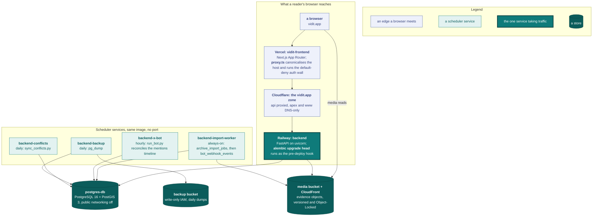
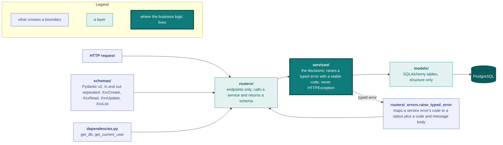

# Engineering

Vidit runs as one API, one frontend, three scheduler services built from the backend image, a backup cron, and three buckets. This page describes that system, the repository it is built from, the conventions its code follows, and how a change reaches it.



Each region of the diagram has a section below. What each piece is and why it was picked is [the tech stack](#tech-stack); the code they all run is [the repository layout](#repository-layout-monorepo), [the backend conventions](#backend-conventions) and [the frontend conventions](#frontend-conventions); the lower band is the three [scheduler services](#scheduler-services) plus the backup cron; the stores and the hosts in front of them are [deployment](#deployment), with the backup bucket's runbook in [`backups.md`](backups.md). The path a change takes to reach the diagram is [CI/CD](#cicd). [Local environment](#local-environment) is the same shape on one machine, with a Docker container standing in for `postgres-db` and `LocalStorage` for the buckets.

---

## Tech stack

### Selection principles

- **Open source first.** Every component must be self-hostable or replaceable.
- **Python backend.** The team's background is in data engineering.

### Backend

| Component | Choice | Target version |
|-----------|--------|----------------|
| API framework | **FastAPI** | ≥ 0.115 |
| ASGI server | **Uvicorn** | ≥ 0.34 |
| ORM | **SQLAlchemy** | ≥ 2.0 |
| Geospatial extension | **GeoAlchemy2** | ≥ 0.15 |
| Migrations | **Alembic** | ≥ 1.14 |
| Authentication | **Cookie session + double-submit CSRF** (JWT payload via PyJWT); bcrypt for passwords | N/A |
| Validation | **Pydantic v2** | ≥ 2.0 |
| Rate limiting | **slowapi** | ≥ 0.1.9 |

### Database

| Component | Choice |
|-----------|--------|
| RDBMS | **PostgreSQL 16**, the same `postgis/postgis:16-3.4` image locally and in production ([`backups.md`](backups.md#automated-backups) explains the `pg_dump` version pin) |
| Geospatial extension | **PostGIS 3** |

PostGIS handles coordinates, bounding boxes, and geographic queries (radius, intersection…).

### Media storage

| Component | Choice |
|-----------|--------|
| Object storage | **AWS S3** (private bucket, eu-west region) |
| CDN | **AWS CloudFront** (with Origin Access Control) |
| Python SDK | `boto3` |

S3 provides the evidence-preservation primitives: Object Lock, versioning and replication. The backend talks to storage through a small `Storage` protocol (`S3Storage` for production, `LocalStorage` for development and CI).

Every image is decoded and re-encoded before it is stored: [`evidence_processing.py`](../backend/app/services/evidence_processing.py) strips its metadata, applies its EXIF orientation, and cuts its display derivatives. The decode is bounded in four ways:

- Only the JPEG, PNG and WebP decoders may read the file, whatever its declared `Content-Type`. The image is then re-encoded in the declared type.
- The pixel limit is checked against the file header before any pixel is decoded. The limits are in [`api.md`](api.md#file-limits).
- The strip works on the decoded image in place. A mode conversion copies it once and frees the source before the encode.
- A process decodes at most `MAX_CONCURRENT_DECODES` images at once. An upload that arrives while every slot is busy waits for one, so a burst of uploads adds latency, not memory.

### Frontend

| Component | Choice |
|-----------|--------|
| Framework | **Next.js 16** (App Router) |
| UI runtime | **React 19** |
| Language | **TypeScript** (`tsconfig` `target: ES2017`; Next's SWC downlevels at build regardless of the type-checker target). Code that needs GeoJSON types imports them from the `geojson` module, not the `GeoJSON.*` global. |
| Interactive map | **MapLibre GL JS** (via `react-map-gl/maplibre`) + **CARTO Dark Matter** vector tiles |
| Rich editor (proof) | **Tiptap** |
| Styles | **Tailwind CSS 4** (CSS-first config: `@theme` block in [`frontend/src/app/globals.css`](../frontend/src/app/globals.css), no `tailwind.config.ts`) |
| Icons | **lucide-react** |
| Linting | **ESLint 9** (flat config in [`frontend/eslint.config.mjs`](../frontend/eslint.config.mjs), importing `eslint-config-next/core-web-vitals`). `npm run lint` invokes `eslint` directly. |
| Tests | **Vitest + Testing Library** (jsdom, config in [`frontend/vitest.config.mts`](../frontend/vitest.config.mts)). Colocated `*.test.ts(x)` under `src/`; `npm test` runs once, `npm run test:watch` watches. `NEXT_PUBLIC_API_URL` is stubbed in the config so importing `lib/api.ts` doesn't trip its boot guard. Layout is not testable there (jsdom has no layout engine): `npm run test:e2e` runs the Playwright suite that measures it, after `npx playwright install chromium` once. See [Narrow-viewport smoke tests](#narrow-viewport-smoke-tests). |
| API types | **`openapi-typescript`**: [`frontend/src/lib/api-types.ts`](../frontend/src/lib/api-types.ts) is **generated** from the backend OpenAPI spec (`make gen-api-types` dumps `app.openapi()` → `openapi-typescript`). [`types/index.ts`](../frontend/src/types/index.ts) derives its enums (`EventStatus`, `TagCategory`, `MediaType`) from it, so a backend schema change that isn't regenerated is a `tsc` failure, not a runtime surprise. The `api-types` CI job regenerates + `git diff --exit-code`, failing on drift. Don't hand-edit `api-types.ts`. |

MapLibre GL JS is open source (BSD-3-Clause). It uses vector tiles and supports client-side clustering. CARTO Dark Matter tiles are free for non-commercial use and match the dark theme.

The MapLibre web worker is served from `public/`, not from the bundle. MapLibre builds the worker URL at runtime, so the bundler never emits it, and the worker imports `maplibre-gl-shared.mjs` by its unhashed name. [`next.config.mjs`](../frontend/next.config.mjs) runs [`scripts/copy-maplibre-worker.mjs`](../frontend/scripts/copy-maplibre-worker.mjs) on every `next dev`, `next build` and `next start`, which copies both files to `public/maplibre-gl/<version>/`. [`maplibreWorker.ts`](../frontend/src/components/map/maplibreWorker.ts) calls `setWorkerUrl` with that path before the first map is created. The `proxy.ts` matcher skips `/maplibre-gl/`, so a signed-out reader gets the worker and not the login page. The `loads the map worker` test in [`e2e/map.spec.ts`](../frontend/e2e/map.spec.ts) fails when the worker request does not return JavaScript.

### Hosting

| Service | Platform |
|---------|----------|
| Backend (FastAPI API, always-on import worker, conflict-sync, bot and backup crons) | **Railway** |
| Frontend (Next.js) | **Vercel** |
| Database (PostgreSQL + PostGIS) | **Railway** |
| Media storage + CDN | **AWS S3 + CloudFront** |
| DNS | **Cloudflare** |
| X API (the bot) | **X pay-per-use** |
| Email, error tracking, uptime | **Resend**, **Sentry**, **UptimeRobot** |

### Not in the stack

- **Redis or an external cache**: not needed. An in-process TTL+LRU cache serves the points endpoint (see `backend/app/cache.py`).
- **An external task queue (Celery or similar)**: the archive-import worker is a plain always-on loop over the job table (see [Scheduler services](#scheduler-services)).
- **Multi-region compute**: the deployment is single-region. Media is the exception: the media bucket replicates cross-region to a locked replica bucket (see [`backups.md`](backups.md#media-replication)).
- **Monitoring and observability**: UptimeRobot runs liveness checks on the API health endpoint, and a Sentry SDK runs on both tiers (backend and frontend), opt-in through a DSN environment variable (see [Observability](#observability-whats-wired-and-how-to-turn-it-on)). There is no APM or tracing pipeline.
- **Handle-ownership verification**: the curated-onboarding import attributes work to an analyst's `@handle` **without proving the uploader controls it**. X's OAuth consent is too broad for the privacy-conscious audience, and X has no lighter identity integration (no OpenID Connect; OAuth 1.0a is worse). Imports land as detections. There is no ownership proof and no claim or dispute path.

---

## Repository layout (monorepo)

```
vidit/
├── backend/                  # FastAPI (Python), uv
│   ├── app/
│   │   ├── middleware/       # CSRF, request id
│   │   ├── models/           # SQLAlchemy, one table per file
│   │   ├── schemas/          # Pydantic v2 request and response bodies
│   │   ├── routers/          # endpoints; events/ holds per-concern sub-routers
│   │   └── services/         # business logic; tweet_ingest/ is the detection engine
│   ├── alembic/              # migrations
│   ├── scripts/              # scheduler entry points, local-dev and operator helpers
│   └── tests/                # pytest
├── frontend/                 # Next.js 16 (TypeScript), npm
│   ├── src/
│   │   ├── app/              # App Router routes
│   │   ├── components/       # feature folders; ui/ holds the shared primitives
│   │   ├── hooks/
│   │   ├── lib/              # API client, FE mirrors of backend rules
│   │   ├── types/
│   │   └── proxy.ts          # host redirect and auth wall (edge runtime)
│   ├── e2e/                  # Playwright narrow-viewport suite
│   └── scripts/              # build helpers and the palette-coverage check
├── docker/backup/            # backup cron image
├── docs/                     # this reference, built by MkDocs
├── planning/                 # roadmap and work tracker
├── video/                    # promo-as-code pipeline, see video/README.md
└── .github/workflows/        # see GitHub Actions
```

`make test` runs `pytest -n auto --dist loadfile`: the conftest migrates a template database to alembic head and clones one database per xdist worker. Plain `pytest` stays serial on the development database.

---

## Backend: conventions

### Layered structure

A request crosses the layers in one direction, and each layer knows only the one under it.



| Layer | Role | Rule |
|-------|------|------|
| **routers/** | HTTP endpoints, no business logic | Calls a service, returns a schema. Maps service-raised typed errors to HTTP status + `{code, message}` detail via the shared [`routers/_errors.py`](../backend/app/routers/_errors.py) `raise_typed_error(exc, status_map)`, each router supplying its own `code → status` map ([`routers/auth.py`](../backend/app/routers/auth.py) `_REGISTRATION_ERROR_STATUS`, [`routers/admin.py`](../backend/app/routers/admin.py) `_ADMIN_ERROR_STATUS`). |
| **services/** | Business logic | Accesses the DB through the session, never sees `Request`/`Response`, never raises `HTTPException`; raise a typed error subclass with a stable `code` and let the router translate. |
| **models/** | SQLAlchemy tables | No logic, just structure |
| **schemas/** | Pydantic validation | Input and output separated (`Create`, `Read`, `Update`, `List`) |
| **dependencies.py** | FastAPI injection | `get_db`, `get_current_user` |

### Request concurrency

The API runs as one uvicorn process with one event loop (the `CMD` in [`backend/Dockerfile`](../backend/Dockerfile)). A blocking call on that loop stalls every in-flight request, `/health` included. Route handlers follow three rules:

- Declare a handler that touches the database as a plain `def`. FastAPI runs it in its threadpool, so a slow query or a lock wait blocks one worker thread and the loop keeps serving.
- Call an `async` service from such a handler through `asyncio.run`, which gives the coroutine an event loop of its own inside the worker thread. The evidence writes in [`routers/events/write.py`](../backend/app/routers/events/write.py) and [`routers/events/item.py`](../backend/app/routers/events/item.py), the avatar upload, and the tweet import work this way. The row lock an evidence write holds across its upload pauses only that private loop.
- Keep `async def` for a handler that awaits the request itself, and run each of its database calls through `run_in_threadpool`, as the X webhook receiver ([`routers/webhooks.py`](../backend/app/routers/webhooks.py)) does: it reads the raw body for its signature check.

[`tests/test_request_concurrency.py`](../backend/tests/test_request_concurrency.py) fails on an `async def` handler that depends on `get_db`, the webhook receiver excepted.

The API process caps every lock wait at `LOCK_TIMEOUT_MS`, 5 seconds. [`main.py`](../backend/app/main.py) calls `bound_lock_waits` from [`database.py`](../backend/app/database.py) at import, and from then on every connection the engine opens sets the Postgres `lock_timeout` in its startup options. A statement that waits longer for a lock fails, and `get_db` answers the request with a `409` carrying the typed envelope `{"code": "lock_timeout", …}`. The cap protects the API's threadpool: a request queued on a lock holds a worker thread for as long as it waits.

The cap applies to the API process only. The import worker, the bot cron, and the conflict-sync cron open their sessions from the same engine but never import `main.py`, so their statements wait for the lock: each service runs on its own compute with no shared threadpool, and waiting costs it nothing. Migrations open their own engine in [`alembic/env.py`](../backend/alembic/env.py) and wait too.

### Hand-kept mirrors

Each validation rule has one backend home: the upload MIME allowlist in `services/storage.py` (the EXIF-strip set derives from the image allowlist), coordinate bounds in `services/events.validate_coordinates`, and password length in `schemas/auth.NewPassword` (`PASSWORD_MIN_LENGTH` characters, `PASSWORD_MAX_BYTES` UTF-8 bytes, the bcrypt input limit). Frontend enum types are generated from the OpenAPI spec into `lib/api-types.ts`.

Every other frontend copy of a backend rule is hand-kept and listed below. Change both sides in the same PR. Frontend paths are under `frontend/src/`; backend modules are under `backend/app/`.

| Frontend | Backend source | Drift breaks |
|---|---|---|
| `lib/mediaTypes.ts` | `storage.ALLOWED_IMAGE_TYPES`, `ALLOWED_VIDEO_TYPES` | picker accepts a file the API refuses |
| `lib/coordinates.ts` | `events.validate_coordinates` | form accepts coordinates the API refuses |
| `lib/auth.ts` `PASSWORD_MIN_LENGTH` (the byte limit shows the API's 422 message) | `schemas/auth.PASSWORD_MIN_LENGTH` | password hint disagrees with the 422 |
| `lib/auth.ts` CSRF cookie and header names; the cookie name again in `proxy.ts` (edge runtime) | `auth_cookies.CSRF_COOKIE`, `CSRF_HEADER` | every write is refused |
| `lib/proofImages.ts` | `sanitize.PROOF_PLACEHOLDER_PREFIX`, `storage.safe_original_filename` | proof images lose their upload binding |
| `lib/search.ts::AUTHOR_FILTER_RE` | `event_filters.AUTHOR_FILTER_PATTERN` | author filter parses differently |
| `components/filters/EventFilterSections.tsx` media options, `STATUS_FILTER_OPTIONS` | `event_filters.MEDIA_TYPES`; `STATUSES` minus `closed`, in declared order | filter offers a value the API refuses |
| `components/profile/RecentSubmissions.tsx` link `status=geolocated` | `event_filters.published_events()` | *Show more* expands a different set than the preview |
| `components/collections/CollectionsSection.tsx` link `type=collection` | the filter `search.search_collections` reads, including the `author` exception | *Show more* lands on an empty group |
| `lib/archive.ts` keep-allowlist, root discovery, `MAX_UPLOAD_BYTES` | `tweet_ingest/archive_zip.py` | client trims files the server needs, or uploads an export it refuses |
| `lib/mediaUrls.ts::displayUrlsFor` | `storage.derivative_key` (`_hero`, `_thumb`); `upload_proof_image(produce_derivatives=False)` | a proof image requests a derivative that does not exist (403) |
| `lib/viewport.ts` | `event_filters.parse_bbox` field order and bounds | map bbox is refused or filters the wrong area |
| `lib/pagination.ts` | `pagination.next_link` `Link` header shape | paging stops after page one |
| `lib/events.ts::MAX_SECONDARY_SOURCE_LINKS` | `models/event.MAX_SECONDARY_SOURCE_LINKS` | form allows a link the API refuses |
| `lib/events.ts::batchCompletionBlockers` | `events/batch._publish_detection`, `events.detection_ready_predicate` | queue labels a row ready that the server refuses |
| `lib/events.ts::EventView` | `event_filters.VIEWS` (the router takes `str`, so codegen cannot carry it) | `view` parameter refused |
| `lib/events.ts::snapshotToEventView`, `changedFields`, `hasVersionChanges` | `versions.build_snapshot` fields, `versions.COMPARED_FIELDS` (the snapshot is untyped JSON, so neither codegen nor `tsc` catches a renamed key) | version pages silently blank a field |
| `lib/events.ts::REPORT_DETAILS_MAX_LEN`, `VERSION_NOTE_MAX_LEN` | `schemas/report.DETAILS_MAX_LENGTH`, `schemas/event.VERSION_NOTE_MAX_LENGTH` | server refuses typed text |
| `components/profile/useProfileEdit.ts::BIO_MAX_LEN` | `schemas/user.BIO_MAX_LEN` | server refuses typed text |
| `components/ui/TagPicker.tsx::TAG_NAME_MAX_LEN` | `schemas/tag.py` name `max_length` | server refuses typed text |
| `lib/collections.ts::COLLECTION_TITLE_MAX_LEN`, `COLLECTION_DESCRIPTION_MAX_LEN` | `models/event.TITLE_MAX_LENGTH`, `schemas/collection.DESCRIPTION_MAX_LENGTH` | server refuses typed text |
| `lib/proof.tsx::tiptapDocText` | `sanitize.tiptap_doc_text` | description counter disagrees with the server cap |
| `lib/collections.ts::COLLECTABLE_STATUSES` | `event_filters.collectable_events` | picker offers rows the add verb refuses (409) |
| `lib/users.ts::SOCIAL_HOSTS`, `SOCIAL_HANDLE_PATTERN` | `schemas/user.SOCIAL_PROFILE_HOSTS`, `SOCIAL_HANDLE_PATTERNS` | profile links the wrong host or hides an accepted handle |
| `components/ui/ArchivedCopies.tsx::SNAPSHOT_HOSTS` | keys of `source_archive.PROVIDER_HOSTS` | pre-submit check disagrees with the server |
| `lib/snapshots.ts` hosts and capture-path patterns | `source_archive._WAYBACK_REPLAY_RE`, `_ARCHIVE_TODAY_CAPTURE_RE`, `PROVIDER_HOSTS` | mis-paste check silently matches nothing |
| `lib/proof.tsx` renderer, `isSafeLinkHref`, `isSafeImageSrc` (`NEXT_PUBLIC_MEDIA_HOST`); `components/editor/ProofEditor.tsx` extensions | `sanitize.py` node and mark allowlist, `safe_link_href`, `_safe_image_src` (CDN host pin) | a security fix lands on one side only |
| `types/index.ts::MapPoint` 6-tuple | `routers/events/read.py::list_points` tuple order `[id, lat, lng, event_date, added_date, detected]` | every map point mis-decodes |
| expiry copy on `app/(auth)/forgot-password`, `registration-pending` and `resend-confirmation` (15 minutes, 24 hours) | `config.password_reset_token_minutes`, `registration.CONFIRMATION_TOKEN_MINUTES` | page states the wrong expiry |
| `@viditbot` in `app/import/page.tsx` and `components/ui/MockPost.tsx` | `config.x_bot_handle` | guide names the wrong handle |

### Migration house style

- Data backfills run through `op.execute` with plain SQL, never through ORM models (application code drifts ahead of the schema a migration targets).
- Column type changes state the cast explicitly via `postgresql_using`.
- Geometry columns use `geoalchemy2` types, with `spatial_index` stated explicitly (GeoAlchemy2 otherwise creates a GIST index by default).
- Validate a new migration's whole chain on a fresh database before pushing: `docker-compose up -d`, then `uv run alembic upgrade head`. Verify the current head with `uv run alembic heads`, not by filename sort order.

The chain starts at one baseline migration, the only file whose `down_revision` is `None`. It builds the whole schema in a single step: the `postgis` extension, every table, constraint and index, and the seed rows a fresh database needs (the `capture_source` tag taxonomy and the `Other` conflict escape value). New migrations stack on top of it as usual.

A squash replaces the chain with a new baseline that **keeps the previous head's revision id**. A database whose `alembic_version` already holds that id therefore needs no stamp, and the pre-deploy `alembic upgrade head` runs nothing. Read the deployed revision before merging a squash, and squash only when it matches the head being replaced:

```sql
SELECT version_num FROM alembic_version;
```

A database at an intermediate revision has no path forward, because the revisions between it and the baseline are gone. Rebuild it: drop the database and run `uv run alembic upgrade head`, or restore a dump taken at the baseline revision. This reaches local databases only, production being at head.

The pytest template database keys its reuse on the alembic head id, which a squash preserves. Drop `<db>_test_tpl` after a squash so the next run rebuilds the template from the baseline.

---

## Frontend: conventions

Client pages load read-only API data through `useApiResource<T>(path)` ([`frontend/src/hooks/useApiResource.ts`](../frontend/src/hooks/useApiResource.ts)). It issues a GET on mount and on every `path` change, aborts the in-flight request on unmount or path change, and skips the request while `path` is `null` (auth unresolved, route params not ready). Call `refetch()` for retry buttons and post-mutation refreshes. Errors surface as messages for the page to render; 401 handling stays in the proxy. Lists the page mutates after seeding (for example, `TagPicker` appending a newly created tag) stay on `useState` plus `apiFetch`. Writes (create, update, delete) run through `useMutation(fn, { onSuccess, onError, fallback })` ([`frontend/src/hooks/useMutation.ts`](../frontend/src/hooks/useMutation.ts)), the shared `loading` / `error` / try-catch wrapper. `errorMessage(err, fallback)` ([`api.ts`](../frontend/src/lib/api.ts)) pulls the message. The anonymous-to-`/login` bounce on a protected page is `useRequireAuth()`, the mirror of `useRedirectIfAuthenticated`.

The auth wall in [`proxy.ts`](../frontend/src/proxy.ts) is default-deny over an explicit public set (`PUBLIC_PREFIXES`). Anonymous read is open on the content routes (map, events, requests, collections, profiles, search), the guide and legal pages (`/about`, `/guide`, `/import`, `/methodology`, `/legal`, `/privacy`, and the `/archive` and `/bot` redirects), and the auth pages. Write and account surfaces (`/submit`, `/settings`, `/admin`, `/timeline`) require a session. Write sub-routes nested under a public prefix (`/events/[id]/edit`, `/profile/[username]/detections`, `/collections/new`, `/collections/[id]/edit`) are bounced client-side by `useRequireAuth`.

Keep one short pointer on each side of a hand-kept frontend/backend mirror (the list is in [`AGENTS.md`](../AGENTS.md)), for example `Mirrors backend storage.derivative_key; change both.` Keep a comment to the fewest lines that hold the fact, usually one to three.

---

## Local environment

### Docker Compose

`docker-compose.yml` runs the stock `postgis/postgis:16-3.4` image, the same one production runs on Railway, so a production dump restores into it unchanged ([`backups.md`](backups.md#restoring-from-a-backup) lists the extensions). The container is named `vidit-db` and its data volume is mounted at `/var/lib/postgresql/data`.

The backend (FastAPI via uvicorn) and the frontend (Next.js dev server) run on the host for hot reload.

```
docker-compose up -d        → PostgreSQL on :5432
uv run uvicorn ...          → backend on :8000
npm run dev                 → frontend on :3000
```

### Environment variables

Each service has its own `.env` (not committed):

- `backend/.env`: `DATABASE_URL`, `JWT_SECRET`, `STORAGE_BACKEND` (`local` or `s3`), `S3_BUCKET`, `AWS_REGION`, `CLOUDFRONT_DOMAIN`, `AWS_ACCESS_KEY_ID`, `AWS_SECRET_ACCESS_KEY`, `CORS_ORIGINS`. Full list in `backend/.env.example`.
- `frontend/.env.local`: `NEXT_PUBLIC_API_URL`. Full list in `frontend/.env.local.example`.

Set `REPORT_NOTIFY_EMAIL` in `backend/.env` to receive one email per content report a viewer files. The message names the reason and links to both the admin console and the reported event. Leave it unset to record reports without sending mail. The admin report queue holds every report either way.

### Running multiple frontends against one backend

The local CORS allowlist accepts every `localhost:<port>` (http or https) by default. See [`backend/app/config.py`](../backend/app/config.py) (`cors_origin_regex`). One backend on `:8000` serves any number of concurrent frontends (main checkout, worktrees, alternate ports) without a restart. For a frontend on a non-default port, run:

```
cd frontend
NEXT_PUBLIC_API_URL=http://localhost:8000/api/v1 npx next dev -p 3030
```

The override applies only to the localhost regex. Explicit `CORS_ORIGINS` (production hosts) still apply. The shipped localhost default is a development convenience, and it's dropped automatically when `DATABASE_URL` points at a non-local host ([`config.py`](../backend/app/config.py) `effective_cors_origin_regex`). This matters because, with `allow_credentials=True`, a live `localhost:<port>` origin regex would otherwise let any localhost page in a viewer's browser make credentialed cross-origin reads against the deployed API. Production therefore relies on the `CORS_ORIGINS` allowlist alone, independent of the cookie `SameSite` attribute, and no manual `CORS_ORIGIN_REGEX=` step is required.

---

## CI/CD

A change reaches production in two moves, and neither is automatic: checks gate the merge, and a person dispatches the deploy.

```mermaid
flowchart LR
  classDef spec fill:#eef1fb,stroke:#4a5fa5,color:#33417a
  classDef shared fill:#e3f2f1,stroke:#0f7b7a,color:#0b5c5b
  classDef core fill:#0f7b7a,stroke:#083f3e,stroke-width:3px,color:#ffffff
  classDef store fill:#0b5c5b,stroke:#083f3e,color:#ffffff

  subgraph legend [Legend]
    direction LR
    l1["`a check reporting on the PR`"]:::spec
    l2["`a step someone takes`"]:::shared
    l3["`a gate nothing passes without`"]:::core
    l1 ~~~ l2 ~~~ l3
  end

  pr["`**a pull request**
  from a feature branch; main is branch-protected`"]:::shared

  subgraph checks [What runs on it]
    direction TB
    ci["`**ci.yml**, seven jobs, no path filters
    backend-lint, backend-test, frontend, frontend-e2e, api-types, hygiene, docs-pairing`"]:::spec
    other["`**pr-title.yml**, the **DCO app**, **codeql.yml**
    title shape, sign-off, and the security-extended scan`"]:::spec
  end

  protect["`**branch protection on main**
  seven required checks, linear history, no force-push`"]:::core
  merge["`**merge to main**
  auto-deploy is off`"]:::shared
  dispatch["`**deploy.yml**, workflow_dispatch
  one ref, six parallel jobs`"]:::core
  rail["`**railway up --detach**
  five services, then poll railway deployment list to a terminal status`"]:::shared
  pre["`**alembic upgrade head**
  the pre-deploy hook, before the new container takes traffic`"]:::core
  vercel["`**vercel pull, build, deploy --prebuilt --prod**`"]:::shared
  prod[("`**production**
  api.vidit.app and vidit.app`")]:::store

  pr --> checks --> protect --> merge --> dispatch
  dispatch --> rail --> pre --> prod
  dispatch --> vercel --> prod
```



The checks are [GitHub Actions](#github-actions), the gate is the branch-protection row under [Observability](#observability-whats-wired-and-how-to-turn-it-on), and the six deploy jobs are [Deployment](#deployment).

### GitHub Actions

| Workflow | Trigger | Steps |
|----------|---------|-------|
| `ci.yml` | Every push to `main` and every PR (no path filters, so required checks always report even on a docs-only PR) | Seven jobs. `backend-lint`: `uv sync` → `ruff check` → `ruff format --check` → `mypy app` → `vulture` (dead code). `backend-test` (parallel with `backend-lint`, no gate): `pytest -n 4 --dist loadfile` against a PostGIS service container (no separate migrate step: the xdist template build runs the migrations, see [Repository layout](#repository-layout-monorepo)). `frontend`: `npm ci` → `eslint` → `tsc --noEmit` → `vitest run` → `next build`. `frontend-e2e`: `npm ci` → `npx playwright install --with-deps chromium` (the browser cached on the lock file's Playwright version) → `npm run test:e2e`, the narrow-viewport smoke suite described below; a red run uploads `frontend/test-results/` as an artifact. `api-types`: regenerates `frontend/src/lib/api-types.ts` from the OpenAPI spec and fails on drift. `hygiene`: `jscpd` (duplication), `knip` (dead frontend code), the palette-coverage check, and `video/check-routes.sh`. `docs-pairing` (PR-only): fails when the PR does not touch both `docs/` and `planning/`; the exemptions are in [CONTRIBUTING *Doc-sync rule*](../CONTRIBUTING.md#doc-sync-rule). Force-pushes cancel the obsolete in-flight run; pushes to `main` run to completion. |
| `codeql.yml` | Push to `main`, PR to `main`, weekly cron (Monday 06:00 UTC) | CodeQL dataflow analysis on Python + TypeScript/JavaScript with the `security-extended` query suite. Findings post to *Security tab → Code scanning alerts*. The `analyze` job is gated on `!github.event.repository.private`: code scanning is free on public repos but a paid GitHub Advanced Security add-on on private ones, so the job runs on the public repo and skips (rather than fails) anywhere the repository is private, e.g. a private fork. |
| `pr-title.yml` | PR opened / edited / synchronized | Validates the PR title against Conventional Commits. Stays outside `ci.yml` on purpose: it re-runs on title edits, and bundling it would re-run the full test suite on every edit. |
| `deploy.yml` | `workflow_dispatch` | See [Deployment](#deployment) below. |
| `deploy-docs.yml` | Push to `main` touching `docs/**`, `mkdocs.yml`, `requirements-docs.txt` or the workflow; `workflow_dispatch` | Builds the MkDocs Material site from `docs/` ([`mkdocs.yml`](../mkdocs.yml)) and deploys it to GitHub Pages at `docs.vidit.app` (the custom domain comes from `docs/CNAME`). |

Dependabot ([`.github/dependabot.yml`](../.github/dependabot.yml)) opens weekly Monday version-update PRs across `pip`, `npm`, and `github-actions`. It groups related updates (`@sentry/*`, `@tiptap/*`, `@typescript-eslint/*`, `@types/*`, `next + @next/* + eslint-config-next`, and a `minor-and-patch` catch-all) so a busy ecosystem doesn't open ten PRs at once. Major bumps stay individual. Security PRs ship one per advisory regardless. Each ecosystem sets a `cooldown` before a version-update PR opens: 7 days for a major, 3 for a minor and 1 for a patch on `pip` and `npm`, and a flat 7 days on `github-actions`, which has no semver keys. Security updates skip the cooldown. Each ecosystem sets a `cooldown` that delays a version-update PR after the release: 7 days for a major, 3 for a minor and 1 for a patch on `pip` and `npm`, and a flat 7 days on `github-actions`, which does not support the semver keys. The cooldown applies to version updates only, so security updates open immediately.

The [Probot DCO App](https://github.com/apps/dco), installed on the GitHub organization, posts the `DCO` status check. Sign-off rules: [CONTRIBUTING](../CONTRIBUTING.md#contributor-sign-off).

The workflows are hardened because forks make every workflow run reachable to attackers:

- **Every third-party action is SHA-pinned**, with the human-readable version in a trailing comment (the `# vX.Y.Z` form is the one Dependabot's `github-actions` ecosystem reads to know which pin to rewrite on a version-update PR).
- **Every workflow declares a top-level `permissions:` block** scoped to the minimum it needs.
- **No workflow uses `pull_request_target`**, because it's a fork-PR escalation vector. Use `pull_request` instead.

#### Narrow-viewport smoke tests

The `frontend-e2e` job tests the phone layouts in a real Chromium, because jsdom (where `vitest` runs) has no layout engine.

The suite lives in [`frontend/e2e/`](../frontend/e2e). [`frontend/playwright.config.ts`](../frontend/playwright.config.ts) runs every spec as two projects: Desktop Chrome at 375x812 and at 320x568, with no touch emulation, mobile user agent or device pixel ratio. It covers the four golden paths (open a shared event link, browse and filter the map, fill the submit page in both modes, sign in and read settings) and the request board, which holds the narrowest content column in the product.

Each page takes the same three assertions, held in `e2e/support/narrowLayout.ts`:

- `document.documentElement.scrollWidth` equals `document.documentElement.clientWidth`, so the page does not scroll sideways. `clientWidth` excludes a classic scrollbar, which `window.innerWidth` would include.
- The page's primary control is visible, scrolled into view, and wholly inside the viewport (`toBeInViewport({ ratio: 1 })`). The scroll runs once, before the assertion, so a spec waits for any block above the control that renders a loading box and then grows: on the collection page, it waits for the player panel's event heading before it measures the Events header.
- Every visible editable field computes a `font-size` of at least 16px, the size below which a phone zooms on focus. `<input>` types that render no typed text (`hidden`, `checkbox`, `radio`, `file`, `range`, `color`, `submit`, `button`, `reset`, `image`) are excluded.

The suite has no screenshot comparison and no retries. It needs no database and no backend: `e2e/support/mockApi.ts` answers every API call with `page.route`, and `grantSession` sets the CSRF cookie [`proxy.ts`](../frontend/src/proxy.ts) reads. The config runs `next dev`, because outside development `proxy.ts` redirects a localhost host to the apex. A failing run keeps its traces under `frontend/test-results/`, which the CI job uploads as an artifact.

To run it locally, from `frontend/`:

```bash
npx playwright install chromium   # once
npm run test:e2e
```

`npm run test:e2e -- --project=chromium-320x568` runs the narrow width alone, and `--ui` opens the runner.

### Deployment

| Service | Platform | Identifier | Method |
|---------|----------|------------|--------|
| Source | GitHub | [`github.com/vidithq/vidit`](https://github.com/vidithq/vidit): public, AGPL-3.0. Cross-linked from the landing roadmap card, the `/about` AGPL paragraph, and the sidebar header (next to the X + Discord shortcuts). | Direct push to feature branches; `main` is branch-protected, every change lands via PR. |
| Backend | Railway | project `vidit` / service `backend`; public host `https://api.vidit.app` (Railway-internal `backend.railway.internal`) | Dockerfile build, deployed via the [`deploy` workflow](../.github/workflows/deploy.yml) (`workflow_dispatch`). Auto-deploy on push to `main` is **off**. Each matrix job runs `railway up --detach`, then polls `railway deployment list --service <svc> --json` until the new deployment reaches a terminal status: `SUCCESS` passes the job, `FAILED` / `CRASHED` / `REMOVED` / `SKIPPED` fail it, and a 15-minute poll budget fails it too. The job prints the deployment id and its final status. The workflow pins the Railway CLI version because the step depends on those flags. `railway up --service backend` from the **repo root** works as a manual fallback (the service's Root Directory `backend` navigates into the uploaded snapshot; running from `backend/` uploads a snapshot with no `backend/` subdir and the build fails). |
| Scheduler services | Railway | services `backend-import-worker` (always-on archive-import worker), `backend-conflicts` (daily conflict-sync cron), and `backend-x-bot` (mention-pipeline reconciliation cron, hourly); per-service config under [Scheduler services](#scheduler-services) | Same [`deploy` workflow](../.github/workflows/deploy.yml), same repo-root `railway up` snapshot as the API: the five services (these three plus `backend` and `backend-backup`) deploy as parallel matrix jobs (`fail-fast: false`, per-service concurrency group), so the backend deploy costs the slowest service, not the sum. No GitHub source connected: the workflow is their only deploy path, so every service ships the same ref. |
| Frontend | Vercel | team `vidithq` / project `vidit-frontend`; primary domain `https://vidit.app` (apex); `www.vidit.app`, `vidit-frontend.vercel.app` and any other non-canonical host 308-redirect at the Next.js proxy layer ([`frontend/src/proxy.ts`](../frontend/src/proxy.ts)) so the project alias doesn't accumulate duplicate-content surface in search. | Deployed via the [`deploy` workflow](../.github/workflows/deploy.yml) (`workflow_dispatch`) using `vercel pull` + `vercel build` + `vercel deploy --prebuilt --prod`. `vercel --prod` from `frontend/` works as a manual fallback. Per-deployment hash URLs are SSO-walled; only the project alias is public. |
| DNS | Cloudflare | `vidit.app` zone. Apex + `www`: **DNS-only** (gray cloud). `api`: **proxied** (orange cloud). `docs`: **DNS-only**. | Apex + `www` A → Vercel `76.76.21.21`; `api` CNAME → Railway; `docs` CNAME → `vidithq.github.io`. Railway and GitHub Pages issue their Let's Encrypt certificates against a DNS-only record, so a record goes proxied only once its certificate exists, and `docs` stays DNS-only. **Bot Fight Mode stays off** on the zone: it serves a managed challenge to Vercel's server-side reads of `api.vidit.app` (user agent `node`, AWS addresses), which are the share-card and `generateMetadata` fetches in [`frontend/src/app/_og/data.ts`](../frontend/src/app/_og/data.ts); challenged, every event and profile unfurls as the fallback card. The Free plan cannot exempt a host from Bot Fight Mode with a security rule, so the switch is the zone-wide toggle. |
| Database | Railway | managed Postgres + PostGIS, service `postgres-db` (image `postgis/postgis:16-3.4`) | `DATABASE_URL` (with internal `*.railway.internal` host) is auto-injected onto the **`backend`** service when the DB is attached. New consumers wire it as `${{backend.DATABASE_URL}}`. Public networking is **off**; admin scripts run inside the backend container via `railway ssh --service backend`. |
| Migrations | Railway | N/A | Pre-deploy hook: `uv run alembic upgrade head` (in [`backend/railway.json`](../backend/railway.json)). Runs *before* the new container takes traffic. |
| Media | AWS | bucket `<media-bucket>` (region `eu-west-3`), CloudFront `d10w3bld05vsky.cloudfront.net` (OAC, not OAI). Versioning ON; Object Lock ON with default rule GOVERNANCE / 365 days (bucket-wide). CORS: `GET`/`HEAD` from `https://vidit.app`, plus the `POST` rule below for the presigned archive-import upload. Lifecycle rules and cross-region replication: [`backups.md`](backups.md#media-replication). Every evidence image upload lands **three** sibling objects: the original (post EXIF-strip), `<key>_hero.jpg` (max-dim 1280, JPEG q80), `<key>_thumb.jpg` (max-dim 400, JPEG q80). An avatar lands **one**: a single stripped 400 px JPEG under `avatars/<user id>/`. Frontend renderers derive the hero and thumbnail URLs through [`frontend/src/lib/mediaUrls.ts`](../frontend/src/lib/mediaUrls.ts), a mirror of `derivative_key()` in [`backend/app/services/storage.py`](../backend/app/services/storage.py). | Backend uploads via `boto3` as IAM user `<runtime-iam-user>` (object-level perms only, scoped to the `uploads/`, `bounty_uploads/`, `proof/`, `demo-pool/`, `archive-imports/`, `detected/`, and `avatars/` key prefixes: a feature that introduces a new prefix must extend the user's policy or every write to it fails `AccessDenied`); bucket-level admin uses a separate `<s3-admin>` IAM principal. CloudFront serves the bucket. |
| Backups | Railway + AWS | Cron service `backend-backup` (image [`docker/backup/`](../docker/backup/)) → bucket `<backup-bucket>` | Schedule, bucket settings, IAM and restore: [`backups.md`](backups.md). |

**Operator step: media-bucket CORS for presigned archive uploads.** The archive import POSTs the zip from the browser straight to the bucket (S3 POST policy; see [`ingestion.md`](ingestion.md#archive-import-worker)), so the bucket CORS must allow cross-origin `POST` from the app origins. Apply this configuration on `<media-bucket>` (S3 console → Permissions → CORS, or `aws s3api put-bucket-cors`) and keep the existing `GET`/`HEAD` rule:

```json
[
  {
    "AllowedMethods": ["GET", "HEAD"],
    "AllowedOrigins": ["https://vidit.app"],
    "AllowedHeaders": [],
    "MaxAgeSeconds": 3600
  },
  {
    "AllowedMethods": ["POST"],
    "AllowedOrigins": ["https://vidit.app"],
    "AllowedHeaders": ["Content-Type"],
    "ExposeHeaders": ["ETag"],
    "MaxAgeSeconds": 3600
  }
]
```

(There's no localhost origin: local development uses `LocalStorage` plus the development upload endpoint, and it never reaches the bucket.)

**Operator step: `archive-imports/` lifecycle rule.** The worker deletes a staged object at terminal states, but an uploaded-but-never-enqueued object has no job row to trigger that delete. Apply the `archive-imports/` rule [`backups.md`](backups.md#media-lifecycle) describes.

Bucket names follow `<product>-<env>-<region>`. The service is named `backend` because Railway already nests it under `vidit/production`. The Vercel project is `vidit-frontend` because the team scope is `vidithq`.

### Scheduler services

The three services in the table above are built from the backend image with Root Directory `backend`, on the config-as-code path [`backend/railway.scheduler.json`](../backend/railway.scheduler.json). That path is mandatory: with Root Directory `backend` and no config of their own, they auto-discover the API's [`railway.json`](../backend/railway.json), whose alembic pre-deploy replays before every run and whose `/health` healthcheck fails any deploy that is not the API server. A cron service merely replays the pre-deploy, but the always-on worker listens on no port, so the inherited healthcheck fails its deploy outright.

All three take `DATABASE_URL=${{backend.DATABASE_URL}}` and `JWT_SECRET=${{backend.JWT_SECRET}}`, because [`config.py`](../backend/app/config.py)'s boot check refuses the placeholder secret against a non-local database. Set `SENTRY_DSN` on each so a failure pages instead of sitting in the logs.

**`backend-import-worker`**, always-on, no exposed port. Start command `uv run python scripts/run_import_worker.py`. It also takes the storage variables (`STORAGE_BACKEND`, `S3_BUCKET`, `AWS_*`) and email variables (`EMAIL_*`, `RESEND_API_KEY`, `FRONTEND_URL`) the API takes, plus the six `X_*` credentials and the two reply caps, `BOT_MAX_REPLIES_PER_HOUR` and `BOT_MAX_REPLIES_PER_AUTHOR_PER_HOUR`, since it posts the webhook path's bot replies. What it drains: [`ingestion.md`](ingestion.md#archive-import-worker).

**`backend-x-bot`**, cron `0 * * * *`, since the webhook owns latency and the cron only reconciles. Start command `uv run python scripts/run_bot.py`. It also takes the six `X_*` credentials, the two `BOT_MAX_REPLIES_*` caps, and `X_WEBHOOK_ENABLED` (see `backend/.env.example`): a bearer token and bot user ID to read, and the four OAuth 1.0a values to post. Without the OAuth values, the bot processes mentions but posts nothing. The process makes one pass, then exits; a failed mentions pull exits non-zero. A missed run is harmless, because the next pass resumes from the ledger. What it runs: [`ingestion.md`](ingestion.md#the-bot).

Set the reply caps to the same values on both services. Defaults and behaviour: [`ingestion.md`](ingestion.md#the-bot).

**`backend-conflicts`**, a cron. Schedule, start command and behaviour: [`conflicts.md`](conflicts.md).

### X webhook operations

[`manage_x_webhook.py`](../backend/scripts/manage_x_webhook.py) reads the same `X_*` environment variables as the bot:

```
uv run python scripts/manage_x_webhook.py register https://api.vidit.app/api/v1/webhooks/x
uv run python scripts/manage_x_webhook.py subscribe <webhook_id>   # bind the bot account
uv run python scripts/manage_x_webhook.py list                     # webhook ids + valid flag
uv run python scripts/manage_x_webhook.py status <webhook_id>      # subscription check
uv run python scripts/manage_x_webhook.py revalidate <webhook_id>  # re-run the CRC after an outage
uv run python scripts/manage_x_webhook.py delete <webhook_id>
```

Register the webhook **after** you deploy the endpoint: X fires a Challenge-Response Check (CRC) at register time. Once `register` and `subscribe` succeed, set `X_WEBHOOK_ENABLED=true` on the backend services.

X re-runs the CRC hourly, and the endpoint answers it in-request, using pure HMAC with no database access. A failed check deactivates the webhook silently, and two nets catch that. `manage_x_webhook.py list` shows the webhook's `valid` flag. While `X_WEBHOOK_ENABLED=true`, the poll's gap detector catches it live: a mention the poll processes fresh logs a warning and captures a Sentry message (`webhook gap: mention <id> arrived via reconciliation`). For a known outage longer than the poll covers, X's replay API re-delivers up to 24 hours of events on request, manually, from the developer console or API.

### Operating the platform: CLIs

Railway:

```bash
brew install railway
railway login           # browser auth, saved per machine
railway link            # interactive: pick project → environment → service (writes .railway/)
railway status          # what's currently linked
railway variables                                # list
railway variables --set "KEY=value"              # add/update; triggers redeploy
railway up [--detach]                            # build + deploy from cwd
railway logs [--build]                           # tail running deployment / latest build
railway run -- <command>                         # run a one-off in the service env
```

Vercel:

```bash
brew install vercel-cli
vercel login                                      # interactive
vercel link --yes --scope vidithq --project vidit-frontend
vercel env ls
printf 'value' | vercel env add NAME production   # pipe avoids leaking via ps/history
vercel --prod --yes                               # promote to production
```

Headless use needs a token from https://vercel.com/account/tokens, passed as `--token="$VERCEL_TOKEN" --scope vidithq` on every command. `--scope` is required in non-interactive shells (no default team).

`NEXT_PUBLIC_*` env vars are baked into the JS bundle at build time. `NEXT_PUBLIC_API_URL` and `NEXT_PUBLIC_DEMO_VIDEO_URL` (the landing demo video, a CloudFront `.mp4` URL under `landing/` on the media bucket) are passed explicitly into the build from repo **variables** in [`deploy.yml`](../.github/workflows/deploy.yml), because `vercel pull` doesn't reliably surface `NEXT_PUBLIC_*` to `next build`.

**Legal pages.** `/legal` and `/privacy` carry their statutory content inline, so they read no environment variables. The *Hosting providers* section of [`legal/page.tsx`](../frontend/src/app/legal/page.tsx) names the three providers that host the platform, each with its role, postal address, and site: Vercel (the web interface), Railway (the API and the database), and Amazon Web Services (media storage and delivery). The platform is a non-professional publisher under LCEN article 6-III-2, so the pages identify the hosts rather than the publisher. Both pages publish `support@vidit.app` for takedown notices, data requests, and other legal mail. Change a hosting provider, and edit the list in the same commit.

### Observability: what's wired and how to turn it on

| Piece | State | How to turn on |
|---|---|---|
| Backend Sentry | `init_sentry` in [`backend/app/observability.py`](../backend/app/observability.py) boots the SDK for the API ([`main.py`](../backend/app/main.py)) and the three [scheduler services](#scheduler-services), and only when `SENTRY_DSN` is non-empty. The scheduler services send traces at the same `SENTRY_TRACES_SAMPLE_RATE` as the API. Events carry no frame local variables and no request bodies, and `send_default_pii` stays off, so a password or an API credential held in a variable or sent in a request body never reaches an event. The engine sets `hide_parameters`, so database error text carries no bound parameters. | Create a project at sentry.io (Python / FastAPI), copy the DSN, then on Railway `backend` service: `railway variables --set "SENTRY_DSN=https://..." --set "SENTRY_ENVIRONMENT=production"`. Verify: hit a 5xx path or `sentry_sdk.capture_message('hello')` from `railway ssh` and confirm it lands. |
| Backend logs and request ids | `configure_logging` in [`backend/app/observability.py`](../backend/app/observability.py) runs at the start of the API and of the three scheduler services. Format and routing: [Backend logs](#backend-logs). | On by default. `LOG_LEVEL` sets the level of the `app.*` loggers: `DEBUG`, `INFO` (the default), `WARNING`, `ERROR`, or `CRITICAL`, in any case. |
| Frontend Sentry | SDK wired in [`frontend/instrumentation-client.ts`](../frontend/instrumentation-client.ts) + [`sentry.server.config.ts`](../frontend/sentry.server.config.ts) + [`sentry.edge.config.ts`](../frontend/sentry.edge.config.ts); booted by [`frontend/instrumentation.ts`](../frontend/instrumentation.ts) which also re-exports `onRequestError = Sentry.captureRequestError` so errors thrown inside nested React Server Components reach Sentry. `Sentry.init(...)` runs only when `NEXT_PUBLIC_SENTRY_DSN` (client) or `SENTRY_DSN` (server / edge) is non-empty. `app/error.tsx` + `app/global-error.tsx` forward caught exceptions via `Sentry.captureException` (React error boundaries are not auto-captured). `next.config.mjs` is wrapped with `withSentryConfig` (with `tunnelRoute: "/monitoring"`, see the ad-blocker note below). | On Vercel set `NEXT_PUBLIC_SENTRY_DSN` (Production) + `SENTRY_DSN` (server runtime) + `NEXT_PUBLIC_SENTRY_ENVIRONMENT=production` + `SENTRY_ENVIRONMENT=production`. For build-time source-map upload also add repo variables `SENTRY_ORG` + `SENTRY_PROJECT` + repo secret `SENTRY_AUTH_TOKEN` ([wired through `deploy.yml`](../.github/workflows/deploy.yml)) and set the same on Vercel. Trigger a `deploy` workflow run. Verification: see [Frontend Sentry verification](#frontend-sentry-verification) below. |
| Vercel Web Analytics + Speed Insights | `<Analytics />` + `<SpeedInsights />` (the `/next` entrypoints of `@vercel/analytics` / `@vercel/speed-insights`) render in [`frontend/src/app/layout.tsx`](../frontend/src/app/layout.tsx). Cookieless aggregate page-view counts and Core Web Vitals; no cross-site tracking, so no consent banner is required. Both components no-op outside a Vercel deployment. | Vercel dashboard → project → **Analytics** tab → Enable, and **Speed Insights** tab → Enable. The components send nothing until both toggles are on. |
| Uptime monitor | External. Pings `/health` from outside Railway region to catch outages. | Pick a free tier (UptimeRobot, BetterStack, Hyperping). Add `https://api.vidit.app/health` as an HTTP monitor, 1-5 min cadence, alert routes to owner email + the Vidit Discord webhook. Health endpoint is unauthenticated and returns `{"status":"ok"}`. |
| CloudWatch budget alarm | External. $20/mo guardrail against a forgotten log-volume spike or a runaway CloudFront-cache-miss bill. | AWS console → Billing → Budgets → Create budget → Cost budget, monthly $20 fixed amount, threshold 80% actual + 100% forecasted → email alert to owner. |
| Branch protection on `main` | External: configured via the branch-protection API; free on public repos (unenforced on free-plan private ones). | Active rule: PRs only, seven required status checks (five `ci.yml` jobs: *Backend lint & format*, *Backend tests*, *Frontend lint, type-check, test, build*, *API types in sync with OpenAPI*, *Hygiene — duplication & dead code*; plus `pr-title.yml`'s *Conventional commit title* and `DCO`), enforced for admins, linear history required, force-push and branch deletion disallowed. *PR touches docs/ and planning/* and *Frontend narrow-viewport smoke tests* run on every PR without being required contexts. No required-review count, because a sole maintainer cannot approve their own PR. `strict` (require branch up to date) is off, so the weekly Dependabot wave merges without per-PR rebases. |
| Secret scanning + push protection | External: *Settings → Code security*; free on public repos, no config file. | Both enabled. Scanning alerts on provider-pattern tokens/keys anywhere in history and new commits; push protection rejects a push containing one before it lands (bypassable per-push with a logged justification). Alerts surface in *Security tab → Secret scanning*. |

#### Backend logs

Each record prints once as `<timestamp> <level> <logger> [<request id>] <message>`, followed by its traceback if it has one. The lines are plain text, not JSON. Records below `WARNING` print on standard output; `WARNING` and above print on standard error, which Railway shows at level error. Other libraries print from `WARNING`, and uvicorn's loggers keep the level uvicorn gives them (`--log-level`). Uvicorn's access and server records use the same format, and `--no-access-log` keeps the access log off. A `--log-config` that gives the root logger handlers replaces this setup.

[`RequestIdMiddleware`](../backend/app/middleware/request_id.py) wraps the whole API, Starlette's error layer included, and gives each request the id its `X-Request-ID` response header carries (contract: *Request id* in [`api.md`](api.md)). Every record the request emits carries the id, including records from a sync route or a worker thread, and a Sentry event the request raises carries it as the `request_id` tag. A record emitted outside a request shows `-`. To follow one request, search the service logs in Railway for the value of its `X-Request-ID` header.

### Frontend Sentry verification

In an incognito window with extensions disabled:

- (a) Browse a few pages, then check **sentry.io → your project → Sessions** for ticks within about 1 minute. Session tracking emits an envelope per page load, so no console action is needed.
- (b) To verify an explicit issue, run `setTimeout(() => { throw new Error("manual test") }, 0)` in DevTools. The `setTimeout` matters: a synchronous `throw` from the console is swallowed by the DevTools wrapper and never reaches `window.onerror`. The SDK does not expose `Sentry` on `window`, so running `Sentry.captureMessage(...)` from the console fails with `Sentry is not defined`.

**Ad-blocker tunnel.** uBlock, Brave shields, AdGuard, and most browser tracking-protection lists block direct POSTs to `*.ingest.sentry.io` with `ERR_BLOCKED_BY_CLIENT`. `withSentryConfig` in [`next.config.mjs`](../frontend/next.config.mjs) sets `tunnelRoute: "/monitoring"`, so the browser SDK posts envelopes to the same-origin `/monitoring` route, and the Next.js server forwards them to Sentry. Verification step (b) above therefore works with extensions enabled too. A blocked `/monitoring` request in the network tab means the route was renamed or the wrapper was dropped. The tunnel path also lives in the proxy's public allowlist ([`proxy.ts`](../frontend/src/proxy.ts) `PUBLIC_PREFIXES`), because the anonymous-read auth wall would otherwise redirect error envelopes to `/login`, where the POST fails with a 405.

### Maintenance runbooks

**Mint an invite code from the host** when no admin account exists yet to mint one at `/admin`:

```bash
railway ssh --service backend -- python <<'EOF'
import os, secrets, string
from datetime import UTC, datetime, timedelta

from app.database import SessionLocal
from app.models.invite_code import InviteCode

alphabet = string.ascii_uppercase + string.digits
code = "".join(secrets.choice(alphabet) for _ in range(12))
db = SessionLocal()
try:
    row = InviteCode(
        code=code,
        expires_at=datetime.now(UTC) + timedelta(days=7),
    )
    db.add(row)
    db.commit()
    print(f"invite code: {code} (expires in 7d, 1 use)")
finally:
    db.close()
EOF
```

**Fill a local database with real data**: run `make import-prod`, which restores the most recent production backup into the local container. Procedure and required variables: [`backups.md`](backups.md#import-production-into-local-dev). For a smaller offline set, `make seed` creates the mock admin and backfills the committed synthetic X archive as machine detections.

**Clean up an orphan Railway domain** (e.g. an auto-generated `*.up.railway.app` host, which leaks the project name to scanners):

```
Railway dashboard → project `vidit` → service `postgres-db` → Settings → Networking
→ remove any public domain that isn't actively in use
```

Public networking on `postgres-db` is off. Delete any public domain with no `DATABASE_PUBLIC_URL` consumer.

### Particularities (non-obvious behavior found during development)

- **`postgres://` → `postgresql://`**: Railway injects the legacy scheme, but SQLAlchemy 2 only loads under `postgresql://`. [`backend/app/config.py`](../backend/app/config.py)'s `_normalize_postgres_scheme` swaps the prefix.
- **`$PORT` not expanded in `railway.json`'s `startCommand`**: Railway passes the literal string `$PORT`. The service sets no `startCommand`; the Dockerfile `CMD ["sh", "-c", "… --port ${PORT:-8000}"]` expands it.
- **`CORS_ORIGINS` is a comma-separated string**, not pydantic's default JSON list. The `cors_origins_list` property parses it. The deployed Vercel alias must be in the list, or browser calls fail at preflight.
- **`COOKIE_DOMAIN` must be `.vidit.app` in production**: the `vidit_csrf` cookie is set by `api.vidit.app` but read by JavaScript at `vidit.app`. Without the parent-domain scope (`COOKIE_DOMAIN=.vidit.app` on the Railway `backend` service), the double-submit CSRF check can't see the token, and **every mutating request fails** with `CSRF token missing or invalid`.
- **The Vercel bundle stays up during a backend outage**: static JS loads from the Vercel CDN regardless of Railway state. When you investigate a report that "the site is broken", check `/health` on Railway first.
- **uvicorn needs `--proxy-headers` behind Railway, AND nothing may read `request.client.host` for security purposes**: without `--proxy-headers --forwarded-allow-ips='*'` (set in the Dockerfile's `CMD`), `request.url.scheme` defaults to `http` and absolute URLs in emails go out broken. With those flags, however, uvicorn populates `request.client.host` from the **left-most** entry of `X-Forwarded-For` (uvicorn's `always_trust=True` branch returns `x_forwarded_for_hosts[0]`). Railway *appends* to `X-Forwarded-For` rather than overwriting it, so the left-most entry is whatever the client sent: fully attacker-controlled. The two callers that need a trustworthy client IP, the slowapi rate limiter and the auth-events audit log, both route through [`services/audit.py::extract_client_ip`](../backend/app/services/audit.py), which parses XFF itself and picks the **right-most** entry (the one the trusted proxy actually wrote). The slowapi side specifically uses the `rate_limit_key` wrapper (same module) as its `key_func`. Without that, an attacker could rotate `X-Forwarded-For: <random>` to mint a fresh per-IP rate-limit bucket per request, or send `X-Forwarded-For: <victim_ip>` to pin a victim's bucket and lock them out, defeating every per-endpoint rate limit. **Never read `request.client.host` directly for rate-limit, auth, or audit purposes**; reach for `extract_client_ip` / `rate_limit_key`. `TRUSTED_PROXY_HOPS` (default `1`, [`config.py`](../backend/app/config.py)) is the number of right-most `X-Forwarded-For` entries written by trusted proxies: `extract_client_ip` reads the entry at that position from the right. Set it to the number of trusted proxies that append to the header in front of the API.
- **CodeQL false positive on `services/audit.py::log_auth_event`**: the `security-extended` suite raises `py/clear-text-logging-sensitive-data` (high) on the `logger.warning` inside `log_auth_event`, which logs only an event-name constant and a UUID. CodeQL taints the whole login `request` (its body carries the password) and follows it through `log_auth_event_from_request` into the shared call. Any PR adding a new `log_auth_event_from_request` call site makes CodeQL re-attribute the baseline alert as new, turning the (non-required) code-scanning check red. The PR stays mergeable. Editing the log line does not release the alert, because the taint is on reachability, not the arguments. To resolve it, dismiss the alert: `gh api --method PATCH repos/vidithq/vidit/code-scanning/alerts/<n> -f state=dismissed -f dismissed_reason="false positive" -f dismissed_comment="..."` (the reason takes the space form `"false positive"`; the comment caps at 280 characters).
- **User-influenced strings entering a log line go through [`services/storage.py::scrub_log`](../backend/app/services/storage.py)**: it strips CR/LF so a crafted URL or title cannot forge extra log entries (CodeQL `py/log-injection`). Current callers: the tweet-import router (URL logging on failure) and `storage.sweep_keys` (the caller-supplied `context` phrase, which can embed a detection source URL). Route any new log interpolation of user input through it instead of adding a local scrubber.
- **`LocalStorage` keeps every key inside its root with a `realpath` + `startswith` check** in [`services/storage.py::LocalStorage._resolve`](../backend/app/services/storage.py). CodeQL does not treat `Path.is_relative_to` as a `py/path-injection` guard, so keep the string form when you change the check.
- **Security response headers live in two places, one per origin**: the frontend (`vidit.app`) sets `X-Frame-Options: DENY`, `X-Content-Type-Options: nosniff`, `Referrer-Policy: strict-origin-when-cross-origin`, and `Content-Security-Policy: frame-ancestors 'none'` via the `headers()` block in [`frontend/next.config.mjs`](../frontend/next.config.mjs); the frontend sets no resource CSP (script, style or img directives), because Next's inline bootstrap, the MapLibre worker and Tiptap need nonce plumbing for one. The API (`api.vidit.app`) stamps HSTS and a global `X-Content-Type-Options: nosniff` in the `add_hsts_header` middleware ([`backend/app/main.py`](../backend/app/main.py)); the tweet-media proxy additionally pins `nosniff` on its own response and clamps the echoed `Content-Type` to the upload MIME allowlist (`ALLOWED_TYPES`), so a lying upstream cannot serve HTML/SVG from the API origin.
- **A proof-image `src` is host-pinned to the media origin** ([`services/sanitize.py::_safe_image_src`](../backend/app/services/sanitize.py)): with CloudFront set, only that host passes; on S3 without CloudFront, only the bucket endpoint (`{bucket}.s3.{region}.amazonaws.com`) passes; on the local backend, the loopback storage prefix and (dev convenience) any https pass. A bare-S3 deployment must not fall through to "any https", or a persisted `<image src="https://attacker/pixel.gif">` would exfiltrate every viewer's IP and User-Agent, defeating the anti-tracking-pixel guarantee. The `no CloudFront` self-hoster should still set one; the pin is the backstop, not a substitute. The renderer applies the same pin client-side ([`lib/proof.tsx`](../frontend/src/lib/proof.tsx) `isSafeImageSrc`): a build that sets `NEXT_PUBLIC_MEDIA_HOST` renders relative paths and https URLs on that host only, and a build that sets none keeps the dev shape (any https, plus the loopback storage prefix). Set it wherever the backend pins a CDN, so both sides of the wire refuse the same foreign host.
- **`/favicon.ico` is served by an explicit route handler** ([`frontend/src/app/favicon.ico/route.ts`](../frontend/src/app/favicon.ico/route.ts)): Next's generated-icon convention ([`frontend/src/app/icon.tsx`](../frontend/src/app/icon.tsx)) only emits `<link rel=icon>` tags pointing at `/icon/*?<per-deploy-hash>`; it registers nothing at the fixed `/favicon.ico` path. Google's favicon crawler and most third-party services fetch that fixed path (and Google wants a stable URL, which the hashed ones are not), so without the handler search results show the generic globe. The handler reuses the Satori `Icon` renderer (192px, above Google's 48px floor), keeping one glyph source of truth. `Icon` receives its `id` as a Promise from Next's image route and awaits it; the handler passes a plain string, which the same `await` accepts.
- **The request body-size cap enforces the length-less path too** ([`backend/app/main.py`](../backend/app/main.py) `enforce_request_body_size`, and the webhook's own `_read_body_capped`): a well-formed in-cap `Content-Length` streams straight through (no pre-buffering, no memory regression), but a chunked or header-less body is read with a running total that aborts at the cap, so it cannot buffer unbounded bytes before the per-file check or (on the unauthenticated webhook) before the HMAC verify.

---

## Package management

| Service | Tool | File |
|---------|------|------|
| Backend | **uv** | `pyproject.toml` + `uv.lock` |
| Frontend | **npm** | `package.json` + `package-lock.json` |

**vulture** is the dead-code gate on the backend: unused functions, classes, methods, and fields that ruff's `F401` misses, the analogue of the frontend's **knip**. Its configuration and framework-magic allowlist live in [`backend/pyproject.toml`](../backend/pyproject.toml) `[tool.vulture]` and [`backend/vulture_whitelist.py`](../backend/vulture_whitelist.py). It runs in the `backend-lint` job and through `make hygiene`.

### Dependency security updates

Dependabot opens a security alert per advisory at [github.com/vidithq/vidit/security/dependabot](https://github.com/vidithq/vidit/security/dependabot), for `pip` on [`backend/uv.lock`](../backend/uv.lock) and `npm` on [`frontend/package-lock.json`](../frontend/package-lock.json). The alert's vulnerable range and first patched version decide the fix:

- **Transitive, lockfile-only**: the resolver can reach the patched version without lifting a top-level constraint. Run `uv lock --upgrade` or `npm update <pkg>` / `npm audit fix`; the manifests do not change.
- **Direct, manifest and lock**: the patched version is outside the top-level constraint. Bump the manifest and the lock in the same PR, with a breaking-change pass; the frontend also needs a browser smoke test.
- **Override-pinned**: a transitive `npm` dependency is vulnerable and its direct parent cannot be lifted in the same PR (for example `maplibre-gl` on its own release cadence). Add a targeted entry to [`frontend/package.json`](../frontend/package.json) `overrides` (`pkg@<x.y.z` for the vulnerable range only, `parent>pkg` for one nested path), written as a range (`^x.y.z`), not an exact pin. A universal override force-downgrades safe higher-major lines elsewhere in the tree, and an exact pin makes npm rewrite consumers' peer ranges to that exact version, which breaks `npm ci`.
- **Patched with `patch-package`**: an upstream fix is merged but not yet released. [`frontend/patches/`](../frontend/patches) holds a patch against the installed version, named after that version, and the `postinstall` script applies it on every `npm install` and `npm ci`. CI fails the install when a bump leaves the patch unable to apply. `next+16.3.8.patch` backports vercel/next.js#97920, which stops `next dev` from serving 404 for pages a partial Watchpack scan missed.

A batched lockfile refresh that closes several advisories cites each GHSA in its CHANGELOG entry.
