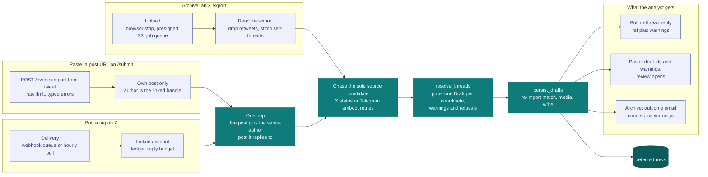

# Ingestion: a post becomes an event

One detection engine, three entries. The bot, the pasted-tweet import and the archive backfill read the same grammar, resolve through the same core and write through the same path, so a fix on one reaches all three. This page states the engine once, then what each entry adds.

Bordered boxes: specific to one entry. Filled boxes: shared by every entry.

- The engine is [`resolve_threads`](../backend/app/services/tweet_ingest/resolve.py) (threads in, one `Draft` per coordinate out, plus warnings and refusals, no I/O) and [`detection.persist_drafts`](../backend/app/services/detection.py) (the one write path from a draft to a `detected` row).
- What the engine reads is [the contract](#the-contract), and the [grammar table](#grammar-table) pins it shape by shape.
- The entries are [the bot](#the-bot), [the pasted-tweet import](#the-pasted-tweet-import) and [the archive backfill](#archive-formats).
- The analyst-facing projection is [`/import`](../frontend/src/app/import/page.tsx), one section per entry (`#bot`, `#paste`, `#archive`). `/bot` and `/archive` redirect into it.

**Module layout.** [`tweet_ingest/`](../backend/app/services/tweet_ingest) splits on whether a module fetches. `records`, `extract`, `stitch` and `resolve` derive and fetch nothing, and `urls` is the URL vocabulary they read, the one place a post URL is written back from an id. `syndication` is the X read, `chase/` holds the chase step and one chaser per technology behind one dispatcher, `acquire` is the live one-hop acquisition, `archive` reads the export off disk, and `retry` is the schedule every fetch runs under. [`test_ingest_boundaries.py`](../backend/tests/test_ingest_boundaries.py) pins the direction: no pure module imports `syndication`, and inside the package only `acquire` imports `chase/`.

## The contract

Every derived field is either correct or empty. A field fills only on an explicit signal in the analyst's own text.

**Acquisition.** The two live entries read their thread through `acquire_thread` in [`acquire.py`](../backend/app/services/tweet_ingest/acquire.py): the post named by a tweet ID, plus the post it replies to when that parent has the same author. One hop, never across authors. So the analyst can post the coordinate and reply to themselves with the source link, and provenance (`detected_from_url`) anchors on the parent whichever of the two the entry was pointed at. The acquisition runs the chase, so resolution does no I/O. The archive backfill reads its threads from the export, which carries every reply edge inline, and chases each stitched thread the same way.

**Attribution.** A draft is owned by the existing Vidit account whose `x_handle` an admin linked, and [`detection.linked_owner`](../backend/app/services/detection.py) is the one map from a handle to that account. No entry creates a user, and none falls back onto the Vidit username. The link binds to the invite code at mint time and copies onto the account at registration; `PATCH /admin/users/{id}/x-handle` (see [`api.md`](api.md)) repairs and backfills it, and self-serve linking is a later gate (see [`planning/next.md`](../planning/next.md)). A post quoting someone else's footage credits the importer, the quoted post stays `source_url`, and contested attribution goes through the claim/dispute pipeline.

**Retweet.** A post whose text opens with `RT @<handle>:` produces nothing: its words belong to another account. `extract.is_retweet` anchors the prefix at the start of the text, so text mentioning RT further in is kept. [`archive.py`](../backend/app/services/tweet_ingest/archive.py)'s `read_tweets` drops the entry before stitching, which costs no thread, since a retweet is never anyone's reply parent.

**Coordinate.** A coordinate counts only in the analyst's own text: the post, its same-author parent, the archive self-thread. Four extractors run over that text ([`extract.py`](../backend/app/services/tweet_ingest/extract.py)), in order:

| Form | Example |
|---|---|
| Decimal pair | `48.012345, 37.802411` |
| Decimal degrees plus hemisphere | `33.1°N 35.5°E`, `N48.0123 E37.8024` |
| DMS | `48°00'45"N 37°48'08"E` |
| Google Maps `@lat,lng` | `google.com/maps/@48.0123,37.8024,15z` |

Position in the line does not matter, and there is no candidate cap. Every coordinate found makes one draft, deduplicated on six decimal places, and a thread yielding several raises `several_coordinates`. A coordinate-shaped string outside the world is dropped under its own refusal code, `coords_invalid`.

**Source.** Every link the thread carries is a candidate, whatever its host: an X status, a Telegram post, a YouTube video, a TikTok, an Instagram reel and a news article all qualify. Three links point at no footage and are excluded: a status link back to the analyst's own post, an X link naming no status (a profile, a search), and a Google Maps link, which is where the coordinate came from.

A quote outranks links: when the thread quotes **one** post, that post is the source and its date comes free. Otherwise the thread's **one** candidate is the source. A quote is itself a candidate, so two quoted posts are two candidates. Several candidates leave `source_url` empty, land every candidate in the [secondary source links](#secondary-source-links) and raise `source_ambiguous`. No candidate and no quote raises `source_missing`. The thread's own permalink is provenance (`detected_from_url`), never the source.

**The chase.** One chase step runs once a thread's records are built, and it spends at most one fetch on that thread ([`chase_thread`](../backend/app/services/tweet_ingest/chase/__init__.py)). A quote names the target by post id, and only when the records do not already carry the quoted post: syndication embeds the post, and an export joins a quote of a post it also holds, so only a quote pointing outside the export is left to fetch. Failing a quote, the thread's sole candidate names the target by URL, and a chase that comes back authored by the thread's own author is a cross-reference, never footage. A thread whose quote is already served, and an ambiguous thread, chase nothing.

The host of a candidate decides what gets *fetched*, never what gets *stored*: one module per technology answers for its own hosts and one dispatcher asks them in turn ([`chase/`](../backend/app/services/tweet_ingest/chase)), so the caller hands over a target and places what comes back without naming a technology. An X status resolves through syndication ([`chase/x.py`](../backend/app/services/tweet_ingest/chase/x.py)) for the author, the post date and the media. A public `t.me/<channel>/<id>` post resolves through its embed ([`chase/telegram.py`](../backend/app/services/tweet_ingest/chase/telegram.py)) for the post date, plus the media when the embed serves it; a sensitive post serves neither. Every other candidate fills `source_url` link-only.

Every chase is fail-soft: a refusing upstream reads as "no footage", never as a failed import. Each chaser answers one of four outcomes (`chased`, `not_accessible`, `transient_failure`, `no_target`), stamped on the record that declared the target. Only the transient one changes what the analyst is told: the draft carries `source_fetch_failed` instead of `source_footage_missing`.

**Retries.** Every outgoing fetch shares one schedule ([`retry.py`](../backend/app/services/tweet_ingest/retry.py)): three attempts, pausing 1 s then 3 s, never sleeping more than 6 s in total, honouring a longer `Retry-After` within that budget. Only a throttled or unreachable upstream earns a retry; a post that is gone, a restricted one and a payload that will not parse come back on the first attempt.

**Media format.** An imported photo is re-encoded at ingest to `records.PHOTO_CONTENT_TYPE`, the format the display derivatives (`_hero`, `_thumb`) use, so no entry derives a photo's type from a payload field or a filename. Videos are stored as fetched, the mp4 variant every payload reader picks. The per-media caps (`MAX_IMAGE_SIZE`, `MAX_VIDEO_SIZE`) apply to the fetched bytes, before the re-encode; over-cap media is skipped and the draft still lands.

**Media split.** The source slot takes the media of the post the source names and nothing else: the quoted post that filled `source_url`, never another quoted post the thread carries, whose media is dropped rather than filed as annotation. With no quote in the thread, a chased Telegram embed's media fills the slot. When both leave it empty, the thread's **first own video** fills it, and every other own media stays `role=proof`. The promotion moves media only, so a video-only draft still declares no source. Photos are never promoted: the proof document embeds images only, so a video left in the annotation slot is dropped at persistence.

**Title.** The first line that carries text beyond coordinates and links, taken verbatim, whitespace collapsed, cut at 120 characters on a word boundary. A line qualifies when something is left of it once every coordinate token, every URL token and the punctuation and list markers around them are removed. Nothing is stripped out of the line that qualifies: a hashtag, a mention, a link or a coordinate inside it stays. No line qualifying leaves the title empty for the analyst to type at review.

**Proof.** The thread's raw text, with each link's `t.co` wrapper expanded back to the real URL. Two things go: the wrappers X appends for the post's own attached media, which expand to a permalink of the post itself, and the bot's `@handle` where it opens a line. Nothing else, and the coordinate line stays. The analyst edits the proof at review.

### Secondary source links

`secondary_source_urls` ([`resolve_secondary_sources`](../backend/app/services/tweet_ingest/resolve.py)) holds the candidates the source slot did not take, in order, normalized and capped at the write-path ceiling (see [`api.md`](api.md#post-events)). When several candidates competed, every one of them lands here so the analyst promotes one at review.

Two links count as one when they share an identity. An X status keys on its status ID, so `x.com`, `twitter.com`, trailing-slash and query variants of one status are one link. Every other host keys on host plus path plus the query minus tracking parameters (`utm_*`, `si`, `s`, `t`, `ref*`, `feature`, `fbclid`, `gclid`, `igshid`): `watch?v=AAA` and `watch?v=BBB` are two links, `watch?v=AAA&si=…` is one link shared twice. The candidate whose identity matches the resolved `source_url` is excluded.

### Warnings

An import pass returns the drafts it wrote plus what those drafts still need from their owner. A warning is not a refusal: the draft lands either way, and review answers it. Two halves raise them, and `Outcome.warnings` counts both together, one count per code over the drafts of the pass. The engine raises what it could not settle from the post:

| Warning | Raised when |
|---|---|
| `source_ambiguous` | Several candidate links, so `source_url` stayed empty and all of them landed as secondary links. |
| `source_missing` | No candidate link and no quote. |
| `several_coordinates` | One thread carried several coordinates, so it produced one draft each. |

`persist_drafts` raises what the row it wrote ended up with, on every created or updated row:

| Warning | Raised when |
|---|---|
| `source_footage_missing` | No `role=source` media landed: a link-only source, a media-less or restricted source post, or a fetch that came back short. |
| `source_fetch_failed` | Same empty source slot, but the chase died on an upstream that would not answer, the retries already spent. The footage may well exist, so importing the post again later is a repair; the two footage codes never appear together. |
| `source_date_unknown` | The source's post date came back unknown, so the provisional event date anchors on the analyst's own post alone. |
| `duplicate_media` | The row's media already exists on another event, by exact `Media.sha256` equality against every event outside the pass. |

The footage and date warnings are dropped on a draft that already carries `source_ambiguous` or `source_missing`, since an empty source slot already says why there is neither footage nor date. A warning counts the created and updated rows only, so a pass that wrote nothing reports no warnings.

Three refusals are all the engine can tell apart: `post_unreadable` (X served no body), `coords_missing` (the analyst's own text carries no coordinate) and `coords_invalid` (a coordinate-shaped string sat outside the world).

Each entry surfaces the set its own way: the bot in its [reply](#the-bot), the paste in its response ([`api.md`](api.md#post-eventsimport-from-tweet)), the archive as counts in its [outcome email](#archive-import-worker). The bot and the paste name a refusal back; the archive reports counts, since an export refusing several threads for different reasons would be picking a winner.

**One sentence per code.** Every code has exactly one wording, in `resolve.WARNING_MESSAGES` and `REFUSAL_MESSAGES`, and every surface reads it. A code added without a sentence fails `test_engine_copy`. Branch on the code, which is stable; the sentence is prose.

**Coverage is text-only.** Coordinates are read from post text and nothing else. Measured on a 48.5k-tweet external OSINT corpus (853 analysts), this recovers about 86% of the geolocations at about 0% false positives. The remaining 14% carry the coordinate only inside the image, which would take vision over every backfilled media item to read and is out of scope. The import panel states the limit when a pasted post produces no draft.

## Grammar table

Each row is one input shape and the outcome the engine produces for it. The bot, the pasted-tweet import and the archive backfill read one grammar, so all three produce the row's outcome, and a change that splits an entry off shows up here as a row that stops matching.

Reading the cells:

- A shape in backticks names the fixture that pins the row, under [`tests/ingest_contract/`](../backend/tests/ingest_contract/).
- A refusal carries the code the bot's failure reply names.
- Outcomes read with the chase on, which is how the import worker runs the archive.
- Where an entry cannot reach a shape, the outcome says so.
- The proof, the title and the empty-source and several-coordinates warnings apply to every row and stay out of the cells (see [the contract](#the-contract)).

| Input shape | Outcome |
|---|---|
| No coordinate anywhere (`no_coord`) | `0`, no coordinate (`coords_missing`) |
| Coordinate inside prose, no link and no quote (`referenceless_annotation`) | 1 draft, source empty |
| Coordinate inside prose behind an `@mention` prefix (`mention_prefix`) | 1 draft, source empty |
| Coordinate alone on its line, or beside its maps link, no other link and no quote | 1 draft, source empty, title empty |
| Two coordinates inside prose (`multi_coord`) | 2 drafts |
| Four or more coordinates in the text | one draft per coordinate |
| Hemisphere or DMS coordinate | 1 draft |
| Google Maps `@lat,lng` link carrying the only coordinate | 1 draft |
| Coordinate out of bounds and nothing else | `0`, coordinate out of bounds (`coords_invalid`) |
| Coordinate only in the quoted post (`quote_coord_in_quoted`) | `0`, no coordinate (`coords_missing`) |
| `T:` / `C:` / `S:` marker lines | 1 draft, the markers kept as text |
| `Source:` line naming one of two links | 1 draft, source empty, two mirrors |
| Two links, no `Source:` line | 1 draft, source empty, two mirrors |
| Sole link off the chase vocabulary (TikTok, Instagram, an article) | 1 draft, source is the link |
| Sole X profile link (`x_profile_link`) | 1 draft, source empty |
| Sole Google Maps link | 1 draft, source empty |
| Sole link back to the analyst's own status | 1 draft, source empty |
| Quote plus one other link | 1 draft, source is the quote, one mirror |
| Two quotes in one thread (`two_quotes`) | 1 draft, source empty, both quoted statuses as mirrors, no source media |
| Sole X status link (`x_status_link`) | 1 draft, source is the chased status, with its date and video |
| Sole Telegram link (`telegram_link`) | 1 draft, source is the link, with the chased date and media |
| Sole YouTube link (`youtube_link`) | 1 draft, source is the link |
| Own-status link, profile link and one third-party status (`self_reference_link`) | 1 draft, source is the third-party status |
| Coordinate in the post, quoted post carries a photo (`quote_coord_in_op`) | 1 draft, source is the quote, its photo as source media |
| Coordinate in the post, quoted post carries a video (`quoted_video`) | 1 draft, source is the quote, its video as source media |
| Own video, coordinate, no link and no quote (`self_video_no_signal`) | 1 draft, source empty, the video as source media |
| Coordinate in the post, source link in the analyst's own reply (`self_reply_geo_then_source`) | 1 draft, source is the reply's link |
| Self-thread, video in the head, coordinate in the reply (`self_thread`) | 1 draft, source empty, the head video as source media; archive only, `n/a` for the two live entries |
| Parent by another author carries the coordinate | `0`, no coordinate (`coords_missing`); `n/a` for the archive, whose export holds the analyst's own tweets only |
| Retweet, text opening `RT @<handle>:` | `0`, dropped; the archive drops it before detection, the live entries read no coordinate (`coords_missing`) |

The `self_thread` fixture ships export entries rather than syndication bodies, so the two live entries cannot be pointed at it. The same two-post shape reaches them through the one-hop acquisition, which the `self_reply_geo_then_source` row covers.

## `detected`: a partial draft by definition

A machine-produced event starts in the `detected` status, and a `detected` row may lack a `source_url`, a source media item, or a location.

Which entry produced the draft is recorded as `detected_via` (`bot`, `paste` or `archive`), stamped once at creation and read-only on the wire. The detections queue shows it beside the event date and the source host.

A `detected` row is **public on every read surface from the moment it lands**, badged as a machine draft and attributed to the importing account (see the `EventStatus` block in [`event.py`](../backend/app/models/event.py)). Review gates the vouching, not the visibility. The owner either completes the draft and promotes it to `geolocated`, or rejects it, which closes the row (`before_closed_status = 'detected'`) and takes it off the read surfaces.

The source requirement applies at promotion. `services/events.geolocate` rejects the transition with `source_url_required` (400) when no `source_url` is set, matching the `ck_events_source_url_status` CHECK constraint: `requested` and `geolocated` rows always carry a `source_url` (see [`data-model.md`](data-model.md#events)). A human submit or edit requires a source URL at the form level, so the invariant holds on every path.

## The bot

The bot adds a delivery and a reply on top of the engine. It reads no grammar of its own, and [`/import#bot`](../frontend/src/app/import/page.tsx) states the same rules for analysts.

**Delivery: webhook nominal, poll reconciliation.** Two paths feed one per-mention pipeline ([`bot.py`](../backend/app/services/bot.py) `process_single_mention`). X POSTs each mention to the signature-verified [`/webhooks/x`](api.md#webhooks), which queues it in [`bot_webhook_events`](data-model.md#bot_webhook_events), and the always-on [import worker](#archive-import-worker) drains that queue between archive passes, so a tag gets answered in seconds. The hourly poll ([`run_bot.py`](../backend/scripts/run_bot.py)) is the reconciliation net: it pulls the mentions timeline newer than the last processed ID (the paid read, see [`x_api.py`](../backend/app/services/x_api.py)) and catches what the webhook dropped.

**Pipeline, per mention.** Acquire the tagged post and its same-author parent (`acquire_tagged_thread`), run `resolve_threads` and `detection.persist_drafts`, then record the mention in the [`bot_mentions`](data-model.md#bot_mentions) ledger, whatever the outcome. The ledger is the idempotency guarantee across both paths: whichever path sees a mention first records it and the other counts it as handled, so a mention is processed, billed and answered at most once. The poll's `since_id` derives from the ledger, so a mid-pull crash resumes where it stopped. A `failed` row retries only when an operator deletes it. A mention from a handle with no [linked account](#the-contract) is ledgered `no_account` and produces nothing: no user row, no draft, no reply. The tag itself is the consent for sync. When syndication refuses the tagged post outright, because it is deleted, protected, age-restricted or withheld, the mention lands `no_detection` and the failure reply names the restriction.

**Response model.** The in-thread reply is the only gesture the bot makes: no like, no retweet. Every reply is billed, so replies are budget-capped over a trailing-hour wall-clock window, in total and per author, seeded from the `bot_mentions` ledger so the caps hold across drain passes and worker restarts. Past a cap, the draft still lands, since detection is unbilled, and only the reply is skipped and logged.

| Moment | Gesture | Condition |
|---|---|---|
| Drafts created | In-thread reply, opening ✅: the draft count, a bare event ref, one ⚠ line per [warning](#warnings), in one fixed order | Always (budget permitting) |
| No draft created, an open one overwritten | The same ✅ reply, reading *updated* rather than *saved* and naming the draft it landed on | Always (budget permitting). A tag on a post the analyst edited since importing it is an answered tag, ledgered `updated` |
| Nothing created | The same shape with an ❌ header and one ⚠ line naming the [refusal](#warnings); no recited lesson and no fix recipe (the guide lives behind the bio link) | Author linked AND the tagged tweet is not itself a reply to the bot (the loop guard: a courtesy answer to the bot's own reply auto-mentions it and must not earn another reply, forever) |
| Nothing created because the write path raised on every draft | The same ❌ reply, its ⚠ line stating that the case is unexpected and naming the admin contact | The same two conditions |
| Anything else | Nothing | A tag that matched a row and moved nothing on it (`skipped`), plus `no_account` and every unlinked author, stay fully silent |

Re-tagging repairs no warning, since it lands on the existing idempotency key and deduplicates; review does.

Reply text is **linkless**: X bills a link-carrying post about 13 times a plain one, so the clickable link lives in the bot bio and no reply carries a URL or an auto-linkable domain. Every reply is **unique per mention**, using the success reference and a short mention tail on failures, since X refuses a tweet identical to a recent one (403 duplicate content); that 403 is logged without paging anyone.

Deployment, the webhook runbook and the CRC operator notes: see [`engineering.md`](engineering.md#scheduler-services) and [`engineering.md`](engineering.md#x-webhook-operations).

## The pasted-tweet import

An analyst pastes a post URL into the submit form and `POST /events/import-from-tweet` creates the drafts the post carries, one per coordinate, owned by the analyst. The response returns the created, updated and skipped ids plus the [warnings](#warnings) review has to answer, and the browser opens the first draft. The request and response contract is [`api.md`](api.md#post-eventsimport-from-tweet).

**Own posts only.** The post's author must resolve to the caller's own [linked account](#the-contract); anything else answers `not_your_post`, and a third party's footage goes through the plain submit form with a `source_url`. The check runs on the pasted post alone, before the rest of the hop: a caller with no linked handle is refused before any fetch, and a caller pasting someone else's post after the one read of that post, so neither the parent hop nor the chase spends the shared syndication budget on a post that is not the caller's. A post X serves to nobody answers `post_unreadable`.

## Archive formats

An X "Download your data" export exposes the analyst's own reply edges and inline media, which syndication alone does not carry. The archive backfill accepts:

- **Self-threads**: reply chains stitched back together through the reply-to edges, ordered by `created_at`, then by tweet ID ascending. The export holds only the analyst's own tweets, so every stitched record already shares the analyst's authorship, and the backfill reads a self-thread's combined text exactly as it reads a single tweet's. An export stores timestamps at second precision and lists tweets newest first, so when a reply is posted in the same second as its parent, the ID settles which one is the head: snowflake IDs are chronological at millisecond precision. The head anchors provenance, the title and the event date.
- **Quotes of the analyst's own tweets**: resolved by an in-archive join, so the join runs whether or not chasing is enabled.
- **Third-party quotes and status links**: resolved by [the chase](#the-contract) over the stitched thread, when chasing is enabled for the import. With the chase off (the pure-disk read), the link is still the source, stored link-only.
- **Photos and videos**: each media entry names the file the export wrote under `tweets_media/`, and video capture takes the highest-bitrate mp4 variant the export saved.

## Archive import worker

**The upload goes direct to storage, never through the API.** The browser strips the export down to the allowlist, then calls `POST /events/import-archive/presign` for a staging key (`archive-imports/<user_id>/<uuid>.zip`; the owner ID in the path binds the key to the caller) plus a presigned S3 POST policy (exact key, `application/zip`, a size guard, 15-minute expiry; the dev upload endpoint stands in for it against local storage, using the same form shape). The browser POSTs the zip there itself, then enqueues it by key: the JSON `POST /events/import-archive` call HEAD-verifies the staged object and inserts an [`archive_import_jobs`](data-model.md#archive_import_jobs) row. The archive size limit is therefore not an HTTP body cap, and `api.vidit.app` sits behind Cloudflare's free-plan 100 MB request cap for read-surface protection.

**Limits.** The product limits are the per-media caps applied at persistence (see [the contract](#the-contract)); the archive-level numbers in [`archive_zip.py`](../backend/app/services/tweet_ingest/archive_zip.py) are guards, not policy. The staged zip is capped at 4 GB, under S3's 5 GB single-part POST ceiling, and enforced by the browser strip, the POST policy, the enqueue HEAD check, and again at claim time. The uncompressed archive is capped at 8 GB total and 200 MB per file, an anti-zip-bomb guard sized to never bind a legitimate export.

**Postgres is the queue.** [`archive_jobs.py`](../backend/app/services/archive_jobs.py) claims the oldest runnable row with `FOR UPDATE SKIP LOCKED`, safe under concurrent workers and the pattern the bot's webhook queue drains with too. It stamps the row `running`, re-checks the staged object's size (the presign window outlives the enqueue), downloads the zip, and runs the hardened extract-and-backfill attributed to the job's owner.

**The owner gate, before anything is downloaded.** A job runs only for a live, active account carrying a linked `x_handle` (see [Attribution](#the-contract)). A job whose owner was soft-deleted, deactivated or left without a handle lands `failed`, so a suspended account accrues no drafts. The terminal states are `done`, with assemble counts stamped, and `failed`, with a terse `error`. Both delete the staged object, so no live object accumulates: the bucket's versioning keeps a noncurrent copy until the lifecycle rule expires it (see [`engineering.md`](engineering.md#deployment)). Zip-shape validation happens only here; a malformed upload lands `failed` and triggers the failure email, and the browser strip catches the common shapes before upload.

**Crash recovery.** A worker killed mid-job leaves its row `running`, and the row becomes claimable again once `started_at` is older than the stale window (30 minutes). `started_at` doubles as a liveness heartbeat, re-stamped every 5 minutes while the job runs, so a long import never crosses the window while it is alive and a reclaim never races a still-running first run, for example two worker instances overlapping during a rolling deploy. After three attempts, the job lands `failed` as a poison-pill guard. A reclaimed, half-applied run duplicates nothing, because the matching rule below holds every row the first pass wrote.

### Re-import

A detection is matched against the importing owner's own rows on the provenance leg plus the coordinate, and on `(source_url, coordinate)` when the detection declares a source. The coordinate compares to six decimal places, the rounding the extraction dedups on. The source URL leg collapses the delete-and-repost shape: two provenance posts declaring the same footage at the same coordinate are one draft.

The provenance leg is the thread's post IDs, not a URL and not the anchor alone. Not a URL, because one post spells the same URL several ways (`x.com` or `twitter.com`, the handle in any case, the handle-less `/i/web/status/` form), which would split one geolocation across two drafts; `detected_from_url` stays as the display value, written from the ID at the engine's exit (see [`data-model.md`](data-model.md#events)). Not the anchor alone, because the entries anchor differently on one thread: in a 3-post self-thread A→B→C carrying the coordinate in C, the archive anchors on A while a bot tag or a paste on C reads [one hop](#the-contract) and anchors on B. Each row therefore stores every post ID of the thread it was read from (`events.detected_thread_tweet_ids`), and a detection matches when the incoming thread's IDs intersect a stored set, whichever entry ran first. A row carrying no stored set matches on its anchor ID alone.

What happens to a matched row depends on what the row is. [`detection._row_disposition`](../backend/app/services/detection.py) holds the matrix:

| Matched row | Outcome |
|---|---|
| Soft-deleted (`deleted_at`) | Skipped. An admin removal stands; a re-import never brings the event back. |
| Withheld (`hidden_at`) | Skipped, whatever its status. A takedown freezes the row for its owner too. |
| `geolocated` | Skipped. A machine never overwrites published work. |
| `detected` | Updated in place. |
| `closed` | Skipped. A rejected detection stays rejected, so nobody rejects the same post twice. |
| No match | A new `detected` row. |

**What an update rewrites.** The row keeps its id, its owner, its `created_at` and `detected_at` stamps, its provenance (`detected_from_tweet_id`, `detected_from_url`, `detected_thread_tweet_ids` and `detected_via`), and its place in the review queue. Provenance says where the draft first came from, so a bot tag landing on a draft the archive created updates it and still reads `archive`. The import overwrites what it owns: the title, the coordinate, the event date, `source_url`, the [secondary source links](data-model.md#event_source_links), `source_posted_at`, `detected_post_at`, the proof document, and the media. Every field edit is welded to the `geolocated` promotion, so an open draft carries no analyst work to lose. The one artifact an analyst can attach to a draft is an [archived copy](archival.md), and those survive the update: if the update moves `source_url`, the copy filed as the source is re-filed under another link the row still carries, or dropped when the row carries it nowhere.

**A short fetch keeps the stored media.** A media the fetch cannot turn into bytes leaves the resolution short of what the post declares, and a short list reads exactly like a post whose media is gone. So a re-import that resolves less than the post carries leaves the row's media as it stands, uploads nothing and sweeps nothing; the other fields still update, and a pass that moves nothing else counts the row `skipped`.

**An unchanged post writes nothing.** Every field is compared before it is written, and media by SHA-256, so re-running the same export leaves `updated_at` where it was, uploads no bytes and creates no storage objects. Such a row counts `skipped`, not `updated`.

**Email.** The job typically finishes after the analyst has navigated away, so the worker emails the outcome. On success, the email carries the counts (created, updated, skipped, failed, each a disjoint bucket), then how many drafts carry each of the [warnings](#warnings) under a "what to look at first" heading, and a link to the Detections queue. The warning counts cover the created and updated drafts, so they cut across two of the four buckets and sit apart from them. On failure, the email carries a retry-safe failure notice. The upload page also polls `GET /events/import-archive/{job_id}` while it stays open.

**Runner.** The worker polls the queue forever, with a 5-second idle sleep and one fresh session per pass. Each pass also drains the bot's [`bot_webhook_events`](data-model.md#bot_webhook_events) queue (see [The bot](#the-bot)). Set `IMPORT_WORKER_ONCE=1` to run a single drain-and-exit pass over both queues, by hand or as a cron fallback.

Deployment: see [`engineering.md`](engineering.md#scheduler-services).

## See also

- [`api.md`](api.md#post-eventsimport-from-tweet) for the `import-from-tweet` and `import-archive` request/response contracts.
- [`data-model.md`](data-model.md#events) for the `events` table columns and CHECK constraints.
- [`engineering.md`](engineering.md#scheduler-services) for the Railway services the bot and the import worker run as, and [`engineering.md`](engineering.md#x-webhook-operations) for the webhook runbook.
- [`archival.md`](archival.md) for the archived copies an analyst records against an event's links.
- [`conflicts.md`](conflicts.md) for the conflict referential the daily sync feeds.
