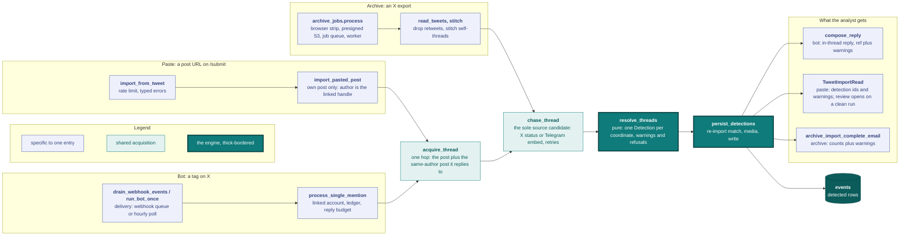
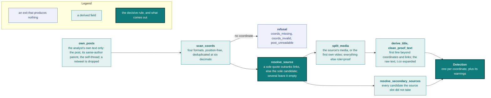
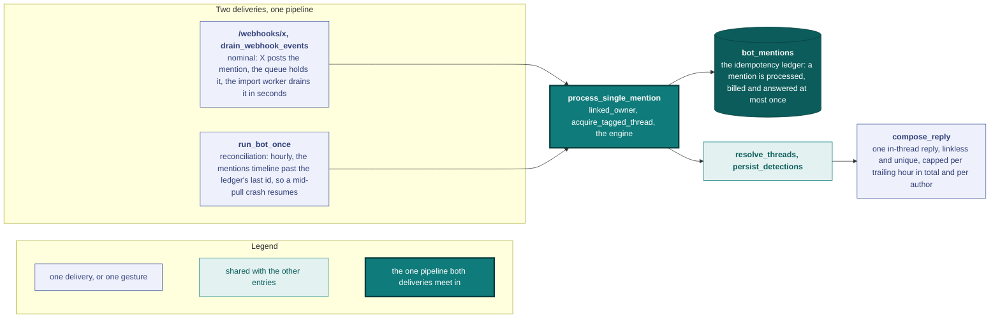
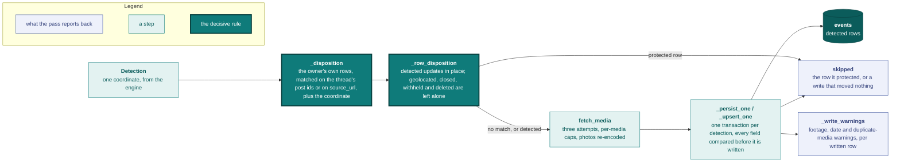

# Ingestion: a post becomes an event

One detection engine, three entries. The bot, the pasted-tweet import and the archive backfill resolve through the same core and write through the same path, so a fix on one reaches all three.

`Detection` is the only shape travelling between [`resolve_threads`](../backend/app/services/tweet_ingest/resolve.py) and [`detection.persist_detections`](../backend/app/services/detection.py). Each region of the diagram has a section below: [the contract](#the-contract) is what the engine reads, the [grammar table](#grammar-table) pins it shape by shape, and the entries are [the bot](#the-bot), [the pasted-tweet import](#the-pasted-tweet-import) and [the archive backfill](#archive-formats). The analyst-facing projection is [`/import`](../frontend/src/app/import/page.tsx), one section per entry (`#bot`, `#paste`, `#archive`); `/bot` and `/archive` redirect into it.

**Module layout.** [`tweet_ingest/`](../backend/app/services/tweet_ingest) splits on whether a module fetches: `records`, `extract`, `stitch` and `resolve` fetch nothing, and `urls` is the URL vocabulary they read, the one place a post URL is written back from an id. `syndication` is the X read, `chase/` holds one chaser per technology behind one dispatcher, `acquire` is the live one-hop acquisition, `archive` reads the export off disk, and `retry` is the schedule every fetch runs under. [`test_ingest_boundaries.py`](../backend/tests/test_ingest_boundaries.py) pins the direction: no pure module imports `syndication`, and only `acquire` imports `chase/`.

## The contract

Every derived field is either correct or empty. A field fills only on an explicit signal in the analyst's own text.

**In**: the threads the entry acquired. One hop and never across authors ([`acquire.py`](../backend/app/services/tweet_ingest/acquire.py)), so an analyst posts the coordinate and replies to themselves with the source link, and provenance anchors on the parent whichever of the two the entry was pointed at. The archive reads its threads from the export, which carries every reply edge inline. Acquisition runs [the chase](#the-chase), so resolution does no I/O.

**Out**: one `Detection` per coordinate, or one refusal for the thread. `post_unreadable` (X served no body), `coords_missing` (no coordinate in the analyst's own text) and `coords_invalid` (a coordinate-shaped string outside the world) are all the engine tells apart.

Each derived field fills on a signal in that text, or stays empty:

| Field | Rule |
|---|---|
| Coordinate | Four extractors ([`extract.py`](../backend/app/services/tweet_ingest/extract.py)) run in the order below; position in the line does not matter and there is no cap. Several coordinates make several detections and raise `several_coordinates`. |
| `source_url` | Every link is a candidate whatever its host, minus three that point at no footage: a status link back to the analyst's own post, an X link naming no status, and a Google Maps link, which is where the coordinate came from. A quote is itself a candidate, so two quoted posts are two candidates. Several candidates raise `source_ambiguous` and all of them land in the [secondary source links](#secondary-source-links); none raises `source_missing`. |
| `detected_from_url` | The thread's own permalink. Provenance, never the source. |
| Source media | The media of the post the source names and nothing else, so another quoted post's media is dropped rather than filed as annotation. One `role=source` media per event (`uq_media_source_per_event`); with no quote, the chased post's media fills the slot, else the thread's first own video. Photos are never promoted: the proof document embeds images only, so a video left in the annotation slot is dropped at persistence. |
| Title | Cut at 120 characters on a word boundary. Nothing inside the qualifying line is stripped, so a hashtag, a mention, a link or a coordinate inside it stays. No line qualifying leaves it empty for review. |
| Proof | The raw text minus two things: the `t.co` wrappers X appends for the post's own attached media, and the bot's `@handle` where it opens a line. |
| Stored media | Photos re-encoded to `records.PHOTO_CONTENT_TYPE`, the format the display derivatives (`_hero`, `_thumb`) use, so no entry reads a photo's type off a payload field or a filename; videos stored as fetched, the mp4 variant every payload reader picks. `MAX_IMAGE_SIZE` and `MAX_VIDEO_SIZE` apply to the fetched bytes, before the re-encode, and over-cap media is skipped while the detection still lands. |

| Coordinate form | Example |
|---|---|
| Decimal pair | `48.012345, 37.802411` |
| Decimal degrees plus hemisphere | `33.1°N 35.5°E`, `N48.0123 E37.8024` |
| DMS | `48°00'45"N 37°48'08"E` |
| Google Maps `@lat,lng` | `google.com/maps/@48.0123,37.8024,15z` |

**Retweet.** `extract.is_retweet` anchors the `RT @<handle>:` prefix at the start of the text, so text mentioning RT further in is kept. [`archive.py`](../backend/app/services/tweet_ingest/archive.py)'s `read_tweets` drops the entry before stitching, which costs no thread: a retweet is never anyone's reply parent.

**Attribution.** A detection is owned by the existing Vidit account whose `x_handle` an admin linked ([`detection.linked_owner`](../backend/app/services/detection.py), the one map from a handle to an account), and no entry creates a user. The link binds to the invite code at mint time and copies onto the account at registration; `PATCH /admin/users/{id}/x-handle` (see [`api.md`](api.md)) repairs and backfills it, and self-serve linking is a later gate (see [`planning/next.md`](../planning/next.md)). A post quoting someone else's footage credits the importer, and contested attribution goes through the claim/dispute pipeline.

**Coverage is text-only.** On a 48.5k-tweet external OSINT corpus (853 analysts), reading coordinates from post text recovers about 86% of the geolocations at about 0% false positives. The remaining 14% carry the coordinate only inside the image, which would take vision over every backfilled media item and is out of scope. The import panel states the limit when a pasted post produces no detection.

### The chase

One chase step runs per thread and spends at most one fetch ([`chase_thread`](../backend/app/services/tweet_ingest/chase/__init__.py)). A quote names the target by post id, and only when the records do not already carry it: syndication embeds the quoted post and an export joins a quote of a post it also holds, so only a quote pointing outside the export is left to fetch. Failing a quote, the thread's sole candidate names the target by URL, and a chase that comes back authored by the thread's own author is a cross-reference, never footage. A thread whose quote is already served, and an ambiguous thread, chase nothing.

The host decides what gets *fetched*, never what gets *stored*: one module per technology answers for its own hosts and one dispatcher asks them in turn ([`chase/`](../backend/app/services/tweet_ingest/chase)).

| Target | Chaser | Fills |
|---|---|---|
| An X status | Syndication ([`chase/x.py`](../backend/app/services/tweet_ingest/chase/x.py)) | The author, the post date, the media |
| A public `t.me/<channel>/<id>` post | Its embed ([`chase/telegram.py`](../backend/app/services/tweet_ingest/chase/telegram.py)) | The post date, plus the media when the embed serves it; a sensitive post serves the date and no media |
| Every other candidate | None | `source_url`, link-only |

Every chase is fail-soft: a refusing upstream reads as "no footage", never as a failed import. Each chaser answers `chased`, `not_accessible`, `transient_failure` or `no_target`, and only the transient one changes what the analyst is told: `source_fetch_failed` instead of `source_footage_missing`.

**Retries.** Every outgoing fetch shares one schedule ([`retry.py`](../backend/app/services/tweet_ingest/retry.py)): three attempts, pausing 1 s then 3 s, never sleeping more than 6 s in total, honouring a longer `Retry-After` within that budget. Only a throttled or unreachable upstream earns a retry; a post that is gone, a restricted one and a payload that will not parse come back on the first attempt.

### Secondary source links

`secondary_source_urls` ([`resolve_secondary_sources`](../backend/app/services/tweet_ingest/resolve.py)) holds the candidates the source slot did not take, in order, normalized and capped at the write-path ceiling (see [`api.md`](api.md#post-events)), so the analyst promotes one at review.

Two links count as one when they share an identity. An X status keys on its status ID, so `x.com`, `twitter.com`, trailing-slash and query variants of one status are one link. Every other host keys on host plus path plus the query minus tracking parameters (`utm_*`, `si`, `s`, `t`, `ref*`, `feature`, `fbclid`, `gclid`, `igshid`): `watch?v=AAA` and `watch?v=BBB` are two links, `watch?v=AAA&si=…` is one link shared twice. The candidate whose identity matches the resolved `source_url` is excluded.

### Warnings

A warning is not a refusal: the detection lands either way, and review answers it. `Outcome.warnings` counts one per code over the detections of the pass, from both halves of the engine. `resolve_threads` raises what it could not settle from the post:

| Warning | Raised when |
|---|---|
| `source_ambiguous` | Several candidate links, so `source_url` stayed empty and all of them landed as secondary links. |
| `source_missing` | No candidate link and no quote. |
| `several_coordinates` | One thread carried several coordinates, so it produced one detection each. |

`persist_detections` raises what the row it wrote ended up with, on every created or updated row:

| Warning | Raised when |
|---|---|
| `source_footage_missing` | No `role=source` media landed: a link-only source, a media-less or restricted source post, or a fetch that came back short. |
| `source_fetch_failed` | Same empty source slot, but the chase died on an upstream that would not answer, the retries already spent. The footage may well exist, so importing the post again later is a repair; the two footage codes never appear together. |
| `source_date_unknown` | The source's post date came back unknown, so the provisional event date anchors on the analyst's own post alone. |
| `duplicate_media` | The row's media already exists on another event, by exact `Media.sha256` equality against every event outside the pass. |

The footage and date warnings are dropped on a detection already carrying `source_ambiguous` or `source_missing`, since an empty source slot already says why there is neither footage nor date. Only created and updated rows count, so a pass that wrote nothing reports no warnings.

The bot names a refusal back in its [reply](#the-bot), and so does the paste in its response ([`api.md`](api.md#post-eventsimport-from-tweet)); the archive reports counts in its [outcome email](#archive-import-worker), since an export refusing several threads for different reasons would be picking a winner. Every code has exactly one wording, in `resolve.WARNING_MESSAGES` and `REFUSAL_MESSAGES`, and every surface reads it; a code added without a sentence fails `test_engine_copy`. Branch on the code, which is stable, not on the sentence.

## Grammar table

Each row is one input shape and the outcome the engine produces for it. The three entries read one grammar, so a change that splits an entry off shows up here as a row that stops matching. A shape in backticks names the fixture that pins the row, under [`tests/ingest_contract/`](../backend/tests/ingest_contract/); a refusal carries the code the bot's failure reply names, and where an entry cannot reach a shape the outcome says so. Outcomes read with the chase on, which is how the import worker runs the archive, and the warnings that apply to every row stay out of the cells.

| Input shape | Outcome |
|---|---|
| No coordinate anywhere (`no_coord`) | `0`, no coordinate (`coords_missing`) |
| Coordinate inside prose, no link and no quote (`referenceless_annotation`) | 1 detection, source empty |
| Coordinate inside prose behind an `@mention` prefix (`mention_prefix`) | 1 detection, source empty |
| Coordinate alone on its line, or beside its maps link, no other link and no quote | 1 detection, source empty, title empty |
| Two coordinates inside prose (`multi_coord`) | 2 detections |
| Four or more coordinates in the text | one detection per coordinate |
| Hemisphere or DMS coordinate | 1 detection |
| Google Maps `@lat,lng` link carrying the only coordinate | 1 detection |
| Coordinate out of bounds and nothing else | `0`, coordinate out of bounds (`coords_invalid`) |
| Coordinate only in the quoted post (`quote_coord_in_quoted`) | `0`, no coordinate (`coords_missing`) |
| `T:` / `C:` / `S:` marker lines (`marker_lines`) | 1 detection, the markers kept as text |
| `Source:` line naming one of two links | 1 detection, source empty, two mirrors |
| Two links, no `Source:` line | 1 detection, source empty, two mirrors |
| Sole link off the chase vocabulary (TikTok, Instagram, an article) | 1 detection, source is the link |
| Sole X profile link (`x_profile_link`) | 1 detection, source empty |
| Sole Google Maps link | 1 detection, source empty |
| Sole link back to the analyst's own status | 1 detection, source empty |
| Quote plus one other link | 1 detection, source is the quote, one mirror |
| Two quotes in one thread (`two_quotes`) | 1 detection, source empty, both quoted statuses as mirrors, no source media |
| Sole X status link (`x_status_link`) | 1 detection, source is the chased status, with its date and video |
| Sole Telegram link (`telegram_link`) | 1 detection, source is the link, with the chased date and media |
| Sole YouTube link (`youtube_link`) | 1 detection, source is the link |
| Own-status link, profile link and one third-party status (`self_reference_link`) | 1 detection, source is the third-party status |
| Coordinate in the post, quoted post carries a photo (`quote_coord_in_op`) | 1 detection, source is the quote, its photo as source media |
| Coordinate in the post, quoted post carries a video (`quoted_video`) | 1 detection, source is the quote, its video as source media |
| Own video, coordinate, no link and no quote (`self_video_no_signal`) | 1 detection, source empty, the video as source media |
| Coordinate in the post, source link in the analyst's own reply (`self_reply_geo_then_source`) | 1 detection, source is the reply's link |
| Self-thread, video in the head, coordinate in the reply (`self_thread`) | 1 detection, source empty, the head video as source media; archive only, `n/a` for the two live entries |
| Parent by another author carries the coordinate | `0`, no coordinate (`coords_missing`); `n/a` for the archive, whose export holds the analyst's own tweets only |
| Retweet, text opening `RT @<handle>:` | `0`, dropped; the archive drops it before detection, the live entries read no coordinate (`coords_missing`) |

The `self_thread` fixture ships export entries rather than syndication bodies, so the two live entries cannot be pointed at it. The same two-post shape reaches them through the one-hop acquisition, which the `self_reply_geo_then_source` row covers.

## `detected`: a partial detection by definition

A machine-produced event starts in the `detected` status and may lack a `source_url`, a source media item, or a location. Which entry produced it is recorded as `detected_via` (`bot`, `paste` or `archive`), stamped once at creation and read-only on the wire.

A `detected` row is **public on every read surface from the moment it lands**, badged as a machine detection and attributed to the importing account (see the `EventStatus` block in [`event.py`](../backend/app/models/event.py)). Review gates the vouching, not the visibility. The owner either completes the detection and promotes it to `geolocated`, or rejects it, which closes the row (`before_closed_status = 'detected'`) and takes it off the map while keeping it in the located catalog as an audit row. `services/events.geolocate` rejects the promotion with `source_url_required` (400) when no `source_url` is set, matching the `ck_events_source_url_status` CHECK constraint (see [`data-model.md`](data-model.md#events)).

## The bot

The bot adds a delivery and a reply on top of the engine. It reads no grammar of its own, and [`/import#bot`](../frontend/src/app/import/page.tsx) states the same rules for analysts.

The webhook is signature-verified ([`/webhooks/x`](api.md#webhooks)) and queues into [`bot_webhook_events`](data-model.md#bot_webhook_events), drained by the always-on [import worker](#archive-import-worker); the poll ([`run_bot.py`](../backend/scripts/run_bot.py)) takes the paid mentions read (see [`x_api.py`](../backend/app/services/x_api.py)).

The [`bot_mentions`](data-model.md#bot_mentions) ledger is written whatever the outcome, so whichever path sees a mention first records it and the other counts it as handled. A `failed` row retries only when an operator deletes it. A mention from a handle with no [linked account](#the-contract) is ledgered `no_account` and produces nothing: no user row, no detection, no reply; the tag itself is the consent for sync. When syndication refuses the tagged post outright, because it is deleted, protected, age-restricted or withheld, the mention lands `no_detection` and the failure reply names the restriction.

**Response model.** The in-thread reply is the only gesture the bot makes: no like, no retweet. Replies are capped per trailing hour, in total and per author, and a reply weighs at most 280 characters in X's units (`bot.py`). The caps default to 40 per hour and 10 per author, and `BOT_MAX_REPLIES_PER_HOUR` and `BOT_MAX_REPLIES_PER_AUTHOR_PER_HOUR` set them per deployment, so you raise them for a traffic spike without a code change. The caps are seeded from the ledger, so they hold across drain passes and worker restarts. Past a cap the detection still lands, since detecting is unbilled, and only the reply is skipped and logged.

| Moment | Gesture | Condition |
|---|---|---|
| Detections created | In-thread reply, opening ✅: the detection count, a bare event ref, one ⚠ line per [warning](#warnings), in one fixed order | Always (budget permitting) |
| No detection created, an open one overwritten | The same ✅ reply, reading *updated* rather than *saved* and naming the detection it landed on | Always (budget permitting). A tag on a post the analyst edited since importing it is an answered tag, ledgered `updated` |
| Nothing created | The same shape with an ❌ header and one ⚠ line naming the [refusal](#warnings); no recited lesson and no fix recipe (the guide lives behind the bio link) | Author linked AND the tagged tweet is not itself a reply to the bot (the loop guard: a courtesy answer to the bot's own reply auto-mentions it and must not earn another reply, forever) |
| Nothing created because the write path raised on every detection | The same ❌ reply, its ⚠ line stating that the case is unexpected and naming the admin contact | The same two conditions |
| Anything else | Nothing | A tag that matched a row and moved nothing on it (`skipped`), plus `no_account` and every unlinked author, stay fully silent |

Re-tagging repairs no warning, since it lands on the existing idempotency key and deduplicates; review does. Reply text is **linkless**, since X bills a link-carrying post about 13 times a plain one, so the clickable link lives in the bot bio. Every reply is **unique per mention**, using the success reference and a short mention tail on failures, since X refuses a tweet identical to a recent one (403 duplicate content); that 403 is logged without paging anyone.

Deployment, the webhook runbook and the CRC operator notes: see [`engineering.md`](engineering.md#scheduler-services) and [`engineering.md`](engineering.md#x-webhook-operations).

## The pasted-tweet import

An analyst pastes a post URL into the submit form and `POST /events/import-from-tweet` creates the detections the post carries, one per coordinate, owned by the analyst. The response returns the created, updated and skipped ids plus the [warnings](#warnings) review has to answer; the browser opens the first created detection when the run raised no warning, and otherwise stays on the page and states what it raised ([`api.md`](api.md#post-eventsimport-from-tweet)).

**Own posts only.** The post's author must resolve to the caller's own [linked account](#the-contract); anything else answers `not_your_post`, and a third party's footage goes through the plain submit form with a `source_url`. The check runs on the pasted post alone, before the rest of the hop, so neither the parent hop nor the chase spends the shared syndication budget on a post that is not the caller's. A post X serves to nobody answers `post_unreadable`.

## Archive formats

An X "Download your data" export exposes the analyst's own reply edges and inline media, which syndication alone does not carry.

| What the export adds | How the backfill reads it |
|---|---|
| Self-threads | Reply chains stitched back through the reply-to edges, ordered by `created_at`, then by tweet ID ascending. The export holds only the analyst's own tweets, so every stitched record already shares the analyst's authorship, and a self-thread's combined text reads exactly as a single tweet's. An export stores timestamps at second precision and lists tweets newest first, so when a reply is posted in the same second as its parent the ID settles which one is the head: snowflake IDs are chronological at millisecond precision. The head anchors provenance, the title and the event date. |
| Quotes of the analyst's own tweets | An in-archive join, so it runs whether or not chasing is enabled. |
| Third-party quotes and status links | [The chase](#the-chase) over the stitched thread, when chasing is enabled. With the chase off (the pure-disk read), the link is still the source, stored link-only. |
| Photos and videos | Each media entry names the file the export wrote under `tweets_media/`, and video capture takes the highest-bitrate mp4 variant the export saved. |

## Archive import worker

```mermaid
flowchart LR
  classDef spec fill:#eef1fb,stroke:#4a5fa5,color:#33417a
  classDef shared fill:#e3f2f1,stroke:#0f7b7a,color:#0b5c5b
  classDef core fill:#0f7b7a,stroke:#083f3e,stroke-width:3px,color:#ffffff
  classDef store fill:#0b5c5b,stroke:#083f3e,color:#ffffff

  subgraph legend [Legend]
    direction LR
    l1["`archive-specific`"]:::spec
    l2["`shared with the other entries`"]:::shared
    l3["`a gate that stops the job`"]:::core
    l1 ~~~ l2 ~~~ l3
  end

  strip["`**the browser strip**
  the export cut down to the allowlist before anything leaves the machine`"]:::spec
  presign["`**POST /events/import-archive/presign**
  key archive-imports/&lt;user_id&gt;/&lt;uuid&gt;.zip, the owner id binding it to the caller; application/zip, size guard, 15 minutes`"]:::spec
  s3[("`**staging bucket**
  the browser POSTs the zip itself, never through the API`")]:::store
  job["`**POST /events/import-archive**
  HEAD-verifies the staged object, inserts an archive_import_jobs row`"]:::spec
  claim["`**claim_next**
  FOR UPDATE SKIP LOCKED, heartbeat every 5 minutes, stale after 30, failed after 3 attempts`"]:::spec
  gate["`**the owner gate**
  live, active, linked handle, checked before the download`"]:::core
  extract["`**archive_zip**
  hardened extract: 4 GB staged, 8 GB uncompressed, 200 MB per file`"]:::core
  read["`**read_tweets, stitch**
  retweets dropped, self-threads stitched, in-archive quote join`"]:::spec
  engine["`**resolve_threads, persist_detections**`"]:::shared
  mail["`**archive_import_complete_email**
  counts and warning counts, or a retry-safe failure notice`"]:::spec

  strip --> presign --> s3 --> job --> claim --> gate --> extract --> read --> engine --> mail
```

The archive-level numbers in [`archive_zip.py`](../backend/app/services/tweet_ingest/archive_zip.py) are guards, not policy; the product limits are the per-media caps.

| Guard | Value | Enforced by |
|---|---|---|
| Staged zip | 4 GB, under S3's 5 GB single-part POST ceiling | The browser strip, the POST policy, the enqueue HEAD check, and again at claim time |
| Uncompressed archive | 8 GB total, 200 MB per file | The extract, an anti-zip-bomb guard sized to never bind a legitimate export |
| Per-media | `MAX_IMAGE_SIZE`, `MAX_VIDEO_SIZE` | Persistence (see [the contract](#the-contract)) |

The zip never crosses the API, so the archive limit is not an HTTP body cap, and `api.vidit.app` sits behind Cloudflare's free-plan 100 MB request cap for read-surface protection. The dev upload endpoint stands in for S3 against local storage, using the same form shape.

**The job row.** [`archive_jobs.py`](../backend/app/services/archive_jobs.py) claims the oldest runnable row, the pattern the bot's webhook queue drains with too, and re-checks the staged object's size, since the presign window outlives the enqueue. The terminal states are `done`, with assemble counts stamped, and `failed`, with a terse `error`; both delete the staged object, and the bucket's versioning keeps a noncurrent copy until the lifecycle rule expires it (see [`engineering.md`](engineering.md#deployment)). A job whose owner was soft-deleted, deactivated or left without a handle lands `failed`, so a suspended account accrues no detections, and so does a malformed upload, which the browser strip catches first and the worker validates last. `started_at` doubles as the liveness heartbeat, so a long import never crosses the stale window while it is alive and a reclaim never races a still-running first run, for example two worker instances overlapping during a rolling deploy. A reclaimed run duplicates nothing, because [re-import](#re-import) matching holds every row the first pass wrote.

**Email and runner.** The job typically finishes after the analyst has navigated away, so the outcome arrives by email: the counts (created, updated, skipped, failed) are disjoint buckets, and the warning counts cut across the created and updated ones, under a "what to look at first" heading above a link to the Detections queue. The upload page also polls `GET /events/import-archive/{job_id}` while it stays open. The worker polls forever, with a 5-second idle sleep and one fresh session per pass, and each pass also drains the bot's [`bot_webhook_events`](data-model.md#bot_webhook_events) queue; `IMPORT_WORKER_ONCE=1` runs a single drain-and-exit pass over both queues, by hand or as a cron fallback. Deployment: see [`engineering.md`](engineering.md#scheduler-services).

### Re-import

The coordinate compares to six decimal places, the rounding the extraction dedups on. The source URL leg collapses the delete-and-repost shape: two provenance posts declaring the same footage at the same coordinate are one detection.

The source URL leg reads the version history as well as the live column. The owner of a published row can correct its [evidence anchor](api.md#post-eventsidversions), and the version that edit files is what still carries the URL the row was imported under, so a re-import of the original post matches the row it already produced instead of creating a second one beside it. A [redacted](api.md#post-admineventsidversionsversion_noredact) version carries no URL, so it matches nothing.

The provenance leg is the thread's post IDs, not a URL and not the anchor alone. Not a URL, because one post spells the same URL several ways (`x.com` or `twitter.com`, the handle in any case, the handle-less `/i/web/status/` form), which would split one geolocation across two detections; `detected_from_url` stays as the display value, written from the ID at the engine's exit. Not the anchor alone, because the entries anchor differently on one thread: in a 3-post self-thread A→B→C carrying the coordinate in C, the archive anchors on A while a bot tag or a paste on C reads [one hop](#the-contract) and anchors on B. Each row therefore stores every post ID of the thread it was read from (`events.detected_thread_tweet_ids`), and a detection matches when the incoming thread's IDs intersect a stored set; a row carrying none matches on its anchor ID alone.

[`detection._row_disposition`](../backend/app/services/detection.py) holds the matrix, and each row states why:

| Matched row | Outcome |
|---|---|
| Soft-deleted (`deleted_at`) | Skipped. An admin removal stands; a re-import never brings the event back. |
| Withheld (`hidden_at`) | Skipped, whatever its status. A takedown freezes the row for its owner too. |
| `geolocated` | Skipped. A machine never overwrites published work. |
| `detected` | Updated in place. |
| `closed` | Skipped, whichever state it left. A rejected detection stays rejected, so nobody rejects the same post twice; a withdrawn request is not the import's to reopen; and a retraction is published work its owner took back, so the published-work rule above keeps holding after the close. |
| No match | A new `detected` row. |

**What an update rewrites.** The row keeps its id, its owner, its `created_at` and `detected_at` stamps, its provenance (`detected_from_tweet_id`, `detected_from_url`, `detected_thread_tweet_ids` and `detected_via`) and its place in the review queue, so a bot tag landing on a detection the archive created updates it and still reads `archive`. The import overwrites what it owns: the title, the coordinate, the event date, `source_url`, the [secondary source links](data-model.md#event_source_links), `source_posted_at`, `detected_post_at`, the proof document, and the media. Every field edit is welded to the `geolocated` promotion, so an open detection carries no analyst work to lose. An [archived copy](archival.md) survives: if the update moves `source_url`, the copy is re-filed under another link the row still carries, or dropped when it carries none.

**A short fetch keeps the stored media.** A media the fetch cannot turn into bytes leaves the resolution short of what the post declares, which reads exactly like a post whose media is gone, so the row's media stays as it stands; the other fields still update, and a pass that moves nothing else counts the row `skipped`. Media compares by `Media.sha256`, so re-running the same export leaves `updated_at` where it was and creates no storage objects.

## See also

- [`api.md`](api.md#post-eventsimport-from-tweet) for the `import-from-tweet` and `import-archive` request/response contracts.
- [`data-model.md`](data-model.md#events) for the `events` table columns and CHECK constraints.
- [`engineering.md`](engineering.md#scheduler-services) for the Railway services the bot and the import worker run as, and [`engineering.md`](engineering.md#x-webhook-operations) for the webhook runbook.
- [`archival.md`](archival.md) for the archived copies an analyst records against an event's links.
- [`conflicts.md`](conflicts.md) for the conflict referential the daily sync feeds.
